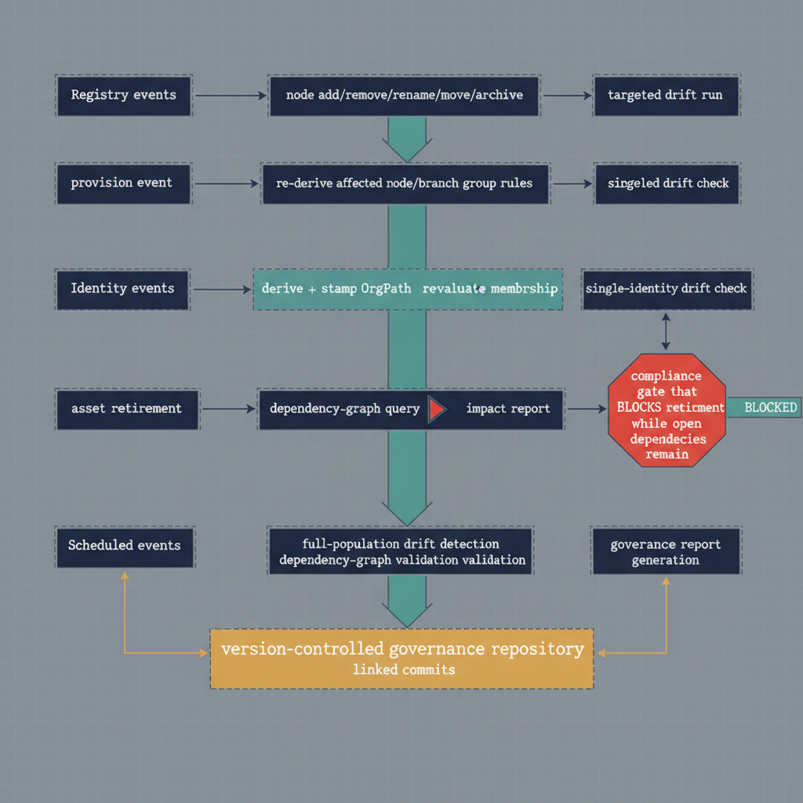

# Chapter 10 — The Governance Pipeline — Automation and Audit as Operational Properties

::: {.callout-note}
## In this chapter
The event-driven pipeline that ties the model together: the four event classes
(registry, identity, decommissioning, scheduled) and the bounded operations
each triggers, and how committing every output to a version-controlled
repository makes governance history an automatic byproduct of operation rather
than a separate audit effort.
:::

::: {.callout-note title="Requirements Being Addressed — Automation and Version Control"}
The companion document required, first, that every operation the governance substrate performs be automatable — triggered by events rather than by administrator action — and, second, that every change to the governance state be committed to a version-controlled repository, making governance history a byproduct of normal operations rather than a separately maintained audit trail.
:::

## The Event Model

The governance pipeline is event-driven. It does not run on a fixed schedule for all operations, and it does not wait for administrator instruction before executing. It responds to four categories of events, each of which triggers a specific, bounded set of pipeline operations whose outputs are committed to the governance repository as a record of the event's consequences.

{#fig-book-03-cpt-10-diagram-01 fig-alt="Four labeled input lanes feed a central pipeline: Registry events (node add/remove/rename/move/archive) → re-derive affected OrgPaths, rebuild node/branch group rules, targeted drift run; Identity events (provision / reassignment) → derive + stamp OrgPath, re-evaluate group membership, single-identity drift check; Decommissioning events (asset retirement) → dependency-graph query, impact report, compliance gate that BLOCKS retirement while open dependencies remain; Scheduled events (fixed cadence) → full-population drift detection, dependency-graph validation, governance report generation. Every lane's outputs flow into a single \"version-controlled governance repository\" as linked commits. Engineering blueprint style, white background, federal navy (#1F3A5F) for event lanes, teal (#1A9E8F) for pipeline operations, red (#C0392B) for the decommissioning compliance gate, amber (#D4A017) for the committed repository, monospace labels, no human figures, 16:9 landscape." width="85%"}

The four event classes share a common shape — a trigger, a bounded set of downstream operations, and a committed record — but differ in what fires them and what consequences they set in motion:

| Event class | Fires when… | Committed record |
| :--- | :--- | :--- |
| **Registry** | The OrgTree is modified — a node addition, removal, rename, move, or archive operation in the OrgTree registry | A linked record set associated with the OrgTree change event that triggered it |
| **Identity** | A new user, device, or server asset is provisioned, or an existing identity's provisioning record is updated to reflect a change in organizational assignment | A provisioning record, linked to the identity and to the OrgTree node that the OrgPath value designates |
| **Decommissioning** | An asset — a server, a service, an application endpoint — is scheduled for retirement from the managed environment | A decommissioning impact report (and a dependency-graph snapshot taken immediately before the decision) |
| **Scheduled** | A fixed cadence elapses | The scheduled event record, capturing the run's drift, validation, and reporting outputs |

### Registry events

A registry event triggers three downstream pipeline operations:

1. The pipeline identifies every identity whose OrgPath traverses any changed node and recomputes the correct OrgPath value for each of them, applying updates where the structural change requires it.
2. The pipeline reconstructs the membership rules for every dynamic group whose node was affected by the change — updating prefix patterns in branch group rules and exact-match patterns in node group rules to reflect the new node paths.
3. The pipeline executes a targeted drift detection run across all identities whose paths traverse the changed node, confirming that the reconciliation was complete and recording any residual deviations as findings.

The outputs of all three operations are committed to the governance repository as a linked record set associated with the OrgTree change event that triggered them.

### Identity events

Identity events trigger:

- OrgPath derivation and stamping for the affected identity,
- dynamic group membership re-evaluation against the new OrgPath value, and
- a single-identity drift check to confirm that the attribute was applied correctly and that the dynamic group memberships have updated to match the new position.

The outputs are committed as a provisioning record in the governance repository, linked to the identity and to the OrgTree node that the OrgPath value designates.

### Decommissioning events

A decommissioning event triggers a dependency graph query for the asset being retired, which returns all consumers of the asset, their OrgPath values, their dependency types, and their current migration status. A decommissioning impact report is generated from this query and committed to the governance repository. A compliance check then confirms that no open dependencies — dependencies with a migration status of not-yet-addressed or in-progress — remain before the retirement proceeds.

> If open dependencies exist, **the decommissioning event is blocked** and the governance team is notified, with the list of unresolved consumers and their OrgPath values included in the notification. The decommissioning does not proceed until the compliance check passes.

### Scheduled events

Scheduled events occur on a fixed cadence and trigger:

- **full-population drift detection** across all users, devices, and server resources in scope;
- **dependency graph validation** to identify any records whose provider or consumer has been decommissioned without a corresponding dependency resolution; and
- **governance report generation**, producing summary documents for the governance team that capture the current state of the OrgPath population, the current drift detection results, and the current dependency migration status.

These reports are committed to the governance repository as part of the scheduled event record.

## The Version-Controlled Repository as Governance Record

Every output of the governance pipeline is committed to the version-controlled repository, and this commitment is not an archival afterthought — it is the primary record of governance state. What gets committed, and when, spans every artifact the pipeline produces:

| Committed artifact | When it is committed |
| :--- | :--- |
| **OrgTree registry** | Versioned with every change, so that the complete history of organizational structure is available from the repository's commit log |
| **OrgPath derivation records** | Committed as structured data files in the repository's identity history directory — the structured log of which identities received which OrgPath values on which dates, under which pipeline runs, from which provisioning sources |
| **Drift detection reports** | After each run, both the full-population scheduled runs and the targeted runs triggered by registry and identity events |
| **Dependency graph snapshots** | On the scheduled cadence and on demand immediately before any decommissioning event, so that the dependency state at the time of each decommissioning decision is permanently recorded |
| **Dynamic group rule definitions** | When they are created or updated by the pipeline |

> The repository's commit history is therefore **the complete, auditable record of the organization's governance state** — every position assignment, every structural change, every drift finding, every dependency resolved, every decommissioning decision and its compliance basis.

This record does not require a separate audit logging process. It does not require an administrator to remember to capture audit evidence before performing a governance operation. It is a consequence of the pipeline's normal operation: the pipeline performs an action, and the pipeline commits the record of that action. The two are inseparable by design.

That inseparability changes what audit and investigation look like in practice:

- An administrator who wants to know what the OrgPath of a specific user was on a specific date does not need to consult an audit system — they check out the version of the identity history file that was current on that date.
- An auditor who needs to demonstrate that the governance model was being actively maintained at the time of a compliance review event does not need to reconstruct a narrative from scattered log files — they examine the commit history of the governance repository and observe directly that drift detection reports were committed on schedule, that OrgTree changes were committed with approval records, and that decommissioning events were preceded by dependency compliance checks.
