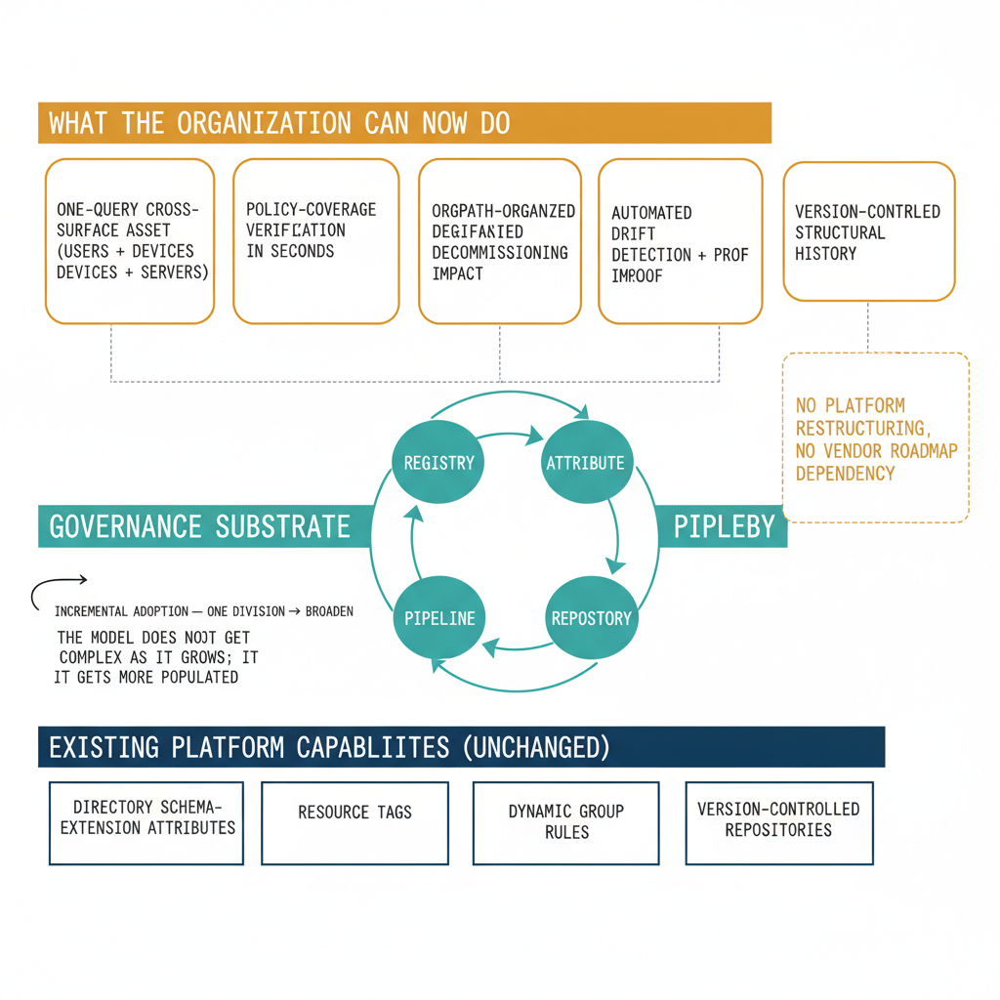

# Chapter 11 — What OrgTree and OrgPath Provide Together

::: {.callout-note}
## In this chapter
The synthesis: the complete model as a coherent system, what it makes possible
(single-query cross-surface inventory, seconds-not-days policy-coverage
verification, drift proof, version-controlled history), what it deliberately
does *not* require (no platform changes, no vendor roadmap), and the
incremental maturity progression for adopting it.
:::

## The Complete Model as a System

OrgTree and OrgPath are not two features of a governance tool. They are two components of an architectural model — a model that imposes structure on an inherently flat environment by externalizing that structure into a governed artifact and distributing its expression across every identity and resource that the organization manages. The model is coherent because the two components are designed to serve each other. OrgTree cannot express organizational position without OrgPath to carry it to individual assets; a registry that defines hierarchy without any mechanism for expressing that hierarchy on the assets being governed is a documentation artifact, not a governance substrate. OrgPath cannot be trusted without OrgTree to validate it; a positional attribute that carries an arbitrary string is no more reliable than the department field it replaces. The coherence of the model emerges from the relationship between them: the registry defines the schema, the attribute carries the instance, the pipeline maintains the connection, and the repository records the history.

## What the Model Makes Possible

An organization that has implemented OrgTree and OrgPath can do a set of things that it demonstrably cannot do without them. It can answer the question "show me all assets belonging to this division" — users, devices, and servers simultaneously — using a single query against a single attribute, without consulting three independent inventories and manually cross-referencing the results. It can verify policy coverage for any organizational segment by checking whether all identities with an OrgPath value at or below that segment are members of the appropriate branch groups — a verification that takes seconds with a query and would otherwise require a manual audit of policy assignments, group memberships, and identity attributes that could take days. It can determine the organizational impact of decommissioning any infrastructure component by querying the dependency graph for consumers, filtering by OrgPath, and producing a structured report organized by division and department — a report that tells the governance team not just that some identities will be affected but which parts of the organization will feel the impact and at what severity.

It can detect and report on every identity that has drifted from its intended organizational position — automatically, on a scheduled basis, without any administrator manually checking attribute values — and produce a machine-readable report of findings that is committed to the governance repository and available for audit. It can audit the complete history of organizational structure changes by examining the version history of the OrgTree registry — not reconstructing that history from scattered administrative logs but reading it directly from the commit history of the governed artifact. It can prove, at any point in time, that the governance posture of the live environment matches the intended governance posture encoded in the registry — or, where they diverge, identify precisely where and by how much they diverge, through the drift detection report committed after the most recent detection run. This proof is not a narrative claim. It is a structured, machine-readable, version-controlled record.

{#fig-book-03-cpt-11-diagram-01 fig-alt="Bottom band \"existing platform capabilities (unchanged)\" lists directory schema-extension attributes, resource tags, dynamic group rules, version-controlled repositories. A middle band \"governance substrate\" shows the registry, the attribute, the pipeline, and the repository working as a closed loop. A top band \"what the organization can now do\" lists the dividends as outcome cards: one-query cross-surface asset inventory (users + devices + servers), policy-coverage verification in seconds, OrgPath-organized decommissioning impact, automated drift detection + proof, version-controlled structural history. A side note \"no platform restructuring, no vendor roadmap dependency\". A small maturity arrow shows incremental adoption — one division → broaden — with the caption \"the model does not get more complex as it grows; it gets more populated\". Engineering blueprint style, neutral slate background, federal navy (#1F3A5F) for the platform band, teal (#1A9E8F) for the substrate, amber (#D4A017) for the outcome cards, monospace labels, no human figures, 16:9 landscape." width="85%"}

## What the Model Does Not Require

The OrgTree and OrgPath model does not require the cloud directory to be restructured. It does not require new directory features to be provisioned by the platform vendor. It does not require per-tool governance models to be replaced or modified. It does not require the endpoint management platform, the hybrid server management plane, or the cloud identity directory to be configured in ways that are not supported by their existing, generally available feature sets. The model works within the capabilities that these platforms already provide: directory schema extension attributes, resource tags, dynamic group membership rules, and version-controlled file repositories are all standard, available, and supported capabilities of the platforms that enterprise environments already use.

The structural coherence that OrgTree and OrgPath provide is layered on top of the existing platform without requiring the platform to change. The organization is not waiting for a platform update. It is not dependent on a vendor roadmap. It is not betting on a feature that may or may not be delivered on a schedule that may or may not align with its governance needs. It is constructing a governance substrate from capabilities it already has, organized according to a disciplined architectural model that the platform does not provide natively but that the platform is fully capable of supporting.

## The Maturity Progression

An organization beginning to implement OrgTree and OrgPath does not need to implement the complete model for the complete organization before any governance value is realized. The model is incremental by design. Implementation begins with a small, well-understood segment of the hierarchy — one division, one functional domain, or one geographic region — where the organizational structure is stable enough to be confidently encoded in an initial OrgTree and where the identity population is small enough to allow the pipeline's behavior to be validated before it is applied more broadly.

The early OrgTree nodes produce a small set of OrgPath values. Those values are tested against the dynamic group rules and the drift detection engine in a limited population before the model is extended to additional organizational segments. Each phase of expansion adds nodes to the OrgTree, extends OrgPath assignment to additional identity populations, adds new entries to the dynamic group library, and broadens the scope of drift detection and dependency mapping. The governance team builds confidence in the pipeline's behavior, the accuracy of the OrgTree registry, and the reliability of the drift detection process through each successive phase, and the model scales with the organization because it is attribute-based and registry-driven. There is no architectural change required as the hierarchy grows — only the addition of new nodes to the governed registry and the derivation of new OrgPath values for the identities that belong to them. The model does not become more complex as it grows; it becomes more populated.

## Closing: What Has Been Proposed and Why It Matters

The companion document — *What Must Exist* — asked, for each of its twelve requirements, what a governance substrate must provide. This document has proposed what should exist: OrgTree as the governed, versioned, authoritative registry of organizational structure; OrgPath as the validated, machine-readable, attribute-based expression of organizational position for every identity and resource the organization manages; a governance pipeline that derives, applies, validates, and monitors both constructs continuously in response to events rather than on administrative demand; and a version-controlled repository that makes the history of the organization's governance state an automatic, auditable, permanent record rather than a separately maintained artifact that must be produced on request.

Together, these constructs constitute the governance substrate that the cloud identity and management stack does not natively provide and that any organization committed to maintaining structural governance coherence through a cloud modernization program will need to construct. The requirement is not theoretical. Every organization that has relied on an on-premises directory to provide authoritative organizational position, hierarchical policy inheritance, and cross-platform coherence has been relying on a governance substrate, whether it recognized it as such or not. The modernization program does not eliminate the need for that substrate. It eliminates the substrate that previously provided it — and leaves in its place an environment that is more capable in many dimensions and more governable in none of the structural ones that matter most.

The construction of OrgTree and OrgPath is not simple — it requires disciplined engineering, a sustained governance process, and organizational commitment to maintaining the registry as the organizational structure evolves. The design is not complex — two constructs, one pipeline, one repository, and a set of standard platform capabilities organized according to a coherent model. The discipline required to maintain it is no greater than the discipline required to maintain the Active Directory environment it replaces — and the transparency it provides, the auditability it enables, and the structural coherence it restores are considerably greater than anything the on-premises model natively delivered.

**The tree and the path. The registry and the attribute. The map and the coordinate.\
OrgTree and OrgPath.**
