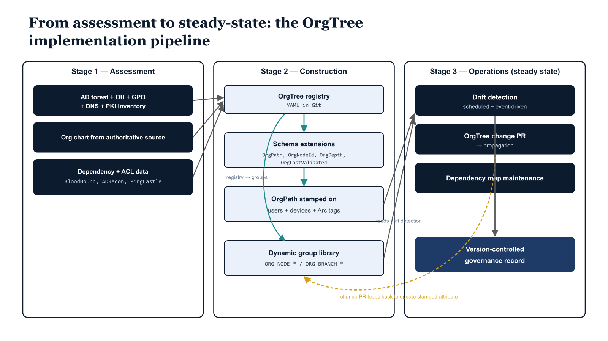

# Chapter 1 — Laying the Foundation — What Must Be in Place Before Implementation Begins

::: {.callout-note}
## In this chapter
Part Four turns the architecture of the preceding volumes into an implementation. This opening chapter frames the build as three sequential stages — assessment, construction, and operations — and establishes the three preconditions (intellectual, organizational, and infrastructural) that must hold before any implementation work begins.
:::

This document describes how to build OrgTree and OrgPath. The proposal in Part Three described both constructs as architectural ideas — OrgTree as a versioned, authoritative registry of organizational structure, and OrgPath as a validated attribute stamped on every identity and resource object in the environment to express that object's position in the registry. Those descriptions were necessarily abstract. Architecture describes what a system is and why it should exist. An implementation guide describes how to make it real, in sequence, with specific tools, specific commands, and specific decisions that carry consequences. That is the purpose of this document.

The implementation proceeds in three broad stages. The first stage is assessment. Assessment captures the current state of the Active Directory environment and produces the raw material from which the initial OrgTree is derived. It is not a bureaucratic formality — it is the foundation on which the entire construction depends. An OrgTree built without a rigorous assessment of the existing directory will misrepresent the organization's actual governance boundaries, and that misrepresentation will propagate through every subsequent stage, producing invalid OrgPath values, misconfigured policy groups, and a governance model that the engineering team will spend months correcting after the fact. The second stage is construction. Construction builds the OrgTree registry, registers the OrgPath directory schema extensions, populates the initial attribute values across the user and device object populations, and establishes the dynamic group library that translates OrgPath values into policy-targetable group memberships. The third stage is operations. Operations puts the drift detection pipeline, the automation layer, and the version-controlled governance record into steady-state production — the running configuration that maintains the model's accuracy over time as the organization changes. None of these stages can be skipped, and they cannot be run out of order. The assessment produces the data the construction depends on. The construction produces the substrate the operations layer maintains. This document works through all three in sequence.

{#fig-04-implementing-orgtree-and-orgpath-diagram-01 fig-alt="Stage 1 \"Assessment\" contains three input boxes: AD forest + OU + GPO + DNS + PKI inventory; Org chart from authoritative source; Dependency + ACL data (BloodHound, ADRecon, PingCastle). Stage 2 \"Construction\" contains four boxes: OrgTree registry (YAML in Git); Schema extensions (OrgPath, OrgNodeId, OrgDepth, OrgLastValidated); OrgPath stamped on users + devices + Arc tags; Dynamic group library (ORG-NODE-* / ORG-BRANCH-*). Stage 3 \"Operations (steady state)\" contains four boxes: Drift detection (scheduled + event-driven); OrgTree change PR → propagation; Dependency map maintenance; Version-controlled governance record. All three Assessment boxes converge into the OrgTree registry box in Stage 2. Stage 2 internal flow: registry → schema extensions → stamped attribute, and registry → dynamic group library. Stage 2 outputs (stamped attribute, group library) feed Stage 3's drift detection. Stage 3 OrgTree change PR loops back to Stage 2 to update the stamped attribute. Drift detection and dependency map maintenance both terminate at the version-controlled governance record. Engineering blueprint style, neutral slate, federal navy (#1F3A5F) for stage frames, 16:9 landscape." width="85%"}

Before any implementation work begins, three conditions must be in place. The first is intellectual: the engineering team must have read and internalized the full content of Parts One, Two, and Three of this series. This is not a formality. The implementation decisions made throughout this document are traceable to the requirements established in Part Two and the design choices resolved in Part Three. A team that begins implementation without that context will encounter decision points — about node naming conventions, about which OUs to promote into the OrgTree, about how to handle synchronized versus cloud-only objects, about what to do with users whose AD organizational placement is ambiguous — and will make those decisions inconsistently, without the benefit of the reasoning that went into the design. The implementation will still proceed, but it will accumulate technical debt at every ambiguous decision point, and that debt will compound. The investment in reading the prior parts pays back immediately.

The second precondition is organizational: the engineering team needs an authoritative description of the organization's own structure, independent of any current state in Active Directory. The initial OrgTree will be informed by the AD OU structure, but it is not a mirror of it. Active Directory OU structures frequently contain artifacts, legacy containers, and administrative groupings that do not reflect the organization's actual governance boundaries. An OU named after a GPO it was created to host. An OU created years ago to give a specific administrator a delegation scope and now containing a mix of objects from three different business units. An OU whose name reflects a department that was reorganized out of existence. These are normal features of any mature Active Directory environment, not signs of negligence, and they are not useful inputs to OrgTree construction. The engineering team needs access to whoever maintains the organization's authoritative organizational chart — in whatever form that exists — and needs to schedule working sessions with that person before the OrgTree construction phase begins. Without that input, the OrgTree will inherit the directory's accumulated confusion rather than correcting it.

The third precondition is infrastructural: the platform infrastructure described in Chapter 2 must be provisioned and validated before any schema registration or attribute population begins. Schema extension registration in Entra ID is a tenant-level operation with lasting consequences. OrgPath attribute population at scale places real load on the Microsoft Graph API. Neither should be run for the first time on an unvalidated platform. The infrastructure provisioning and validation work documented in Chapter 2 is not a long process, but it is a necessary one, and it should be completed and signed off before the team moves to Chapter 7.

::: {.callout-note title="Three Preconditions Checklist"}
Before advancing beyond this chapter: (1) confirm that all team members have read Parts One through Three; (2) confirm that an authoritative organizational chart or structure document has been obtained and a working session with its owner has been scheduled; and (3) confirm that the infrastructure provisioning plan from Chapter 2 has been drafted and approved. All three must be satisfied before implementation work begins.
:::
