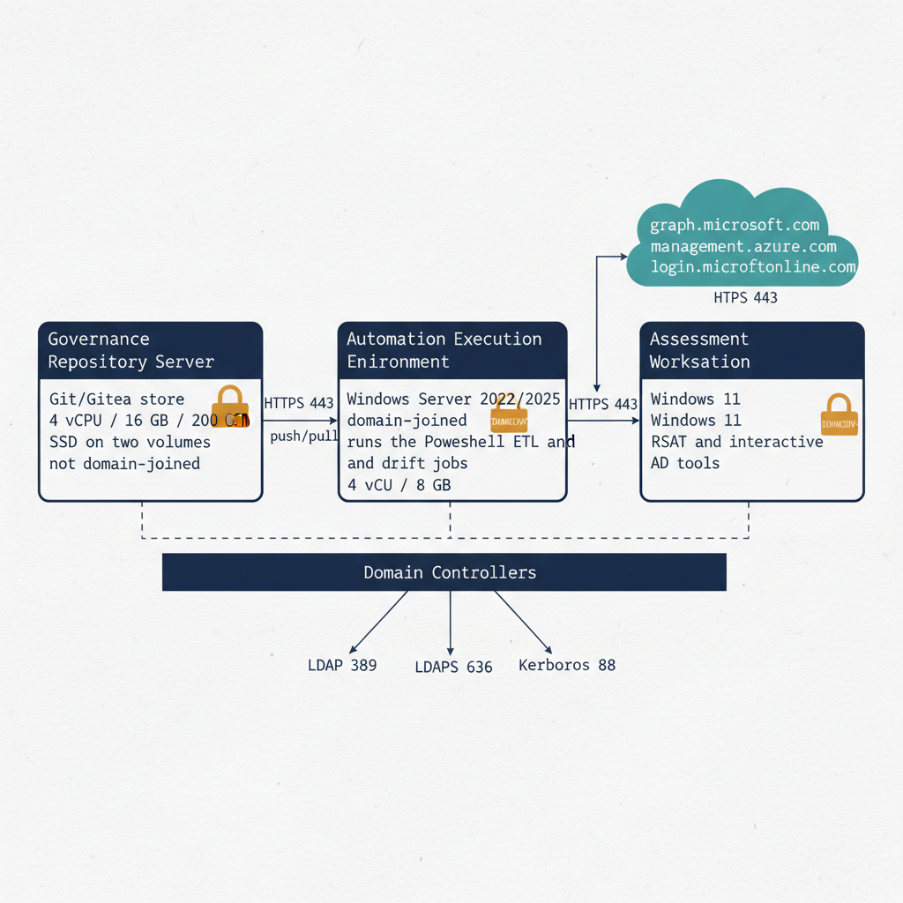

# Chapter 2 — Infrastructure Requirements for the Governance Pipeline

::: {.callout-note}
## In this chapter
Before any schema registration or attribute write, the platform itself must exist and be validated. This chapter specifies the three infrastructure roles the governance pipeline depends on — the governance repository server, the automation execution environment, and the assessment workstation — their sizing and operating-system requirements, and the exact network connectivity that must be tested up front.
:::

## Architectural Shape of the Platform

The OrgTree and OrgPath system requires three categories of infrastructure, each with a distinct responsibility:

- a **governance repository server** that hosts the version-controlled OrgTree registry and all pipeline outputs;
- an **automation execution environment** that runs the ETL processes, drift detection workflows, and event-triggered pipeline jobs; and
- the **assessment workstation** environment from which the Active Directory assessment tools are executed interactively before the pipeline is fully automated.

How these roles map onto physical or virtual machines depends on deployment scale:

- In **small to medium deployments**, the repository server and automation execution environment can be provisioned on the same physical or virtual machine.
- In **larger deployments**, or those with strict separation of duties requirements that prohibit colocating a version-controlled data store with an execution environment that writes to it, the two roles are separated onto dedicated machines.

> The **assessment workstation is always separate from both**, because it must be domain-joined and must operate under the assessment service account — conditions that would be inappropriate on the repository or automation server.

{#fig-book-04-cpt-02-diagram-01 fig-alt="Three labeled server boxes arranged left to right: \"Governance Repository Server\" (Git/Gitea store, 4 vCPU / 16 GB / 200 GB SSD on two volumes, not domain-joined), \"Automation Execution Environment\" (Windows Server 2022/2025, domain-joined, runs the PowerShell ETL and drift jobs, 4 vCPU / 8 GB), and \"Assessment Workstation\" (Windows 11, domain-joined, RSAT and interactive AD tools). Directed arrows show the automation server pushing and pulling to the repository server over HTTPS 443; the automation server reaching domain controllers over LDAP 389, LDAPS 636, and Kerberos 88; and outbound HTTPS 443 from the automation server to a cloud band containing graph.microsoft.com, management.azure.com, and login.microsoftonline.com. The assessment workstation connects to the domain controllers only. Each connection arrow carries a monospace port label. Engineering blueprint style, white background, federal navy (#1F3A5F) for the three role boxes, teal (#1A9E8F) for cloud endpoints, amber (#D4A017) for the domain-join markers, monospace labels for ports and hostnames, no human figures, 16:9 landscape." width="85%"}

## Governance Repository Server

The repository server requires a minimum of four virtual CPUs, sixteen gigabytes of RAM, and two hundred gigabytes of SSD-backed storage. The storage should be provisioned as two volumes:

- a **system volume** for the operating system and installed software, and
- a **data volume** for all governance pipeline content.

The data volume hosts four content stores, which differ from one another in growth pattern:

| Content store | Growth pattern |
| :--- | :--- |
| Git repository storage directory | Versioned, change-driven |
| Assessment output archive | Bounded bursts at assessment time |
| Drift detection report history | Incremental, every day |
| Pipeline execution log directory | Continuous |

Separating these from the system volume protects against the data volume filling and impacting system operation.

For the operating system, the repository server may run Windows Server 2022 or Windows Server 2025, or a supported Linux distribution. Ubuntu 22.04 LTS and Red Hat Enterprise Linux 9 are both appropriate Linux choices; both have long-term support windows that extend beyond any reasonable deployment horizon for this infrastructure.

The repository server does not need to be domain-joined. A domain-joined deployment simplifies Kerberos-based authentication integration if the engineering team prefers to use Windows Integrated Authentication for repository access, but an HTTPS-based authentication model using personal access tokens or SSH keys is equally valid and requires no domain membership. The server must be reachable by the automation execution environment and by the workstations of all engineers and administrators who will commit changes to the OrgTree registry or review pipeline outputs.

## Automation Execution Environment

The automation execution environment must run Windows Server 2022 or Windows Server 2025, and must be domain-joined to at least one domain in the forest being assessed, because the assessment service account must be able to authenticate via Kerberos to query directory objects.

> The requirement for Windows on this machine is **not a preference — it is driven by the PowerShell execution model.**

The Active Directory module, the Microsoft Graph PowerShell SDK, and the Azure PowerShell module all execute correctly on Windows PowerShell 5.1 or PowerShell 7.x on Windows. The Active Directory module in particular has dependency chains on Windows-native COM interfaces and ADSI providers that are not present on Linux; running that module on a Linux host is not supported and produces silent failures in attribute enumeration that are difficult to diagnose.

It requires a minimum of four virtual CPUs, eight gigabytes of RAM, and one hundred gigabytes of storage to accommodate the PowerShell module cache, temporary assessment output files during pipeline execution, and the running pipeline execution log.

## Assessment Workstation

The assessment workstation is the machine from which Active Directory assessment commands are executed interactively, before the pipeline is fully automated and before the engineering team trusts the automated output enough to rely on it without manual verification. It must be Windows 10 version 21H2 or later, or Windows 11, and must be domain-joined.

The workstation's PowerShell and tooling baseline is as follows:

- **Windows PowerShell 5.1** is present on all supported Windows versions by default and requires no installation.
- **PowerShell 7.x** should be installed alongside it — the installer from the PowerShell GitHub releases page deploys to C:\Program Files\PowerShell\7\\ without displacing the Windows PowerShell installation at C:\Windows\System32\WindowsPowerShell\v1.0\\, and both are available in parallel.
- The **Remote Server Administration Tools** package must be installed to provide the Active Directory module, the Group Policy Management module, the DNS Server module, and the Certificate Authority module. On Windows 11, RSAT features are installed through Settings, Optional Features, or through DISM at an administrative command prompt.

The three roles and their baseline requirements are summarized below.

| Role | Operating system | Domain-joined | Minimum sizing | Primary function |
|------|------------------|:-------------:|----------------|------------------|
| Governance repository server | Windows Server 2022/2025, or Ubuntu 22.04 LTS / RHEL 9 | No | 4 vCPU · 16 GB RAM · 200 GB SSD (system + data volumes) | Hosts the version-controlled OrgTree registry and all pipeline outputs (Git/Gitea over HTTPS) |
| Automation execution environment | Windows Server 2022/2025 | Yes | 4 vCPU · 8 GB RAM · 100 GB | Runs the ETL, drift-detection, and event-triggered pipeline jobs; Windows is required by the AD PowerShell module |
| Assessment workstation | Windows 10 21H2+ or Windows 11 | Yes | Workstation-class | Runs the AD assessment tools interactively under the assessment service account before automation is trusted |

## Network Connectivity Requirements

The automation server's network access requirements are specific and must be validated before pipeline execution begins.

Outbound HTTPS on port 443 must reach four classes of endpoint:

| Endpoint | Purpose |
| :--- | :--- |
| graph.microsoft.com | Microsoft Graph API |
| management.azure.com | Azure Resource Manager |
| login.microsoftonline.com | Entra ID token endpoint |
| Target Git repository host | A self-hosted Gitea instance on the repository server, or a hosted service |

Toward the domain controllers, the automation server requires directory and authentication access:

- bidirectional **LDAP** access on port 389 and **LDAPS** access on port 636 to the domain controllers it will query;
- **Kerberos** authentication traffic on port 88, both UDP and TCP, between the automation server and the domain controllers; and
- correct **DNS resolution** of the domain's SRV record infrastructure — specifically the \_ldap.\_tcp.{domain} and \_kerberos.\_tcp.{domain} records that direct clients to domain controllers — from the automation server's network position.

If the deployment includes Azure Arc-managed servers, the automation server must also reach the Azure Arc service endpoints documented in the Azure Arc network requirements reference in the Microsoft documentation.

> **Every one of these connectivity requirements should be tested explicitly** during the platform provisioning phase, before any assessment or pipeline work begins:

- `Test-NetConnection` for TCP ports,
- `Resolve-DnsName` for DNS records, and
- a lightweight LDAP bind test using the System.DirectoryServices.DirectoryEntry constructor.

::: {.callout-note title="Connectivity Validation Is Not Optional"}
Connectivity failures discovered during pipeline execution are dramatically more disruptive than connectivity failures discovered during the provisioning validation phase. A pipeline that silently fails to reach a domain controller will produce assessment output that appears complete but is missing objects from unreachable sites. Validate every connection requirement explicitly before proceeding.
:::
