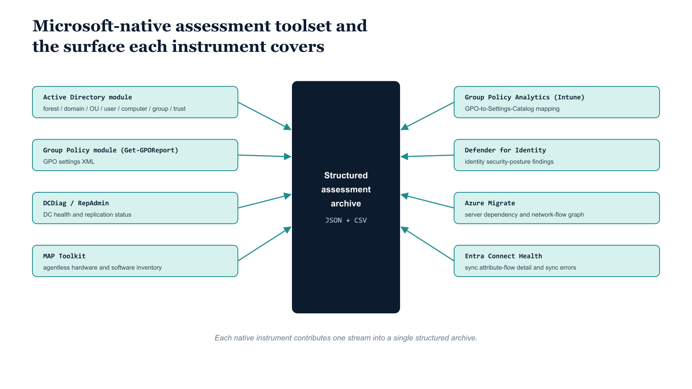

# Chapter 4 — Capturing Current State — What Microsoft Provides for AD Discovery

::: {.callout-note}
## In this chapter
The initial OrgTree is derived from a rigorous inventory of the existing directory, never invented. This chapter walks the Microsoft-native assessment toolset — the Active Directory and Group Policy modules, DCDiag and RepAdmin, the MAP Toolkit, Group Policy Analytics, Defender for Identity, Azure Migrate, and Entra Connect Health — and what each contributes to that inventory. Chapter 5 adds the specialized instruments that complement it.
:::

## The Purpose of the Assessment Phase

The initial OrgTree cannot be constructed from imagination. It must be derived from a rigorous inventory of the current Active Directory environment, combined with the organization's authoritative description of its own structure. The assessment phase uses tooling to extract the raw facts of the AD environment and produces structured output that the OrgTree construction process consumes. The raw facts to be extracted include:

- the forest topology,
- the domain structure,
- the OU hierarchy,
- the GPO library,
- the DNS configuration,
- the certificate services infrastructure,
- the computer object population,
- the user population,
- the group structure,
- the trust relationships,
- the service account inventory, and
- the access control model.

> A thorough assessment takes time. **That investment is not avoidable and should not be compressed** — every shortcut taken in the assessment phase will surface as a construction error or an operations incident later.

This chapter covers the Microsoft native toolset. Chapter 5 covers the third-party and open-source tools that complement it.

{#fig-book-04-cpt-04-diagram-01 fig-alt="A central vertical spine labeled \"Structured assessment archive (JSON + CSV)\" with eight native tools arranged around it, each connected by an arrow into the archive and tagged with what it contributes: \"Active Directory module\" feeding forest / domain / OU / user / computer / group / trust inventory; \"Group Policy module (Get-GPOReport)\" feeding GPO settings XML; \"DCDiag / RepAdmin\" feeding DC health and replication status; \"MAP Toolkit\" feeding agentless hardware and software inventory; \"Group Policy Analytics (Intune)\" feeding GPO-to-Settings-Catalog mapping; \"Defender for Identity\" feeding identity security-posture findings; \"Azure Migrate\" feeding the server dependency and network-flow graph; \"Entra Connect Health\" feeding sync attribute-flow detail and sync errors. Engineering blueprint style, white background, federal navy (#1F3A5F) for the archive spine, teal (#1A9E8F) for the eight tool boxes, monospace cmdlet and tool names, no human figures, 16:9 landscape." width="85%"}

## The PowerShell Active Directory Module

The Active Directory module, distributed with RSAT, is the primary native assessment instrument for the directory structure itself. It exposes the complete directory through a family of `Get-` cmdlets that return strongly typed PowerShell objects, each carrying the full attribute set of the queried object type. The cmdlets most relevant to the assessment, and what each returns, are:

| Cmdlet | What it returns |
| :--- | :--- |
| `Get-ADForest` | The forest structure: the forest root domain FQDN, all child and tree domain FQDNs, the UPN suffix list, the site list, the forest functional level, and the distinguished names of the Sites, Schema, and Configuration naming contexts |
| `Get-ADDomain` | Domain-level detail: the PDC Emulator, RID Master, and Infrastructure Master FSMO role holders, the domain functional level, the linked GPO list, the domain SID, the default password policy settings (minimum password length, lockout threshold, observation window, and lockout duration), and the DistinguishedName of the domain's well-known containers |
| `Get-ADDomainController -Filter *` | All domain controllers in the queried domain, returning for each one its operating system version, its site membership, its FSMO role assignments, its global catalog status, its LDAPS certificate thumbprint (where applicable), and its replication partner list |
| `Get-ADOrganizationalUnit -Filter * -SearchBase {domainDN} -SearchScope Subtree -Properties *` | The complete OU tree for a domain (see the OU attribute detail below) |
| `Get-ADUser -Filter * -Properties *` | All user objects with their complete attribute sets, including attributes not returned by default |
| `Get-ADComputer -Filter * -Properties *` | All computer objects with their complete attribute sets |
| `Get-ADGroup -Filter * -Properties *` | All group objects with their complete attribute sets |
| `Get-ADReplicationSite -Filter *` | The site topology |
| `Get-ADReplicationSiteLink -Filter *` | The inter-site replication transport configuration |
| `Get-ADTrust -Filter *` | All trust relationships visible from the queried domain, including the trust type, direction, transitivity, and the SID filter status of each trust |

Each OU object returned by `Get-ADOrganizationalUnit` carries a set of attributes that the OrgTree construction pipeline depends on:

- its **DistinguishedName**, which encodes its position in the tree — the DN is the OU path expressed in LDAP notation;
- its **linked GPO list** via the `gpLink` attribute;
- its **`managedBy`** attribute, which identifies the account or group responsible for the OU;
- its **`description`** attribute; and
- its **`gPOptions`** attribute, which controls GPO inheritance blocking.

> The DistinguishedName of each OU is the **primary key** that the OrgTree construction pipeline uses to map OUs to OrgTree nodes.

For the object queries, the `-Properties *` parameter is essential and should not be omitted, as the default attribute set excludes several fields relevant to the assessment, including `PasswordLastSet`, `LastLogonDate`, `PasswordNeverExpires`, `ServicePrincipalNames`, and `msDS-SupportedEncryptionTypes`.

## The Group Policy Management Module

The Group Policy Management module provides the cmdlets needed to fully inventory the GPO library. `Get-GPO -All` returns all GPO objects in the domain, each carrying:

- a GUID identifier,
- a display name,
- a creation timestamp,
- a modification timestamp, and
- a status indicating whether the computer settings, user settings, or both are enabled.

The GPO object returned by `Get-GPO` does not contain the policy settings themselves — it is a metadata object. The actual settings are extracted using `Get-GPOReport -Guid {gpoGuid} -ReportType Xml`, which returns an XML document containing the complete configuration of every setting in the GPO, organized by Computer Configuration and User Configuration extension.

> This XML document is machine-parseable and should be the output format used for all pipeline consumption — the HTML output format produced by the `ReportType Html` option is easier to read but harder to parse.

Running `Get-GPOReport` for every GPO in the domain — which may be dozens or hundreds of GPOs in a mature environment — should be scripted as a loop that:

1. iterates through the output of `Get-GPO -All`,
2. invokes `Get-GPOReport` for each GUID, and
3. writes the output to a file named with the GPO's GUID in the assessment output directory.

`Get-GPLink` applied to each OU DistinguishedName returns the GPO links active at that OU, including the link order (which determines precedence when multiple GPOs are linked at the same level) and the enforcement and enabled status of each link.

## DCDiag and RepAdmin

DCDiag is the domain controller diagnostic tool included with Windows Server and RSAT. It executes a battery of tests against a specified domain controller and reports pass or fail for each test, with diagnostic detail for any test that fails. The relevant invocation for the assessment is `dcdiag /test:all /s:{DCHostname} /v`, where the `/v` flag enables verbose output that includes diagnostic detail even for passing tests.

Running this against every domain controller in the forest — iterating over the output of `Get-ADDomainController -Filter * -Properties *` — produces a per-DC diagnostic record covering:

- DNS registration accuracy,
- AD replication health,
- SYSVOL replication status,
- Kerberos connectivity,
- LDAP connectivity,
- LDAPS availability,
- RID pool allocation,
- machine account health, and
- the accessibility of all FSMO role holders from each DC's perspective.

DCDiag produces text output; the assessment pipeline should capture this output to per-DC text files and, where automated parsing is needed, process it using PowerShell string parsing or a structured wrapper script that invokes `dcdiag` and classifies its output by test name and result.

RepAdmin is the replication administration tool. The command `repadmin /replsummary` produces a per-domain-controller summary of replication success and failure counts across all replication connections in the forest, making it the fastest way to identify DCs with active replication problems that would affect the consistency of the assessment data collected from them.

## Microsoft Assessment and Planning Toolkit

The MAP Toolkit is a free agentless assessment tool from Microsoft that discovers hardware inventory, software inventory, and readiness information across a domain by connecting to domain-joined machines using WMI without requiring any agent installation on the target. The MAP Toolkit installer deploys a SQL Server Express instance on the assessment workstation to serve as the data store for its collected information.

After running a discovery job scoped to the target domain — configured in the MAP Toolkit wizard to use Active Directory-based machine discovery with the assessment service account's credentials — it produces a comprehensive inventory of all reachable machines, including:

- their operating system version and service pack level,
- hardware specifications (CPU count, RAM, disk),
- installed applications and their versions, and
- running services.

For the OrgPath implementation, the MAP Toolkit's most valuable output is its computer inventory: a comprehensive enumeration of all machines in the domain that were reachable at assessment time, their operating systems, their network addresses, and their installed workloads.

> This data supplements the Active Directory computer object inventory — which records what the directory *believes* about each machine — by adding hardware detail and reachability confirmation that the directory cannot provide.

MAP Toolkit reports are generated from the embedded SQL Server Express database using the tool's built-in reporting interface or through direct T-SQL queries against the MAPToolkit database, which can be exported to CSV for pipeline ingestion.

## Group Policy Analytics in the Intune Portal

Group Policy Analytics is a feature of Microsoft Intune that accepts GPO XML exports — exactly the XML files produced by `Get-GPOReport` — and analyzes them to classify each policy setting into one of three categories:

- those with **direct equivalents** in the Intune Settings Catalog,
- those with **functional equivalents** that require manual mapping work, and
- those with **no cloud-native equivalent**, which will require an alternative approach.

The workflow is to export every GPO from the domain using `Get-GPOReport -Guid {guid} -ReportType Xml -Path .\gpo-{guid}.xml`, then import each XML file into the Group Policy Analytics tool. The import can be done two ways:

- through the Intune admin center portal at `endpoint.microsoft.com` under **Devices, Group Policy Analytics**, or
- programmatically through the Microsoft Graph API at the beta endpoint `/beta/deviceManagement/groupPolicyMigrationReports`.

The API approach is preferable for large GPO sets because it can be scripted to process all GPO exports without manual portal interaction. After import, the analysis report for each GPO is retrieved from the same endpoint and records, for each setting in the GPO, whether a Settings Catalog equivalent exists, what that equivalent's name and category path are, and what the migration complexity classification is.

> This analysis is a critical input to the migration planning layer of the governance model: **it identifies which on-premises policy surface can be replicated in Intune and at what effort level.**

## Microsoft Defender for Identity

Microsoft Defender for Identity, when deployed with sensors on the domain controllers in the forest, analyzes Kerberos, NTLM, LDAP, and SAM-R traffic at the wire level and builds a behavioral and configuration model of the directory. For assessment purposes, its point-in-time security posture reports are the most valuable output.

The Identity Security Posture Management assessments in the Defender for Identity portal enumerate specific misconfigurations across the domain, each assigned to a Microsoft Secure Score category:

- accounts with unconstrained Kerberos delegation configured on them,
- accounts with constrained delegation to a sensitive resource,
- accounts enrolled in AS-REP Roasting vulnerability (that is, accounts with the `DONT_REQ_PREAUTH` flag set in their `userAccountControl` attribute),
- accounts with Kerberoastable service principal names registered,
- accounts with non-expiring passwords,
- domain controllers that do not enforce SMB signing, and
- the coverage of the Protected Users security group across privileged accounts.

These findings are directly relevant to the OrgTree implementation because they identify the highest-risk objects in the directory — the ones whose migration must be prioritized and whose on-premises footprint must be remediated before infrastructure decommissioning can safely proceed.

> An account with unconstrained delegation that is not migrated before decommissioning is an account that either **blocks decommissioning** or **creates an unacceptable security exposure.**

## Azure Migrate

Azure Migrate serves two assessment functions.

1. **Agentless discovery.** The Azure Migrate appliance — a lightweight virtual machine deployed in the environment — performs agentless discovery of servers, applications, and their dependencies using API-level integration with vCenter Server for VMware environments and WMI-based collection for physical or Hyper-V environments. It collects server hardware specifications, operating system versions, installed applications, and running process inventories without requiring agents on the target machines.

2. **Dependency analysis.** Azure Migrate's dependency analysis feature maps the actual network communication patterns between servers by capturing network flow data — which server is communicating with which other server, over which ports, and at what frequency, measured over a configurable collection window of typically thirty to sixty days. This produces the dependency graph that is the foundation of the infrastructure dependency map described in Part Three and implemented in Chapter 13 of this document.

The Azure Migrate project stores its collected data in an Azure-hosted Log Analytics workspace and exposes it through the Azure Migrate portal and through the Azure REST API at the `Microsoft.Migrate` resource provider endpoints, enabling programmatic retrieval of the dependency data for pipeline ingestion.

> The dependency data from Azure Migrate should be treated as a **starting point, not a complete picture:** it captures network connections that were active during the collection window and will miss connections that were dormant, seasonal, or triggered by events that did not occur during collection.

## Microsoft Entra Connect Health

For environments using Entra Connect sync — the hybrid identity synchronization service that replicates on-premises Active Directory objects into Entra ID — the Entra Connect Health service provides monitoring of the synchronization agent's health and, critically for the assessment, detailed visibility into the attribute flow between the on-premises directory and the cloud directory. The Connect Health portal displays:

- the synchronization rules in effect,
- the objects in scope for synchronization, and
- the attribute-level flow details for each synchronized object type.

Most relevantly for the OrgPath implementation, it surfaces synchronization errors: objects in the on-premises directory that are failing to synchronize because of attribute conflicts, duplicate attribute values, format violations, or scoping rules that exclude the object. These errors represent objects that will not receive OrgPath values through the synchronization pipeline even after the attribute is populated on the on-premises AD object — they are exceptions that must be handled separately.

Reviewing the Connect Health error dashboard before beginning OrgPath implementation identifies the scale of this exception population and allows the engineering team to remediate the underlying synchronization problems before the OrgPath ETL pipeline runs, rather than discovering them as silent failures after the fact.

The native instruments and their distinct contributions to the assessment archive are summarized below.

| Native tool | Assessment contribution |
|-------------|-------------------------|
| Active Directory PowerShell module | Forest, domain, OU, user, computer, group, site, and trust inventory as strongly typed objects |
| Group Policy module (`Get-GPOReport`) | Complete GPO settings as machine-parseable XML, plus per-OU GPO link order and enforcement |
| DCDiag / RepAdmin | Per-DC health diagnostics and forest-wide replication success/failure status |
| MAP Toolkit | Agentless hardware and software inventory and reachability confirmation across domain-joined machines |
| Group Policy Analytics (Intune) | Maps each GPO setting to its Settings Catalog equivalent and a migration-complexity classification |
| Defender for Identity | Identity security-posture findings — delegation, AS-REP/Kerberoast, SMB signing, Protected Users coverage |
| Azure Migrate | Server dependency graph derived from captured network-flow data over a 30–60 day window |
| Entra Connect Health | Hybrid sync attribute-flow detail and the population of synchronization errors |
