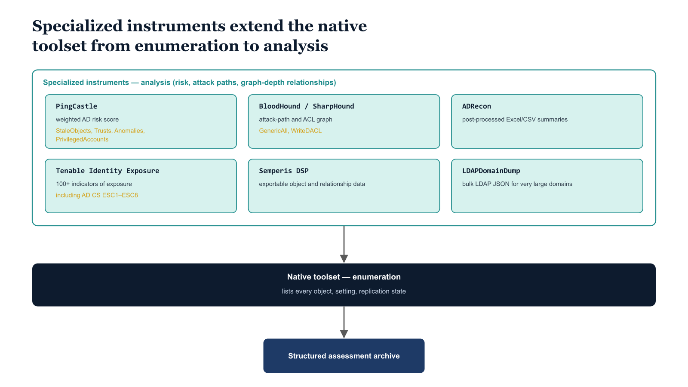

# Chapter 5 — Beyond the Native Toolset — Specialized Assessment Instruments

::: {.callout-note}
## In this chapter
Native tools enumerate; they do not analyze risk, characterize attack paths, or map relationships at graph depth. This chapter adds the specialized instruments that fill those gaps — PingCastle, BloodHound/SharpHound, ADRecon, Tenable Identity Exposure, Semperis DSP, and LDAPDomainDump — and explains how their output joins the same structured assessment archive as the native toolset.
:::

## Why the Native Toolset Is Insufficient on Its Own

The Microsoft native toolset is comprehensive for enumeration. It can list every object in the directory, every setting in every GPO, every replication partner and replication status, and every site and subnet in the forest topology. What it does *not* do well — and in some cases does not attempt — is analytical work:

- **risk analysis** — weighting and scoring the findings rather than merely listing them;
- **attack path characterization** — tracing how an attacker moves from one position to another;
- **relationship mapping at graph depth** — following chains of permissions and trust beyond a single hop; and
- **the identification of emergent security properties** that arise from combinations of individual configurations that are each individually unremarkable.

Several third-party and open-source tools have been built specifically to fill these analytical gaps, and a complete assessment uses them alongside the native toolset.

> The output of these tools **feeds the same structured assessment archive as the native tool output;** they are not separate workstreams.

{#fig-book-04-cpt-05-diagram-01 fig-alt="A horizontal split: a lower band labeled \"Native toolset — enumeration (lists every object, setting, replication state)\" and an upper band labeled \"Specialized instruments — analysis (risk, attack paths, graph-depth relationships)\". The upper band holds six tool cards, each with a one-line analytical contribution: \"PingCastle\" → weighted AD risk score (StaleObjects, Trusts, Anomalies, PrivilegedAccounts); \"BloodHound / SharpHound\" → attack-path and ACL graph (GenericAll, WriteDACL); \"ADRecon\" → post-processed Excel/CSV summaries; \"Tenable Identity Exposure\" → 100+ indicators of exposure including AD CS ESC1–ESC8; \"Semperis DSP\" → exportable object and relationship data; \"LDAPDomainDump\" → bulk LDAP JSON for very large domains. A single arrow shows both bands feeding one \"Structured assessment archive\". Engineering blueprint style, white background, federal navy (#1F3A5F) for the native band, teal (#1A9E8F) for the specialized cards, amber (#D4A017) for the risk and attack-path emphasis, monospace tool names, no human figures, 16:9 landscape." width="85%"}

## PingCastle

PingCastle is a free-to-use Active Directory security assessment tool that produces a risk score for the Active Directory domain based on a weighted analysis of security misconfigurations, privilege escalation paths, account hygiene problems, and infrastructure weaknesses. It runs as a standalone executable from any domain-joined machine with standard authenticated user credentials, without requiring domain administrator or elevated privileges for its core analysis:

```
PingCastle.exe --healthcheck --server {domainFQDN}
```

> Because it needs no elevated privileges, PingCastle is practical as a **Phase Zero assessment instrument** — something the engineering team can run immediately, without waiting for the elevated service account provisioning that Phase One requires.

Its output is an HTML report organized into four risk categories:

| Risk category | What it covers |
| :--- | :--- |
| **StaleObjects** | User and computer accounts that have not authenticated recently and represent orphaned or unmanaged credentials |
| **Trusts** | Inter-domain and inter-forest trust relationships and their specific security implications — including whether SID filtering is enforced and whether the trust is bidirectional when it should be unidirectional |
| **Anomalies** | Unusual configurations, inherited security exceptions, and deviations from hardening best practices |
| **PrivilegedAccounts** | Account and group configurations that create excessive privilege — including direct Domain Admins group membership for service accounts, nested groups in privileged roles, and accounts protected by AdminSDHolder that carry unexpected OU placement |

PingCastle also produces a machine-readable XML report at `--xmls` output mode that is suitable for pipeline ingestion and comparison between assessment runs.

For the OrgTree implementation specifically, PingCastle's AdminSDHolder-protected account analysis is particularly valuable: accounts protected by AdminSDHolder have their ACL overwritten periodically by the SDProp process, which means their OU placement in the directory does not necessarily reflect their governance context — they are a class of object that requires special handling in the OrgTree assignment logic.

## BloodHound and SharpHound

BloodHound is an open-source attack path analysis tool that models Active Directory as a property graph and finds shortest paths from any starting node to any target node — most commonly from a compromised standard user account to a Domain Admin equivalent. It was built for adversarial security analysis, but its data model is equally useful for governance work, because understanding what administrative relationships exist in the directory is a prerequisite for representing them correctly in the OrgTree.

SharpHound is BloodHound's data collection component. It runs as a .NET executable — or as a PowerShell script — on a domain-joined machine:

```
SharpHound.exe --CollectionMethods All --Domain {domainFQDN}
```

It collects:

- **group membership data** via LDAP;
- **session data** via SMB-based enumeration of logged-in users on domain computers;
- **ACL data** by reading the `nTSecurityDescriptor` attribute on directory objects;
- **trust relationships;** and
- **GPO linkage data.**

It produces a set of JSON files — one each for users, groups, computers, domains, GPOs, OUs, and ACLs — that are loaded into the BloodHound Neo4j database for visualization and Cypher query.

For the OrgTree implementation, the ACL data is the most valuable output. BloodHound identifies every instance where a non-privileged account has write permissions over a sensitive object — `GenericAll`, `GenericWrite`, `WriteDACL`, `WriteOwner`, or `AllExtendedRights` — and displays the path from that account to the sensitive target.

> This data reveals administrative relationships that exist in the directory but are **not visible in the OU structure,** and those relationships must be modeled in the OrgTree dependency map rather than ignored.

## ADRecon

ADRecon is an open-source PowerShell script, available from the GitHub repository at `github.com/adrecon/ADRecon`, that collects a comprehensive set of Active Directory data and outputs it to a structured Excel workbook and a parallel set of CSV files. Unlike the raw `Get-AD*` cmdlets, ADRecon applies post-processing logic to its collected data:

- **calculates** password age distributions across the user population;
- **identifies** accounts with specific risky configurations, such as `PASSWD_NOTREQD` or `DES_KEY_ONLY` in their `userAccountControl` flags;
- **summarizes** the OU tree with object counts at each level — valuable for understanding the density of objects at different levels of the hierarchy; and
- **produces** a GPO summary cross-referenced with link counts and scope analysis.

The two output forms serve different consumers: the Excel output is intended for human review by the organizational stakeholders who will participate in OrgTree construction, while the CSV outputs are suitable for pipeline ingestion and should be included in the structured assessment archive.

ADRecon requires standard domain user credentials for the majority of its data collection, and domain administrator credentials only for the sections that read ACL data and privileged group membership. The script is written entirely in PowerShell and should be reviewed before being run in a production environment — not because it is known to be malicious, but because the assessment workstation's execution policy should be set to `RemoteSigned` at minimum, and any script introduced to that environment should be code-reviewed before trust is extended to it.

## Tenable Identity Exposure

Tenable Identity Exposure — formerly known as Alsid for Active Directory before the Tenable acquisition — is a commercial product that performs continuous, agentless monitoring of Active Directory by collecting and analyzing changes from the directory replication stream without requiring agents on domain controllers. For the assessment phase, its point-in-time assessment capability is what matters: it evaluates the directory against a library of more than one hundred indicators of exposure, each corresponding to a specific Active Directory configuration or state that is known to be exploitable or represents a deviation from security best practice.

The indicator library includes attack techniques that neither the Microsoft native toolset nor PingCastle surfaces at the same depth:

- **DCSync delegation** misconfigurations;
- **Kerberos delegation** attack paths targeting resource-based constrained delegation;
- **AdminSDHolder propagation anomalies** where the SDProp timer has not run recently;
- **Protected Users group coverage gaps** for Tier Zero accounts; and
- **Active Directory Certificate Services template misconfigurations** that enable ESC1 through ESC8 class certificate-based privilege escalation attacks.

> For the OrgTree implementation, the **AD CS template findings** are particularly important: they identify certificate templates that can be used to impersonate any user in the domain — a class of infrastructure dependency that must be explicitly captured in the dependency map and resolved before decommissioning proceeds.

## Semperis Directory Services Protector

Semperis Directory Services Protector is a commercial Active Directory security and recovery platform whose assessment mode evaluates the security posture of the directory across categories including privileged access, delegation configuration, password policy adequacy, Kerberos configuration, and Active Directory Certificate Services exposure.

For organizations that have already deployed DSP as part of their existing security program, its value for the OrgTree assessment is in its export capability: DSP can export its collected object and relationship data in structured formats — JSON and CSV — that can be consumed directly by the dependency mapping component of the governance pipeline without requiring the engineering team to run a separate collection pass.

> If the organization has DSP deployed and has been collecting data for **at least thirty days** before the assessment begins, the DSP export can partially replace the BloodHound collection and some of the ADRecon collection, reducing the assessment workload for those sections.

## LDAPDomainDump

LDAPDomainDump is an open-source Python tool available from the GitHub repository at `github.com/dirkjanm/ldapdomaindump` that performs a bulk LDAP dump of an Active Directory domain and outputs the results as JSON files organized by object type: separate files for users, groups, computers, GPOs, OUs, and trusts.

It is particularly useful for large domains — environments with tens of thousands of objects — where running interactive PowerShell queries against a domain controller carries real performance concerns. Rather than maintaining a persistent session against the domain controller for the duration of the collection, LDAPDomainDump performs a single bulk LDAP query for each object type using the python-ldap library and writes all results to disk for offline analysis.

It runs on any platform with Python 3 installed and connects to any LDAP-accessible domain controller using credentials provided on the command line:

```
python ldapdomaindump.py -u DOMAIN\username -p password ldap://{dcIPAddress}
```

The JSON output format is directly consumable by the OrgTree construction pipeline without transformation.

> For very large environments — domains with **more than fifty thousand objects** — LDAPDomainDump's bulk collection approach produces consistent results more reliably than iterating through PowerShell pipelines that may timeout or be interrupted by session limits on busy domain controllers.

The specialized instruments and the analytical gap each one closes are summarized below.

| Instrument | Type | Primary output | Why it matters for OrgTree |
|------------|------|----------------|----------------------------|
| PingCastle | Free | HTML + XML risk report (StaleObjects, Trusts, Anomalies, PrivilegedAccounts) | Runnable in Phase Zero; AdminSDHolder-protected accounts need special handling in OrgTree assignment |
| BloodHound / SharpHound | Open-source | JSON graph of group, session, ACL, and trust data | ACL edges expose admin relationships invisible in the OU structure — modeled in the dependency map |
| ADRecon | Open-source | Excel workbook + CSV with post-processed summaries | OU object-count density and risky-flag accounts inform node selection and special-case handling |
| Tenable Identity Exposure | Commercial | 100+ indicators of exposure | AD CS ESC1–ESC8 template findings are dependencies to resolve before decommissioning |
| Semperis DSP | Commercial | Exportable JSON / CSV object and relationship data | Can partially replace BloodHound and ADRecon collection where already deployed 30+ days |
| LDAPDomainDump | Open-source | Per-object-type JSON from a single bulk LDAP query | Reliable bulk collection for very large (50k+ object) domains |
