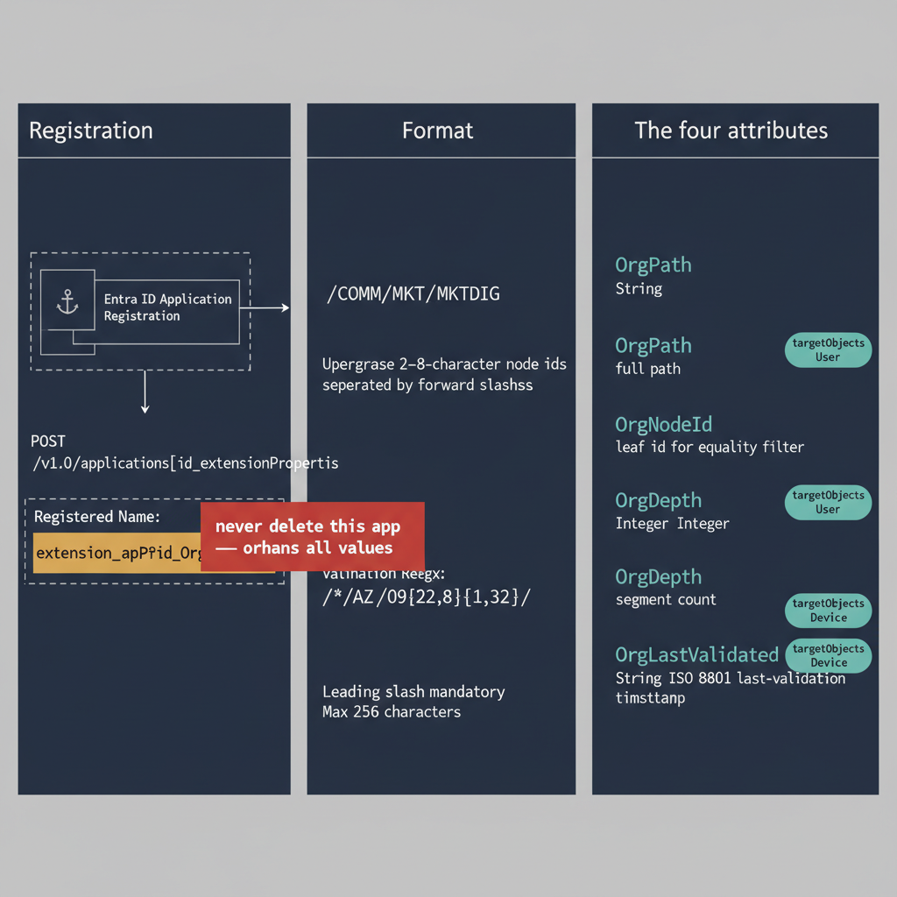

# Chapter 8 — The OrgPath Attribute — Registration, Format, and Validation

::: {.callout-note}
## In this chapter
This chapter specifies the OrgPath attribute itself: how the schema extension is registered against an application registration, the strict string format and the regular expression every value is validated against, and the three supplementary attributes — OrgNodeId, OrgDepth, and OrgLastValidated — that make the model efficiently queryable.
:::

{#fig-book-04-cpt-08-diagram-01 fig-alt="Left panel \"Registration\" shows an Entra ID application registration acting as an ownership anchor, with a POST to /v1.0/applications/{id}/extensionProperties producing a registered name of the form extension_{appId}_OrgPath, and a red warning tag \"never delete this app — orphans all values\". Center panel \"Format\" shows an example OrgPath string /COMM/MKT/MKTDIG broken into uppercase 2–8-character node ids separated by forward slashes, with the validation regex and notes (leading slash mandatory, max 256 characters). Right panel \"The four attributes\" lists OrgPath (String, full path), OrgNodeId (String, leaf id for equality filter), OrgDepth (Integer, segment count), and OrgLastValidated (String, ISO 8601 last-validation timestamp), each tagged targetObjects User and Device. Engineering blueprint style, white background, federal navy (#1F3A5F) for the panels, teal (#1A9E8F) for the four attributes, amber (#D4A017) for the registered-name anchor, red (#C0392B) for the do-not-delete warning, monospace identifiers and regex, no human figures, 16:9 landscape." width="85%"}

## Schema Extension Registration

The OrgPath attribute is stored in Entra ID as a directory schema extension registered to an application. Registration depends on a prerequisite established earlier: the schema extension application must already have been created during the platform setup phase described in Chapter 3, with its application object ID and client ID recorded in the pipeline configuration file at `pipeline/config.json`. With that confirmed, the extension properties are created by posting to the Microsoft Graph API endpoint `/v1.0/applications/{applicationObjectId}/extensionProperties`.

The POST body for the OrgPath extension property is a JSON object with three fields:

| Field | Value |
|-------|-------|
| `name` | `OrgPath` |
| `dataType` | `String` |
| `targetObjects` | `["User", "Device"]` |

The response includes the full registered attribute name in the `name` field of the response body.

> This registered name is **the string that all subsequent read and write operations must use** — and it must be stored in the pipeline configuration immediately.

The remaining three extension properties are created in separate POST requests to the same endpoint. Each carries the same `targetObjects` value of `["User", "Device"]`:

| Extension property | dataType | Carries |
|--------------------|----------|---------|
| OrgNodeId | `String` | The leaf node id, for efficient point-lookup queries |
| OrgDepth | `Integer` | The integer depth of the node in the hierarchy, for depth-bounded filtering |
| OrgLastValidated | `String` | The ISO 8601 timestamp of the last drift detection run that confirmed this object's OrgPath value against the current OrgTree |

All four extension properties should be created in a single session and their registered names recorded in the pipeline configuration before any ETL work begins.

::: {.callout-note title="Do Not Delete the Schema Extension Application"}
The application registration that owns the schema extension must not be deleted for as long as any extension attribute values exist in the directory — and in practice, for the full operational life of the governance substrate. Deleting the application orphans every OrgPath, OrgNodeId, OrgDepth, and OrgLastValidated value in the tenant. The values remain physically on the directory objects but become unreadable through the Graph API because the schema definition no longer exists. Recovery requires recreating the application with the same application ID, which Microsoft does not support — the application ID is globally unique and cannot be reused. Protect the application registration through the Entra ID Conditional Access policy and through role assignment reviews that prevent accidental deletion.
:::

## The OrgPath String Format

The OrgPath value is a forward-slash-delimited string of node ids, ordered from the root node to the leaf node, with a mandatory leading forward slash. A user who belongs to the Digital Marketing team, which sits within the Marketing department, which sits within the Commercial division, would carry the OrgPath value `/COMM/MKT/MKTDIG`.

The leading forward slash is mandatory — it is not a separator between root and first segment; it is a format marker that distinguishes an OrgPath value from a plain string and enables prefix matching using the `-startsWith` operator in dynamic group membership rules.

The format obeys a small set of strict rules:

- Node ids within the path are **uppercase alphanumeric** strings between **two and eight characters** in length.
- **No spaces** are permitted within a node id.
- **No special characters** other than the forward-slash delimiter are permitted anywhere in the value.
- The **maximum length** of an OrgPath value is **256 characters** — this accommodates up to approximately twenty hierarchy levels with average node id lengths of twelve characters including the delimiter, which is more than sufficient for any real organizational hierarchy.
- The **minimum length** is **three characters**, representing a root-level node with a two-character id: `/XX`.

Every OrgPath value written to the directory is validated against the regular expression `^\(\[A-Z0-9\]{2,8})(\\\[A-Z0-9\]{2,8})\*\$` before the write is submitted to the Graph API. Any value that does not match this expression is rejected by the pipeline's validation layer and logged as a write error. The rejection occurs at the **Transform** stage of the ETL pipeline, before the **Load** stage submits any API calls, so a validation failure for one object does not prevent processing of other objects.

The validation layer applies a second, semantic check beyond syntax: it confirms that the OrgPath value being written corresponds to a node that exists in the current OrgTree registry with an **Active** or **Pending** status. A value that is syntactically valid but references a node that does not exist in the registry — or that references a node with **Deprecated** or **Archived** status — is rejected with an `InvalidPath` error and logged as an unmapped object for manual review.

## The OrgNodeId, OrgDepth, and OrgLastValidated Attributes

The three supplementary extension attributes are written alongside OrgPath in every ETL operation. Each exists to make the model efficiently queryable in a way that the full path string alone cannot.

**OrgNodeId** is the id of the leaf node in the OrgPath — the last segment of the path string, extractable by splitting on the forward-slash delimiter and taking the last element. It is stored as a separate attribute to support efficient Graph API filter queries against a specific node without requiring a string suffix match, which is not supported by the Graph API's `$filter` syntax. A query to retrieve all users at exactly the MKTDIG node uses the filter `extension_{appId}_OrgNodeId eq 'MKTDIG'`, which is a supported equality filter and executes efficiently at directory scale.

**OrgDepth** is the count of segments in the OrgPath — for `/COMM/MKT/MKTDIG`, the depth is three. It is stored to support depth-bounded queries: retrieving all users at depth two or shallower retrieves only division and department-level placements, which is useful for organizational reporting that needs a coarse-grained view of the population distribution.

**OrgLastValidated** is the ISO 8601 timestamp of the most recent drift detection run that successfully validated this object's OrgPath value against the current OrgTree.

> Objects whose OrgLastValidated value is **more than forty-eight hours old** at drift detection time are flagged as potentially stale — even if their OrgPath value itself appears valid.

That flag exists because it is possible that the OrgTree was updated in a way that retroactively invalidated the path without the pipeline successfully re-validating the object.

The four extension attributes written on every ETL operation are summarized below.

| Attribute | Data type | Target objects | Purpose |
|-----------|-----------|----------------|---------|
| OrgPath | String | User, Device | Full forward-slash-delimited path from root to leaf (e.g. `/COMM/MKT/MKTDIG`) |
| OrgNodeId | String | User, Device | Leaf node id, enabling efficient equality-filter queries with no suffix match |
| OrgDepth | Integer | User, Device | Count of path segments, for depth-bounded organizational queries |
| OrgLastValidated | String | User, Device | ISO 8601 timestamp of the most recent drift run that confirmed the value |
