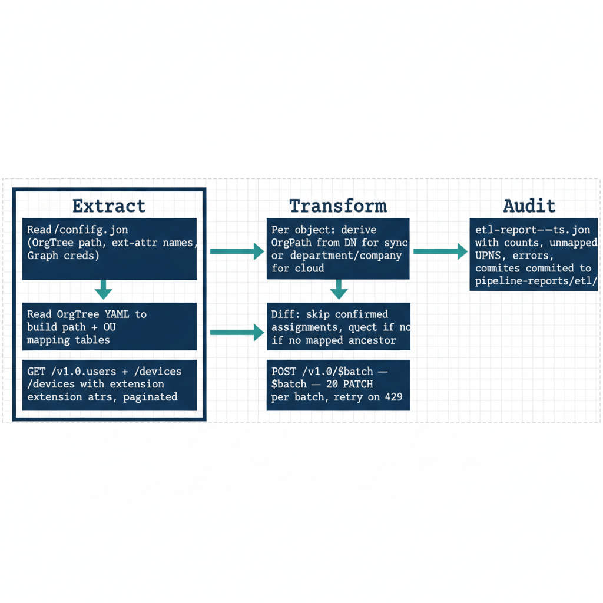

# Chapter 9 — The ETL Pipeline — Deriving and Stamping OrgPath Values at Scale

::: {.callout-note}
## In this chapter
With the attribute defined, it must be derived and stamped across tens of thousands of objects without disrupting the directory or tripping Graph API throttling. This chapter details the four-stage ETL pipeline — Extract, Transform, Load, and Audit — its idempotent re-run behavior, and the throttle-aware retry logic that keeps it safe at directory scale.
:::

## The Initial Population Challenge

In a mature Active Directory environment that has been synchronized to Entra ID through Entra Connect, the initial OrgPath population is a large-scale operation. It must process:

- potentially **tens of thousands** of user objects,
- **thousands** of device objects enrolled in Intune, and
- **hundreds or thousands** of server objects registered with Azure Arc.

For each object, the pipeline must derive the correct OrgPath value, validate it against the OrgTree registry, write it to the directory object through the Microsoft Graph API, and log every result. All of this must happen without disrupting the live directory environment or exceeding the Graph API's throttling limits in a way that impacts other services consuming the API concurrently.

> The ETL pipeline is the **most operationally consequential script in the entire governance implementation**, and it must be built with the care appropriate to that consequence.

## Pipeline Architecture: The Four Stages

{#fig-04-implementing-orgtree-and-orgpath-diagram-02 fig-alt="A leading config box on the far left labeled \"pipeline/config.json (OrgTree path, ext-attr names, Graph creds)\" feeds into the first stage. Four labeled stages follow sequentially: Extract (two boxes — Read OrgTree YAML to build path + OU mapping tables; GET /v1.0/users + /devices with extension attrs, paginated); Transform (two boxes — Per object: derive OrgPath from DN for sync or department/company for cloud; Validate against registry, reject if no mapped ancestor); Load (two boxes — Diff: skip confirmed assignments, queue new assignments; POST /v1.0/$batch — 20 PATCH per batch, retry on 429); Audit (one box — etl-report-{ts}.json with counts, unmapped UPNs, errors, committed to pipeline-reports/etl/). Single solid arrow connects each box to the next, advancing through the four stages. Engineering blueprint style, monospace API paths and filenames, white background, federal navy (#1F3A5F) and teal (#1A9E8F) accents, 16:9 landscape." width="85%"}

The ETL pipeline is a PowerShell script named `Invoke-OrgPathETL.ps1` that reads all of its configuration from a JSON file at `pipeline/config.json` and executes in four sequential stages. The configuration file records:

- the **OrgTree registry path**,
- the **schema extension application id**,
- the **registered names of all four extension attributes**,
- the **Graph API authentication parameters**,
- the **maximum batch size** for Graph API batch requests,
- the **retry parameters** for throttle handling, and
- the **path to the output directory** for the audit report.

The four stages run in order — Extract, Transform, Load, Audit — each consuming the output of the one before it.

### Extract

In the Extract stage, the pipeline reads the OrgTree registry YAML from the governance repository's local clone and builds two in-memory hash tables:

| Hash table | What it maps |
| :--- | :--- |
| **Path table** | Each OrgTree node id → its computed path value |
| **OU table** | Each OU DistinguishedName (derived from the OU-to-OrgTree mapping produced during the construction phase) → its corresponding OrgPath value |

This **OU-to-OrgPath mapping is the bridge** between the on-premises directory structure and the cloud identity model. It is stored in the governance repository as a YAML file at `registry/ou-mapping.yaml`, where each entry associates a specific OU DistinguishedName with the id of the OrgTree node it maps to. This file is produced during the OrgTree construction phase and committed alongside the initial OrgTree.

With the mapping tables built, the pipeline queries the Microsoft Graph API to retrieve all directory objects, following the `@odata.nextLink` pagination chain until all pages are consumed:

- **Users** — `GET /v1.0/users?\$select=id,userPrincipalName,onPremisesDistinguishedName,department,companyName,{orgPathExtAttr},{orgNodeIdExtAttr},{orgDepthExtAttr},{orgLastValidatedExtAttr}&\$top=999`
- **Devices** (parallel query) — `GET /v1.0/devices?\$select=id,displayName,onPremisesDistinguishedName,{orgPathExtAttr},{orgNodeIdExtAttr}&\$top=999`

The results of both queries are stored in memory as arrays of objects.

### Transform

In the Transform stage, the pipeline iterates through every retrieved object and derives its target OrgPath value. The derivation path depends on whether the object is synchronized from on-premises or cloud-only.

**For synchronized objects** — those with a non-null `onPremisesDistinguishedName` field — the derivation proceeds as follows:

1. Parse the OU path from the DistinguishedName string by extracting the sequence of OU components from the DN (the `OU=` segments in reverse order, since DNs are expressed from leaf to root).
2. Construct the OU DistinguishedName of the object's direct parent OU.
3. Look up that DN in the OU-to-OrgPath mapping hash table.
4. If the direct parent OU is not in the mapping — because it was classified as an administrative container during the OrgTree construction — walk up the DN hierarchy, checking each successive parent OU until a mapped one is found or the hierarchy is exhausted.

The outcome of that walk determines the assignment:

- **Mapped ancestor found** — the object receives that ancestor's OrgPath value, and the pipeline logs a note that the assignment was resolved at an ancestor level.
- **No mapped ancestor found** — the object is classified as **Unmapped** and excluded from the Load stage.

**For cloud-only objects** — those with a null or empty `onPremisesDistinguishedName` — the derivation falls back to the `department` attribute and the `companyName` attribute. These are checked against a separate cloud-provisioning mapping table in the configuration file that maps known department and companyName values to OrgTree node ids. Objects that cannot be resolved through either mechanism are classified as Unmapped.

### Load

In the Load stage, the pipeline collects all objects for which a valid OrgPath value was derived and sorts them into two groups:

| Group | Definition | Pipeline action |
| :--- | :--- | :--- |
| **New assignments** | Objects whose current OrgPath extension attribute is null or does not match the derived value | Submitted to the Graph API |
| **Confirmed assignments** | Objects whose current OrgPath extension attribute already matches the derived value and whose OrgLastValidated timestamp is current | Skipped |

> Confirmed assignments are skipped — **the pipeline is idempotent** with respect to objects that are already correctly attributed.

New assignments are submitted to the Graph API using the batch endpoint at `POST /v1.0/\$batch`, with each batch containing up to **twenty** individual PATCH requests. Each PATCH request body contains the four extension attribute values as a JSON object:

- the **OrgPath** string,
- the **OrgNodeId** string,
- the **OrgDepth** integer, and
- the **OrgLastValidated** ISO 8601 timestamp.

The batch response is checked for per-request errors:

| Response status | Meaning |
| :--- | :--- |
| **200 or 204** | Success |
| **429** | Throttling |
| **400** | Malformed request body |
| **500-series** | Server error |

All non-success responses are logged with the object id, the response status code, the response body, and the derived OrgPath value that was attempted.

### Audit

In the Audit stage, the pipeline produces a summary JSON report named `etl-report-{YYYYMMDD-HHMM}.json` containing:

- the run **start and end timestamps**,
- the **OrgTree version hash** used for derivation,
- the **total objects processed**,
- the count of **new assignments written**,
- the count of **confirmed assignments skipped**,
- the count of **unmapped objects**,
- the count of **write failures**, and
- the **list of unmapped object UPNs or device names** for manual review.

This report is written to the pipeline output directory and committed to the governance repository in the `pipeline-reports/etl/` subdirectory.

## Throttle Handling and Retry Logic

The Microsoft Graph API enforces throttling at the tenant level, with limits that vary by endpoint and by the number of concurrent callers. When the pipeline receives a 429 response from a batch request, it handles it deterministically:

1. Read the `Retry-After` header value from the response — which specifies the number of seconds the client must wait before retrying.
2. Pause execution for that duration using `Start-Sleep -Seconds \$retryAfterValue`.
3. After the pause, retry the failed batch.

The pipeline implements a maximum of **five retry attempts per batch** before marking all objects in the batch as failed and proceeding. The retry logic is implemented as a function `Invoke-GraphBatchWithRetry` that accepts a batch request array and returns a result array with per-request success or failure status. This function is called by the Load stage for every batch.

> The pipeline is also designed to be **re-run safely from any point of failure.**

Because the Extract stage reads the current extension attribute values on all objects and the Transform stage skips objects that already carry a current, valid value, a pipeline run that fails at the Load stage due to an unrecoverable error can be restarted from scratch without re-processing the objects that were successfully written in the partial run.

::: {.callout-note title="From one-time stamping to a continuous feed"}
This ETL run stamps OrgPath onto the object population as it stands today — a snapshot. Keeping that snapshot true requires an upstream source that carries hire, move, and separation events into OrgTree and OrgPath automatically. That source is the HR system of record, and the HR-agnostic provisioning pipeline that connects it — together with the play for reconciling an inherited, drifted OU estate by overlay rather than remediation — is the subject of [Chapter 9A — HR-Driven OrgPath Provisioning](Book_04_CPT_09a.qmd).
:::
