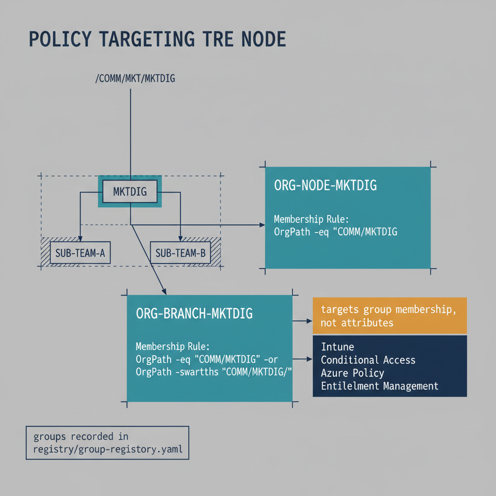

# Chapter 10 — From OrgPath to Policy Targeting — The Dynamic Group Library

::: {.callout-note}
## In this chapter
An attribute alone cannot be targeted by policy — only group memberships can. This chapter builds the dynamic group library that translates OrgPath values into policy-targetable groups: the node and branch group pair generated per OrgTree node, their membership rules, the creation pipeline, and the maintenance lifecycle as the OrgTree changes.
:::

## What the Dynamic Group Library Accomplishes

The dynamic group library is the set of Entra ID security groups — one pair per OrgTree node — that translates OrgPath attribute values into group memberships that policy surfaces can target. The OrgPath attribute, by itself, is a label on an identity object. A label alone cannot be consumed by Intune, Conditional Access, Azure Policy, or Entitlement Management — those tools work with group memberships, not with arbitrary attribute values. The dynamic group library is the translation layer: it creates the groups whose membership rules reference the OrgPath extension attribute, ensuring that every identity in a given organizational position automatically becomes a member of the appropriate groups, and that any change to an identity's OrgPath value — triggered by the ETL pipeline — is automatically reflected in group membership within the Entra ID directory's asynchronous group processing window. Once the library is in place, policy targeting becomes a declaration of organizational position: an Intune device compliance policy targeted at the ORG-BRANCH-MKTDIG group applies to every device in the Digital Marketing team and every device in any sub-team beneath it, automatically, without any manual group management.

## Naming Convention and Group Design

Each node in the OrgTree generates exactly two Entra ID security groups. The first is the node group, named ORG-NODE-{nodeId}, whose dynamic membership rule selects every user and device whose OrgPath extension attribute equals exactly the path of that specific node. For the node with id MKTDIG at path /COMM/MKT/MKTDIG, the node group is named ORG-NODE-MKTDIG and its membership rule is (user.extension\_{appIdWithoutHyphens}\_OrgPath -eq "/COMM/MKT/MKTDIG"). The second is the branch group, named ORG-BRANCH-{nodeId}, whose dynamic membership rule selects every user and device at that node or at any descendant node — that is, any object whose OrgPath equals the node's path exactly, or whose OrgPath begins with the node's path followed by a forward slash. For the same MKTDIG node, the branch group is named ORG-BRANCH-MKTDIG and its membership rule is (user.extension\_{appIdWithoutHyphens}\_OrgPath -eq "/COMM/MKT/MKTDIG") -or (user.extension\_{appIdWithoutHyphens}\_OrgPath -startsWith "/COMM/MKT/MKTDIG/"). The node group is used for policies that should apply only to a specific level of the hierarchy — for example, a compliance policy specific to the Digital Marketing team but not to its sub-teams. The branch group is used for policies that should apply to an entire subtree — for example, an Intune configuration profile that applies to everyone in Commercial and all of its descendant units, targeted at ORG-BRANCH-COMM.

{#fig-book-04-cpt-10-diagram-01 fig-alt="Center: an OrgTree fragment with node MKTDIG at path /COMM/MKT/MKTDIG and two child sub-teams beneath it. Two group cards branch off — \"ORG-NODE-MKTDIG\" with membership rule OrgPath -eq \"/COMM/MKT/MKTDIG\" (exact level only, highlighting just the MKTDIG node), and \"ORG-BRANCH-MKTDIG\" with membership rule OrgPath -eq \"/COMM/MKT/MKTDIG\" -or OrgPath -startsWith \"/COMM/MKT/MKTDIG/\" (the node and every descendant, highlighting MKTDIG and its sub-teams). Arrows from the two group cards point to a policy-surface band (Intune, Conditional Access, Azure Policy, Entitlement Management) labeled \"targets group membership, not attributes\". A small note reads \"groups recorded in registry/group-registry.yaml\". Engineering blueprint style, neutral slate background, federal navy (#1F3A5F) for the OrgTree, teal (#1A9E8F) for the two group cards, amber (#D4A017) for the policy-surface band, monospace group names and membership rules, no human figures, 16:9 landscape." width="85%"}

## The Group Creation Pipeline

The dynamic group library is created by the pipeline script New-OrgGroupLibrary.ps1, which reads the OrgTree registry from the governance repository, enumerates all nodes with Active or Pending status, and for each node makes two POST requests to the Microsoft Graph API endpoint /v1.0/groups. Each POST request body specifies the displayName, the mailNickname (a URL-safe version of the display name, required by the API even for non-mail-enabled groups), the groupTypes array containing the single value DynamicMembership, the securityEnabled flag set to true, the mailEnabled flag set to false, and the membershipRule string. The membershipRuleProcessingState property should be set to On to activate the rule immediately upon group creation; a value of Paused creates the group with an inactive rule, which is useful for staged deployment scenarios where the engineering team wants to validate the group definition before membership processing begins. After each group is created, the pipeline records the group's id (the Entra object ID returned in the creation response) against the corresponding OrgTree node id in a group registry file at registry/group-registry.yaml. This file is the authoritative mapping between OrgTree node ids and Entra group object IDs and is committed to the governance repository after every group creation or modification operation.

## Group Library Maintenance Lifecycle

The group library is a living construct that changes as the OrgTree changes. When a new node is added to the OrgTree and the change is merged to main, the post-receive webhook fires the propagation pipeline. The propagation pipeline reads the new OrgTree, identifies nodes that do not have corresponding entries in the group registry, creates the node and branch groups for those new nodes using the same POST sequence described above, and updates the group registry with the new group IDs. When a node is renamed in the OrgTree — its name field changes but its id field does not — the propagation pipeline updates the displayName of both associated groups using a PATCH to /v1.0/groups/{groupObjectId} with a JSON body containing only the updated displayName. The membershipRule does not change, because it is based on the node's id and path, neither of which changes when the display name changes. When a node is deprecated in the OrgTree, the propagation pipeline updates the description field of both groups to include a deprecation notice including the effective date, but does not delete the groups — active policy assignments may reference them during the transition period, and deleting them would immediately remove those policy targets. When a node is archived, the propagation pipeline first queries the Graph API to confirm that neither group is referenced in any current Conditional Access policy, Intune assignment, or Entitlement Management access package — using the /v1.0/groups/{groupId}/transitiveMemberOf endpoint and the policy assignment endpoints — and only proceeds with deletion after confirming no active references exist.
