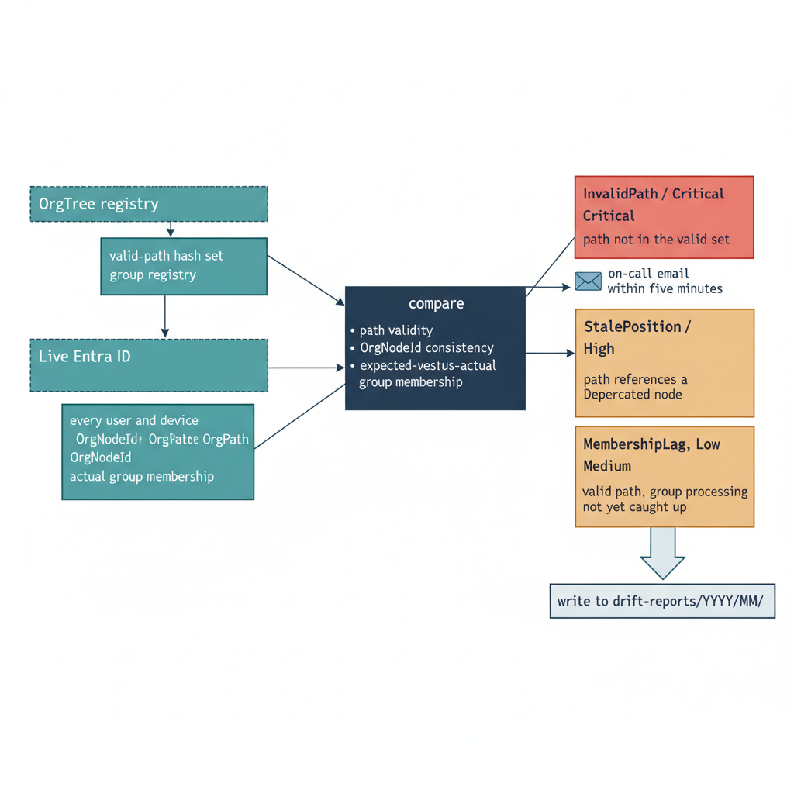

# Chapter 11 — Keeping the Model True — Implementing Continuous Drift Detection

::: {.callout-note}
## In this chapter
OrgPath values drift from the registry in any live environment. This chapter implements continuous drift detection — the nightly comparison of every object against the valid-path set and its expected group memberships, the four finding categories and their severities, and the report format that routes Critical and High findings to the on-call engineer before business hours.
:::

## Drift as Operational Reality

The OrgPath attribute stamped on every identity object will drift from the OrgTree registry over time. This is not a failure of the implementation — it is the natural consequence of operating a governance model in a live environment that changes continuously.

> **Drift is the default state of a live directory, not an exception to it.** In any active environment, drift sources accumulate faster than they are manually corrected.

The drift sources are mundane and constant:

- **Out-of-band provisioning.** Users are provisioned through automated workflows that do not invoke the OrgPath assignment pipeline.
- **Self-service enrollment.** Devices are enrolled in Intune through self-service enrollment flows that have no OrgPath awareness.
- **Informal reorganizations.** Organizational changes happen and are communicated informally — a manager sends an email asking for a user to be moved to a new team — and the person who acts on that change updates the user's group memberships but does not know to update their OrgPath value.
- **Failed propagation.** A webhook delivery fails and the propagation pipeline does not run after an OrgTree commit.

Each of these events is a drift source. Drift detection is the mechanism that catches these deviations systematically and brings the live environment back into alignment with the governed model before they compound into governance failures — compliance exceptions, misconfigured policy targets, or identity objects that are invisible to organizational reporting because their OrgPath value references a node that no longer exists.

{#fig-book-04-cpt-11-diagram-01 fig-alt="Left: two sources feeding a comparison engine — \"OrgTree registry → valid-path hash set + group registry\" and \"Live Entra ID → every user and device OrgPath, OrgNodeId, and actual group membership\". A central \"compare\" node runs three checks: path validity, OrgNodeId consistency, and expected-versus-actual group membership. Right: four finding cards stacked by severity — \"InvalidPath / Critical\" (path not in the valid set), \"Unpositioned / High\" (null or absent OrgPath), \"StalePosition / Medium\" (path references a Deprecated node), and \"MembershipLag / Low\" (valid path, group processing not yet caught up). An arrow shows Critical and High findings routing to an on-call email within five minutes; all findings are written to drift-reports/{YYYY}/{MM}/. Engineering blueprint style, white background, federal navy (#1F3A5F) for the comparison engine, teal (#1A9E8F) for the sources, amber (#D4A017) for the Medium and Low cards, red (#C0392B) for the Critical and High cards, monospace category labels, no human figures, 16:9 landscape." width="85%"}

## Drift Detection Script Architecture

The drift detection script, Invoke-DriftDetection.ps1, runs as a scheduled task on the automation server at 02:00 every morning. It accepts two parameters:

| Parameter | Points to | Purpose |
|-----------|-----------|---------|
| `-RepositoryPath` | The local clone of the governance repository | The source from which it reads the current OrgTree and group registry |
| `-OutputPath` | The output directory | Where it writes the drift report |

The script executes in a defined sequence. It first builds its reference data from the governance repository, then captures the live state from Entra ID, then runs three comparisons that surface every discrepancy:

1. **Compute the valid-path set.** Read the OrgTree registry and compute the complete set of valid OrgPath values — the universe of paths that any object may legitimately carry — as a hash set for O(1) membership testing.
2. **Build the expected-group mapping.** Read the group registry to build the mapping from OrgPath values to expected group IDs.
3. **Query live objects.** Query the Graph API for all users and all devices with their current extension attribute values.
4. **Query live group membership.** Query the current dynamic group membership state for each node and branch group in the library using `GET /v1.0/groups/{groupId}/members?$select=id&$top=999`, following pagination.
5. **Run the three comparisons.** First, check each object's OrgPath attribute value against the valid-path hash set; second, check each object's OrgNodeId value against the expected node id derived from its OrgPath; and third, compute the expected group memberships for each object based on its OrgPath value and the OrgTree hierarchy, and compare that expected membership set to the actual membership set returned from the Graph API queries.

Discrepancies in any of these three comparisons generate findings.

## Finding Categories and Severity Assignments

The drift detection output organizes its findings into four categories, each with a defined severity level and a defined disposition:

| Finding | Condition | Severity | Recommended action |
|---------|-----------|----------|--------------------|
| InvalidPath | OrgPath references a node combination absent from the current OrgTree | Critical | Investigate provisioning; apply the correct value with the manual remediation script |
| Unpositioned | OrgPath is null, empty, or absent | High | Determine the assignment from HR/provisioning records and run the ETL pipeline |
| StalePosition | OrgPath references a node with Deprecated status | Medium | Identify the new assignment from the deprecation event and update OrgPath |
| MembershipLag | OrgPath valid, but group memberships do not yet match | Low | None — resolves on its own as asynchronous group processing completes |

Each category carries a distinct operational meaning:

- **InvalidPath (Critical).** The object's OrgPath references a node id combination that does not exist in the current OrgTree registry. This indicates the value was set incorrectly — through a pipeline error, a manual edit mistake, or a race condition during an OrgTree restructuring event. A Critical finding must be investigated and corrected before the next governance review cycle.
- **Unpositioned (High).** The object has a null, empty, or entirely absent OrgPath extension attribute. Unpositioned objects are invisible to the governance model — they do not appear in any OrgTree-based report, they are not members of any dynamic group in the library, and any policy that requires organizational position cannot evaluate them correctly.
- **StalePosition (Medium).** The OrgPath value references a node that exists in the OrgTree with a status of Deprecated. This indicates that the object has not yet been reassigned following an organizational restructuring event.
- **MembershipLag (Low).** The OrgPath value is valid, but the object's dynamic group memberships do not match the expected memberships derived from that path. This condition occurs normally when an OrgPath value has been recently updated and the Entra ID directory's asynchronous group membership processing has not yet completed — it is expected to resolve itself within minutes to hours without intervention.

## Drift Report Format and Disposition

The drift report is a JSON file named drift-report-{YYYYMMDD-HHMM}.json written to the -OutputPath directory and then committed to the governance repository under drift-reports/{YYYY}/{MM}/.

The report's JSON structure begins with a header object that records:

- the run **start** timestamp,
- the run **end** timestamp,
- the **SHA-256 hash** of the OrgTree YAML file used for the comparison — which binds the report to a specific version of the organizational model, and
- **summary counts** for each severity level.

Below the header is an array of finding objects. Each finding object carries:

| Field | Value |
|-------|-------|
| Entra object ID | The directory identifier of the object |
| User principal name or device name | The human-readable identity of the object |
| Object type | `User` or `Device` |
| Current OrgPath value | The stamped path, or `null` if the attribute is absent |
| OrgNodeId value | The node identifier carried by the object |
| Finding category | InvalidPath, Unpositioned, StalePosition, or MembershipLag |
| Severity | Critical, High, Medium, or Low |
| `recommendedAction` | A string describing the corrective action |

The `recommendedAction` string is tailored to the finding category:

- For **InvalidPath**, investigate provisioning records and apply the correct OrgPath using the manual remediation script.
- For **Unpositioned**, determine the object's organizational assignment from HR or provisioning records and run the assignment pipeline.
- For **StalePosition**, identify the new node assignment resulting from the deprecation event and update the OrgPath.

> **Critical and High findings do not wait for the next review cycle.** They trigger an email notification through the Graph API to the governance team's distribution list within five minutes of the script completing.

The notification uses a PATCH to /v1.0/users/{serviceAccountId}/sendMail with a structured HTML email body summarizing the Critical and High finding counts and linking to the drift report in the repository.
