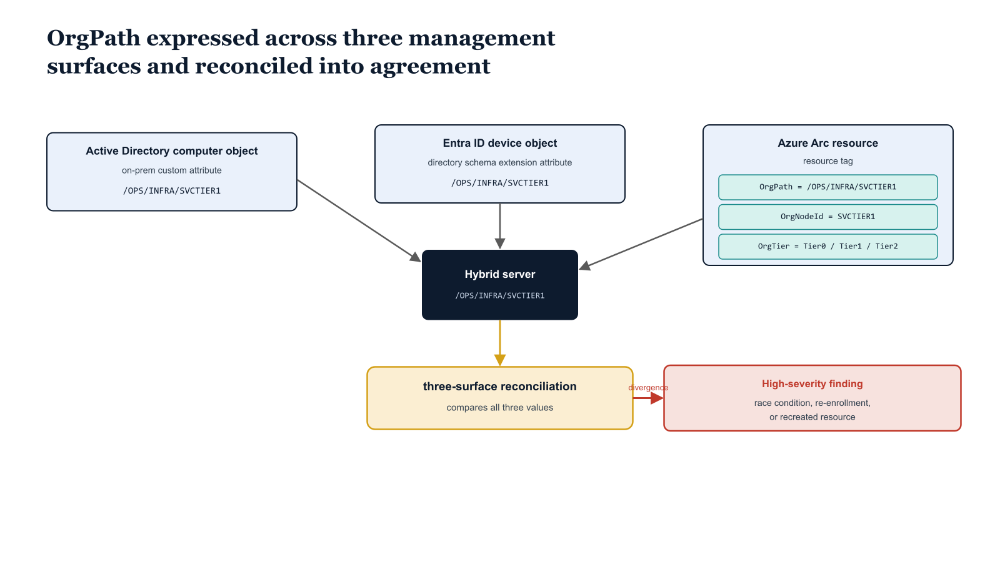

# Chapter 12 — OrgPath as a Resource Tag — Extending the Model to Arc-Managed Servers

::: {.callout-note}
## In this chapter
On the Azure management plane, OrgPath is expressed as a resource tag rather than a directory attribute. This chapter covers the Arc-specific implementation — the three tags applied to every Arc machine resource, the tag-population pipeline, and the three-surface reconciliation that keeps the Active Directory, Entra ID, and Arc copies of an OrgPath value in agreement.
:::

## The Arc-Specific Implementation

For servers managed through the Azure hybrid management plane — servers enrolled in Azure Arc and represented as `Microsoft.HybridCompute/machines` resources in Azure Resource Manager — the OrgPath value is expressed as a resource tag rather than as a directory schema extension attribute. This is not a design compromise; it is the correct choice for the Azure management plane.

> **Azure resource tags are the native mechanism for attaching governance metadata to Azure resources.** They are queryable across the entire resource graph using Azure Resource Graph queries, enforced and audited through Azure Policy, and exposed in every Azure cost management, compliance, and reporting surface.

Storing OrgPath as a tag on Arc machine resources integrates the governance substrate with the Azure management plane in the same way that storing it as an extension attribute on directory objects integrates it with the identity management plane.

{#fig-book-04-cpt-12-diagram-01 fig-alt="Center: a single hybrid server icon. Three labeled surface boxes around it each carry the same OrgPath value /OPS/INFRA/SVCTIER1 — \"Active Directory computer object\" (on-prem custom attribute), \"Entra ID device object\" (directory schema extension attribute), and \"Azure Arc resource\" (resource tag). The Arc box expands to show its three tags: OrgPath (/OPS/INFRA/SVCTIER1), OrgNodeId (SVCTIER1), and OrgTier (Tier0/Tier1/Tier2 management classification). A central \"three-surface reconciliation\" check compares all three values; a divergence path is drawn in red and labeled \"High-severity finding (race condition, re-enrollment, or recreated resource)\". Engineering blueprint style, white background, federal navy (#1F3A5F) for the three surface boxes, teal (#1A9E8F) for the Arc tags, amber (#D4A017) for the reconciliation check, red (#C0392B) for the divergence path, monospace tag names and path values, no human figures, 16:9 landscape." width="100%"}

### The Three Tags

Three tags are applied to every Arc machine resource, each carrying a distinct piece of governance metadata:

| Tag | What it holds | Purpose |
| :--- | :--- | :--- |
| **`OrgPath`** | The same forward-slash-delimited node id string used in the directory extension attribute — for example, `/OPS/INFRA/SVCTIER1` | Carries the full organizational lineage on the Azure management plane |
| **`OrgNodeId`** | The leaf node id — `SVCTIER1` in the example | Efficient tag-based filtering in Azure Resource Graph queries |
| **`OrgTier`** | The server's management tier classification (`Tier0`, `Tier1`, or `Tier2`) | A separate governance dimension that sits alongside OrgPath |

The `OrgTier` value classifies the server by management tier:

- **`Tier0`** — servers that are part of the identity infrastructure itself: domain controllers, PKI servers, ADFS servers.
- **`Tier1`** — servers hosting line-of-business applications and services.
- **`Tier2`** — servers supporting end-user workloads and departmental functions.

The `OrgTier` classification is determined during the assessment phase and recorded in the server's provisioning record in the governance repository — it is **not** derived from the OrgTree. It is a separate governance dimension that sits alongside OrgPath rather than being derived from it.

Tags are applied to Arc machine resources by either of two mechanisms:

- the `Update-AzConnectedMachine` cmdlet from the `Az.ConnectedMachine` module with the `-Tag` parameter; or
- a PATCH request to the Azure Resource Manager API at `https://management.azure.com/subscriptions/{subId}/resourceGroups/{rgName}/providers/Microsoft.HybridCompute/machines/{machineName}?api-version=2023-10-03-preview` with a JSON body containing the updated tags object.

## The Tag Population Pipeline

The Arc tag population pipeline is a component of the daily drift detection and remediation run, implemented in `Invoke-ArcTagPipeline.ps1`. It reads the governance repository to determine the authoritative OrgPath assignment for each Arc-enrolled server.

The assignment record for each server is created during the Arc onboarding process and committed to the governance repository as a YAML record at `registry/servers/{serverName}.yaml`, containing:

- the server's Arc resource ID,
- its OrgPath node id assignment,
- its OrgTier classification, and
- the date and approver of the assignment.

The pipeline runs through the following steps:

1. **Read** the assignment records and build a mapping from Arc resource ID to the expected tag set.
2. **Retrieve** the current tags on all Arc machine resources in scope by calling the Azure Resource Graph API using `Get-AzResourceGraphQuery` or directly through the `POST https://management.azure.com/providers/Microsoft.ResourceGraph/resources?api-version=2022-10-01` endpoint.
3. **Compare** the current tags against the expected tags from the assignment records.
4. **Apply** corrections where they diverge.

> All tag write operations use the Azure REST API **PATCH endpoint rather than a full tag replacement operation**, to avoid overwriting non-governance tags that other teams may have applied to the same resources.

## Three-Surface Reconciliation

For servers that are simultaneously domain-joined on-premises, registered in Entra ID as hybrid-joined devices, and enrolled in Azure Arc, the OrgPath value exists on all three management surfaces:

- the **Active Directory computer object** — in a custom attribute populated by the on-premises pipeline;
- the **Entra ID device object** — in the directory schema extension attribute; and
- the **Arc resource tag**.

The drift detection run's three-surface reconciliation check queries all three sources for each qualifying server and confirms that all three carry the same OrgPath value. Any divergence between the three values generates a **High severity** finding in the drift report.

Divergence is most commonly caused by a race condition during an OrgPath update — one surface is updated by the ETL pipeline before the others, and the drift detection run executes during the window between the first write and the last. But it can also indicate a more serious problem:

- a server that was manually **re-enrolled in Entra ID** (losing its extension attribute values),
- an Arc resource that was **deleted and re-created** (losing its tags), or
- a domain computer object that was **moved to a different OU** and had its on-premises custom attribute reset.

> The three-surface check is what makes these edge cases visible, and its **High severity classification ensures they receive attention at the next morning's review.**
