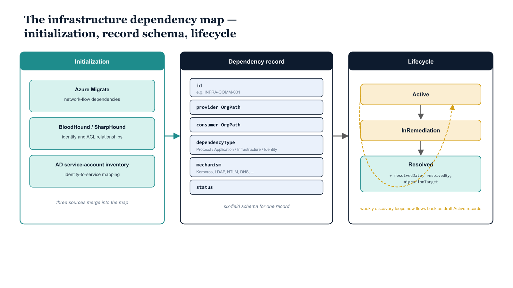

# Chapter 13 — Building and Maintaining the Infrastructure Dependency Map

::: {.callout-note}
## In this chapter
Legacy infrastructure cannot be decommissioned safely until its dependencies are known and resolved. This chapter initializes the infrastructure dependency map from assessment data, defines the six-field dependency record schema, and establishes the planned-resolution and continuous-discovery workflows that keep the map accurate as the environment evolves.
:::

## Initializing the Dependency Map from Assessment Data

The infrastructure dependency map is initialized from three data sources produced during the assessment phase, each contributing a different layer of dependency information:

| Source | Layer it provides | What it contributes |
| :--- | :--- | :--- |
| **Azure Migrate dependency analysis** | Network layer | Which servers communicate with which other servers, on which protocols and ports, at what frequency — retrieved through the Azure REST API and processed into candidate records, each a directional communication relationship between two servers |
| **BloodHound / SharpHound output** | Identity layer | Which accounts have administrative relationships over which objects, which service accounts are used by which applications, which Kerberos service principal names map to which server accounts, and which trust relationships enable cross-domain authentication flows |
| **Active Directory service account inventory** | Identity-to-service mapping | The set of user accounts carrying populated `ServicePrincipalNames` attributes or belonging to service-account organizational units — establishing which accounts are used as service identities and which are used for specific application integrations |

> These three sources are merged by **a Python or PowerShell initialization script** into a unified set of dependency records organized by dependency type, which it writes as the initial dependency map YAML files in the governance repository.

{#fig-book-04-cpt-13-diagram-01 fig-alt="Left panel (Initialization): three assessment sources merge into the map — Azure Migrate (network-flow dependencies), BloodHound/SharpHound (identity and ACL relationships), and the AD service-account inventory (identity-to-service mapping). Center panel (Dependency record): the six-field schema for one record — id (for example INFRA-COMM-001), provider OrgPath, consumer OrgPath, dependencyType (one of Protocol, Application, Infrastructure, Identity), mechanism (Kerberos, LDAP, NTLM, DNS, and similar), and status. Right panel (Lifecycle): a three-state track Active then InRemediation then Resolved, with the Resolved state adding resolvedDate, resolvedBy, and migrationTarget. A separate dashed arrow labeled weekly discovery loops new Azure Migrate flows back into the map as draft Active records. Engineering blueprint style, white background, federal navy (#1F3A5F) for the record schema, teal (#1A9E8F) for the three sources, amber (#D4A017) for the lifecycle states, monospace field names and ids, no human figures, 16:9 landscape." width="85%"}

## The Dependency Record Schema

Each record in the dependency map YAML files contains six mandatory fields:

| Field | Meaning |
|-------|---------|
| `id` | Unique record id — provider node id + consumer node id + sequence number (e.g. `INFRA-COMM-001` for the first dependency between the infrastructure and commercial units) |
| `provider` | OrgPath value of the unit that owns the infrastructure component being depended upon — the server, service, or identity the consumer relies on |
| `consumer` | OrgPath value of the unit that owns the consuming identity, application, or service |
| `dependencyType` | Protocol, Application, Infrastructure, or Identity |
| `mechanism` | The concrete mechanism in use |
| `status` | Active, InRemediation, or Resolved |

The `dependencyType` field classifies each dependency into one of four categories:

- **Protocol** — a specific authentication or communication protocol dependency.
- **Application** — an application-to-application integration.
- **Infrastructure** — a server-to-server dependency such as a backup relationship or a DNS dependency.
- **Identity** — a service account or credential dependency.

The `mechanism` field names the concrete means by which the dependency operates. Valid values are `Kerberos`, `LDAP`, `NTLM`, `CertificateEnrollment`, `DNS`, `DatabaseConnection`, `WebServiceCall`, `NFS`, `SMB`, `RPC`, and `ServiceAccountCredential`.

The `status` field tracks the dependency's migration state:

- **Active** — the dependency exists and is in use.
- **InRemediation** — the dependency has been identified and a remediation project is underway.
- **Resolved** — the dependency has been successfully eliminated.

> When a record transitions to **Resolved**, three additional fields are populated: `resolvedDate` in ISO 8601 format, `resolvedBy` identifying the engineer or team who completed the remediation, and `migrationTarget` describing the mechanism that replaced the dependency — for example, OAuth 2.0 replacing Kerberos, or a managed identity replacing a service account credential.

## Ongoing Dependency Map Maintenance

The dependency map is maintained through two concurrent mechanisms that together keep it accurate as the environment evolves.

**The planned maintenance workflow.** When the engineering team resolves a dependency — migrating an application from NTLM to modern authentication, replacing a service account credential with a managed identity, or decommissioning a server whose consumers have been migrated to a new endpoint — the resolving engineer:

1. Updates the dependency record in the YAML file.
2. Sets the status to Resolved and populates the resolution fields.
3. Commits the change to the governance repository with a commit message that references the associated change management ticket.

The change is then reviewed in the next governance team meeting to confirm the resolution is complete and that no residual consumer traffic has been observed in the network monitoring data.

**The discovery workflow.** The drift detection pipeline includes a dependency discovery component that runs weekly. Each cycle, it:

1. Calls the Azure Migrate API to retrieve the most recent network flow data collected by the Migrate appliance.
2. Compares the observed server communication patterns against the current dependency map records.
3. Identifies flows that are not represented in any existing record.
4. Generates a draft dependency record for each newly discovered flow — status Active, with a `discoveredBy` field noting that the record was pipeline-created — and commits it to the governance repository as an open finding for the engineering team to classify, annotate, and assign for remediation.

> This continuous discovery approach ensures that the dependency map stays comprehensive **even as new integrations are created outside of the formal change management process.**
