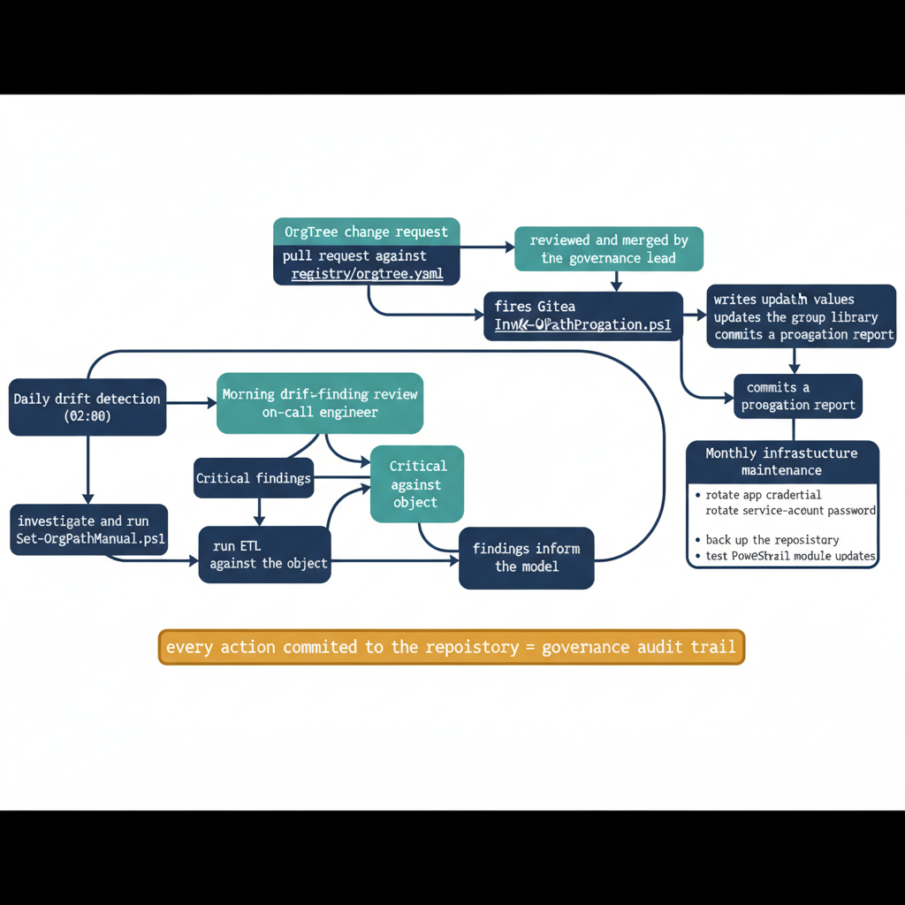

# Chapter 14 — Running the Governance Pipeline — Operational Procedures and Ongoing Maintenance

::: {.callout-note}
## In this chapter
Once deployed, the substrate largely runs itself; the engineering team's role shifts from execution to judgment. This chapter covers steady-state operations — the daily drift-finding review, the OrgTree change-request and propagation process, and the periodic infrastructure maintenance that keeps credentials, accounts, backups, and PowerShell modules current.
:::

## What Steady-State Operation Looks Like

Once the governance substrate is fully deployed — the OrgTree is published, OrgPath values are stamped on all objects, the dynamic group library is in place, and the drift detection pipeline is running on schedule — the system operates largely autonomously. Three jobs run on their own cadence, without human intervention:

- **Daily drift detection** runs on schedule and produces a report.
- **The OrgPath propagation pipeline** runs whenever an OrgTree change is committed and triggers the webhook.
- **The Arc tag pipeline** runs alongside drift detection and maintains tag accuracy on server resources.

The engineering team's operational role in steady state is not to operate the pipeline — the pipeline runs itself. It is to review the pipeline's output, act on its findings, and govern the changes that flow through the OrgTree change process.

> These are qualitatively different activities from running scripts manually, and they require a different operational posture: **less about execution and more about judgment.**

{#fig-book-04-cpt-14-diagram-01 fig-alt="A continuous loop: \"Daily drift detection (02:00)\" produces a report, which feeds the \"Morning drift-finding review\" by the on-call engineer (Critical findings → investigate and run Set-OrgPathManual.ps1; High findings → run ETL against the object), and the findings inform the model. A parallel branch \"OrgTree change request\" shows a pull request against registry/orgtree.yaml, reviewed and merged by the governance lead, firing the Gitea post-receive webhook into Invoke-OrgPathPropagation.ps1, which writes updated OrgPath values, updates the group library, and commits a propagation report. A side box \"Monthly infrastructure maintenance\" lists rotate app credential, rotate service-account password, back up the repository, and test PowerShell module updates. A footer band reads \"every action committed to the repository = governance audit trail\". Engineering blueprint style, white background, federal navy (#1F3A5F) for the automated jobs, teal (#1A9E8F) for the human-review steps, amber (#D4A017) for the audit-trail footer, monospace script and file names, no human figures, 16:9 landscape." width="85%"}

## Drift Finding Review Procedure

Each morning, the on-call governance engineer opens the most recent drift report committed to the governance repository. The review begins with the summary header: if the Critical count is zero and the High count is below a threshold defined in the governance team's SLA — typically five or fewer for a mid-sized deployment — the morning review is brief. Otherwise, the engineer works the findings by severity.

**Critical findings — invalid OrgPath values.** A Critical finding is an object with an invalid OrgPath value. If any are present, the on-call engineer begins investigating immediately, following a fixed sequence:

1. **Retrieve the object's provisioning record** from the provisioning system to determine when and how it was created.
2. **Determine who wrote the OrgPath value** the object carries:
   - If the pipeline wrote it, there is a **derivation error** in the OU-to-OrgPath mapping, or a **race condition** during a recent OrgTree update.
   - If something else wrote it, there is a **process gap** — something in the environment has write access to the OrgPath extension attribute that the pipeline does not control.
3. **Derive the correct OrgPath value** from the current OrgTree and apply it using the manual remediation script `Set-OrgPathManual.ps1`.

The `Set-OrgPathManual.ps1` script accepts an object ID and an OrgPath value, and then:

- validates the value against the current OrgTree,
- writes it to the directory, and
- logs the manual write to the governance repository with the engineer's identity and the reason for the manual override.

**High findings — Unpositioned objects.** High findings are reviewed to determine which of two situations applies:

- **A provisioning process failure** — the object was created without invoking the OrgPath assignment pipeline, which indicates a gap in the provisioning automation.
- **A legitimate new object** that has not yet been processed — in which case running the ETL pipeline against the specific object resolves the finding.

## OrgTree Change Request Process

Organizational restructuring events — a new division is created, two departments are merged, a team is moved from one unit to another, a regional office is established — are submitted as pull requests against the `registry/orgtree.yaml` file in the governance repository. The pull request is submitted by the engineer who has been tasked with implementing the structural change.

Its description field includes:

- the **change management ticket number**,
- a **plain-language description** of what is changing,
- the **business reason** for the change,
- the **effective date** on which the change takes effect, and
- the **names and OrgPath values of all nodes affected** — both the nodes being added, modified, or deprecated, and any nodes whose `parentId` changes as a result of the restructuring.

The pull request is reviewed by the governance team lead, who confirms that:

- the structural change is consistent with the organization's authoritative chart,
- all affected node ids are correct and unique,
- the effective date is appropriate, and
- the pull request description is complete.

> Approved pull requests are merged by the **governance team lead**, not by the submitting engineer.

On merge, the Gitea post-receive webhook delivers a payload to the webhook listener on the automation server. The listener then performs three steps in sequence:

1. **Validates the webhook signature** using the HMAC-SHA256 secret configured in the Gitea repository's webhook settings.
2. **Confirms that the push modified** `registry/orgtree.yaml`.
3. **Invokes** `Invoke-OrgPathPropagation.ps1` with the repository path as a parameter.

The propagation script runs the full derivation logic for all objects whose expected OrgPath changes as a result of the structural change and writes the updated values to the directory. It then runs the group library maintenance logic to update, create, or archive the affected dynamic groups. Finally, it commits a propagation report to the governance repository recording the number of objects updated, the number of groups modified, and the elapsed time for the full operation.

## Pipeline Infrastructure Maintenance

The governance pipeline infrastructure requires periodic maintenance to remain operational. Four components need ongoing attention:

| Component | What to maintain | Why it matters |
| :--- | :--- | :--- |
| **Schema extension app registration (Entra ID)** | Monitor credentials — client secrets or certificate credentials — to ensure they remain valid. If a client secret is used, track its expiration date and rotate it before it expires. | An expired secret prevents the pipeline from authenticating to the Graph API and causes all attribute write operations to **fail silently**. Certificate credentials are preferable because they can be renewed with longer validity periods. |
| **Assessment service account (AD queries)** | Rotate the password on the organization's standard password rotation schedule, and update the pipeline configuration with the new credential wherever it is stored — in a protected credential store, **not** in the configuration file in clear text. | Keeps the account valid for Active Directory queries without exposing the credential in plaintext. |
| **Git repository (repository server)** | Back up using a mechanism outside of the repository itself — a daily backup of the repository storage directory to a separate backup target. | The repository is the authoritative record of all governance decisions; its loss would be a significant governance incident. |
| **PowerShell modules** | Review the Graph SDK, the Az module, and the AD module periodically for updates. Test module updates in a non-production environment before applying them to the production automation server. | Breaking changes in major module versions — particularly in the Microsoft Graph PowerShell SDK, which has a history of significant API changes between major versions — can cause pipeline failures that are not immediately obvious from the module's release notes alone. |

A monthly infrastructure maintenance task, added to the governance team's operational calendar, should review all of these components and confirm they are current, valid, and operational.

::: {.callout-note title="The Governance Record as Operational Byproduct"}
One of the most valuable properties of the governance pipeline is that it produces a complete, version-controlled governance record as a natural byproduct of its normal operation — not as a separate reporting effort. Every OrgTree change, every ETL run, every drift report, every propagation event, and every manual remediation is committed to the repository with authorship, timestamp, and context. This record is the organization's governance audit trail. It can answer questions that would otherwise require reconstructing history from scattered logs: when was the Marketing department split into two units? Which objects were Unpositioned for more than a week after the last major provisioning event? When did the OrgPath value for a specific user change, and why? The record exists without any special effort to create it, because the pipeline creates it as it operates. Protecting and retaining this record is an operational responsibility with governance consequences.
:::
