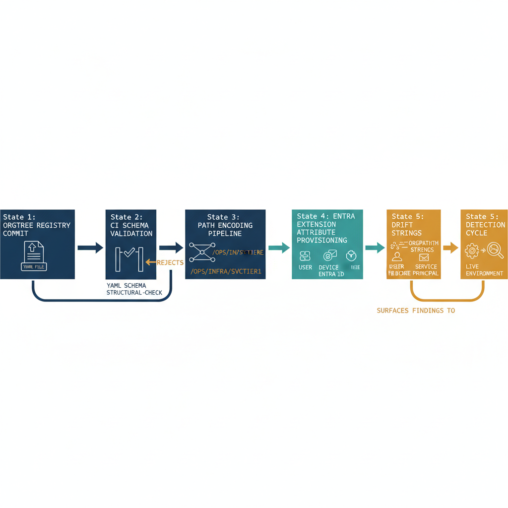

# Chapter 15 — What Has Been Built — A Summary of the Governance Substrate in Operation

::: {.callout-note}
## In this chapter
This closing chapter takes stock of what now exists: OrgTree as a governed registry that lives above the tools, OrgPath as its projection across identity, device, and server surfaces, the dynamic group library, the self-correcting drift-detection pipeline, the dependency map, and the version-controlled governance record — the layer the Microsoft stack does not natively provide.
:::

Consider what the organization now possesses that it did not possess before this implementation. The starting point was an Active Directory environment whose structural model — the OU hierarchy that organized everything the directory governed — had served well for everything it was designed to serve, but suffered from a set of limitations once the organization moved beyond AD-aware tools. That model:

- existed only inside the directory itself,
- was never formally versioned,
- was never change-controlled in a way that preserved the reasons for each structural decision, and
- could not be projected beyond the boundary of AD-aware tools.

The tools the organization now relies on for endpoint management, identity governance, conditional access, and hybrid server management do not read the OU hierarchy. They have no equivalent construct. They cannot natively answer the question of where an identity belongs in the organization's structure, because that structure was never expressed in a form they could consume.

{#fig-04-implementing-orgtree-and-orgpath-diagram-03 fig-alt="A horizontal state-machine diagram tracing a single OrgTree change as it advances left to right through five labeled states. State 1 \"OrgTree registry commit\" shows a Git push icon over a YAML file. State 2 \"CI schema validation\" shows a check-mark gate with YAML schema and structural-check sublabels; a curved arrow loops backward to State 1 labeled \"rejects\". State 3 \"Path encoding pipeline\" shows registry nodes resolving into OrgPath strings (monospace example /OPS/INFRA/SVCTIER1). State 4 \"Entra extension attribute provisioning\" shows OrgPath strings being written to user, device, and service principal objects in Entra ID. State 5 \"Drift detection cycle\" shows a continuous-comparison icon between the registry baseline and the live environment, with a long feedback arrow looping back to State 1 labeled \"surfaces findings to\". Solid forward arrows connect each successive state. Aesthetic: engineering blueprint style, white background, federal navy (#1F3A5F) for the substrate stages (1, 2, 3), teal (#1A9E8F) for the Entra surface stage (4), amber (#D4A017) for the governance and feedback arrows (rejects loop and drift feedback loop), monospace state labels, no human figures, 16:9 landscape." width="100%"}

### OrgTree — The Governed Registry

OrgTree is the answer to that problem. It is a versioned, validated, authoritative registry of every division, department, unit, and team that the organization formally recognizes as a governance boundary — maintained in a Git repository, changed through a reviewed pull request process, and carrying the complete history of every structural decision ever made:

- what was **created**,
- what was **renamed**,
- what was **deprecated**, and
- **when** each of those events was approved.

OrgTree does not live inside any management tool. It lives above them, in a repository that every tool can read from but that no tool owns.

> The organization's structure is no longer a fact that must be reconstructed from whatever the directory happens to contain. **It is a first-class, explicitly governed artifact.**

### OrgPath — The Projection Into Identity, Device, and Server Surfaces

OrgPath is the projection of OrgTree into the identity plane. Every user object in the Entra ID directory now carries an extension attribute — OrgPath — that expresses that user's position in the OrgTree as a validated, formatted string. The same attribute appears across every governed surface:

| Surface | How OrgPath is carried |
| :--- | :--- |
| **Entra ID user object** | Extension attribute holding the validated, formatted OrgPath string |
| **Device object** | The same OrgPath extension attribute |
| **Arc-managed server** | The equivalent value, carried as a resource tag |

The attribute was not set manually; it was derived from the OrgTree by an automated pipeline that consulted the authoritative registry and applied a defined mapping logic. It is validated on every write and re-validated on every drift detection run. An identity object whose OrgPath value does not correspond to a valid, active node in the current OrgTree is identified as a governance finding within twenty-four hours at most.

> The live environment stays aligned with the governed model **not because of manual discipline but because of automated detection and correction.**

### The Dynamic Group Library

The dynamic group library translates OrgPath values into group memberships that every policy surface in the Microsoft stack can target — Intune, Conditional Access, Azure Policy, Entitlement Management, and Administrative Units — all of which can now express organizational-position-based policy without any manual group management. For example:

- A compliance policy for a specific department targets the department's branch group.
- A conditional access policy for the entire commercial division targets the division's branch group.

When an organizational restructuring event moves a team from one division to another and the OrgTree is updated to reflect it, every policy that targets the affected groups automatically applies to the correct population the next time the dynamic group membership processing completes. The policy configuration does not change. The group membership rules do not change. Only the OrgPath values on the affected identity objects change, and the groups follow automatically.

### The Drift Detection Pipeline

The drift detection pipeline is the mechanism that makes the model self-correcting. It runs every night and produces a report of every identity object whose OrgPath value does not match the current OrgTree — for any of the following reasons:

- the object was provisioned outside of the governed pipeline,
- an organizational change was not propagated correctly, or
- the OrgPath value was modified by something the pipeline does not control.

Critical and High findings reach the on-call engineer before business hours begin.

> The governance model does not drift silently; **it drifts detectably,** with every deviation surfaced, categorized, and recommended for remediation before it can compound into a larger governance failure.

### The Infrastructure Dependency Map

The infrastructure dependency map records every infrastructure relationship that must be resolved before legacy on-premises infrastructure can be decommissioned, and tracks the resolution status of each dependency through three states: **Active**, **InRemediation**, and **Resolved**. The decommissioning plan is not a project that exists in a separate document that someone must keep manually up to date. It is a set of YAML records in the governance repository whose status fields tell the engineering team exactly how much work remains, where it is concentrated, and what the blocking dependencies for each decommissioning milestone are. When the last dependency record for a given infrastructure component transitions to Resolved, the decommissioning of that component can proceed with confidence.

### The Version-Controlled Governance Record

The version-controlled repository contains the complete history of all of it — a governance audit trail that exists as a byproduct of operating the pipeline:

| Record | What it captures |
| :--- | :--- |
| **OrgTree change** | The approver's commit identity and the business reason |
| **ETL run report** | The count of objects processed and any unmapped exceptions |
| **Drift report** | The finding counts and the object-level detail |
| **Propagation report** | What changed and how many objects were updated |
| **Manual remediation** | The engineer's identity and the justification |

This is not a special reporting effort, not a separate system, not something that requires manual entry. It is simply what the repository accumulates as the pipeline runs, day after day, governance decision after governance decision.

### The Layer the Microsoft Stack Does Not Provide

What the organization has built is the layer that the Microsoft identity and governance stack does not provide. Each of the tools in the stack — the cloud identity platform, the endpoint management system, the hybrid server management plane, the policy engine, the compliance reporting service — is powerful in its own domain, and each is more capable than its on-premises predecessor in the ways it was designed to be. What none of them provides is a shared organizational model that spans all of them and gives them a common vocabulary for expressing where an identity belongs in the organization's structure. That shared model had to be built separately, above the tools, in a form that each tool can consume.

OrgTree and OrgPath are that model. They are not a product. They are not a feature of any of the tools in the stack. They are an implementation that the engineering team built, deliberately and precisely, from the design established in Part Three of this series, using the assessment data gathered in the earliest chapters of this document and the construction steps that followed.

> The governance substrate now exists. The migration from the on-premises directory can proceed with the confidence that comes from knowing the governance model has not been abandoned — **it has been rebuilt in a form that will outlast the infrastructure it was originally expressed through.**

::: {.callout-note title="Series Summary"}
Part One established why the Microsoft identity stack's native constructs do not provide a sufficient organizational governance model for enterprises in transition. Part Two defined the requirements that a purpose-built governance substrate must meet. Part Three proposed OrgTree and OrgPath as the architectural response to those requirements. Part Four — this document — built the system from the proposal forward: assessment, construction, and operations, in sequence, with specific tools, specific commands, and the operational model that keeps the system accurate over time. The governance substrate is now operational.
:::
