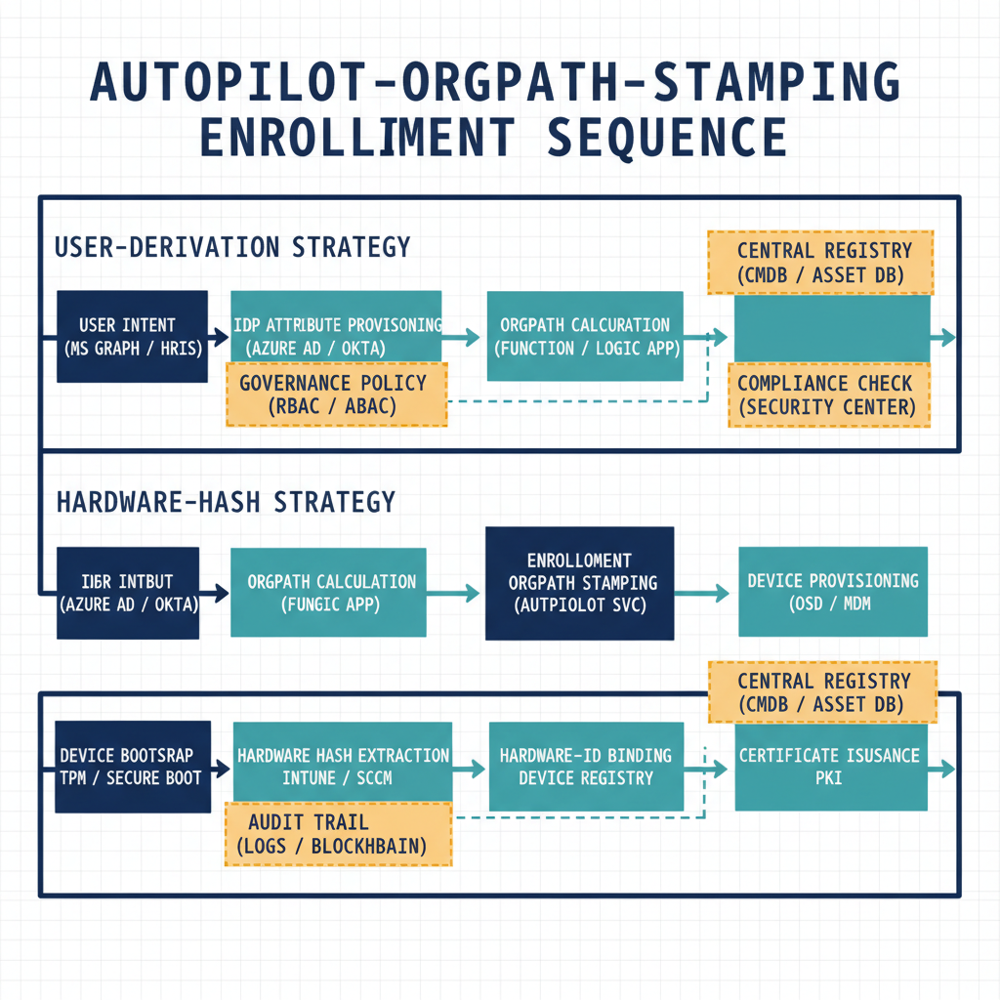

::: {.callout-note}
How OrgPath drives Microsoft Intune — node and branch dynamic groups for configuration profile and compliance targeting, Autopilot enrollment OrgPath assignment, scope-tag administration boundaries, and organizational compliance reporting that surfaces device posture by branch. Companion to the [Old AD vs New EntraID foundational reference](../learning/old-ad-vs-new-entra-reference.qmd).
:::

{#fig-05-orgpath-and-intune-image-02 fig-alt="Autopilot-OrgPath-stamping enrollment sequence (user-derivation + hardware-hash strategies). Engineering blueprint style, white background, federal navy (#1F3A5F) for primary structural elements, teal (#1A9E8F) for secondary/integration elements, amber (#D4A017) for governance/audit/registry overlays, monospace labels for identifiers, no human figures, 16:9 landscape." width="85%"}

::: {.callout-note title="Authoritative canon"}
The substrate-internal canonical specification for OrgPath-driven Intune
targeting is [UIAO_011 — OrgPath in Intune & Device Governance](https://github.com/WhalerMike/uiao/blob/main/src/uiao/canon/UIAO_011_OrgPath_in_Intune_and_Device_Governance.md),
which wraps [ADR-036](https://github.com/WhalerMike/uiao/blob/main/src/uiao/canon/adr/adr-036-dynamic-group-provisioning.md)
and [ADR-039](https://github.com/WhalerMike/uiao/blob/main/src/uiao/canon/adr/adr-039-policy-targeting.md)
plus `canon/data/orgpath/policy-targets.yaml` (retired by [ADR-078](https://github.com/WhalerMike/uiao/blob/main/src/uiao/canon/adr/adr-078-orgpath-attribute-schema-15-facet.md) Phase 1; per-facet rebuild scheduled in Phase 5).
This chapter is the customer-facing narrative; the canon doc is the
operator/spec reference.
:::

::: {.callout-tip}
## Download this book
**[Book_05-bundle.docx](Book_05-bundle.docx)** — every chapter of this book concatenated into one Word document. Regenerated on every site deploy.
:::

## Chapters

::: {#book-chapters}
:::

::: {.callout-tip}
## Continue the series

[← Previous: Book 04 — Implementing OrgTree and OrgPath](04-implementing-orgtree-and-orgpath.qmd) · [Index](index.qmd) · [Next: Book 06 — OrgPath and the Defender Suite →](06-orgpath-and-defender-suite.qmd)
:::
