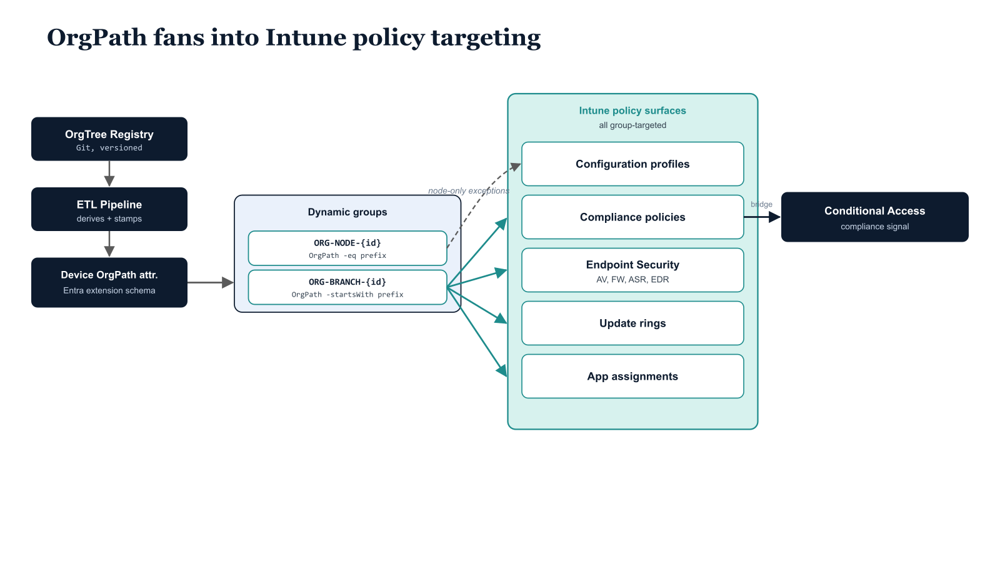

# Chapter 1 — The Missing Inheritance Layer in Intune Device Management

::: {.callout-note}
## In this chapter
Intune is a capable policy platform, but it has no native concept of organizational structure — no policy inheritance, no parent-to-child cascade. This chapter explains why that gap is structurally incompatible with an OrgTree-driven governance model, and how OrgPath stamped on device objects turns Entra ID dynamic groups into structural expressions that restore Group Policy–style inheritance. It closes with the eight-chapter architecture the rest of this document follows.
:::

## 1.1   The Structural Problem Intune Presents

Microsoft Intune is a mature and capable device management platform. Its policy model is comprehensive, with a distinct instrument for every dimension of Windows device governance a mature enterprise requires:

| Policy surface | What it governs |
| :--- | :--- |
| **Configuration profiles** | The full Settings Catalog |
| **Administrative Templates** | Group Policy preferences, mirrored |
| **Custom OMA-URI profiles** | Settings not yet surfaced in the UI |
| **Endpoint security policies** | Antivirus, firewall, attack surface reduction, account protection, and endpoint detection and response |
| **Compliance policies** | Device health evaluated against an organizational standard |
| **Application deployments** | Win32, Microsoft Store, and line-of-business packages |
| **Update rings** | Windows Update for Business delivery staged across the device population |

> **What Intune lacks, entirely and by design, is any native concept of organizational structure.**

This is not an oversight or a gap that a product update will close. It is a consequence of the architectural assumptions Intune was built on: devices are managed as individuals or as collections, collections are groups, and groups are either static or dynamic. No policy inherits from any other policy. No group contains another group in a way that causes policy to flow downward from a parent group to its children. No Intune policy surface has an equivalent to the Group Policy OU linkage model that caused a policy linked to a parent OU to apply automatically to every object in every child OU beneath it.

The practical consequence of this gap for an organization that has built the OrgTree and OrgPath substrate is stark. The OrgTree represents the organization as a hierarchy of nodes — divisions, departments, units, and sub-units — and the governance team's intent is that policy should cascade through that hierarchy the same way that Active Directory Group Policy cascaded through the OU hierarchy in the domain-joined model. A security baseline defined at the division level should apply to every device in every department and unit beneath that division. A configuration profile that establishes department-specific settings should apply to every device in every unit within that department. A site-specific network profile should apply to every device at every unit located at that site.

In Intune, without OrgPath, achieving this requires manual construction. If an organization has forty-two organizational units in its OrgTree and wants to apply a division-level security baseline that cascades to all units below the division node, the administrator must manually populate a group with devices from all forty-two units. When a new unit is added to the OrgTree, the administrator must manually add a representation of that unit's devices to the group. When a device is reassigned from one unit to another, the administrator must manually remove it from the old group and add it to the new one. When a department is reorganized and three units move from one division to another, the administrator must update every group that expressed the old organizational structure. The manual maintenance burden is not merely inconvenient — it is structurally incompatible with a governance model that is supposed to be deterministic, auditable, and driven by the OrgTree registry as its single source of truth.

There is an additional problem beyond maintenance burden. Groups maintained manually are not auditable in any meaningful sense. A static group's membership may have been correct when it was created and wrong six months later due to device assignments that occurred through channels that did not update the group. A compliance policy assigned to a manually maintained group may be applying to a device population that no longer reflects the intended organizational scope. The governance team cannot detect this drift without a separate reconciliation process, and reconciliation against a manually maintained group is itself a manual process. The structural integrity of the governance model depends on the membership of every group being derivable from the OrgTree registry — and that derivability is possible only if group membership is defined by a rule that evaluates the OrgPath attribute, not by a list of device objects that someone last updated at some undetermined point in the past.

## 1.2   What OrgPath Changes About the Intune Model

OrgPath changes the nature of device groups in Entra ID from collections to structural expressions. Because the Part Four ETL pipeline stamped the OrgPath schema extension attribute on every device object as part of its enrollment-time processing, every managed device already carries its organizational position as a machine-readable, queryable attribute directly on the directory object. That attribute is readable by the Entra ID dynamic group membership evaluation engine. A dynamic group whose membership rule evaluates the OrgPath attribute will automatically contain every device whose OrgPath value satisfies the rule — and that membership is maintained in real time by Entra ID itself, not by any manual process.

When a device is reassigned from one unit to another, the ETL pipeline updates its OrgPath value. Within minutes of that update, the dynamic group membership engine re-evaluates the device's group memberships. The device leaves every group whose rule no longer matches its new OrgPath and joins every group whose rule now matches. No administrator touches any group. No pipeline step explicitly removes or adds the device to any group. The group memberships are a pure function of the OrgPath value and the membership rules, and both of those are under version-controlled governance control.

The combination of OrgPath stamped on device objects and a properly designed dynamic group library restores to Intune the structural inheritance that Active Directory's OU model provided through Group Policy linkage. A policy assigned to a group whose membership rule matches all devices in a division will automatically apply to every device in every unit beneath that division, because every one of those devices carries an OrgPath value that satisfies the rule. When a new unit is added to the OrgTree beneath the division, devices enrolled in that unit receive OrgPath values that satisfy the division-level group rule, and those devices automatically receive the division-level policy without any policy assignment change. The OrgTree registry drives group membership, group membership drives policy targeting, and policy targeting is therefore a deterministic extension of the organizational structure defined in the registry.

::: {.callout-note title="Critical Prerequisite"}
All implementation steps in this document assume that the OrgPath schema extension has been registered in the Entra ID tenant, that the ETL pipeline from Part Four is stamping OrgPath on device objects, and that the OrgTree registry JSON file is current and accessible to the automation service account. None of the scripts in this document will function correctly if OrgPath is not present on device objects.
:::

## 1.3   Architecture Overview for This Document

This document builds the Intune integration layer of the OrgPath governance model in a sequence of eight chapters, each addressing a specific component of the integration. The sequence is designed so that each chapter's output is a prerequisite for the next: Chapter Two must complete before Chapter Three can be executed correctly, and so on through Chapter Nine.

Chapter Two creates the dynamic device group library — the node and branch group pattern that expresses every node in the OrgTree as a pair of Entra ID dynamic security groups with membership rules that evaluate the OrgPath attribute. These groups are the universal targeting mechanism for every Intune policy surface. Chapter Three covers Intune policy targeting: how each policy surface in Intune — configuration profiles, compliance policies, endpoint security policies, application deployments, and update rings — maps to the group library, and what the correct targeting decision is for each. Chapter Four covers Autopilot enrollment integration: the specific challenge of stamping OrgPath on a device during Autopilot provisioning, before the device has completed enrollment, so that it enters the governance model correctly positioned from its first policy evaluation cycle. Chapter Five covers the Compliance and Conditional Access bridge: the pattern through which OrgPath-derived compliance policies become the device posture signal in organizationally contextual Conditional Access rules, so that the compliance standard a device is evaluated against reflects its organizational position. Chapter Six covers the pipeline extension: the additional operations the Part Four ETL pipeline must execute after stamping OrgPath, specifically requesting a device policy sync and updating the Intune device category to match the OrgTree node type. Chapter Seven covers scope tag administration delegation: the mapping of OrgPath segments to Intune scope tags for administrative boundary enforcement, so that divisional and departmental IT administrators can manage exactly their segment's devices and policies. Chapter Eight covers KQL dashboards: the Sentinel and Log Analytics queries that surface OrgPath-aware device compliance visibility, enabling the governance team to answer organizational questions about device posture that the native Intune compliance dashboard cannot answer. Chapter Nine covers the rollout sequence and operational notes for production deployment.

{#fig-05-orgpath-and-intune-diagram-01 fig-alt="On the far left, three sequential boxes: OrgTree Registry (Git, versioned) → ETL Pipeline (derives + stamps) → Device OrgPath attribute (Entra extension schema). The Device OrgPath attribute fans rightward into a labeled group containing two dynamic group rows: ORG-NODE-{id} (OrgPath -eq prefix) and ORG-BRANCH-{id} (OrgPath -startsWith prefix). The Branch group fans rightward into a second labeled cluster \"Intune policy surfaces (all group-targeted)\" containing five boxes arranged vertically: Configuration profiles, Compliance policies, Endpoint Security (AV, FW, ASR, EDR), Update rings, App assignments. A dashed arrow from the Node group to Configuration profiles labeled \"node-only exceptions\". A separate downstream box \"Conditional Access (compliance signal)\" receives a single arrow from Compliance policies, indicating the bridge from device compliance into CA evaluation. Engineering blueprint style, white background, monospace group names, federal navy (#1F3A5F) for substrate stages and teal (#1A9E8F) for Intune surfaces, 16:9 landscape." width="85%"}
