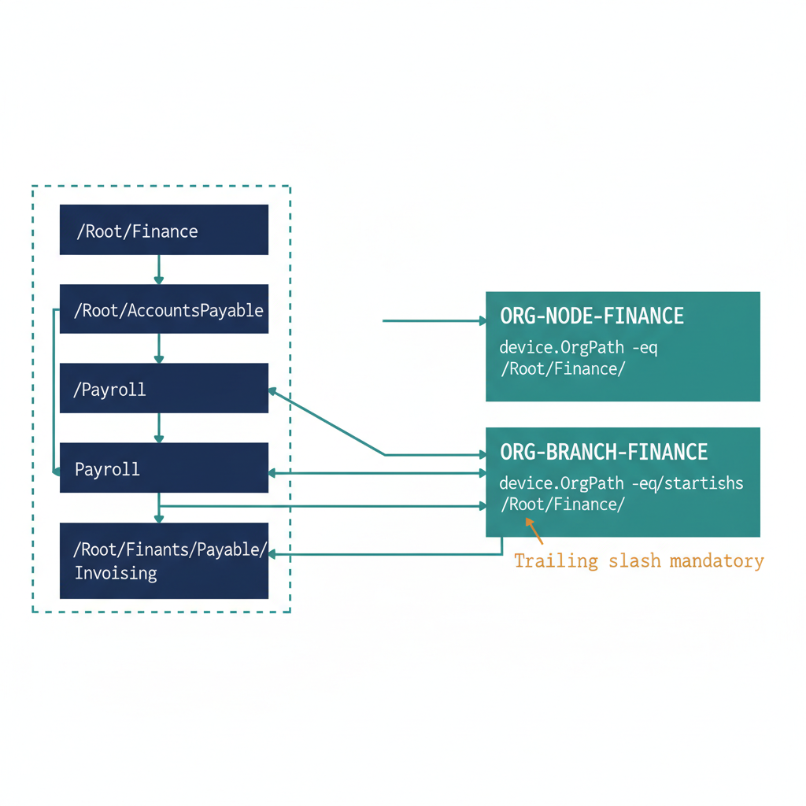

# Chapter 2 — The Dynamic Device Group Library

::: {.callout-note}
## In this chapter
For every OrgTree node the governance pipeline creates two dynamic security groups: a node group, which matches devices assigned exactly to that node, and a branch group, which matches the node plus every descendant unit. This chapter defines the two-group pattern, the NodeId-based naming convention, the dynamic membership rule syntax built from the OrgPath schema extension attribute, and the idempotent New-OrgPathDeviceGroupLibrary.ps1 script that maintains the full library on every registry change.
:::

## Node Groups and Branch Groups — The Foundation of Structural Intune Targeting

## 2.1   The Two-Group Pattern

For each node in the OrgTree, the governance pipeline creates two dynamic security groups in Entra ID. These two groups serve different and complementary purposes, and understanding the distinction between them is essential before any policy assignment decisions are made.

The first group is the **node group**. The node group contains every device whose OrgPath value exactly equals the path of that node. These are devices assigned precisely to that organizational unit and no others. A device in the Finance department whose OrgPath is /Root/Finance is in the Finance node group. A device in the Finance Accounts Payable unit whose OrgPath is /Root/Finance/AccountsPayable is not in the Finance node group — it is in the Accounts Payable node group. The node group is used for policies that must apply to one specific unit without cascading downward to subordinate units. This is the exception case, not the rule.

The second group is the **branch group**. The branch group contains every device whose OrgPath value either exactly equals the path of that node or begins with the node path followed by the path delimiter. This means the branch group contains the node group's population plus every device in every organizational unit descended from the node in the hierarchy. A device in /Root/Finance/AccountsPayable is in the Finance branch group. A device in /Root/Finance/AccountsPayable/Invoicing is also in the Finance branch group.

The branch group is the correct targeting choice for the vast majority of Intune policies because it replicates the inheritance behavior of Group Policy Object linkage to an OU in Active Directory. A policy assigned to the Finance branch group applies to every Finance device at every level of the Finance subtree, including units not yet created at the time the policy is assigned.

The two-group pattern is not optional. Creating only one group type for each node destroys either the cascading behavior (if only node groups are created) or the unit-specific targeting capability (if only branch groups are created). The governance pipeline creates both groups for every active node in the OrgTree registry, even for leaf nodes where the branch group and the node group will initially have identical membership. Leaf node branch groups will diverge from their corresponding node groups if subordinate units are added beneath the leaf in the future, and having the branch group pre-created means no policy assignment changes are needed when that happens.

## 2.2   Naming Convention

Node groups are named ORG-NODE-{NodeId} where NodeId is the unique identifier of the node from the OrgTree registry. Branch groups are named ORG-BRANCH-{NodeId}. The NodeId is the same identifier used in the OrgTree registry's nodes array — typically a short alphanumeric slug that is stable across renames of the organizational unit itself (since organizational units can be renamed without changing their structural position in the hierarchy).

This naming convention is deterministic and reversible in both directions. Given a group name, the NodeId can be recovered by stripping the ORG-NODE- or ORG-BRANCH- prefix. Given a NodeId, both group names can be constructed without any additional directory lookup. The governance pipeline uses this convention exclusively and never creates device groups with ad-hoc names outside this scheme. Any Intune policy found to be assigned to a group whose name does not match the ORG-NODE-\* or ORG-BRANCH-\* pattern is flagged in the daily drift detection report as a governance exception, because its assignment target is not managed by the pipeline and may have drifted from the intended organizational scope.

::: {.callout-note title="Why NodeId, Not NodeName?"}
Group names are based on NodeId rather than NodeName because organizational units are frequently renamed. If groups were named after the unit's display name, a departmental rename would require renaming the group, which would invalidate any Intune policy assignments, Conditional Access policy references, or RBAC role assignments that reference the group by name. NodeId is assigned once when the node is created in the registry and never changes, making it safe to use as a durable identifier in group names and all downstream references.
:::

## 2.3   Dynamic Membership Rule Syntax

The dynamic membership rules for both group types use the OrgPath schema extension attribute name, which is constructed from the Application ID of the Entra ID app registration that owns the OrgPath schema extension. Entra ID schema extension attribute names take the form extension\_{AppIdWithoutHyphens}\_{AttributeName}. The Application ID used when defining the schema extension in Part Three is used here, with all hyphens removed from the GUID. This is the same App ID used in the Part Four ETL pipeline when stamping OrgPath values, and it must be consistent across all components of the governance model.

Using the Finance division node as the concrete example, where the Finance node's OrgPath is /Root/Finance and the App ID (hyphens removed) is the tenant-specific value substituted into every script in this document, the node group membership rule is:

```
(device.extension_{AppIdWithoutHyphens}_OrgPath -eq "/Root/Finance")
```

The branch group membership rule for the same node, which covers the Finance node itself and every organizational unit at any depth beneath it, is:

```
(device.extension_{AppIdWithoutHyphens}_OrgPath -eq "/Root/Finance")
    -or
(device.extension_{AppIdWithoutHyphens}_OrgPath -startsWith "/Root/Finance/")
```

The trailing slash in the -startsWith clause of the branch group rule is critical and must not be omitted. Without the trailing slash, a branch group for /Root/Finance would incorrectly include devices whose OrgPath begins with /Root/FinanceAdjacent or any other path that starts with the string /Root/Finance but represents a different organizational unit. The trailing slash ensures that the match is structural — it matches only paths that are genuinely subordinate to the Finance node in the hierarchy.

In both rules, {AppIdWithoutHyphens} must be substituted with the Application ID of the Entra ID app registration used to define the OrgPath schema extension, with all hyphens removed. The script in Section 2.4 constructs this substitution programmatically from the \$OrgPathAppId parameter, so the raw GUID with hyphens is the only value that needs to be supplied as input. The script derives the hyphen-free form automatically.

The two group types, their naming, and their membership rules are summarized below, using the Finance division node (OrgPath /Root/Finance) as the worked example.

| Group type | Name pattern | Membership rule (Finance example) | Contains | Primary use |
|----|----|----|----|----|
| Node group | ORG-NODE-{NodeId} | device.OrgPath -eq "/Root/Finance" | Devices assigned exactly to this node | Unit-specific policies, no cascade (the exception case) |
| Branch group | ORG-BRANCH-{NodeId} | device.OrgPath -eq "/Root/Finance" -or device.OrgPath -startsWith "/Root/Finance/" | This node plus every descendant unit at any depth | Division/department policies that cascade downward (the default) |

{#fig-book-05-cpt-02-diagram-01 fig-alt="Engineering blueprint diagram on a white background showing how a node group and a branch group draw their membership from the same OrgTree subtree. On the left, a vertical hierarchy of three federal navy (#1F3A5F) nodes with monospace path labels: NCR / Finance at the top, branching to NCR / Finance / GRC and NCR / Finance / Service. A fourth position beneath NCR / Finance / GRC is drawn as a dashed grey note reading \"the path stops at Division - finer tiers ride facets 11-14, not the path\". On the right, two stacked teal (#1A9E8F) group boxes. The top box labeled ORG-NODE-FINANCE with rule extensionAttribute15 -eq \"Region=NCR|Department=Finance|\" draws a single solid connector to ONLY the NCR / Finance node. The bottom box labeled ORG-BRANCH-FINANCE with rule extensionAttribute15 -startsWith \"Region=NCR|Department=Finance|\" draws solid connectors to all three nodes and encloses the entire subtree in a dashed teal boundary. An amber (#D4A017) marker notes that the trailing delimiter is mandatory, because Department=Finance| never matches Department=FinanceOps|. Monospace labels for all paths and group names, no human figures, 16:9 landscape." width="100%"}

## 2.4   New-OrgPathDeviceGroupLibrary.ps1

The following script creates and maintains the full dynamic device group library. It is named New-OrgPathDeviceGroupLibrary.ps1 and is stored in the governance repository under governance/intune/groups/. It runs as a pipeline step immediately after any change to the OrgTree registry is committed and validated. The script is designed to be fully idempotent: running it multiple times against the same registry state produces the same result as running it once, and it never creates duplicate groups or corrupts existing groups whose membership rules are already correct.

```powershell
<# data-id="133"
.SYNOPSIS
    Creates and maintains the OrgPath dynamic device group library in Entra ID.

.DESCRIPTION
    Reads the OrgTree registry and ensures that every active node has both a
    node group and a branch group with the correct dynamic membership rules.
    Creates missing groups, updates stale membership rules, and archives groups
    for nodes that have been removed from the registry.

.PARAMETER OrgTreeRegistryPath
    Local path to the OrgTree registry JSON file, checked out from the
    governance repository before this script runs.
    Example: "C:\governance\orgtree\registry.json"

.PARAMETER OrgPathAppId
    The Application ID (with hyphens) of the Entra ID app registration that
    owns the OrgPath schema extension. Used to construct the extension attribute
    name in dynamic membership rules.
    Example: "a1b2c3d4-e5f6-a1b2-c3d4-e5f6a1b2c3d4"
    Substitute your tenant's actual App ID for this value.

.PARAMETER WhatIf
    When set, reports what would be created or updated without making changes.

.NOTES
    Requires Microsoft.Graph PowerShell SDK 2.x or later.
    Required Graph permission scopes: Group.ReadWrite.All, Directory.ReadWrite.All
    Run under the automation service account (Managed Identity preferred in CI/CD).
    PowerShell 7.4 or later recommended.
    This script is safe to run on every OrgTree change — it will not create
    duplicate groups or overwrite correct membership rules unnecessarily.
#>
param(
    [string] $OrgTreeRegistryPath = "C:\governance\orgtree\registry.json",
    # Substitute with your tenant's OrgPath app registration Application ID (with hyphens):
    [string] $OrgPathAppId        = "a1b2c3d4-e5f6-a1b2-c3d4-e5f6a1b2c3d4",
    [switch] $WhatIf
)

Set-StrictMode -Version Latest
$ErrorActionPreference = "Stop"

# --- Build the extension attribute name from the App ID ---
# Entra ID schema extension names require the App ID with NO hyphens.
# This derivation must match exactly what was used in the Part Four ETL pipeline.
$appIdNoHyphens    = $OrgPathAppId -replace "-", ""
$extensionAttrName = "extension_${appIdNoHyphens}_OrgPath"

Write-Host "[$(Get-Date -f 'HH:mm:ss')] Extension attribute name: $extensionAttrName"

# --- Authentication ---
# In production CI/CD pipelines, replace with Managed Identity or
# certificate-based authentication. Do not use interactive browser auth
# in unattended automation contexts.
Connect-MgGraph -Scopes "Group.ReadWrite.All", "Directory.ReadWrite.All" -NoWelcome

# --- Load OrgTree Registry ---
$registry    = Get-Content -Path $OrgTreeRegistryPath -Raw | ConvertFrom-Json
$activeNodes = $registry.nodes | Where-Object { $_.Status -eq "Active" }
Write-Host "[$(Get-Date -f 'HH:mm:ss')] OrgTree loaded: $($activeNodes.Count) active nodes."

# --- Load Existing ORG-NODE and ORG-BRANCH Groups ---
# This retrieves ALL governance-managed device groups in a single batched call
# rather than querying per-node, which is significantly more efficient for
# large OrgTrees with hundreds of nodes.
$existingGroups = Get-MgGroup `
    -Filter "startsWith(displayName,'ORG-NODE-') or startsWith(displayName,'ORG-BRANCH-')" `
    -All `
    -Property "Id,DisplayName,MembershipRule,Description"

# Index existing groups by display name for O(1) lookup during the sync loop.
$groupIndex = @{}
foreach ($g in $existingGroups) { $groupIndex[$g.DisplayName] = $g }

Write-Host "[$(Get-Date -f 'HH:mm:ss')] Existing governance groups found: $($existingGroups.Count)"

# --- Helper: Build Node Group Membership Rule ---
# Returns the rule that matches ONLY devices assigned exactly to this node.
function Build-NodeRule {
    param([string]$NodePath, [string]$ExtAttr)
    return "(device.${ExtAttr} -eq `"${NodePath}`")"
}

# --- Helper: Build Branch Group Membership Rule ---
# Returns the rule that matches devices at this node OR any descendant node.
# The trailing slash in the -startsWith clause is mandatory — see Section 2.3.
function Build-BranchRule {
    param([string]$NodePath, [string]$ExtAttr)
    return "(device.${ExtAttr} -eq `"${NodePath}`") " +
           "-or (device.${ExtAttr} -startsWith `"${NodePath}/`")"
}

# --- Helper: Create or Update a Dynamic Device Group ---
# This function is the core idempotency mechanism. It checks existence and
# rule correctness before making any write calls to the Graph API.
function Sync-DeviceGroup {
    param(
        [string]    $DisplayName,
        [string]    $MembershipRule,
        [string]    $Description,
        [hashtable] $GroupIndex,
        [switch]    $WhatIf
    )

    if ($GroupIndex.ContainsKey($DisplayName)) {
        $existing = $GroupIndex[$DisplayName]
        if ($existing.MembershipRule -ne $MembershipRule) {
            # Rule has drifted — update it.
            if ($WhatIf) {
                Write-Host "  [WHATIF] Would update rule for: $DisplayName"
                Write-Host "    Old rule: $($existing.MembershipRule)"
                Write-Host "    New rule: $MembershipRule"
            } else {
                Update-MgGroup -GroupId $existing.Id -MembershipRule $MembershipRule
                Write-Host "  [UPDATED] $DisplayName"
            }
        } else {
            # Rule is correct. No action needed.
            Write-Host "  [OK]      $DisplayName (rule current, no change)"
        }
    } else {
        # Group does not yet exist — create it.
        if ($WhatIf) {
            Write-Host "  [WHATIF] Would create: $DisplayName"
        } else {
            # MailNickname must be unique. Strip non-alphanumeric characters.
            # The ORG-NODE- and ORG-BRANCH- prefixes contain hyphens which are removed here.
            $mailNick = $DisplayName -replace "[^a-zA-Z0-9]", ""

            $params = @{
                DisplayName                        = $DisplayName
                Description                        = $Description
                MailEnabled                        = $false
                MailNickname                       = $mailNick
                SecurityEnabled                    = $true
                GroupTypes                         = @("DynamicMembership")
                MembershipRule                     = $MembershipRule
                MembershipRuleProcessingState      = "On"
            }
            $null = New-MgGroup -BodyParameter $params
            Write-Host "  [CREATED] $DisplayName"
        }
    }
}

# --- Main Loop: Synchronize Groups for Every Active OrgTree Node ---
foreach ($node in $activeNodes) {
    $nodeGroupName   = "ORG-NODE-$($node.Id)"
    $branchGroupName = "ORG-BRANCH-$($node.Id)"

    # Build membership rules for this node.
    $nodeRule   = Build-NodeRule   -NodePath $node.Path -ExtAttr $extensionAttrName
    $branchRule = Build-BranchRule -NodePath $node.Path -ExtAttr $extensionAttrName

    Write-Host ""
    Write-Host "Node: $($node.Id) | Name: $($node.Name) | Path: $($node.Path)"

    Sync-DeviceGroup `
        -DisplayName    $nodeGroupName `
        -MembershipRule $nodeRule `
        -Description    "OrgPath node group — devices assigned exactly to $($node.Name) [$($node.Path)]" `
        -GroupIndex     $groupIndex `
        -WhatIf:$WhatIf

    Sync-DeviceGroup `
        -DisplayName    $branchGroupName `
        -MembershipRule $branchRule `
        -Description    "OrgPath branch group — devices at $($node.Name) and all descendant units [$($node.Path)]" `
        -GroupIndex     $groupIndex `
        -WhatIf:$WhatIf
}

Write-Host ""
Write-Host "=== Device Group Library Synchronization Complete ==="
Write-Host "    Active nodes processed : $($activeNodes.Count)"
Write-Host "    Groups before sync     : $($existingGroups.Count)"
Write-Host "    Run timestamp (UTC)    : $(Get-Date -f 'o')"

Disconnect-MgGraph
```

The script's processing logic deserves detailed attention because several of its decisions are not obvious from reading the code alone.

The extension attribute name is constructed from the App ID by removing hyphens and prepending the extension\_ prefix and appending the attribute name — this is the format Entra ID uses internally for all schema extension attributes, and the dynamic group membership rule must use exactly this format or the rule will evaluate as invalid and the group will have zero members regardless of how many devices carry an OrgPath value.

The App ID used here must be the same one used in the Part Four ETL pipeline when stamping OrgPath values; using a different App ID produces a different extension attribute name and the group rule will never match anything in the directory.

The bulk retrieval of existing groups using the startsWith filter is a deliberate efficiency choice. An alternative implementation would query for each group individually within the node loop, but that produces one Graph API call per node per group type — two calls per node, and potentially hundreds of calls for a large OrgTree. Retrieving all governance-managed groups in a single batched operation and then using an in-memory hashtable for lookup reduces the API call count dramatically and avoids throttling on tenants with large group directories.

The Sync-DeviceGroup function's rule comparison check — comparing the stored rule against the computed rule before issuing an update — is the mechanism that makes the script safe to run repeatedly. Without this check, every pipeline execution would issue an unnecessary update call for every group, which would trigger Entra ID's dynamic membership engine to re-evaluate membership for every group on every run, creating unnecessary processing load and audit log noise. With the check, the engine is triggered only when a rule genuinely changes, which occurs only when the OrgTree registry changes in a way that affects a node's path.
