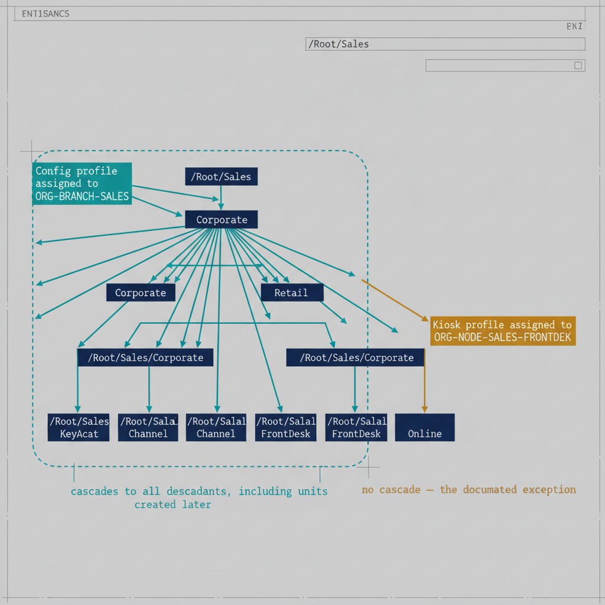

# Chapter 3 — Intune Policy Targeting with OrgPath Groups

::: {.callout-note}
## In this chapter
Every Intune policy is assigned to an OrgPath-derived group — branch groups by default, so policy cascades downward, and node groups only as documented exceptions. This chapter walks each policy surface — configuration profiles, compliance policies, endpoint security policies, and Windows Update rings — explaining the correct targeting choice, the conflict-resolution behavior each one introduces, and the programmatic assignment pattern that keeps the policy assignment manifest authoritative.
:::

## Assigning Every Intune Policy Surface to the Right Group

## 3.1   The Targeting Principle

Every Intune policy in the governance model is assigned to one or more OrgPath-derived groups — never to manually maintained static groups, never to all-device groups unless the policy genuinely applies to every device in the organization without exception, and never to individual devices outside of documented emergency remediation scenarios. This constraint is not merely a preference: it is the rule that makes the governance model auditable. If a policy can be assigned to groups outside the ORG-NODE-\* and ORG-BRANCH-\* scheme, then the pipeline cannot determine the effective scope of any policy by inspecting the registry, and the deterministic relationship between the OrgTree and the device governance model breaks down.

The branch group is the default assignment target for any policy that should apply to an organizational segment and cascade downward to all subordinate units. The node group is the exception assignment target, used only when a policy must apply to exactly one unit without cascading. The governance team documents the rationale for every node group assignment in the governance repository's policy assignment manifest, because node group assignments represent organizational specificity that should be periodically reviewed — the condition that required a unit-specific policy may resolve over time, and the policy may then become a candidate for promotion to the branch level.

{#fig-book-05-cpt-03-diagram-01 fig-alt="Engineering blueprint diagram on a neutral slate background contrasting branch-group cascade against node-group containment over one OrgTree. Center-left, a federal navy (#1F3A5F) OrgTree: a /Root/Sales division node at the top branching to two department nodes, each branching to leaf unit nodes, all with monospace path labels. A teal (#1A9E8F) box labeled \"Config profile assigned to ORG-BRANCH-SALES\" sends solid teal arrows that fan out to EVERY node in the Sales subtree, with a dashed teal boundary enclosing the whole subtree and the caption \"cascades to all descendants, including units created later\". Separately, an amber (#D4A017) box labeled \"Kiosk profile assigned to ORG-NODE-SALES-FRONTDESK\" sends a single solid arrow to ONLY one leaf node, captioned \"no cascade — the documented exception\". Monospace labels for all group names and paths, no human figures, 16:9 landscape." width="85%"}

## 3.2   Configuration Profile Targeting

Configuration profiles represent the largest volume of Intune policy assignments and the closest analogue to Group Policy in the OrgPath governance model. Settings Catalog profiles, Administrative Templates, custom OMA-URI profiles, certificate profiles, and email profiles all belong to this category. Every configuration profile in the library is assigned to at least one branch group. The assignment level — which branch group — depends on the intended scope of the profile's settings.

A profile that enforces a division-wide security baseline — BitLocker drive encryption, Windows Defender Antivirus real-time protection, audit policy settings, and SmartScreen configuration — is assigned to the division-level branch group. Every device in every department and unit beneath the division receives this profile. A profile that configures a department-specific VPN connection, including the VPN server address, authentication method, and traffic routing rules for that department's network segment, is assigned to the department-level branch group. Only devices in that department and its subordinate units receive the VPN profile. A profile that establishes a site-specific Wi-Fi connection, with an SSID and credential appropriate for a particular physical location, is assigned to the site-level branch group, which may span multiple divisions or departments if the site contains mixed organizational populations.

The cascade behavior that results from this assignment pattern mirrors Group Policy inheritance precisely. A device enrolled in a unit that sits beneath both a division and a department in the OrgTree receives the division-level profile because it is in the division branch group, the department-level profile because it is in the department branch group, and any unit-level profile assigned to its specific unit's branch group. Settings from these profiles are evaluated according to Intune's conflict resolution rules — for most settings, the last-applied value wins when profiles conflict, with the exception of settings governed by endpoint security policies, which follow their own conflict resolution logic discussed in Section 3.4.

The governance pipeline maintains a policy assignment manifest at governance/intune/policy-assignments.json that records every configuration profile and its assigned group. This manifest is the authoritative record of the intended assignment state. A pipeline step that runs after every OrgTree change reads the manifest and reconciles the actual assignment state in Intune against the intended state, flagging any deviation as drift. This reconciliation is the mechanism that prevents assignment drift from accumulating silently through manual portal changes.

## 3.3   Compliance Policy Targeting and Programmatic Assignment

Compliance policies determine whether a device is considered compliant, which feeds Conditional Access grant controls and therefore directly governs whether a user can access organizational resources from that device. Every compliance policy in the governance model is assigned to a branch group. The governance team faces one critical design decision when laying out compliance policies: whether to maintain a single organization-wide baseline compliance policy or to maintain differentiated compliance policies for organizational segments with different security requirements.

The OrgPath model supports both approaches and allows them to coexist. A single baseline compliance policy that expresses the organization's minimum acceptable device posture is assigned to the root-level branch group, which contains every managed device in the organization. Supplementary compliance policies for high-security organizational segments — executive leadership, financial data processing, security operations, and any other segment with elevated data classification — are assigned to their respective branch groups. A device in the Finance division is covered by both the baseline compliance policy and the Finance segment compliance policy. Intune evaluates a device as compliant only if it satisfies all applicable compliance policies. If the Finance segment policy requires a stricter BitLocker encryption standard than the baseline, the device must meet the stricter standard to be marked compliant, even though both policies apply.

Intune policy assignments made through the portal are not version-controlled, not auditable in the governance repository, and will drift from the intended assignment state over time as administrators make manual changes. The governance pipeline must manage all compliance policy assignments through the Graph API. The following script establishes the pattern for programmatic compliance policy assignment and is called by the pipeline whenever a new compliance policy is introduced or an existing assignment needs to change:

```powershell
<# data-id="159"
.SYNOPSIS
    Assigns an Intune compliance policy to an OrgPath branch group via Graph API.

.DESCRIPTION
    Used by the governance pipeline to ensure that compliance policy assignments
    are managed programmatically and match the OrgTree registry rather than
    being configured manually through the Intune portal.
    This script is idempotent: re-running it with the same parameters produces
    the same assignment state without creating duplicate assignments.

.PARAMETER PolicyId
    GUID of the target Intune compliance policy.
    Retrieve via: Get-MgDeviceManagementDeviceCompliancePolicy -All |
                  Where-Object { $_.DisplayName -eq "Your Policy Name" }

.PARAMETER GroupId
    GUID of the ORG-BRANCH-{NodeId} group to assign the policy to.
    Retrieve via: Get-MgGroup -Filter "displayName eq 'ORG-BRANCH-{NodeId}'"

.NOTES
    Required Graph scope: DeviceManagementConfiguration.ReadWrite.All
    Assignment is a POST to the /assign endpoint. This replaces ALL existing
    assignments on the policy with the assignments specified in the body.
    If the policy should be assigned to multiple branch groups, pass all group
    IDs in the same call rather than calling this script multiple times.
    Calling /assign multiple times with different groups will overwrite the
    previous call's assignments.
#>
param(
    [Parameter(Mandatory=$true)]
    [string]$PolicyId,   # GUID of the target Intune compliance policy

    [Parameter(Mandatory=$true)]
    [string[]]$GroupIds  # One or more ORG-BRANCH-{NodeId} group GUIDs
)

Connect-MgGraph -Scopes "DeviceManagementConfiguration.ReadWrite.All" -NoWelcome

# Build the assignments array with one entry per group.
# The @odata.type for a standard included group assignment is:
#   #microsoft.graph.groupAssignmentTarget
# For excluded groups, use: #microsoft.graph.exclusionGroupAssignmentTarget
$assignmentTargets = $GroupIds | ForEach-Object {
    @{
        target = @{
            "@odata.type" = "#microsoft.graph.groupAssignmentTarget"
            groupId       = $_
        }
    }
}

$assignmentBody = @{
    assignments = @($assignmentTargets)
}

# POST to the /assign action. This is a full replace, not an additive merge.
Invoke-MgGraphRequest `
    -Method      POST `
    -Uri         "https://graph.microsoft.com/v1.0/deviceManagement/deviceCompliancePolicies/$PolicyId/assign" `
    -Body        ($assignmentBody | ConvertTo-Json -Depth 10) `
    -ContentType "application/json"

Write-Host "Compliance policy '$PolicyId' assigned to $($GroupIds.Count) group(s):"
$GroupIds | ForEach-Object { Write-Host "  - $_" }

Disconnect-MgGraph
```

One behavioral detail of the Graph API /assign endpoint warrants emphasis: it performs a full replace of all existing assignments, not an additive merge. Calling the endpoint with a single group ID when the policy was previously assigned to three groups will result in the policy being assigned to only one group after the call. The governance pipeline must always supply the complete intended assignment list for a policy when calling this endpoint, which is why the policy assignment manifest is the authoritative record — the pipeline reads the full intended assignment state for each policy from the manifest and passes the complete list in every assignment call.

## 3.4   Endpoint Security Policy Targeting

Endpoint security policies cover antivirus settings, firewall rules, attack surface reduction rules, account protection policies, and endpoint detection and response configuration. These policies follow the same branch group targeting pattern as configuration profiles and compliance policies: each policy is assigned to the branch group that corresponds to the organizational scope it is intended to cover. A firewall rule set that applies to all devices in the organization is assigned to the root branch group. A stricter attack surface reduction configuration for the security operations division is assigned to the security operations division's branch group.

Endpoint security policies have one important behavioral difference from configuration profiles that the governance team must account for during policy design. When a device receives settings from multiple endpoint security policies assigned to overlapping branch groups — as will happen for any device that is in both the root branch group and a division-level branch group — the conflict resolution behavior is not uniform across setting categories. For most endpoint security settings, the more restrictive value wins when two policies specify conflicting values. For some settings, the most recently applied policy wins. For a small number of settings, a merge occurs: values from multiple policies are combined rather than one winning over the other. The Intune documentation for each endpoint security profile type specifies the conflict behavior for each setting category, and the governance team must review this documentation when designing layered endpoint security policies.

The diagnostic instrument for verifying effective endpoint security configuration is the Get-MgDeviceManagementManagedDeviceConfigurationState cmdlet, which retrieves the applied configuration state — including the applied value and the policy that supplied it — for a specific managed device. The governance team should run this cmdlet against representative devices in each organizational segment after the policy library is deployed and during periodic governance audits to verify that the layered policy application produces the intended result rather than a conflict-resolution outcome that deviates from the design intent.

## 3.5   Update Ring Targeting

Windows Update for Business update rings are the most naturally suited Intune policy type for branch group targeting, because the primary use case for update rings — staged rollout by organizational segment to validate compatibility before broad deployment — maps directly and exactly to the OrgTree hierarchy. A well-designed update ring library in the OrgPath model has three to four rings with progressively broader organizational coverage.

The Targeted ring is assigned to a specific technology unit's node group: the devices operated by engineers, developers, and systems administrators who have the expertise and tolerance for compatibility issues to serve as the earliest validators of a new Windows build. Because it is a node group assignment, only devices in that specific unit receive updates immediately. The Pilot ring is assigned to a specific department-level branch group selected for its organizational diversity and its members' technical literacy: it covers a meaningful cross-section of device configurations and applications without exposing the entire division to a potentially incompatible update. The Broad ring is assigned to the root-level branch group, which covers every managed device in the organization. Devices in the Broad ring receive updates only after the Targeted and Pilot rings have completed their validation waves without triggering a rollback or a pause. The ring assignments can optionally include a deadline-and-grace-period configuration that ensures devices in the Broad ring do not defer updates indefinitely if users repeatedly dismiss update prompts.

The branch group targeting of the Broad ring has a particularly valuable operational property: new organizational units added to the OrgTree automatically receive the Broad ring's update cadence without any update ring assignment change. A device enrolled in a newly created department is in the root branch group from the moment its OrgPath is stamped, and therefore immediately in scope for the Broad ring update policy. The alternative — manually adding each new organizational unit's devices to the Broad ring's assignment — creates the risk that new devices are orphaned from update governance until the assignment is made, which in practice can mean weeks of unmanaged Windows Update behavior.

The correct targeting choice and the key behavior to account for on each Intune policy surface are summarized below.

| Policy surface | Default target | Typical example | Behavior to account for |
|----|----|----|----|
| Configuration profiles | Branch group | Division security baseline; department VPN profile | Cascades like GPO inheritance; last-writer-wins on most setting conflicts |
| Compliance policies | Branch group (baseline at root, segment policies at their branch) | Org-wide baseline plus a stricter Finance segment policy | AND logic — a device must satisfy every applicable policy to be compliant |
| Endpoint security policies | Branch group | Org-wide firewall rules; security-operations ASR ruleset | Per-setting conflict resolution (most-restrictive / last-applied / merge) varies by setting |
| Update rings | Node group (Targeted), branch group (Pilot, Broad) | Targeted → Pilot → Broad rollout waves | Root branch group auto-covers newly created units with no assignment change |
| Application deployments | Branch group | Segment-scoped Win32 or Store app assignments | /assign is a full replace — always supply the complete intended target list |
