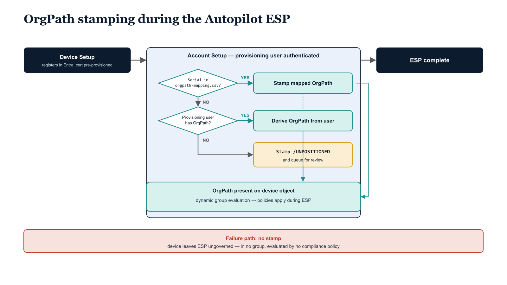

# Chapter 4 — Autopilot Enrollment and OrgPath Stamping

::: {.callout-note}
## In this chapter
A device must carry OrgPath before the Autopilot Enrollment Status Page completes, or it leaves provisioning ungoverned — in no policy group and evaluated by no compliance policy. This chapter presents two stamping strategies — deriving OrgPath from the provisioning user for personally assigned devices, and a hardware-hash mapping table for shared, kiosk, and purpose-built devices — and the /UNPOSITIONED quarantine node that safely contains any device that falls through both.
:::

## Getting OrgPath Right at Zero Touch — Enrollment Integration

## 4.1   The Autopilot OrgPath Challenge

In the steady-state operation of the governance model, OrgPath is stamped on device objects by the ETL pipeline after the device is enrolled and its organizational assignment is determined through the standard provisioning record. This post-enrollment stamping works correctly for devices that are already enrolled when the governance model is first deployed, and for devices enrolled through standard IT provisioning processes where the device is handed to the ETL pipeline before the user begins working on it. Autopilot presents a different and more constrained timing problem.

During Autopilot provisioning, the device must receive its OrgPath value before any user signs in and before the Enrollment Status Page (ESP) completes its device setup phase. This constraint exists because the dynamic group memberships that determine which configuration profiles, compliance policies, and endpoint security policies apply during enrollment all depend on OrgPath being present on the device object. Entra ID's dynamic group membership engine evaluates device objects against group membership rules continuously, but it can only evaluate the OrgPath attribute if the attribute has already been written to the device object. A device completing the ESP without an OrgPath value is evaluated by every dynamic group rule in the library and fails every rule — which means it is a member of no ORG-NODE-\* or ORG-BRANCH-\* group during the enrollment session, receives no organization-defined configuration profiles, and is evaluated by no compliance policy. It leaves the ESP in an ungoverned state.

The gap between the device object appearing in Entra ID (which happens early in Autopilot provisioning, when the device registers with the service using its hardware hash) and the ETL pipeline's next scheduled run may be hours. If Autopilot provisioning runs overnight or during a bulk deployment event, the ETL pipeline may not run until the following morning, by which point the device has already completed provisioning with incorrect policy coverage. The solution is to stamp OrgPath during the Autopilot provisioning session itself, using a script that runs during the ESP and writes OrgPath to the device object before configuration profile processing begins in earnest.

{#fig-book-05-cpt-04-diagram-01 fig-alt="Engineering blueprint timeline diagram on a neutral slate background showing the Autopilot Enrollment Status Page phases left to right with an OrgPath stamping decision inserted before policy evaluation. Three federal navy (#1F3A5F) phase boxes in sequence: \"Device Setup — device registers in Entra, certificate pre-provisioned\", \"Account Setup — provisioning user authenticated\", and \"ESP complete\". Inside Account Setup, a teal (#1A9E8F) decision diamond \"Serial in orgpath-mapping.csv?\" branches: YES to a teal box \"Stamp mapped OrgPath\"; NO to a second diamond \"Provisioning user has OrgPath?\" which branches YES to \"Derive OrgPath from user\" and NO to an amber (#D4A017) box \"Stamp /UNPOSITIONED and queue for review\". All three stamping outcomes converge into a teal box \"OrgPath present on device object → dynamic group evaluation → policies apply during ESP\". A red (#C0392B) annotation marks the failure path \"no stamp → device leaves ESP ungoverned, in no group, evaluated by no compliance policy\". Monospace labels for paths, filenames, and cmdlets, no human figures, 16:9 landscape." width="85%"}

## 4.2   Strategy One — User-Derivation During Enrollment

The first strategy derives the device's OrgPath from the provisioning user's OrgPath. When a user is assigned as the primary user for a device during Autopilot provisioning, the device's appropriate organizational position is typically the same as the user's organizational position — both should map to the same OrgTree node. Because OrgPath is already stamped on user objects by the Part Four ETL pipeline, the device-side script can read the provisioning user's OrgPath attribute via the Graph API and write the same value to the device object. This strategy is appropriate for personally assigned devices where the device's organizational position is definitionally the position of its assigned user.

The script below is deployed as a PowerShell script in the Intune script library and associated with the Autopilot profile's enrollment status page. It runs during the Account Setup phase, at which point the provisioning user has authenticated and the device object exists in Entra ID. The script authenticates using a certificate-based service principal — the same service account identity used by the ETL pipeline — whose certificate is pre-provisioned on the device through a configuration profile applied during the Device Setup phase of the ESP.

```powershell
<# data-id="184"
.SYNOPSIS
    Stamps OrgPath on the device object during Autopilot provisioning
    by deriving the device's organizational position from the provisioning user.

.DESCRIPTION
    This script is deployed as a PowerShell script in Microsoft Intune and
    executed during the Autopilot enrollment status page (Account Setup phase).
    It authenticates as a governance service principal (certificate-based),
    reads the provisioning user's OrgPath extension attribute, and writes
    the same value to the device object.

    Deploy via: Intune > Devices > Scripts > Add > Windows 10 and later
      - Run this script using the logged-on credentials : No
        (Script runs as SYSTEM; certificate must be in the LocalMachine store)
      - Run script in 64-bit PowerShell host             : Yes
      - Enforce script signature check                   : Yes (sign before production deployment)

.NOTES
    The provisioning user account must have been assigned OrgPath by the
    ETL pipeline before Autopilot provisioning begins. If the user has no
    OrgPath, the device is stamped as /UNPOSITIONED and queued for review.

    The governance service principal requires the following Graph permissions:
      Device.ReadWrite.All   — to write OrgPath to the device object
      User.Read.All          — to read the provisioning user's OrgPath attribute

    The service principal's certificate must be available in the machine
    certificate store (LocalMachine\My) under the thumbprint specified below.
    Pre-provision the certificate via a PKCS certificate profile in Intune
    targeted to the Autopilot pre-provisioning device group.
#>

# --- Configuration: Substitute all values below for your environment ---

# The Application (client) ID of the governance service principal.
# This is the same App ID used by the Part Four ETL pipeline.
$OrgPathAppId    = "a1b2c3d4-e5f6-a1b2-c3d4-e5f6a1b2c3d4"  # SUBSTITUTE: Your App ID

# Your Entra ID tenant ID.
$TenantId        = "f1e2d3c4-b5a6-f1e2-d3c4-b5a6f1e2d3c4"  # SUBSTITUTE: Your Tenant ID

# Thumbprint of the governance service principal's certificate,
# pre-provisioned into the LocalMachine\My certificate store.
$ClientCertThumb = "AABBCCDDEEFF112233445566778899AABBCCDDEE" # SUBSTITUTE: Your cert thumbprint

# --- Derive extension attribute names from App ID ---
$appIdNoHyphens    = $OrgPathAppId -replace "-", ""
$userOrgPathAttr   = "extension_${appIdNoHyphens}_OrgPath"
$deviceOrgPathAttr = "extension_${appIdNoHyphens}_OrgPath"

# --- Authenticate to Graph using certificate-based service principal ---
# This avoids storing client secrets on the device and survives offline re-enrollment.
try {
    Connect-MgGraph `
        -ClientId              $OrgPathAppId `
        -TenantId              $TenantId `
        -CertificateThumbprint $ClientCertThumb `
        -NoWelcome
} catch {
    Write-Error "Authentication to Microsoft Graph failed: $_"
    exit 1
}

# --- Determine the provisioning user's UPN ---
# During the Autopilot Account Setup phase, the signed-in user is the provisioning user.
# Get-MgContext returns the identity of the current Graph session.
# Because this script runs as SYSTEM with a service principal, we need to
# identify the provisioning user from the Windows session instead.
$currentUserUPN = (Get-WmiObject -Class Win32_ComputerSystem).UserName
# Strip the domain prefix if present (DOMAIN\username format)
if ($currentUserUPN -like "*\*") {
    $currentUserUPN = $currentUserUPN.Split("\")[1]
}
# If UPN lookup fails, query Entra ID for the user based on the signed-in account.
# In practice, supplement this with the Intune enrollment user API if needed.
if (-not $currentUserUPN) {
    Write-Error "Could not determine provisioning user UPN. Cannot derive OrgPath."
    Disconnect-MgGraph
    exit 1
}

Write-Host "Provisioning user identified: $currentUserUPN"

# --- Read the user's OrgPath attribute ---
try {
    $user = Get-MgUser `
        -UserId     $currentUserUPN `
        -Property   "id,displayName,$userOrgPathAttr"
} catch {
    Write-Error "Failed to retrieve user object for '$currentUserUPN': $_"
    Disconnect-MgGraph
    exit 1
}

$userOrgPath = $user.AdditionalProperties[$userOrgPathAttr]

if (-not $userOrgPath) {
    Write-Warning "User '$currentUserUPN' has no OrgPath attribute."
    Write-Warning "Stamping device as /UNPOSITIONED. Queue for governance review."
    $deviceOrgPath = "/UNPOSITIONED"
} else {
    # Device inherits the provisioning user's OrgPath.
    # For shared or kiosk devices, replace this with the hardware hash mapping
    # strategy described in Section 4.3 instead of this user-derivation path.
    $deviceOrgPath = $userOrgPath
    Write-Host "Derived device OrgPath from user: $deviceOrgPath"
}

# --- Find this device's Entra ID object by computer name ---
# The device registers with Entra ID during the Device Setup phase of Autopilot,
# using the displayName assigned by the Autopilot naming template. By the time
# this script runs in Account Setup, the device object exists in Entra ID.
$deviceName = $env:COMPUTERNAME
try {
    $device = Get-MgDevice `
        -Filter   "displayName eq '$deviceName'" `
        -Property "id,displayName"
} catch {
    Write-Error "Error querying Entra ID for device '$deviceName': $_"
    Disconnect-MgGraph
    exit 1
}

if (-not $device) {
    Write-Error "Device '$deviceName' not found in Entra ID. OrgPath stamp cannot proceed."
    Disconnect-MgGraph
    exit 1
}

Write-Host "Entra device object located: $($device.DisplayName) (ID: $($device.Id))"

# --- Stamp OrgPath on the device object ---
# The AdditionalProperties dictionary is used for schema extension attributes.
# The attribute name must match exactly what the ETL pipeline writes —
# any discrepancy produces a second attribute rather than overwriting the first.
$updateBody = @{
    AdditionalProperties = @{
        $deviceOrgPathAttr = $deviceOrgPath
    }
}

try {
    Update-MgDevice -DeviceId $device.Id -BodyParameter $updateBody
    Write-Host "SUCCESS: OrgPath '$deviceOrgPath' stamped on device '$deviceName'."
} catch {
    Write-Error "Failed to write OrgPath to device object: $_"
    Disconnect-MgGraph
    exit 1
}

Disconnect-MgGraph
exit 0
```

## 4.3   Strategy Two — Hardware Hash Mapping for Shared and Kiosk Devices

The user-derivation strategy is not appropriate for shared devices, kiosk devices, dedicated purpose devices, or any device whose organizational position is defined by the physical location or functional role of the device rather than by the identity of the user who provisions it. A reception kiosk device is assigned to the Front Office unit regardless of which IT administrator performed the Autopilot provisioning. A shared workstation in a laboratory is assigned to the laboratory unit regardless of which user first signs in. For these devices, a hardware hash to OrgPath mapping table is the correct source of organizational position.

The governance repository contains a mapping file at governance/autopilot/orgpath-mapping.csv with the following columns: SerialNumber (the device's serial number as it appears in the Autopilot hardware hash registration), OrgPath (the fully-qualified OrgPath to stamp on this device), and OrgNodeId (the NodeId of the leaf node, for cross-reference to the OrgTree registry). This file is managed by the governance team and is the authoritative source for pre-assigned device positions. When a new device is purchased and registered in Autopilot, the procurement team adds a row to this file as part of the intake process, before the device ships to the provisioning location. The file is committed to the governance repository, reviewed by a second governance team member, and merged before the device arrives.

A device's serial number is available during Autopilot provisioning via the Get-WmiObject -Class Win32_BIOS call, which returns the SerialNumber property. The provisioning script reads the mapping CSV from a pre-staged location on the device (copied during the Device Setup phase of the ESP from a storage account accessible by the device's Managed Identity or from a UNC path accessible during setup) and looks up the device's serial number. If a match is found, the OrgPath from the mapping table is used. If no match is found, the script falls back to the user-derivation strategy if the device is a personal assignment, or stamps the device as a quarantine-node path if neither source of organizational position is available.

The quarantine node is a dedicated OrgTree node created specifically for devices that cannot be automatically positioned. Its OrgPath, /UNPOSITIONED, does not resolve to any productive organizational unit. The ORG-BRANCH-UNPOSITIONED group is assigned only a minimal configuration profile that does nothing harmful and a compliance policy that marks every member device as non-compliant immediately on evaluation. A Conditional Access policy blocks all resource access from non-compliant devices, which means any device that completes Autopilot without a valid OrgPath is automatically blocked from accessing organizational resources until the governance team reviews the device, assigns the correct OrgPath through the ETL pipeline, and the device re-evaluates its compliance state. The quarantine mechanism is not a punishment — it is the safety valve that ensures the governance model's integrity is never silently violated by a device that fell through the positioning logic.

The two stamping strategies and the quarantine fallback are summarized below.

| Strategy | Source of device OrgPath | Best suited to | Outcome when no value is available |
|----|----|----|----|
| User derivation (Strategy One) | The provisioning user's OrgPath attribute | Personally assigned devices | Stamp /UNPOSITIONED and queue for governance review |
| Hardware-hash mapping (Strategy Two) | orgpath-mapping.csv, keyed on the device serial number | Shared, kiosk, and purpose-built devices | Fall back to user derivation; if neither resolves, stamp /UNPOSITIONED |
| Quarantine node | /UNPOSITIONED — resolves to no productive unit | Any device the positioning logic could not place | Marked non-compliant on evaluation; Conditional Access blocks all resource access until review |
