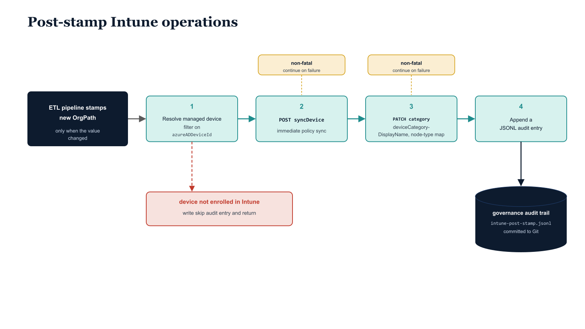

# Chapter 6 — Governance Pipeline Extension for Intune

::: {.callout-note}
## In this chapter
Stamping OrgPath is no longer the pipeline's last act once Intune is in scope. This chapter adds the post-stamp operations the ETL pipeline must perform for each device whose OrgPath changed: resolving the Intune managed-device record, requesting an immediate policy sync to shrink the coverage gap, mapping the OrgTree node type to an Intune device category, and writing a structured audit entry to the governance trail.
:::

## Extending the ETL Pipeline — Intune-Specific Post-Stamp Operations

## 6.1   What Changes When Intune Is in Scope

The Part Four ETL pipeline performs OrgPath stamping as its primary operation: it reads the OrgTree registry, evaluates each device object's current organizational assignment, and writes the correct OrgPath value to the device's directory object. When Intune was not in scope, this stamping operation was sufficient. The OrgPath value was written, the downstream systems that depended on it — Conditional Access, PIM, Sentinel — would pick it up through their own polling mechanisms, and no further pipeline action was needed for those systems.

Intune is different in two ways that require additional pipeline steps. First, Intune policy delivery depends on dynamic group membership, and dynamic group membership in Entra ID is evaluated asynchronously. After OrgPath is stamped on a device object, the Entra ID dynamic membership engine must re-evaluate the device against all group membership rules that reference the OrgPath extension attribute. For large groups with many members, this evaluation can take several minutes. For unusually large or complex rule sets, it can take longer. The device is not in its new groups — and therefore not in scope for its new policies — until the membership engine completes its evaluation. The pipeline cannot directly accelerate the membership engine's processing, but it can request an Intune device sync, which instructs the Intune service to push a check-in request to the device at its next available opportunity rather than waiting for the standard check-in interval, which may be hours away.

Second, Intune maintains a device category field that provides a secondary classification layer independent of group membership. Device categories are visible in the Intune device list, filterable in reports, and can be used as an additional targeting dimension for some Intune operations. The OrgTree node type field in the registry — Division, Department, Unit, Kiosk, Server — maps naturally to a set of Intune device categories that give the Intune administrative team a human-readable classification view that complements the OrgPath-derived group membership. Updating this field is a low-cost operation that adds visibility without adding complexity, and the pipeline extension handles it as part of the same post-stamp processing step.

{#fig-book-05-cpt-06-diagram-01 fig-alt="Engineering blueprint sequence diagram on a white background showing the post-OrgPath-stamp Intune operations performed for a single device. Far left, a federal navy (#1F3A5F) trigger box \"ETL pipeline stamps new OrgPath — only when the value changed\". A left-to-right chain of four teal (#1A9E8F) numbered step boxes follows: 1 \"Resolve Intune managed device by filtering on azureADDeviceId\", 2 \"POST syncDevice — request an immediate policy sync\", 3 \"PATCH deviceCategoryDisplayName from the node-type map\", 4 \"Append a JSONL audit entry\". Steps 2 and 3 each carry a small amber (#D4A017) side-note \"non-fatal — continue on failure\". A dashed branch off step 1 leads to a red (#C0392B) box \"device not enrolled in Intune → write skip audit entry and return\". Step 4 outputs to a navy cylinder \"governance audit trail — intune-post-stamp.jsonl, committed to Git\". Monospace labels for cmdlets, endpoints, and filenames, no human figures, 16:9 landscape." width="85%"}

## 6.2   The Post-Stamp Pipeline Extension Script

The following script runs immediately after the ETL pipeline stamps OrgPath on a device object. It is passed the device's Entra ID object ID, the new OrgPath value, and the OrgTree node type of the leaf node. It resolves the Intune managed device record from the Entra ID device ID, requests a policy sync, updates the device category, and writes a governance audit log entry. The script is called once per device per ETL pipeline run where OrgPath changed — it is not called for devices whose OrgPath value did not change, to avoid unnecessary sync requests and API calls for the steady-state population.

```powershell
<# data-id="235"
.SYNOPSIS
    Post-OrgPath-stamp Intune operations: triggers policy sync and
    updates the device category to reflect the OrgTree node type.

.DESCRIPTION
    Runs immediately after the Part Four OrgPath ETL pipeline stamps a device object.
    Must be called only for devices whose OrgPath value changed in the current run.
    Three operations are performed in sequence:
      1. Resolve the Intune managed device record from the Entra device ID.
      2. Request an immediate policy sync to minimize the policy coverage gap.
      3. Update the Intune device category to match the OrgTree node type.
      4. Write a structured audit log entry to the governance audit trail.

.PARAMETER DeviceId
    The Entra ID device object ID (a GUID — not the Intune managed device ID,
    not the Azure AD device ID displayed in the Intune portal, but the
    object ID from the Entra ID device object).

.PARAMETER OrgPath
    The OrgPath value just stamped on the device. Used for the audit log.

.PARAMETER OrgNodeType
    The node type of the leaf node from the OrgTree registry.
    Valid values: Division, Department, Unit, Kiosk, Server, Default.
    Extend the $categoryMap hashtable below to add additional types.

.NOTES
    Required Graph scopes:
      DeviceManagementManagedDevices.ReadWrite.All
      DeviceManagementConfiguration.ReadWrite.All
    The Intune managed device ID differs from the Entra ID device object ID.
    Resolution is performed via the azureADDeviceId filter on managedDevices.
    Script produces a JSONL audit entry appended to .\audit\intune-post-stamp.jsonl.
    The pipeline commits this file to the governance repository at run end.
#>
param(
    [Parameter(Mandatory=$true)] [string]$DeviceId,
    [Parameter(Mandatory=$true)] [string]$OrgPath,
    [Parameter(Mandatory=$true)] [string]$OrgNodeType
)

$ErrorActionPreference = "Stop"
$SyncSuccess           = $false
$CategorySuccess       = $false

Connect-MgGraph `
    -Scopes "DeviceManagementManagedDevices.ReadWrite.All",
            "DeviceManagementConfiguration.ReadWrite.All" `
    -NoWelcome

# --- Step 1: Resolve the Intune Managed Device Record ---
# azureADDeviceId on the managedDevices endpoint corresponds to the
# Entra ID device object ID, which is what the ETL pipeline passes as $DeviceId.
$managedDevice = Get-MgDeviceManagementManagedDevice `
    -Filter   "azureADDeviceId eq '$DeviceId'" `
    -Property "id,deviceName,complianceState,managedDeviceOwnerType,azureADDeviceId" `
    -ErrorAction SilentlyContinue

if (-not $managedDevice) {
    Write-Warning "Device with Entra ID '$DeviceId' is not enrolled in Intune."
    Write-Warning "Post-stamp Intune operations skipped. ETL pipeline will retry on next run."
    Disconnect-MgGraph

    # Write a partial audit entry indicating the skip.
    @{
        Timestamp     = (Get-Date).ToUniversalTime().ToString("o")
        Operation     = "IntunePostStamp"
        DeviceId      = $DeviceId
        IntuneId      = $null
        DeviceName    = $null
        NewOrgPath    = $OrgPath
        OrgNodeType   = $OrgNodeType
        Category      = $null
        SyncRequested = $false
        Skipped       = $true
        SkipReason    = "Not enrolled in Intune"
    } | ConvertTo-Json -Compress |
        Out-File -FilePath ".\audit\intune-post-stamp.jsonl" -Append -Encoding utf8

    return
}

$intuneDeviceId = $managedDevice.Id
Write-Host "Intune device resolved: $($managedDevice.DeviceName) | Intune ID: $intuneDeviceId"
Write-Host "  Compliance state     : $($managedDevice.ComplianceState)"
Write-Host "  Owner type           : $($managedDevice.ManagedDeviceOwnerType)"

# --- Step 2: Request an Immediate Policy Sync ---
# syncDevice instructs Intune to schedule the next MDM sync as soon as
# the device checks in, rather than waiting for the standard check-in interval.
# This does NOT guarantee immediate sync — it guarantees the sync occurs at
# the next check-in, which may still be minutes away if the device is sleeping.
try {
    Invoke-MgGraphRequest `
        -Method POST `
        -Uri    "https://graph.microsoft.com/v1.0/deviceManagement/managedDevices/$intuneDeviceId/syncDevice"
    Write-Host "Policy sync requested for $($managedDevice.DeviceName)."
    $SyncSuccess = $true
} catch {
    # Sync request failure is non-fatal. The device will sync on its next scheduled interval.
    Write-Warning "Sync request failed for device $intuneDeviceId: $_"
    Write-Warning "Device will sync on its next scheduled MDM check-in interval."
}

# --- Step 3: Update Device Category ---
# Map OrgTree node types to Intune device category display names.
# Extend this map to include additional node types your OrgTree uses.
# Category names here must exactly match the display names of categories
# configured in Intune (Tenant Administration > Device Categories).
$categoryMap = @{
    "Division"   = "Corporate — Division Level"    # SUBSTITUTE: Must match Intune category names exactly
    "Department" = "Corporate — Department Level"  # SUBSTITUTE: Must match Intune category names exactly
    "Unit"       = "Corporate — Unit Level"        # SUBSTITUTE: Must match Intune category names exactly
    "Kiosk"      = "Kiosk Device"                  # SUBSTITUTE: Must match Intune category names exactly
    "Server"     = "Managed Server"                # SUBSTITUTE: Must match Intune category names exactly
    "Default"    = "Corporate — Unclassified"      # SUBSTITUTE: Must match Intune category names exactly
}

$categoryName = if ($categoryMap.ContainsKey($OrgNodeType)) {
    $categoryMap[$OrgNodeType]
} else {
    $categoryMap["Default"]
}

# Verify the category exists in Intune before attempting assignment.
$category = Get-MgDeviceManagementDeviceCategory `
    -Filter "displayName eq '$categoryName'" `
    -ErrorAction SilentlyContinue

if ($category) {
    try {
        Invoke-MgGraphRequest `
            -Method      PATCH `
            -Uri         "https://graph.microsoft.com/v1.0/deviceManagement/managedDevices/$intuneDeviceId" `
            -Body        (@{ deviceCategoryDisplayName = $categoryName } | ConvertTo-Json) `
            -ContentType "application/json"
        Write-Host "Device category updated to: '$categoryName'."
        $CategorySuccess = $true
    } catch {
        Write-Warning "Category update failed for $($managedDevice.DeviceName): $_"
    }
} else {
    Write-Warning "Category '$categoryName' not found in Intune device categories."
    Write-Warning "Create this category in Intune before rerunning the pipeline."
}

# --- Step 4: Governance Audit Log Entry ---
# Append a structured JSON line to the governance audit file.
# The pipeline commits this file to the governance repository after the full run.
# Each line is a self-contained JSON object (JSONL format) for streaming compatibility.
$auditEntry = @{
    Timestamp        = (Get-Date).ToUniversalTime().ToString("o")
    Operation        = "IntunePostStamp"
    DeviceId         = $DeviceId
    IntuneId         = $intuneDeviceId
    DeviceName       = $managedDevice.DeviceName
    NewOrgPath       = $OrgPath
    OrgNodeType      = $OrgNodeType
    Category         = $categoryName
    SyncRequested    = $SyncSuccess
    CategoryUpdated  = $CategorySuccess
    ComplianceBefore = $managedDevice.ComplianceState
}

$null = New-Item -ItemType Directory -Path ".\audit" -Force
$auditEntry | ConvertTo-Json -Compress |
    Out-File -FilePath ".\audit\intune-post-stamp.jsonl" -Append -Encoding utf8

Write-Host "Audit entry written for $($managedDevice.DeviceName)."
Disconnect-MgGraph
```

The audit log produced by this script serves two purposes. First, it creates a time-stamped record of every OrgPath change on Intune-enrolled devices, which is required for compliance reporting in environments where device governance decisions must be auditable. Second, it provides the raw data for the compliance-state-before-and-after analysis that the governance team runs quarterly to measure whether OrgPath reassignments are being handled correctly — whether devices that moved from a lenient segment to a stricter segment are showing the expected compliance state change within a reasonable time after the OrgPath stamp.

The pipeline maps each OrgTree node type to an Intune device category. The category display names below must match those configured under Tenant Administration > Device Categories exactly, or the category update silently fails.

| OrgTree node type | Intune device category |
|----|----|
| Division | Corporate — Division Level |
| Department | Corporate — Department Level |
| Unit | Corporate — Unit Level |
| Kiosk | Kiosk Device |
| Server | Managed Server |
| Default (unmatched node type) | Corporate — Unclassified |
