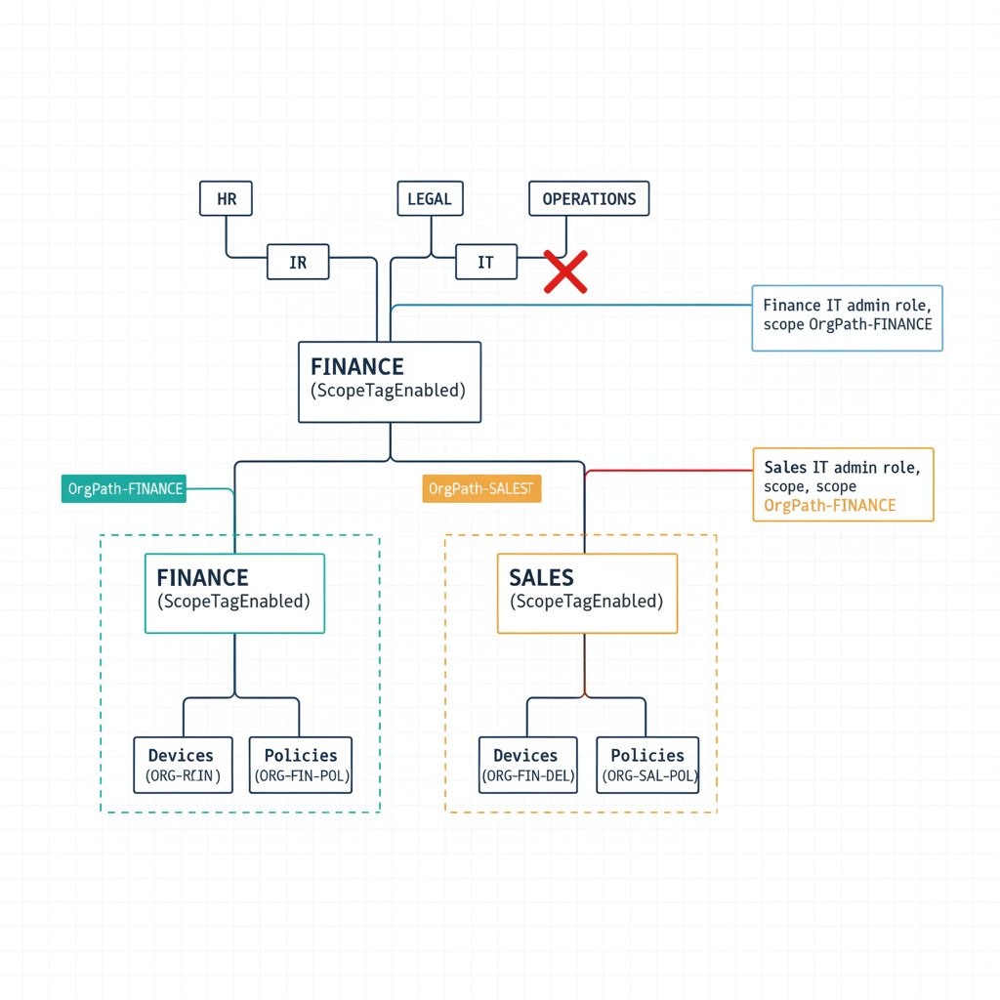

# Chapter 7 — Scope Tags and Administrative Delegation

::: {.callout-note}
## In this chapter
Intune scope tags define administrative visibility boundaries. This chapter shows how OrgPath turns scope tags from an inconsistently applied manual convention into a deterministic function of organizational position: scope tags are created only at delegation-meaningful nodes (flagged ScopeTagEnabled in the registry), named OrgPath-{NodeId}, and assigned by the pipeline to every device within a node's branch — bounding each divisional administrator to exactly their segment.
:::

## Aligning Intune Administration Boundaries with OrgPath

## 7.1   Scope Tags and Their Relationship to OrgPath

Scope tags in Intune define administrative visibility boundaries. A policy, device, or application assigned a scope tag is visible only to administrators whose Intune role assignment includes that scope tag. A divisional IT administrator whose role assignment includes only the Finance scope tag can see and manage Finance-scoped devices, compliance policies, and configuration profiles. They cannot see devices, policies, or applications scoped to other divisions, which means they cannot accidentally modify resources outside their area of responsibility, and a compromise of their account cannot be used to modify governance controls for other organizational segments.

Without OrgPath, scope tags accumulate inconsistencies because there is no systematic mechanism for assigning them. A device enrolled six months ago may carry a Finance scope tag because someone remembered to set it during enrollment. A device enrolled last month may carry no scope tag because the administrator who provisioned it was not aware of the convention. A compliance policy may be scoped to Finance but assigned to a group that includes non-Finance devices, which is a contradiction that is invisible unless someone explicitly audits the intersection of scope tag assignments and group membership rules.

With OrgPath, scope tags are derived from the organizational hierarchy and assigned by the same pipeline that assigns OrgPath values. Every device's scope tag membership is a deterministic function of its OrgPath value. Every policy's scope tag is a deterministic function of the OrgPath segment it governs. The governance team can verify the entire scope tag configuration by comparing the pipeline's intended output against the actual state in Intune — a comparison the pipeline performs automatically as a drift detection step.

{#fig-book-05-cpt-07-diagram-01 fig-alt="Engineering blueprint diagram on a neutral slate background showing how OrgPath-derived scope tags bound what each delegated administrator can see and manage. In the center, a federal navy (#1F3A5F) OrgTree with two scope-tag-enabled division nodes, each marked (ScopeTagEnabled) in monospace. The Finance node carries a teal (#1A9E8F) scope-tag chip \"OrgPath-FINANCE\" that encloses the Finance subtree of devices and policies in a dashed teal boundary; the Sales node carries an amber (#D4A017) chip \"OrgPath-SALES\" enclosing its subtree in a dashed amber boundary. On the right, two delegated-admin role boxes: \"Finance IT admin role, scope OrgPath-FINANCE\" with a solid connector reaching ONLY into the teal boundary, and \"Sales IT admin role, scope OrgPath-SALES\" reaching ONLY into the amber boundary. A red (#C0392B) crossed-out connector shows the Finance admin blocked from Sales-scoped resources. Monospace labels for scope-tag names and node identifiers, no human figures, 16:9 landscape." width="85%"}

## 7.2   Scope Tag Naming and Creation

Scope tags are not created for every node in the OrgTree. Creating a scope tag for every node in a large OrgTree would produce hundreds of scope tags and make the administrative delegation model so fine-grained as to be unmanageable. Scope tags are created for the subset of OrgTree nodes at which meaningful administrative delegation occurs — typically division-level nodes and, for divisions with significant IT management complexity, department-level nodes. The governance team identifies these nodes by adding a ScopeTagEnabled: true field to the relevant node entries in the OrgTree registry.

Scope tags are named using the convention OrgPath-{NodeId}, which is consistent with the group naming convention and allows the governance pipeline to derive the scope tag name from the NodeId without any additional lookup. An Intune administrator whose role assignment shows a scope tag named OrgPath-FINANCE can immediately identify that this scope corresponds to the Finance node in the OrgTree, and can look up the full organizational scope by finding the FINANCE node in the registry.

## 7.3   Scope Tag Assignment Script

The following script creates scope tags for all scope-tag-enabled OrgTree nodes and assigns them to all managed devices whose OrgPath falls within each node's branch. It is run after the ETL pipeline's OrgPath stamping phase completes, so scope tag assignments reflect the current OrgPath state of the device population.

```powershell
<# data-id="254"
.SYNOPSIS
    Creates Intune scope tags from OrgTree registry nodes and assigns them
    to managed devices based on OrgPath values.

.DESCRIPTION
    Reads OrgTree registry nodes where ScopeTagEnabled is true. Creates scope
    tags for any that do not yet exist. Assigns each scope tag to all Intune
    managed devices whose OrgPath begins with the corresponding node's path.
    Scope tag assignment is additive for devices in multiple branches; this
    script does not remove previously assigned scope tags except through
    a full-replace PATCH, which would require loading the existing scope tag
    list per device. For simplicity this script sets the single authoritative
    scope tag per device based on the most specific matching node.

.NOTES
    Required Graph scope: DeviceManagementConfiguration.ReadWrite.All
    For large device populations, the inner device loop may be slow.
    Consider parallelizing with ForEach-Object -Parallel in PowerShell 7+,
    adding a -ThrottleLimit parameter to control concurrency.
    Run after OrgPath stamping is complete for the current pipeline run.
#>
param(
    [string]$OrgTreeRegistryPath = "C:\governance\orgtree\registry.json",
    # SUBSTITUTE: Your OrgPath App Registration Application ID (with hyphens)
    [string]$OrgPathAppId        = "a1b2c3d4-e5f6-a1b2-c3d4-e5f6a1b2c3d4"
)

$appIdNoHyphens    = $OrgPathAppId -replace "-", ""
$deviceOrgPathAttr = "extension_${appIdNoHyphens}_OrgPath"

Connect-MgGraph -Scopes "DeviceManagementConfiguration.ReadWrite.All" -NoWelcome

$registry      = Get-Content -Path $OrgTreeRegistryPath -Raw | ConvertFrom-Json
# Filter to only nodes that have ScopeTagEnabled set to true and are Active.
$scopeTagNodes = $registry.nodes | Where-Object {
    $_.ScopeTagEnabled -eq $true -and $_.Status -eq "Active"
}

Write-Host "Scope-tag-enabled nodes: $($scopeTagNodes.Count)"

# Load all existing scope tags once for efficient lookup.
$existingScopeTags = Get-MgDeviceManagementRoleScopeTag -All
$scopeTagIndex     = @{}
foreach ($st in $existingScopeTags) { $scopeTagIndex[$st.DisplayName] = $st }

foreach ($node in $scopeTagNodes) {
    $tagName = "OrgPath-$($node.Id)"

    # --- Create scope tag if it does not exist ---
    if (-not $scopeTagIndex.ContainsKey($tagName)) {
        $newTag = New-MgDeviceManagementRoleScopeTag `
            -DisplayName $tagName `
            -Description "OrgPath administrative scope for $($node.Name) [$($node.Path)] and all subordinate units."
        $scopeTagIndex[$tagName] = $newTag
        Write-Host "  [CREATED] Scope tag: $tagName (ID: $($newTag.Id))"
    } else {
        Write-Host "  [EXISTS]  Scope tag: $tagName (ID: $($scopeTagIndex[$tagName].Id))"
    }

    $scopeTagId = $scopeTagIndex[$tagName].Id

    # --- Find managed devices in this node's branch ---
    # The filter uses startsWith on the OrgPath extension attribute.
    # Note: Graph API filter support for extension attributes varies by tenant
    # configuration. If the startsWith filter returns an error, retrieve all
    # managed devices and filter client-side as the fallback approach.
    try {
        $devices = Get-MgDeviceManagementManagedDevice `
            -Filter   "startsWith($deviceOrgPathAttr,'$($node.Path)')" `
            -Property "id,deviceName,$deviceOrgPathAttr" `
            -All
    } catch {
        Write-Warning "  Graph filter on OrgPath not supported — falling back to client-side filter."
        $allDevices = Get-MgDeviceManagementManagedDevice `
            -Property "id,deviceName,$deviceOrgPathAttr" -All
        $devices = $allDevices | Where-Object {
            $_.AdditionalProperties[$deviceOrgPathAttr] -like "$($node.Path)*"
        }
    }

    Write-Host "  Assigning scope tag '$tagName' to $($devices.Count) device(s) in $($node.Name) branch..."

    foreach ($device in $devices) {
        # roleScopeTagIds is a full-replace array — not additive per call.
        # If a device should carry multiple scope tags (e.g., from nested
        # scope-tag-bearing nodes), load the existing list first and append.
        # For the common case of one scope tag per device, this direct set is correct.
        $patchBody = @{
            roleScopeTagIds = @($scopeTagId)
        }
        try {
            Invoke-MgGraphRequest `
                -Method      PATCH `
                -Uri         "https://graph.microsoft.com/v1.0/deviceManagement/managedDevices/$($device.Id)" `
                -Body        ($patchBody | ConvertTo-Json) `
                -ContentType "application/json"
        } catch {
            Write-Warning "    Scope tag assignment failed for $($device.DeviceName): $_"
        }
    }
    Write-Host "  Complete for $($node.Name)."
}

Write-Host ""
Write-Host "=== Scope Tag Assignment Complete ==="
Disconnect-MgGraph
```

After scope tags are created and assigned to devices, the Intune role assignment configuration must be updated to associate each scope tag with the appropriate delegated administrator role and the appropriate user or group representing the divisional IT administrators. This step is performed once after the scope tags are created and is updated whenever the governance team adds a new scope-tag-bearing node to the OrgTree or changes the membership of a delegated administrator group. The role assignment configuration is documented in the governance repository's RBAC manifest and is managed using the same Graph API patterns established in the Part Five Azure RBAC integration.
