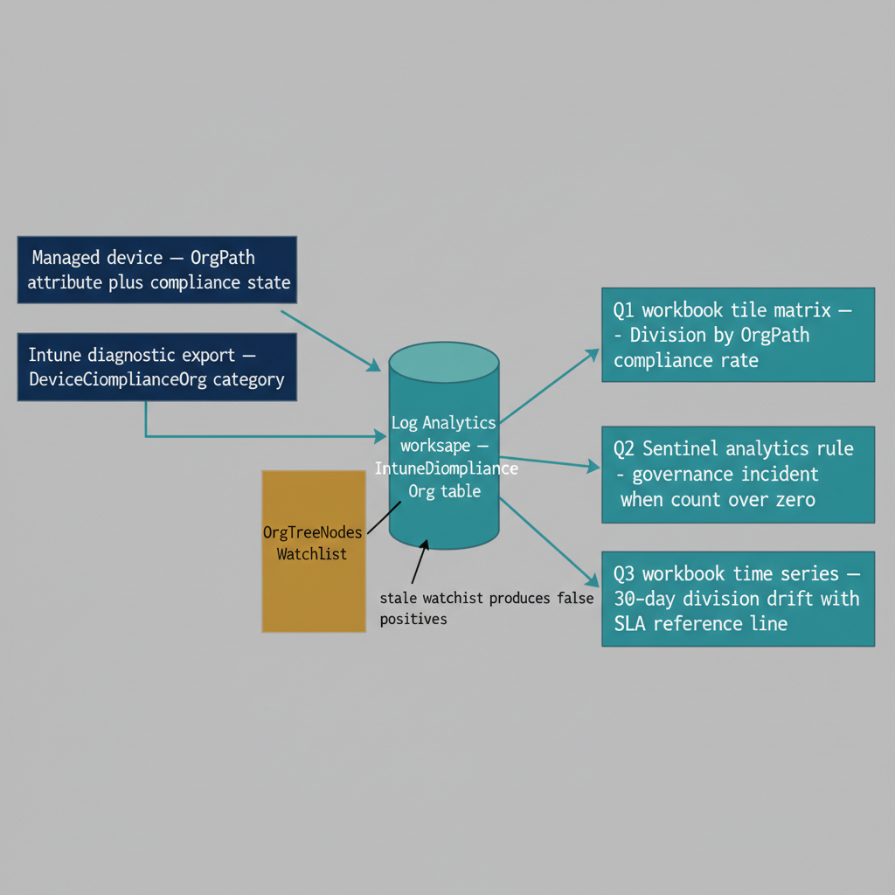

# Chapter 8 — KQL Dashboards for Intune and OrgPath Visibility

::: {.callout-note}
## In this chapter
The native Intune compliance dashboard is device- and policy-centric; it cannot answer organizational questions like which divisions are trending toward non-compliance. This chapter provides three KQL queries that join Intune compliance data with OrgPath in Log Analytics and Microsoft Sentinel — compliance-by-OrgPath, unpositioned and mismatched devices, and a 30-day division drift trend — and explains how each is operationalized as a workbook tile or a scheduled analytics rule.
:::

## Monitoring Device Compliance Through the Organizational Lens

## 8.1   What OrgPath Adds to Intune Compliance Reporting

The native Intune compliance dashboard is device-centric and policy-centric. It shows which devices are compliant, which are not, and which compliance policy produced each result. It cannot answer the question that organizational governance actually requires: which organizational units have devices that are out of compliance, what is the compliance rate within each division, which segments are trending toward a compliance degradation that will trigger Conditional Access blocks, and which specific devices are ungoverned because their OrgPath is missing or invalid? These are governance questions, not device questions, and answering them requires joining Intune compliance data with OrgPath values.

OrgPath makes this join possible. Because every managed device carries an OrgPath value as a device object attribute, and because Intune device data is exported to Log Analytics through the Intune diagnostic settings, KQL queries in Log Analytics workspaces and Microsoft Sentinel can join compliance state with OrgPath values to produce organizationally structured compliance reports. The queries that follow are designed for the Log Analytics workspace configured as the destination for Intune diagnostic exports. The workspace must have the IntuneDeviceComplianceOrg table populated, which requires enabling the corresponding Intune diagnostic setting under Tenant Administration in the Intune portal.

::: {.callout-note title="Prerequisite: Intune Diagnostic Settings"}
Before these queries will return results, Intune diagnostic settings must be configured to export device compliance data to the Log Analytics workspace. Navigate to: Intune portal &gt; Tenant Administration &gt; Diagnostic Settings &gt; Add diagnostic setting. Select <strong>DeviceComplianceOrg</strong> as the data category. Select the target Log Analytics workspace. Allow up to 48 hours for the first data to appear after enabling the export.
:::

{#fig-book-05-cpt-08-diagram-01 fig-alt="Engineering blueprint data-flow diagram on a neutral slate background showing the path from a managed device to the governance dashboards. Far left, a federal navy (#1F3A5F) box \"Managed device — OrgPath attribute plus compliance state\". An arrow leads to a navy box \"Intune diagnostic export — DeviceComplianceOrg category\". An arrow leads to a teal (#1A9E8F) cylinder \"Log Analytics workspace — IntuneDeviceComplianceOrg table\". From the cylinder, three teal query arrows fan rightward to three labeled output boxes: \"Q1 workbook tile matrix — Division by OrgPath compliance rate\", \"Q2 Sentinel analytics rule — governance incident when count over zero\", and \"Q3 workbook time series — 30-day division drift with SLA reference line\". An amber (#D4A017) side box \"OrgTreeNodes Watchlist — active node paths\" feeds into the Q2 box with the note \"stale watchlist produces false positives\". Monospace labels for table, category, and query names, no human figures, 16:9 landscape." width="85%"}

## 8.2   Query 1 — Device Compliance by OrgPath

This query produces a compliance rate summary organized by organizational division and OrgPath segment. It is the primary governance dashboard query and is intended to be run on a 24-hour lookback window as the top-level view in a Log Analytics workbook. Divisions with compliance rates below the governance threshold appear at the top of the result set because the query orders by ascending compliance rate.

```kql
// ---------------------------------------------------------------
// Query 1: Intune Device Compliance by OrgPath
// Purpose : Compliance rate per organizational segment, updated daily.
// Table   : IntuneDeviceComplianceOrg
//           (requires Intune > Tenant Admin > Diagnostic Settings >
//            DeviceComplianceOrg export to this Log Analytics workspace)
// OrgPath : Populated via the OrgPath ETL pipeline on device objects.
//           Flows into the compliance export via the device record.
// Lookback: 24 hours (adjust the ago() parameter to change the window)
// ---------------------------------------------------------------

IntuneDeviceComplianceOrg
| where TimeGenerated >= ago(24h)
| extend
    // column_ifexists() handles tenants where OrgPath is not yet in all records
    OrgPath         = tostring(column_ifexists("OrgPath", "")),
    DeviceName      = tostring(DeviceName),
    ComplianceState = tostring(ComplianceState),
    OS              = tostring(OS)
// Normalize missing OrgPath values to the UNPOSITIONED sentinel
| extend OrgPathDisplay = iif(isempty(OrgPath), "UNPOSITIONED", OrgPath)
// Extract the division segment from the OrgPath
// OrgPath format: /Root/Division/Department/Unit (leading slash, slash-delimited)
// split() on "/" produces: ["", "Root", "Division", "Department", "Unit"]
// Index 2 is the Division segment; adjust for your OrgTree's root depth.
| extend Division = tostring(split(OrgPathDisplay, "/")[2])
| extend Division = iif(isempty(Division) or Division == "UNPOSITIONED",
                        "UNPOSITIONED", Division)
// Aggregate by Division and full OrgPath for drill-down capability
| summarize
    TotalDevices      = count(),
    CompliantCount    = countif(ComplianceState == "Compliant"),
    NonCompliantCount = countif(ComplianceState == "NonCompliant"),
    UnknownCount      = countif(ComplianceState == "Unknown")
    by Division, OrgPathDisplay, OS, bin(TimeGenerated, 1d)
| extend ComplianceRate = round(100.0 * CompliantCount / TotalDevices, 1)
// Surface lowest-compliance segments first for governance prioritization
| order by ComplianceRate asc, Division asc
```

## 8.3   Query 2 — Unpositioned and Mismatched Devices

This query identifies managed devices that represent governance gaps: devices with no OrgPath, devices stamped with the /UNPOSITIONED quarantine value, and devices whose OrgPath value does not correspond to any node in the OrgTree registry. The third category is particularly important because it catches OrgPath values that were once valid but are now stale — for example, a device that still carries the OrgPath of a unit that has since been decommissioned from the OrgTree. This query requires that the OrgTree registry has been imported as a Microsoft Sentinel Watchlist named OrgTreeNodes with at minimum a NodePath column containing the fully-qualified path of each active node.

```kql
// ---------------------------------------------------------------
// Query 2: Unpositioned and Mismatched Devices
// Purpose : Identify managed devices with missing, quarantine, or
//           invalid OrgPath values. Results drive a daily Sentinel
//           incident when count > 0.
// Requires: Microsoft Sentinel Watchlist named "OrgTreeNodes"
//           with column NodePath (string) — one row per active
//           OrgTree node path. Populated by the governance pipeline
//           after every OrgTree change.
// ---------------------------------------------------------------

// Load valid OrgPath values from the OrgTree Watchlist.
// This Watchlist is refreshed by the governance pipeline after every
// OrgTree registry change. If the Watchlist is stale, this query
// will produce false positives for recently decommissioned paths.
let ValidPaths = _GetWatchlist("OrgTreeNodes")
    | project NodePath;

IntuneDeviceComplianceOrg
| where TimeGenerated >= ago(24h)
| extend OrgPath = tostring(column_ifexists("OrgPath", ""))
// Identify the two primary gap types
| extend
    IsUnpositioned = (isempty(OrgPath) or OrgPath == "/UNPOSITIONED"),
    OrgPathPresent = isnotempty(OrgPath)
// Left join to check whether the OrgPath is in the valid registry
| join kind=leftouter (
    ValidPaths | extend ValidPath = NodePath
) on $left.OrgPath == $right.ValidPath
// An invalid path is: OrgPath is present AND not the quarantine sentinel
// AND did NOT match any row in the Watchlist join
| extend IsInvalidPath = (OrgPathPresent
                           and OrgPath != "/UNPOSITIONED"
                           and isempty(ValidPath))
// Keep only gap devices
| where IsUnpositioned or IsInvalidPath
| project
    TimeGenerated,
    DeviceName,
    OrgPath,
    ComplianceState,
    OS,
    // ProblemType drives the incident severity classification
    ProblemType = iif(IsUnpositioned, "UNPOSITIONED", "INVALID_PATH")
| order by ProblemType asc, DeviceName asc
```

## 8.4   Query 3 — Compliance Drift Trend by Organizational Division

This query tracks compliance rates by division over a thirty-day window, producing a time series that reveals whether any division's device compliance posture is degrading. A division whose compliance rate was 98% three weeks ago and is 91% today is on a trajectory toward triggering Conditional Access blocks unless the governance team intervenes. This query is rendered as a multi-line time series chart in the Log Analytics workbook, with one line per division and a horizontal threshold line marking the governance minimum compliance rate. Divisions whose lines cross below the threshold trigger an alert.

```kql
// ---------------------------------------------------------------
// Query 3: Compliance Drift Trend by Organizational Division
// Purpose : Track compliance rate per division over 30 days.
//           Rendered as a time-series line chart in the governance
//           workbook. Alert threshold line set at 95.0%.
//           Adjust the governance threshold value in the
//           BelowThreshold extend expression to match your SLA.
// ---------------------------------------------------------------

IntuneDeviceComplianceOrg
| where TimeGenerated >= ago(30d)
| extend
    OrgPath  = tostring(column_ifexists("OrgPath", "/Unknown")),
    Division = tostring(split(column_ifexists("OrgPath", "/Unknown"), "/")[2])
// Normalize missing or malformed division segments
| extend Division = iif(isempty(Division) or Division == "Unknown",
                        "UNPOSITIONED", Division)
// Aggregate per division per day
| summarize
    TotalDevices     = count(),
    CompliantDevices = countif(ComplianceState == "Compliant")
    by Division, bin(TimeGenerated, 1d)
| extend ComplianceRate = round(100.0 * CompliantDevices / TotalDevices, 1)
// Flag days where compliance fell below the governance SLA threshold.
// SUBSTITUTE 95.0 with your organization's minimum compliance rate SLA.
| extend BelowThreshold = (ComplianceRate < 95.0)
| order by Division asc, TimeGenerated asc
```

## 8.5   Operationalizing the Queries

The three queries above are not intended to be executed ad hoc from the Log Analytics query editor. They are intended to be deployed as persistent, operationalized monitoring artifacts that produce continuous governance visibility without requiring manual analyst action.

Query One is added to a Log Analytics workbook that serves as the primary governance dashboard for Intune device compliance. In the workbook, it is rendered as a tile matrix with Division as the row axis and OrgPath as the drill-down axis. The ComplianceRate column is displayed as a colored bar within the cell — green for rates above the governance threshold, amber for rates within ten percentage points of the threshold, and red for rates below the threshold. Governance team members can expand any division row to see the full OrgPath breakdown within that division, identifying whether a compliance problem is division-wide or isolated to a specific unit.

Query Two is saved as a Microsoft Sentinel Analytics Rule with a daily scheduled frequency. The rule is configured to trigger an incident whenever the query returns one or more rows — that is, whenever any managed device has a missing, quarantine, or invalid OrgPath. The incident is assigned directly to the governance queue, not to the security operations queue, because it represents a governance gap rather than a security threat in the traditional sense. The incident description includes the full result set from the query, giving the governance team the device names and OrgPath values they need to begin remediation without running the query manually. The governance team's SLA for resolving Query Two incidents is defined in the governance charter from Part One.

Query Three is rendered as a time series line chart in the same governance workbook as Query One, positioned below the compliance tile matrix. The workbook renders one line per division, with the ComplianceRate on the Y axis and the date on the X axis. A horizontal reference line drawn at the governance threshold value provides an immediate visual indicator of which division lines have crossed into the below-threshold zone and when the crossing occurred. Governance team members reviewing the workbook weekly can identify degradation trends early enough to intervene before Conditional Access blocks begin affecting user productivity.

The OrgTree Watchlist referenced in Query Two is a critical operational dependency. The governance pipeline includes a step that exports the active node paths from the OrgTree registry to a CSV file and uploads it to Microsoft Sentinel as a Watchlist update using the Sentinel Watchlist API after every OrgTree change. If this Watchlist update step fails — due to an API error, a permissions issue, or a pipeline configuration problem — Query Two will produce false positives for every device in the organization, because no OrgPath value will match any row in the Watchlist. The pipeline monitors for Watchlist update success and raises a pipeline alert if the step fails, so the governance team can remediate before the nightly Query Two analytics rule runs and generates a spurious incident wave.

The three queries, their lookback windows, and how each is operationalized are summarized below.

| Query | Purpose | Lookback | Operationalized as | Trigger / threshold |
|----|----|----|----|----|
| Q1 — Compliance by OrgPath | Compliance rate per division and OrgPath segment | 24 hours | Workbook tile matrix (Division × OrgPath) | Color bands: green / amber / red against the governance threshold |
| Q2 — Unpositioned and mismatched | Devices with missing, quarantine, or stale OrgPath | 24 hours | Sentinel scheduled analytics rule → governance queue | Incident when the result count is greater than zero (requires the OrgTreeNodes Watchlist) |
| Q3 — Compliance drift trend | Per-division compliance rate over time | 30 days | Workbook time-series line chart | Reference line at the SLA (default 95.0%) |
