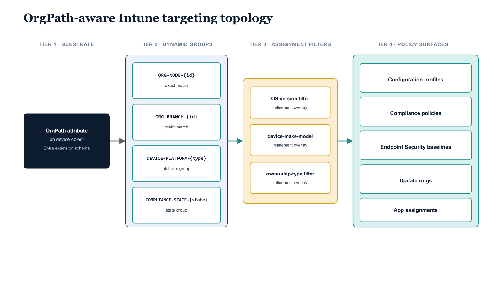

# Chapter 9 — Rollout Sequence and Operational Notes

::: {.callout-note}
## In this chapter
This closing chapter sequences the production rollout as six dependency-ordered steps — from populating OrgPath on already-enrolled devices through scope-tag delegation — then extends drift detection with four Intune-specific gap categories and closes the Part Six narrative. Quick-reference appendices tabulate the Graph API scopes each component requires, the group naming convention, and the full post-change pipeline step sequence.
:::

## Implementation Order and Production Readiness

## 9.1   Rollout Sequence

The recommended rollout sequence for the Intune integration layer is a six-step progression. The ordering is not arbitrary — it reflects the dependency chain between the components built throughout this document, and skipping steps or reordering them will produce intermediate states in which the governance model is partially deployed in ways that create real policy gaps or compliance state inconsistencies.

The first step is to populate OrgPath on all device objects that are already enrolled in Intune. This is accomplished by running the Part Four ETL pipeline in device mode against the full Intune managed device population. Devices that have a known organizational assignment from the provisioning record, from the hardware hash mapping table, or from their primary user's OrgPath receive their OrgPath values immediately. Devices with no clear assignment source are stamped as /UNPOSITIONED and queued for manual review by the governance team.

This step is deliberately limited to reading device records and writing OrgPath attribute values — no Intune policy changes occur, no group assignments change, and no compliance state changes for any device. The step is low-risk and reversible: if the OrgPath values written during this step are found to be incorrect, the ETL pipeline can be re-run with corrected assignment logic, and the new OrgPath values will overwrite the incorrect ones.

The second step is to run New-OrgPathDeviceGroupLibrary.ps1 in WhatIf mode first. The WhatIf output lists every group that would be created and every existing group whose membership rule would be updated. The engineering team reviews this output to verify that the group names and membership rules correspond correctly to the OrgTree registry before any groups are actually created. Once the WhatIf output has been reviewed and approved, the script is re-run in production mode.

Dynamic group membership processing in Entra ID begins immediately after the groups are created, but the membership engine evaluates large groups asynchronously and may take anywhere from twenty minutes to several hours to reach a stable membership state for large device populations. The governance team must not proceed to the third step until a spot-check confirms that a representative sample of devices from each organizational segment appear in their expected branch groups.

The spot-check is performed by querying the transitive members of a representative set of branch groups using Get-MgGroupTransitiveMember and verifying that the returned device objects carry OrgPath values that satisfy the group's membership rule.

The third step is to migrate existing Intune policy assignments from manually maintained static groups to the OrgPath-derived branch groups. This migration must be executed policy by policy, not in bulk. For each policy, the engineering team identifies the device population currently covered by the existing static group assignment and confirms that the intended OrgPath branch group covers the same population.

When the populations match, the assignment is migrated using the programmatic assignment scripts from Chapter Three, and the static group assignment is removed from the policy simultaneously — not in sequence — to avoid a window where either no group or two conflicting groups are assigned.

Policies whose static groups cannot be cleanly mapped to a single OrgPath branch group require a governance decision before migration: they represent either organizational ambiguity in the OrgTree structure (which the OrgTree registry should be updated to resolve) or policies that are genuinely cross-organizational in scope (which should be assigned to the root branch group or to the lowest common ancestor node in the hierarchy that covers all intended targets).

The fourth step is to deploy the Autopilot OrgPath stamping script. The user-derivation version of the script is uploaded to the Intune script library and associated with the enrollment status page configuration for each Autopilot profile that targets personally assigned devices. The hardware hash mapping strategy is configured for Autopilot profiles that target shared devices, kiosk devices, and purpose-built workstations. The quarantine node is configured and its branch group is assigned the minimal configuration profile and the non-compliant compliance policy before this step runs, so that any device that completes Autopilot without a valid OrgPath immediately enters a governed (if restricted) state. This step affects only future enrollments — previously enrolled devices already have their OrgPath from the first step.

The fifth step is to create the segment-level compliance policies for every organizational segment that requires differentiated compliance standards, assign them to their respective branch groups, and validate the Conditional Access bridge end-to-end. Validation is performed by authenticating to a resource protected by a segment-specific Conditional Access policy from four device states: a correctly positioned and compliant device (access expected), a correctly positioned but non-compliant device (access denied), a correctly positioned device with a pending compliance evaluation (access depends on CA policy grace period configuration), and an unpositioned device (access denied). All four outcomes must match expectations before the fifth step is marked complete.

The sixth step is to create scope tags, assign them to devices by OrgPath, assign the scope tags to the Intune policies and applications that fall within each segment's administrative boundary, and configure role assignments for divisional and departmental IT administrators. Validation for this step requires signing in as a delegated administrator account that has been granted an Intune role with a specific scope tag, verifying that only the devices and policies bearing that scope tag are visible, and verifying that devices bearing a different scope tag are invisible. The validation must also confirm that the delegated administrator cannot escalate their own scope tag assignments — a misconfigured role that allows scope tag self-assignment would allow a divisional IT administrator to grant themselves access to resources outside their segment.

## 9.2   Drift Detection Extensions

The drift detection run that the Part Four pipeline established must be extended to include four Intune-specific gap categories. These categories join the original OrgPath attribute drift categories — devices missing OrgPath, devices with OrgPath values not matching any active registry node, devices whose OrgPath value changed since the last run — in the daily drift detection report, and findings from all categories are committed together to the governance repository's drift detection log at the end of each pipeline run.

The first Intune-specific drift category is **unenrolled devices with OrgPath**: device objects in Entra ID that carry an OrgPath value but have no corresponding Intune managed device record. These represent either devices that were un-enrolled from Intune without going through the offboarding pipeline (which should have cleared the OrgPath value) or devices that were assigned OrgPath values speculatively before enrollment. Both conditions require investigation.

The second category is **compliance policies assigned to non-OrgPath groups**: compliance policies in Intune whose assignment targets include any group whose name does not match the ORG-NODE-\* or ORG-BRANCH-\* convention. Any such policy has escaped the governance pipeline's assignment management and may be applying to a device population that diverges from the intended organizational scope.

The third category is **devices whose scope tags do not match their OrgPath**: managed devices whose Intune scope tag assignments do not correspond to the scope tag that the OrgPath model prescribes for their OrgPath value. Scope tag mismatches create administrative visibility inconsistencies — a divisional administrator may be able to see a device they should not manage, or unable to see one they should.

The fourth category is **devices whose OrgPath changed but whose device category was not updated**: devices that were reassigned to a new OrgTree node of a different type (for example, from a Unit node to a Kiosk node) but whose Intune device category field still reflects the old node type. This category is detected by comparing the device category value in the Intune managed device record against the expected category for the device's current OrgTree node type using the category map from Chapter Six.

## 9.3   Series Closure

The Intune integration layer is now complete. The dynamic device group library expresses the OrgTree hierarchy in terms that Intune's policy targeting engine can consume, the policy assignment model restores the structural inheritance that Active Directory's Group Policy OU linkage provided for domain-joined devices, Autopilot enrollment is wired to stamp OrgPath during provisioning so that devices enter the governance model correctly positioned before their first policy evaluation cycle, the compliance bridge makes device posture evaluation organizationally contextual rather than uniformly permissive, the pipeline extension handles the Intune-specific post-stamp operations that reduce the policy coverage gap after an OrgPath change, scope tags enforce administrative delegation boundaries that align with the organizational hierarchy, and KQL dashboards surface the compliance questions that organizational governance actually requires answers to.

Together with the privileged identity management, Lifecycle Workflow, Microsoft Sentinel, and Azure role-based access control integrations built in Part Five, the OrgPath substrate now drives governance coherently and deterministically across every major dimension of the enterprise's identity and device management landscape: user identities positioned in the OrgTree, device objects carrying the same structural attribute, policy targeting derived from that attribute, compliance measurement contextual to organizational position, administrative delegation bounded by organizational structure, and all of it monitored through an organizational lens that the native tooling could not provide without OrgPath as the connective tissue.

The governance gap that Part One established, the requirements that Part Two specified, the OrgTree and OrgPath design that Part Three defined, the build that Part Four delivered, and the security operations integrations that Part Five wired together have now been extended through the device management layer. The governance model is structurally complete. Parts Seven and Eight of this series address the governance model's operational maturity: the change management procedures for OrgTree modifications, the decommissioning procedures for retired nodes, the reporting cadence for governance posture reviews, and the audit evidence package the model produces for compliance assessments.

## Appendix — Quick Reference: Graph API Scopes Required by Component

| **Component / Script** | **Required Graph Permission Scopes** | **Chapter Reference** |
|----|----|----|
| New-OrgPathDeviceGroupLibrary.ps1 | Group.ReadWrite.All, Directory.ReadWrite.All | Chapter 2 |
| Compliance Policy Assignment | DeviceManagementConfiguration.ReadWrite.All | Chapter 3 |
| Autopilot OrgPath Stamp (User Derivation) | Device.ReadWrite.All, User.Read.All | Chapter 4 |
| Compliance Policy Creation (Finance) | DeviceManagementConfiguration.ReadWrite.All | Chapter 5 |
| Post-Stamp Intune Extension | DeviceManagementManagedDevices.ReadWrite.All, DeviceManagementConfiguration.ReadWrite.All | Chapter 6 |
| Scope Tag Creation and Assignment | DeviceManagementConfiguration.ReadWrite.All | Chapter 7 |

## Appendix — Quick Reference: OrgPath Group Naming Convention

| **Group Type** | **Name Pattern** | **Membership Rule Behavior** | **Primary Use** |
|----|----|----|----|
| Node Group | ORG-NODE-{NodeId} | Exact OrgPath match only | Unit-specific policies without cascade |
| Branch Group | ORG-BRANCH-{NodeId} | Exact match OR startsWith {NodePath}/ | Division/department policies that cascade downward (default) |

## Appendix — Quick Reference: Pipeline Step Sequence After an OrgTree Change

| **Step** | **Action** | **Script / Tool** | **Blocking?** |
|----|----|----|----|
| 1 | Validate OrgTree registry JSON schema | Registry validator (Part Four) | Yes — halt on failure |
| 2 | Stamp OrgPath on affected user and device objects | ETL pipeline (Part Four) | Yes — halt on failure |
| 3 | Synchronize dynamic device group library | New-OrgPathDeviceGroupLibrary.ps1 | Yes — halt on failure |
| 4 | Request policy sync for OrgPath-changed devices | Post-stamp extension script | No — continue on sync failure |
| 5 | Update device categories for type-changed nodes | Post-stamp extension script | No — continue on category failure |
| 6 | Assign scope tags to newly positioned devices | Scope tag assignment script | No — log failures and continue |
| 7 | Reconcile compliance policy assignments against manifest | Assignment reconciliation script | Yes — alert on drift |
| 8 | Update OrgTree Watchlist in Microsoft Sentinel | Sentinel Watchlist API call | Yes — alert on failure |
| 9 | Run drift detection across all categories | Drift detection report script | No — report findings |
| 10 | Commit audit and drift logs to governance repository | Git commit in pipeline CI/CD | Yes — halt on commit failure |

Governance Architecture Series — Part Six of Eight \| OrgPath and Microsoft Intune — Structural Device Governance at Enterprise Scale \| Document date: 08 May 2026 \| Classification: Internal — Engineering Restricted \| This document is version-controlled in the governance repository. Do not distribute externally.

{#fig-05-orgpath-and-intune-diagram-03 fig-alt="Four-tier left-to-right topology diagram of OrgPath-aware Intune targeting. Tier 1 (far left): a single box \"OrgPath attribute on device object (Entra extension schema)\". Tier 2 (center-left), a labeled cluster \"Dynamic group library\" containing four stacked box rows: ORG-NODE-{id} (exact match), ORG-BRANCH-{id} (prefix match), DEVICE-PLATFORM-{type}, COMPLIANCE-STATE-{state}. Each group connects rightward to Tier 3, a labeled cluster \"Intune assignment filters\" containing three stacked boxes: OS-version filter, device-make-model filter, ownership-type filter — each shown as a refinement overlay on incoming group membership. Tier 3 connects rightward to Tier 4, a labeled cluster \"Intune policy surfaces\" containing five stacked boxes: Configuration profiles, Compliance policies, Endpoint Security baselines, Update rings, App assignments. The four tiers are arranged horizontally with clear visual grouping and tier labels above each cluster. Engineering blueprint style, white background, federal navy (#1F3A5F) for the substrate/Entra tier, teal (#1A9E8F) for Intune policy surfaces, amber (#D4A017) for the assignment-filter overlays, monospace group names, no human figures, 16:9 landscape." width="100%"}
