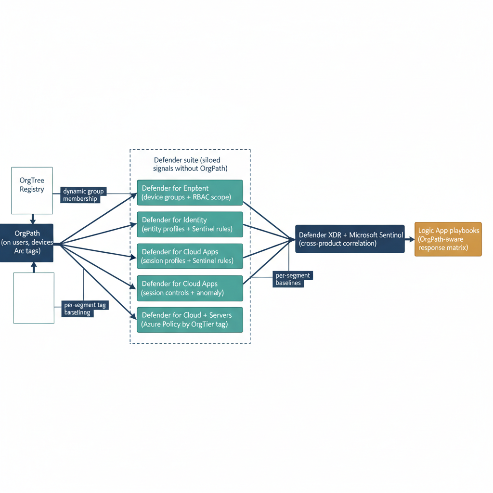
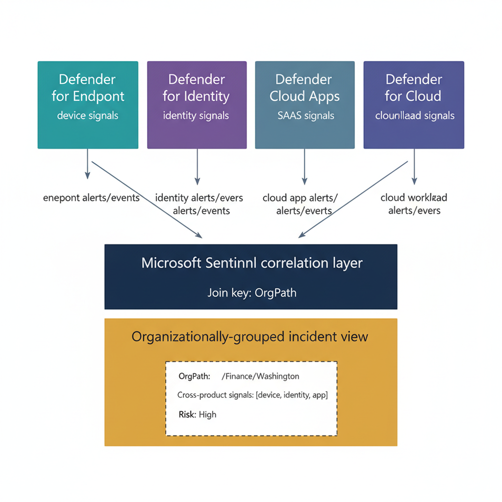

# Chapter 1 — Security Signals Without Organizational Structure

::: {.callout-note}
## In this chapter
The Defender suite generates security signal of unmatched breadth — across endpoints, identity, cloud apps, and infrastructure — but none of it carries organizational context: where in the org an event occurred, who is accountable, and which runbook applies. This chapter frames that context gap (the authorized-pentest-versus-live-incident problem is its sharpest illustration) and previews how OrgPath, carried in the telemetry, makes organizational position a first-class attribute in every investigation.
:::

## The Context Gap in Native Defender Telemetry

The Microsoft Defender suite occupies a unique position in the enterprise security toolchain. No other product family generates telemetry of comparable breadth and depth across as many attack surfaces simultaneously. Defender for Endpoint produces continuous behavioral signal from every enrolled workstation and server: process creation chains, network connections, file system writes, registry modifications, memory access patterns, and MITRE ATT&CK technique attributions, all correlated and scored by the cloud-native detection engine.

Defender for Identity monitors the authentication fabric itself — Active Directory domain controllers, Entra ID sign-in events, service ticket requests, and lateral movement indicators — producing alert-level detections for techniques that span decades of adversarial tradecraft from Kerberoasting to DCSync. Defender for Cloud Apps watches the application layer: which users are accessing which cloud services, at what volume, from which locations, with what classification of data in scope.

Defender for Cloud surveys the infrastructure plane, evaluating every Azure resource and Arc-enrolled server against security baselines and surfacing configuration drift, missing patches, and exposed attack surface. The unified Defender XDR portal and Microsoft Sentinel pull all of these signals into a correlated incident view that, at its best, traces an attack chain across device, identity, application, and infrastructure in a single investigation pane.

The problem is not the volume or quality of the signal. The problem is the absence of a dimension that makes the signal operationally actionable: organizational context. The Defender suite, taken as a whole, knows that a device named DESKTOP-F4A2B1 generated a process injection alert. It knows that a user named jsmith@contoso.com requested a Kerberos service ticket for a highly privileged service account. It knows that a user downloaded eight hundred files from a SharePoint document library in thirty minutes.

It knows that an Arc-enrolled server has three critical missing patches and an exposed RDP service. What it does not know — in any form that is systematically surfaced, queryable, or actionable — is where in the organization these events occurred, who is responsible for the assets involved, whether the behavior is anomalous relative to the norms of that organizational segment, and what the correct response procedure is for that organizational context.

The consequences of this gap play out daily in every security operations center that runs the Defender suite without organizational context in the data. An analyst receives a high-severity alert. The alert identifies the device and the technique. To determine the appropriate response, the analyst must answer a sequence of questions that the alert itself cannot answer: Who owns this device? What team does that person work on? What division does that team belong to? What policies govern that division?

Is the flagged activity consistent with the normal work patterns of that organizational context? Who is the responsible security contact for this segment of the environment? Which runbook applies? In the absence of a systematic answer to these questions embedded in the alert data itself, the analyst reconstructs the organizational context from memory, from directory lookups, from asset management queries, and from institutional knowledge that may or may not be accurate, current, or consistently applied across the SOC team.

Consider the most direct illustration of why this matters. A penetration test is authorized and running in the engineering division. The penetration testing team is generating exactly the alert signatures that a real attacker would generate: lateral movement, privilege escalation attempts, credential harvesting activity, anomalous SharePoint access. Simultaneously, a real attack is underway in the finance division, executing similar techniques. Both sets of activity appear in the Defender portal with identical alert structures. The engineering alerts are expected, documented, and should be acknowledged and excluded from the active investigation queue.

The finance alerts are a live incident requiring immediate containment. Without organizational context in the alert data, differentiating these two scenarios requires out-of-band knowledge — an analyst who happens to know that a pentest is running in engineering, or a process that manually excludes engineering devices from the active incident queue for the pentest window. Neither is systematic. Both fail under load, when analysts are rotating, or when the pentest scope expands without the SOC being notified.

The root cause is structural: the alert data carries no organizational position for the affected assets, so the SOC cannot build systematic, data-driven differentiation into its processes.

::: {.callout-note title="📝 Organizational Context Is Not Asset Management"}
It is worth distinguishing between organizational context and asset management metadata. Asset management systems (CMDB, ITAM, SCCM inventory) track device ownership, location, cost center, and lifecycle state. These are useful fields, but they are not the same as organizational position in the governance hierarchy. OrgPath encodes the device's or user's position in the organizational tree — the chain of accountability from the root of the enterprise down to the specific unit responsible for the asset. This is the dimension that drives security policy differentiation, analyst ownership boundaries, and response procedure selection. Asset management metadata may contribute to deriving OrgPath, but it is not a substitute for it.
:::

## What OrgPath Changes About the SOC Operating Model

{#fig-06-orgpath-and-defender-suite-diagram-01 fig-alt="Two leading boxes on the left: OrgTree Registry → OrgPath (on users, devices, Arc tags). The OrgPath box fans rightward into a labeled cluster \"Defender suite (siloed signals without OrgPath)\" containing four product boxes stacked vertically: Defender for Endpoint (device groups + RBAC scope); Defender for Identity (entity profiles + Sentinel rules); Defender for Cloud Apps (session controls + anomaly); Defender for Cloud + Servers (Azure Policy by OrgTier tag). Each arrow from OrgPath into a Defender product is labeled with its binding mechanism: \"dynamic group membership\", \"identity org context\", \"per-segment baselines\", \"resource tag targeting\". All four Defender products converge rightward into a single downstream box \"Defender XDR + Microsoft Sentinel (cross-product correlation)\", which then forwards to a final box \"Logic App playbooks (OrgPath-aware response matrix)\". Engineering blueprint style, white background, federal navy (#1F3A5F) for substrate, teal (#1A9E8F) for Defender products, amber (#D4A017) for the response automation tail, 16:9 landscape." width="85%"}

When every device, user, and Arc-enrolled server in the environment carries an OrgPath value, and when that value is present in the telemetry streams that feed Microsoft Sentinel and the Defender portal, organizational context becomes a first-class attribute in every investigation. The change this makes to the SOC operating model is architectural, not cosmetic.

An alert on a device whose OrgPath is /Root/Finance/Accounting arrives in the analyst's queue already annotated: Finance policies apply, the Accounting unit's responsible SOC analyst is designated by the RBAC role assignment that scopes to the MDE-FINANCE-ACCOUNTING device group, the containment action follows the Finance incident response runbook entry in the response matrix, and the Sentinel workbook places this alert in the Finance organizational view alongside all other Finance-segment alerts from Defender for Identity, Defender for Cloud Apps, and Defender for Cloud. The analyst does not reconstruct any of that context. It is present in the data, surfaced by the platform, and acted on by the automation layer before the analyst even opens the incident.

An alert on a device whose OrgPath is /Root/Engineering/SecurityTesting during a pentest window can be automatically correlated against the pentest authorization record stored in the governance repository, suppressed from the active queue, and tagged as an authorized assessment event — all without analyst intervention — because the OrgPath value in the alert data matches the scope of the authorization record. This is not possible with device name patterns or IP address ranges, both of which are fragile and require constant maintenance. It is possible with OrgPath because OrgPath is derived from the authoritative organizational hierarchy and updated automatically when devices move between organizational units.

The five chapters that follow describe exactly how this organizational context is introduced into each layer of the Defender suite. Chapter Two covers Defender for Endpoint device groups and the RBAC scoping model that gives organizational SOC roles bounded visibility into their assigned segments. Chapter Three covers Defender for Identity investigation enrichment — how OrgPath surfaces in the MDI entity profile and how Sentinel analytics rules fire differentiated alerts based on the organizational position of the affected identity.

Chapter Four covers Defender for Cloud Apps session controls and anomaly detection, explaining how per-segment behavioral baselines are established through Conditional Access policy differentiation backed by OrgPath dynamic user groups. Chapter Five covers Defender for Cloud and Defender for Servers, showing how Azure Policy initiative targeting and Resource Graph queries use the OrgPath resource tag on Arc-enrolled servers to produce an infrastructure security posture view organized by organizational hierarchy. Chapter Six presents the unified cross-product KQL query that joins all Defender signal streams into a single organizational security posture dashboard.

Chapter Seven presents the Logic App playbook architecture that reads OrgPath at incident creation time and drives contextually appropriate automated response based on the governance-controlled response matrix.

{#fig-06-orgpath-and-defender-suite-diagram-02 fig-alt="Cross-product correlation diagram. Top row of four boxes labeled with distinct cool tones — \"Defender for Endpoint\" (device signals, teal), \"Defender for Identity\" (identity signals, purple), \"Defender for Cloud Apps\" (SaaS signals, slate-blue), \"Defender for Cloud\" (cloud workload signals, indigo). Each top-row box emits an alert/event stream downward via a labeled arrow into a single rectangular middle layer \"Microsoft Sentinel correlation layer\" (federal navy #1F3A5F) spanning all four arrows, with text inside the rectangle reading \"Join key: OrgPath\". Below the Sentinel layer, a single box \"Organizationally-grouped incident view\" (amber #D4A017) shows an example incident card with the fields `OrgPath: /Finance/Washington`, `Cross-product signals: [device, identity, app]`, `Risk: High`. Engineering blueprint style, white background, no human figures, 16:9 landscape." width="85%"}
