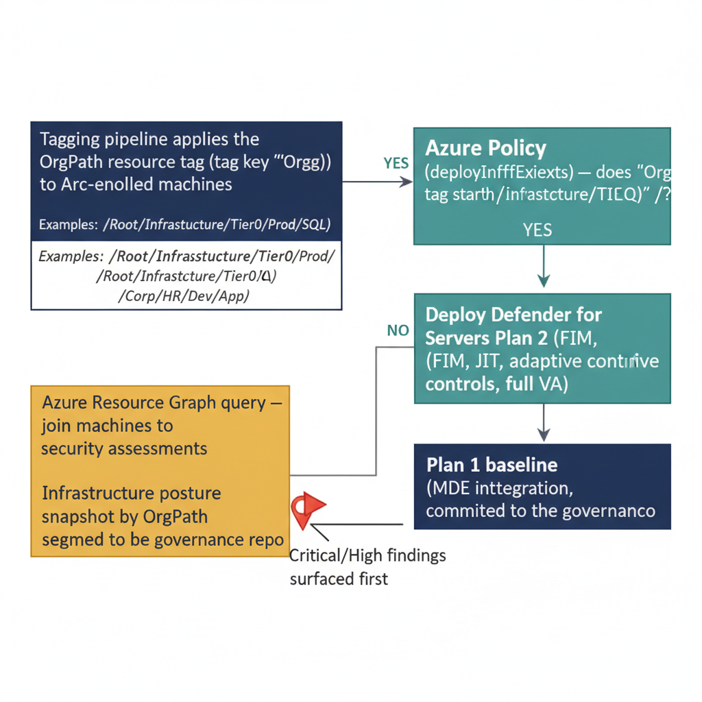

# Chapter 5 — Defender for Cloud and Defender for Servers: Tag-Based Initiative Targeting

::: {.callout-note}
## In this chapter
Defender for Cloud operates on the infrastructure plane, where Arc-enrolled servers carry OrgPath as a resource tag. This chapter shows how that tag drives organizational-tier differentiation: an Azure Policy deployIfNotExists definition that enforces Defender for Servers Plan 2 on Tier 0 machines automatically, and an Azure Resource Graph query plus snapshot script that report infrastructure security posture organized by OrgPath segment.
:::

*Organizational-Context Security Posture for Hybrid Workloads*

## The Infrastructure Plane and the OrgPath Resource Tag

The preceding chapters of this document operated primarily on the identity and device planes: users and endpoints. Defender for Cloud operates on a different plane — the infrastructure plane: Azure virtual machines, Arc-enrolled on-premises servers, container workloads, managed databases, and storage accounts. These infrastructure assets carry OrgPath as a resource tag, applied by the tagging pipeline described in Part Five of this series. That resource tag is the bridge between the infrastructure governance model and the Defender for Cloud security posture model, and it enables two capabilities that are not achievable through native Defender for Cloud configuration alone: plan-level differentiation by organizational tier, and security posture reporting organized by organizational hierarchy.

The organizational significance of this is substantial. Enterprise infrastructure is rarely uniform in its security requirements. Tier 0 domain controllers, certificate authorities, and privileged access workstations have security hardening requirements that are categorically more stringent than Tier 1 application servers or Tier 2 developer build machines.

Defender for Cloud offers two server protection plans — Plan 1, which includes Microsoft Defender for Endpoint integration and basic vulnerability assessment, and Plan 2, which adds file integrity monitoring, just-in-time VM access, adaptive application controls, Docker host hardening assessment, and the full vulnerability assessment engine. Applying Plan 2 universally across all servers is expensive and may not be operationally warranted for low-sensitivity workloads. Applying Plan 1 uniformly leaves Tier 0 infrastructure without the enhanced detection coverage it requires.

OrgPath resource tags enable the organization to express this differentiation through Azure Policy without maintaining manual per-resource or per-subscription plan assignments.

The two Defender for Servers plans and their typical OrgPath-tier targeting are summarized below.

| Plan | Capabilities | Typical OrgPath tier |
|----|----|----|
| Plan 1 | Microsoft Defender for Endpoint integration; basic vulnerability assessment | Tier 1 application servers, lower-sensitivity workloads |
| Plan 2 | Everything in Plan 1 plus file integrity monitoring, just-in-time VM access, adaptive application controls, Docker host hardening assessment, and the full vulnerability assessment engine | Tier 0 infrastructure (domain controllers, CAs, PAWs) — enforced automatically by policy |

{#fig-book-06-cpt-05-diagram-01 fig-alt="Engineering blueprint diagram on a white background showing how the OrgPath resource tag selects the Defender for Servers plan for Arc-enrolled machines. On the left, a federal navy (#1F3A5F) box \"Tagging pipeline applies the OrgPath resource tag (tag key OrgPath) to Arc-enrolled machines\" with monospace tag examples. An arrow leads to a teal (#1A9E8F) decision box \"Azure Policy (deployIfNotExists) — does OrgPath tag start with /Root/Infrastructure/Tier0?\". The YES branch leads to a teal box \"Deploy Defender for Servers Plan 2 (FIM, JIT, adaptive controls, full VA)\"; the NO branch leads to a navy box \"Plan 1 baseline (MDE integration, basic VA)\". Separately, an amber (#D4A017) box \"Azure Resource Graph query — join machines to security assessments\" aggregates rightward into a navy box \"Infrastructure posture snapshot by OrgPath segment, committed to the governance repo\". A red (#C0392B) marker flags \"Critical/High findings surfaced first\". Monospace labels for tag keys, paths, and plan names, no human figures, 16:9 landscape." width="100%"}

## Azure Policy Definition: Tier 0 Defender for Servers Plan 2 Enforcement

The following Azure Policy definition uses the deployIfNotExists effect to automatically remediate Arc-enrolled servers whose OrgPath tag identifies them as Tier 0 infrastructure, ensuring they receive Defender for Servers Plan 2. The policy evaluates the resource tag at every compliance scan cycle. When a server is newly enrolled and its OrgPath tag is applied by the tagging pipeline, the policy's next compliance evaluation will find the server non-compliant and trigger the remediation task automatically.

```json
{
  "properties": {
    "displayName": "OrgPath — Enable Defender for Servers Plan 2 on Tier0 Arc Machines",
    "description": "Deploys Defender for Servers Plan 2 on Arc-enabled machines whose
                    OrgPath tag identifies them as Tier 0 infrastructure. Uses
                    deployIfNotExists to automatically remediate non-compliant resources.
                    Assign at the management group scope covering all subscriptions
                    that may contain Tier 0 Arc-enrolled servers.",
    "mode": "Indexed",

    "parameters": {
      "OrgPathPrefix": {
        "type": "String",
        "defaultValue": "/Root/Infrastructure/Tier0",
        "metadata": {
          "displayName": "OrgPath Prefix for Tier 0 Machines",
          "description": "Arc machines whose OrgPath tag starts with this value receive
                          Defender for Servers Plan 2. SUBSTITUTE: Replace with the
                          exact Tier 0 OrgPath prefix used in your OrgTree registry."
        }
      }
    },

    "policyRule": {
      "if": {
        "allOf": [
          {
            // Only evaluate Arc-enrolled machines (on-premises servers connected to Azure).
            "field": "type",
            "equals": "Microsoft.HybridCompute/machines"
          },
          {
            // Match machines whose OrgPath tag contains the Tier 0 prefix.
            // "contains" is used rather than "startsWith" because Azure Policy
            // tag condition functions differ from KQL. For exact prefix matching,
            // use the "like" condition with a trailing wildcard: "/Root/Infrastructure/Tier0*"
            "field": "tags['OrgPath']",
            "contains": "[parameters('OrgPathPrefix')]"
          }
        ]
      },

      "then": {
        "effect": "deployIfNotExists",
        "details": {
          "type": "Microsoft.Security/defenderForServersSettings",
          "name": "mma-agent",

          // Existence check: the resource is compliant if Plan 2 is already enabled.
          "existenceCondition": {
            "field": "Microsoft.Security/defenderForServersSettings/plan.name",
            "equals": "P2"
          },

          // roleDefinitionIds: The managed identity performing remediation requires
          // the Security Admin role (fb1c8493-542b-48eb-b624-b4c8fea62acd) on the
          // target subscription. Grant this role to the policy assignment's managed
          // identity through the Remediation tab of the policy assignment blade.
          "roleDefinitionIds": [
            "/providers/Microsoft.Authorization/roleDefinitions/fb1c8493-542b-48eb-b624-b4c8fea62acd"
          ],

          "deployment": {
            "properties": {
              "mode": "incremental",
              "template": {
                "$schema": "https://schema.management.azure.com/schemas/2019-04-01/deploymentTemplate.json#",
                "contentVersion": "1.0.0.0",
                "resources": [
                  {
                    "type": "Microsoft.Security/defenderForServersSettings",
                    "apiVersion": "2022-01-01-preview",
                    "name": "mma-agent",
                    "properties": {
                      "plan": {
                        // P2 = Defender for Servers Plan 2
                        // P1 = Defender for Servers Plan 1
                        "name": "P2"
                      }
                    }
                  }
                ]
              }
            }
          }
        }
      }
    }
  }
}
```

::: {.callout-note title="⚠ Policy Assignment Scope"}
Assign this policy at the management group level that encompasses all subscriptions containing Arc-enrolled servers. Assigning at the subscription level requires creating a separate assignment per subscription and will miss servers in newly created subscriptions until the assignment is manually extended. Management group-level assignment covers all child subscriptions automatically. Ensure the policy assignment's system-assigned managed identity is granted Security Admin at the management group scope, not just the subscription level, to enable cross-subscription remediation tasks.
:::

## Azure Resource Graph Query: Defender for Cloud Findings by OrgPath

Azure Resource Graph provides a query interface across the Azure resource inventory that supports joining resource properties — including tags — with Defender for Cloud assessment results. The following query joins the Arc-enrolled machine inventory with the Defender for Cloud security assessment table, filters to high and critical findings, and aggregates the results by OrgPath to produce a per-segment security posture snapshot. This query is the data source for the infrastructure security posture workbook tile described in Chapter Six, and it is also run by the automation script below to produce the governance repository snapshot for drift detection.

```kql
// ---------------------------------------------------------------
// Azure Resource Graph: Defender for Cloud Findings by OrgPath
//
// Run location options:
//   1. Azure Portal — Resource Graph Explorer (portal.azure.com)
//   2. PowerShell:
//        Install-Module Az.ResourceGraph
//        Connect-AzAccount
//        Search-AzGraph -Query $queryString
//   3. Azure CLI:
//        az graph query -q "$queryString"
//
// Returns: OrgPath segments with unresolved high/critical Defender
//          for Cloud recommendations on Arc-enrolled servers.
//          Results ordered by severity for SOC prioritization.
// ---------------------------------------------------------------

Resources
// Filter to Arc-enrolled servers only.
// To include Azure VMs, add: or type == "microsoft.compute/virtualmachines"
| where type == "microsoft.hybridcompute/machines"
| extend
    // SUBSTITUTE: These tag names must match the exact tag key names applied
    // by your OrgPath tagging pipeline from Part Five.
    OrgPath   = tostring(tags['OrgPath']),
    OrgNodeId = tostring(tags['OrgNodeId']),
    OrgTier   = tostring(tags['OrgTier']),
    ResourceId = id
// Exclude machines that have not received OrgPath tags yet.
| where isnotempty(OrgPath)
| join kind=inner (
    SecurityResources
    | where type == "microsoft.security/assessments"
    // Filter to unresolved findings only.
    | where properties.status.code != "Passed"
    | extend
        AssessmentName     = tostring(properties.displayName),
        Severity           = tostring(properties.metadata.severity),
        RemediationDesc    = tostring(properties.metadata.remediationDescription),
        // The assessed resource ID is the full ARM resource ID of the
        // machine that failed the assessment.
        AssessedResourceId = tostring(properties.resourceDetails.id)
    // Focus on High and Critical findings for SOC prioritization.
    // Remove this filter for a complete compliance view including Medium and Low.
    | where Severity in ("High", "Critical")
    | project AssessedResourceId, AssessmentName, Severity, RemediationDesc
) on $left.ResourceId == $right.AssessedResourceId
// Aggregate findings per OrgPath segment.
| summarize
    CriticalFindings = countif(Severity == "Critical"),
    HighFindings     = countif(Severity == "High"),
    TotalFindings    = count(),
    // make_set with limit of 10 provides a representative sample of findings.
    // Remove the limit for a complete finding list (increases result size).
    FindingSample    = make_set(AssessmentName, 10)
    by OrgPath, OrgTier, OrgNodeId
| order by CriticalFindings desc, HighFindings desc
```

## Security Posture Snapshot Automation Script

The following PowerShell script wraps the Resource Graph query and commits its output to the governance repository as the infrastructure security posture snapshot for the current cycle. This snapshot is consumed by the drift detection process to identify organizational segments where security posture is degrading over time, and it is surfaced in the Sentinel workbook as the infrastructure security posture tile alongside the identity and cloud app risk data from Chapters Three and Four.

```powershell
#Requires -Modules Az.ResourceGraph, Az.Accounts
<# data-id="240"
.SYNOPSIS
    Executes the OrgPath-annotated Defender for Cloud assessment query
    and writes the results to the governance repository for version-controlled
    posture tracking.

.DESCRIPTION
    Authenticates using a managed identity (for automation server execution),
    runs the Azure Resource Graph assessment query, and exports the results
    to the governance repository security posture directory as a timestamped JSON file.

    This script is intended to run on a schedule (daily or per-shift) as part
    of the governance automation pipeline. The output file is committed to the
    governance repository by the CI/CD pipeline after this script completes.

.PARAMETER OutputPath
    Path to write the posture snapshot JSON file.
    SUBSTITUTE: Set to the path within your governance repository working directory
    where the CI/CD pipeline will commit the file.
    Example: "C:\governance\security-posture\defender-cloud-by-orgpath.json"

.PARAMETER SubscriptionId
    Optional. Scope the Resource Graph query to a specific subscription.
    If omitted, the query runs across all subscriptions in scope for the
    authenticated identity.
    SUBSTITUTE: Provide your subscription GUID if needed.

.NOTES
    Connect-AzAccount -Identity authenticates using the managed identity of
    the compute resource running this script (Azure VM, Arc server, or
    Azure Automation account). The managed identity must have:
      - Reader role on all subscriptions containing Arc-enrolled servers
      - Security Reader role to access SecurityResources in Resource Graph
#>
param(
    [string]$OutputPath     = "C:\governance\security-posture\defender-cloud-by-orgpath.json",
    [string]$SubscriptionId = ""   # SUBSTITUTE: Your subscription GUID, or leave empty for all
)

$ErrorActionPreference = "Stop"

# Authenticate using managed identity on the automation server.
# SUBSTITUTE: Replace with Connect-AzAccount -ServicePrincipal ... if using
# a service principal instead of a managed identity.
Connect-AzAccount -Identity

Write-Host "[$(Get-Date -f 'HH:mm:ss')] Running Defender for Cloud OrgPath posture query"

$query = @'
Resources
| where type == 'microsoft.hybridcompute/machines'
| extend OrgPath    = tostring(tags['OrgPath']),
         OrgTier    = tostring(tags['OrgTier']),
         OrgNodeId  = tostring(tags['OrgNodeId']),
         ResourceId = id
| where isnotempty(OrgPath)
| join kind=inner (
    SecurityResources
    | where type == 'microsoft.security/assessments'
    | where properties.status.code != 'Passed'
    | extend Severity          = tostring(properties.metadata.severity),
             AssessmentName    = tostring(properties.displayName),
             AssessedResourceId = tostring(properties.resourceDetails.id)
    | where Severity in ('High', 'Critical')
    | project AssessedResourceId, AssessmentName, Severity
) on $left.ResourceId == $right.AssessedResourceId
| summarize
    CriticalFindings = countif(Severity == 'Critical'),
    HighFindings     = countif(Severity == 'High'),
    TotalFindings    = count(),
    FindingSample    = make_set(AssessmentName, 10)
    by OrgPath, OrgTier, OrgNodeId
| order by CriticalFindings desc
'@

# Build query parameters — scope to subscription if specified
$queryParams = @{ Query = $query }
if (-not [string]::IsNullOrEmpty($SubscriptionId)) {
    $queryParams["Subscription"] = @($SubscriptionId)
    Write-Host "  Query scope: Subscription $SubscriptionId"
} else {
    Write-Host "  Query scope: All accessible subscriptions"
}

$results = Search-AzGraph @queryParams

# Build the output document with provenance metadata
$output = @{
    GeneratedAt     = (Get-Date).ToUniversalTime().ToString("o")
    GeneratedBy     = "OrgPath-DefenderCloud-PostureSnapshot.ps1"
    QueryScope      = if ($SubscriptionId) { $SubscriptionId } else { "All Subscriptions" }
    TotalSegments   = $results.Count
    CriticalSegments = ($results | Where-Object { $_.CriticalFindings -gt 0 }).Count
    HighSegments    = ($results | Where-Object { $_.HighFindings -gt 0 }).Count
    Results         = $results
}

# Ensure the output directory exists
$outputDir = Split-Path $OutputPath -Parent
if (-not (Test-Path $outputDir)) {
    New-Item -ItemType Directory -Path $outputDir -Force | Out-Null
}

$output | ConvertTo-Json -Depth 10 | Set-Content -Path $OutputPath -Encoding UTF8

Write-Host "[$(Get-Date -f 'HH:mm:ss')] Posture snapshot written to: $OutputPath"
Write-Host "  OrgPath segments with findings: $($results.Count)"
Write-Host "  Segments with Critical findings: $($output.CriticalSegments)"
Write-Host "  Segments with High findings: $($output.HighSegments)"
```
