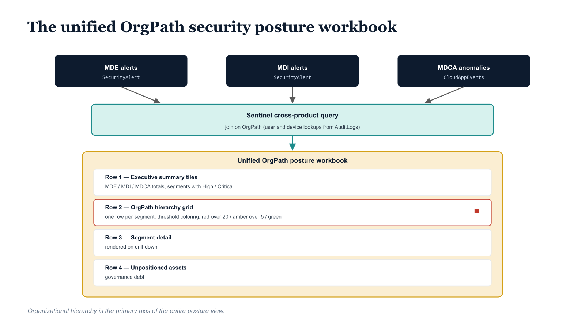

# Chapter 6 — The Unified Defender XDR View: Cross-Product Security Posture by OrgPath

::: {.callout-note}
## In this chapter
The full payoff of the OrgPath model is the unified view that combines every Defender signal into one organizational security posture picture. This chapter presents the cross-product Sentinel query that joins MDE, MDI, and MDCA signal streams on OrgPath, the data-source tables it requires, and a four-row workbook design that answers "which parts of the organization are under the most security pressure right now?" directly and continuously.
:::

*One Pane of Organizational Security Truth*

## Why the Unified View Is the Primary Operational Artifact

Chapters Two through Five of this document each addressed one layer of the Defender suite in isolation: device group scoping in MDE, identity alert enrichment in MDI, session control and anomaly detection in MDCA, and infrastructure posture assessment in Defender for Cloud. Each layer produces value on its own. An analyst investigating a specific MDE alert benefits from OrgPath context even if the other layers are not yet integrated. An SOC manager reviewing the Defender for Cloud posture snapshot organized by OrgPath gets organizational clarity even without the identity layer connected. But the full operational payoff of the OrgPath model comes from the unified view that combines all of these signals into a single organizational security posture picture.

The unified Sentinel workbook organized by OrgPath hierarchy is the primary operational artifact for an SOC manager in an OrgPath-governed environment. It answers the question that every security leader asks but that conventional tooling cannot answer concisely: Which parts of the organization are under the most security pressure right now, across all dimensions? The conventional answer to this question requires the manager to aggregate data from four or more dashboards, apply their own judgment about which signals are most significant, and mentally map device names and user accounts to organizational structures. The OrgPath-organized workbook answers this question directly and continuously, with the organizational hierarchy as the primary axis of the entire view.

{#fig-book-06-cpt-06-diagram-01 fig-alt="Engineering blueprint diagram on a white background. Across the top, three federal navy (#1F3A5F) source boxes — \"MDE alerts (SecurityAlert)\", \"MDI alerts (SecurityAlert)\", \"MDCA anomalies (CloudAppEvents)\" — each emit a downward arrow into a single teal (#1A9E8F) layer \"Sentinel cross-product query — join on OrgPath (user and device lookups from AuditLogs)\". Below it, an amber (#D4A017) workbook frame labeled \"Unified OrgPath posture workbook\" stacks four labeled rows top to bottom: Row 1 \"Executive summary tiles (MDE / MDI / MDCA totals, segments with High/Critical)\", Row 2 \"OrgPath hierarchy grid — one row per segment, threshold row coloring red over 20 / amber over 5 / green\", Row 3 \"Segment detail (rendered on drill-down)\", Row 4 \"Unpositioned assets — governance debt\". A red (#C0392B) accent marks the over-20 rows in the grid. Monospace labels for table and column names, no human figures, 16:9 landscape." width="85%"}

## Data Source Requirements

The unified cross-product KQL query joins data from the following tables in the Microsoft Sentinel workspace. All tables must be populated for the unified view to be complete:

| **Table** | **Source** | **Required For** | **Sentinel Connector** |
|----|----|----|----|
| SecurityAlert | Microsoft Defender XDR | MDE and MDI alert counts | Microsoft Defender XDR |
| CloudAppEvents | Microsoft Defender XDR | MDCA session and anomaly data | Microsoft Defender XDR |
| AuditLogs | Entra ID | OrgPath lookup (user and device) | Azure Active Directory |
| DeviceInfo | Microsoft Defender XDR | Device name to OrgPath mapping | Microsoft Defender XDR |

## Unified Cross-Product Sentinel Dashboard Query

The following KQL query is saved as a Sentinel workbook query with a one-hour auto-refresh interval. It produces a table of OrgPath segments with aggregated signal counts from MDE, MDI, and MDCA for the past twenty-four hours, ordered by total signal volume. This table is the primary organizational security posture view for the SOC operations center screen.

```kql
// ---------------------------------------------------------------
// Unified OrgPath Security Posture Dashboard — Cross-Product View
//
// Purpose:  Single pane showing alert and anomaly distribution across
//           all Defender products, organized by organizational segment.
// Refresh:  1 hour (configure in Sentinel workbook tile settings)
// Tables:   SecurityAlert, CloudAppEvents, AuditLogs
//
// Configure this as a Sentinel Workbook grid tile with:
//   - Column sparklines for MDEAlertCount and MDIAlertCount
//   - Threshold-based row coloring: red if TotalSignals > 20,
//     amber if > 5, green otherwise
//   - OrgPath column as the drill-down link to the segment workbook
// ---------------------------------------------------------------

// --- OrgPath Lookup: Most Recent Path per User ---
// materialize() caches the result for reuse across multiple joins
// without re-executing the subquery, which improves performance significantly
// on large AuditLogs tables.
let UserOrgPaths = materialize(
    AuditLogs
    | where TimeGenerated >= ago(7d)
    | where OperationName == "Update user"
    | mv-expand Props = AdditionalDetails
    // SUBSTITUTE: Replace "OrgPath" with the exact displayName of your extension attribute
    | where tostring(Props.displayName) contains "OrgPath"
    | extend
        UPN     = tostring(TargetResources[0].userPrincipalName),
        OrgPath = tostring(Props.newValue)
    | summarize arg_max(TimeGenerated, OrgPath) by UPN
    | project UPN, OrgPath
);

// --- OrgPath Lookup: Most Recent Path per Device ---
let DeviceOrgPaths = materialize(
    AuditLogs
    | where TimeGenerated >= ago(7d)
    | where OperationName == "Update device"
    | mv-expand Props = AdditionalDetails
    | where tostring(Props.displayName) contains "OrgPath"
    | extend
        // DeviceName in the audit log matches the displayName of the device object.
        // Confirm this matches how MDE surfaces device names in ExtendedProperties.
        DeviceName = tostring(TargetResources[0].displayName),
        OrgPath    = tostring(Props.newValue)
    | summarize arg_max(TimeGenerated, OrgPath) by DeviceName
    | project DeviceName, OrgPath
);

// --- Metric 1: MDE Alert Summary by OrgPath Segment ---
let MDEAlerts = SecurityAlert
| where TimeGenerated >= ago(24h)
| where ProviderName == "Microsoft Defender for Endpoint"
| extend
    // "Machine Name" is the ExtendedProperties key for the device name in MDE alerts.
    DeviceName = tostring(todynamic(ExtendedProperties)["Machine Name"])
| join kind=leftouter DeviceOrgPaths on DeviceName
| extend OrgPath = iif(isempty(OrgPath), "UNPOSITIONED", OrgPath)
| summarize
    MDEAlertCount   = count(),
    // High and Critical severity counts drive the threshold-based row coloring.
    MDEHighSeverity = countif(AlertSeverity in ("High", "Critical"))
    by OrgPath;

// --- Metric 2: MDI Alert Summary by OrgPath Segment ---
let MDIAlerts = SecurityAlert
| where TimeGenerated >= ago(24h)
| where ProviderName == "Microsoft Defender for Identity"
| extend
    // "User Name" is the ExtendedProperties key for the source UPN in MDI alerts.
    SourceUPN = tostring(todynamic(ExtendedProperties)["User Name"])
| join kind=leftouter UserOrgPaths on $left.SourceUPN == $right.UPN
| extend OrgPath = iif(isempty(OrgPath), "UNPOSITIONED", OrgPath)
| summarize
    MDIAlertCount   = count(),
    MDIHighSeverity = countif(AlertSeverity in ("High", "Critical"))
    by OrgPath;

// --- Metric 3: MDCA Anomalies by OrgPath Segment ---
let MDCAEvents = CloudAppEvents
| where TimeGenerated >= ago(24h)
// MDCA anomaly and policy violation events carry "Anomaly" or "Policy" in ActionType.
// SUBSTITUTE: Review your CloudAppEvents ActionType values and adjust the filter
// to match the specific anomaly event types relevant to your MDCA policy set.
| where ActionType contains "Anomaly" or ActionType contains "Policy"
| join kind=leftouter UserOrgPaths on $left.AccountId == $right.UPN
| extend OrgPath = iif(isempty(OrgPath), "UNPOSITIONED", OrgPath)
| summarize
    MDCAAnomolies = count()
    by OrgPath;

// --- Unified Join: Combine All Three Metric Streams ---
// fullouter join ensures all OrgPath segments appear in the result
// even if they have activity in only one of the three products.
MDEAlerts
| join kind=fullouter MDIAlerts  on OrgPath
| join kind=fullouter MDCAEvents on OrgPath
// coalesce resolves OrgPath from whichever join arm is non-null.
| extend OrgPath = coalesce(OrgPath, OrgPath1, OrgPath2, "UNKNOWN")
// Replace nulls from outer join with zeros for clean display.
| extend
    MDEAlertCount   = coalesce(MDEAlertCount,   0),
    MDEHighSeverity = coalesce(MDEHighSeverity, 0),
    MDIAlertCount   = coalesce(MDIAlertCount,   0),
    MDIHighSeverity = coalesce(MDIHighSeverity, 0),
    MDCAAnomolies   = coalesce(MDCAAnomolies,   0)
| extend TotalSignals = MDEAlertCount + MDIAlertCount + MDCAAnomolies
| project
    OrgPath,
    MDEAlertCount,
    MDEHighSeverity,
    MDIAlertCount,
    MDIHighSeverity,
    MDCAAnomolies,
    TotalSignals
| order by TotalSignals desc
```

## Sentinel Workbook Design for Organizational SOC Operations

The unified query above serves as the primary grid tile in a Sentinel workbook configured with the following layout. The workbook is organized top-to-bottom to answer progressively more specific questions as the analyst drills down:

- **Row 1 — Executive Summary Tiles:** Four metric tiles showing total MDE alerts, total MDI alerts, total MDCA anomalies, and count of organizational segments with any High or Critical severity signal in the past twenty-four hours. These tiles are visible on the operations center display without scrolling.

- **Row 2 — OrgPath Hierarchy Grid:** The unified query result table, with OrgPath as a clickable column that filters all subsequent tiles in the workbook to the selected segment. Row colors are threshold-driven: red for TotalSignals greater than twenty, amber for greater than five, green otherwise. This threshold should be calibrated per segment as organizational baselines are established.

- **Row 3 — Segment Detail (conditionally rendered on OrgPath selection):** Four sub-tiles showing the alert time series for MDE, MDI alert type breakdown, MDCA anomaly detail table, and the Defender for Cloud infrastructure finding count from the posture snapshot. This row is hidden until an analyst selects a specific OrgPath segment from the grid above.

- **Row 4 — Unpositioned Assets:** A dedicated tile showing devices and users with no OrgPath assignment, their alert counts, and their last seen dates. This tile represents governance debt: every asset in this view should receive an OrgPath assignment through the pipeline before the next reporting cycle.
