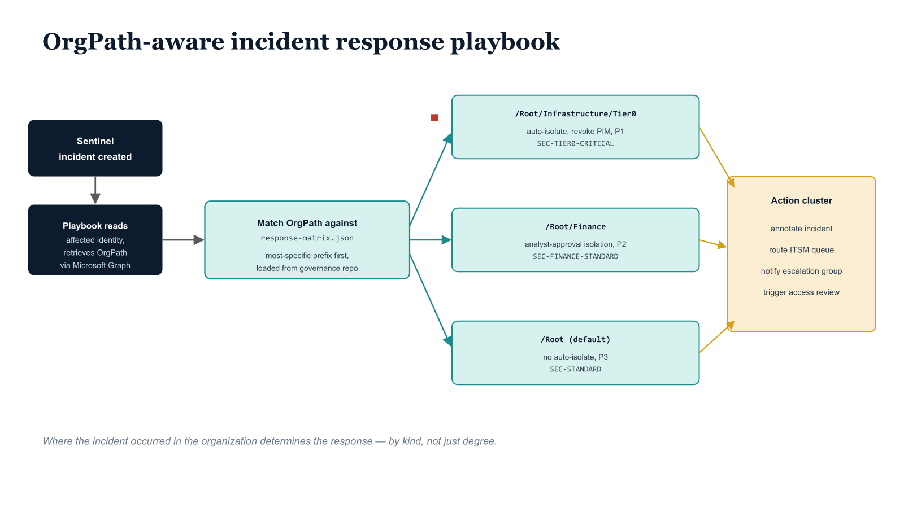

# Chapter 7 — Automated Response Playbooks: OrgPath-Aware Incident Containment

::: {.callout-note}
## In this chapter
Most SOC playbooks are alert-class-aware but not organization-aware: every high-severity incident gets the same notification, queue, and containment decision. This chapter shows how reading OrgPath as the playbook's first action makes everything that follows organizationally calibrated — driven by a governance-controlled response matrix (in the repository, changed by pull request) and executed by a Logic App that routes escalation, ITSM queue, isolation, and PIM/access-review actions by organizational tier.
:::

*Playbooks That Know Where the Incident Is*

## Generic Versus Organizational Incident Response Automation

Sentinel automation rules and Logic App playbooks have been available to SOC teams since Sentinel's general availability, and most mature SOC operations have some playbook automation in place. The typical playbook triggered by a high-severity Sentinel incident sends a notification to a Teams channel or security distribution list, creates an incident ticket in the ITSM system, optionally isolates the affected device in MDE, and closes the automation run. Every high-severity incident receives the same treatment: the same notification channel, the same ITSM queue, the same isolation decision.

The playbook is alert-class-aware — it might behave differently for a ransomware detection than for an impossible travel alert — but it is not organization-aware. It cannot differentiate between a high-severity alert on a Tier 0 domain controller and the same alert type on a Tier 2 developer workstation in terms of escalation path, notification list, containment urgency, or review requirements.

An OrgPath-aware playbook changes this. When the playbook reads the OrgPath of the affected identity or device as its first action after receiving the incident trigger, everything that follows can be calibrated to the organizational context. The escalation contact is drawn from the segment's designated SOC team, not a global distribution list. The ITSM queue is the Finance SOC queue or the Infrastructure Tier 0 queue, not a single undifferentiated security queue.

The isolation decision is automatic for Tier 0 assets but requires analyst approval for Tier 2 assets because the operational impact of isolating a developer workstation is very different from isolating a domain controller. The access review trigger fires immediately for any incident involving an Executive-segment identity but enters a standard review cycle for a Tier 2 incident. These are not differences in degree; they are differences in kind, and they can only be expressed systematically when the playbook knows where in the organization the incident occurred.

{#fig-book-06-cpt-07-diagram-01 fig-alt="Engineering blueprint flow diagram on a white background. Far left, a federal navy (#1F3A5F) trigger box \"Sentinel incident created\". An arrow leads to a navy box \"Playbook reads affected identity, retrieves OrgPath via Microsoft Graph\". An arrow leads to a teal (#1A9E8F) decision box \"Match OrgPath against response-matrix.json (most-specific prefix first; loaded from governance repo)\". Three teal branch boxes fan right by tier: \"/Root/Infrastructure/Tier0 → auto-isolate, revoke PIM, P1, SEC-TIER0-CRITICAL\", \"/Root/Finance → analyst-approval isolation, P2, SEC-FINANCE-STANDARD\", and \"/Root (default) → no auto-isolate, P3, SEC-STANDARD\". Each branch emits an amber (#D4A017) action cluster \"annotate incident, route ITSM queue, notify escalation group, trigger access review\". A red (#C0392B) accent marks the Tier 0 auto-isolation action. Monospace labels for paths, queues, and the matrix filename, no human figures, 16:9 landscape." width="100%"}

## The Response Matrix: Governance-Controlled Playbook Configuration

The playbook's organizational intelligence is not hardcoded in the Logic App definition. It is stored in a JSON file in the governance repository at governance/security/response-matrix.json and retrieved by the playbook at runtime via the repository's REST API. This separation is essential: it means that changes to response procedures for any organizational segment — a change in the Finance escalation contact, a decision to enable automatic isolation for a new department, an update to the Tier 0 PIM revocation policy — are made through the same governed pull request, review, and approval process used for all other governance artifacts. The playbook code does not change; the governance document changes, and the playbook picks up the new configuration on its next execution.

The response matrix structure is illustrated below for three representative OrgPath segments:

```kql
// governance/security/response-matrix.json
// ---------------------------------------------------------------
// OrgPath Response Matrix
// Format: Array of response configurations ordered from most specific
//         to least specific OrgPath prefix. The playbook evaluates
//         prefixes in array order and applies the first match.
//         More specific paths (longer strings) must appear before
//         their parent paths in the array.
//
// Fields:
//   orgPathPrefix       — OrgPath prefix this entry applies to
//   escalationGroupId   — Entra ID group GUID for escalation notification
//   itsmQueue           — ITSM queue name for ticket creation
//   autoIsolate         — true: isolate device automatically
//                         false: require analyst approval
//   revokePIM           — true: suspend PIM eligible assignments pending review
//   triggerAccessReview — true: create an access review for the affected user
//   responseRunbook     — URL to the applicable runbook in the team wiki
//   incidentPriority    — P1/P2/P3 classification for ITSM routing
// ---------------------------------------------------------------
{
  "version": "1.0",
  "lastUpdated": "2026-05-08",
  "approvedBy": "Security Architecture Board",
  "configurations": [
    {
      "orgPathPrefix": "/Root/Infrastructure/Tier0",
      "escalationGroupId": "aaaaaaaa-1111-aaaa-1111-aaaaaaaaaaaa",
      "itsmQueue": "SEC-TIER0-CRITICAL",
      "autoIsolate": true,
      "revokePIM": true,
      "triggerAccessReview": true,
      "responseRunbook": "https://wiki.internal/security/runbooks/tier0-incident",
      "incidentPriority": "P1"
    },
    {
      "orgPathPrefix": "/Root/Finance/Treasury",
      "escalationGroupId": "bbbbbbbb-2222-bbbb-2222-bbbbbbbbbbbb",
      "itsmQueue": "SEC-FINANCE-P1",
      "autoIsolate": true,
      "revokePIM": true,
      "triggerAccessReview": true,
      "responseRunbook": "https://wiki.internal/security/runbooks/finance-treasury",
      "incidentPriority": "P1"
    },
    {
      "orgPathPrefix": "/Root/Finance",
      "escalationGroupId": "cccccccc-3333-cccc-3333-cccccccccccc",
      "itsmQueue": "SEC-FINANCE-STANDARD",
      "autoIsolate": false,
      "revokePIM": false,
      "triggerAccessReview": true,
      "responseRunbook": "https://wiki.internal/security/runbooks/finance-standard",
      "incidentPriority": "P2"
    },
    {
      "orgPathPrefix": "/Root/Executive",
      "escalationGroupId": "dddddddd-4444-dddd-4444-dddddddddddd",
      "itsmQueue": "SEC-EXECUTIVE-VIP",
      "autoIsolate": false,
      "revokePIM": true,
      "triggerAccessReview": true,
      "responseRunbook": "https://wiki.internal/security/runbooks/executive-incident",
      "incidentPriority": "P1"
    },
    {
      "orgPathPrefix": "/Root",
      "escalationGroupId": "eeeeeeee-5555-eeee-5555-eeeeeeeeeeee",
      "itsmQueue": "SEC-STANDARD",
      "autoIsolate": false,
      "revokePIM": false,
      "triggerAccessReview": false,
      "responseRunbook": "https://wiki.internal/security/runbooks/standard-incident",
      "incidentPriority": "P3"
    }
  ]
}
```

## Logic App Playbook: OrgPath-Aware Incident Response

The following Logic App definition implements the OrgPath-aware incident response playbook. The playbook is triggered by a Sentinel incident creation event. It parses the incident entities, retrieves the OrgPath of each affected user from the Microsoft Graph API using the Logic App's managed identity, evaluates the OrgPath against the response matrix, adds an organizational context comment to the Sentinel incident, and executes the response actions specified by the matrix entry. The managed identity must be granted the following roles: Microsoft Graph User.Read.All for the Graph API calls, and the Sentinel Responder role on the Sentinel workspace for the incident comment and label operations.

```json
{
  "definition": {
    "$schema": "https://schema.management.azure.com/providers/Microsoft.Logic/schemas/2016-06-01/workflowdefinition.json#",
    "contentVersion": "1.0.0.0",

    "triggers": {
      "Microsoft_Sentinel_incident": {
        "type": "ApiConnectionWebhook",
        "inputs": {
          "body": { "callback_url": "@{listCallbackUrl()}" },
          "host": {
            "connection": {
              "name": "@parameters('$connections')['azuresentinel']['connectionId']"
            }
          },
          "path": "/incident-creation"
        }
      }
    },

    "actions": {

      // ---------------------------------------------------------------
      // Step 1: Initialize variables for OrgPath and response config
      // ---------------------------------------------------------------
      "Init_UserOrgPath": {
        "type": "InitializeVariable",
        "inputs": {
          "variables": [{
            "name": "UserOrgPath",
            "type": "string",
            "value": ""
          }]
        }
      },

      "Init_ResponseConfig": {
        "type": "InitializeVariable",
        "runAfter": { "Init_UserOrgPath": ["Succeeded"] },
        "inputs": {
          "variables": [{
            "name": "ResponseConfig",
            "type": "object",
            "value": {}
          }]
        }
      },

      // ---------------------------------------------------------------
      // Step 2: Get incident entities from Sentinel
      // ---------------------------------------------------------------
      "Get_Incident_Entities": {
        "type": "ApiConnection",
        "runAfter": { "Init_ResponseConfig": ["Succeeded"] },
        "inputs": {
          "body": {
            "incidentArmId": "@triggerBody()?['object']?['id']"
          },
          "host": {
            "connection": {
              "name": "@parameters('$connections')['azuresentinel']['connectionId']"
            }
          },
          "method": "post",
          "path": "/Incidents/Entities"
        }
      },

      // ---------------------------------------------------------------
      // Step 3: Retrieve the response matrix from the governance repository.
      // SUBSTITUTE: Replace the URI with the raw content URL for the
      // response-matrix.json file in your governance repository.
      // For Azure DevOps: https://dev.azure.com/{org}/{project}/_apis/git/
      //   repositories/{repo}/items?path=/governance/security/response-matrix.json
      // For GitHub: https://raw.githubusercontent.com/{org}/{repo}/main/
      //   governance/security/response-matrix.json
      // The managed identity must have Reader access to the repository.
      // ---------------------------------------------------------------
      "Get_Response_Matrix": {
        "type": "Http",
        "runAfter": { "Get_Incident_Entities": ["Succeeded"] },
        "inputs": {
          "method": "GET",
          "uri": "https://dev.azure.com/{OrgName}/{ProjectName}/_apis/git/repositories/{RepoId}/items?path=/governance/security/response-matrix.json&api-version=7.1",
          "authentication": {
            "type": "ManagedServiceIdentity",
            "resource": "499b84ac-1321-427f-aa17-267ca6975798"
          }
        }
      },

      "Parse_Response_Matrix": {
        "type": "ParseJson",
        "runAfter": { "Get_Response_Matrix": ["Succeeded"] },
        "inputs": {
          "content": "@body('Get_Response_Matrix')",
          "schema": {
            "type": "object",
            "properties": {
              "configurations": {
                "type": "array"
              }
            }
          }
        }
      },

      // ---------------------------------------------------------------
      // Step 4: Process each entity in the incident
      // ---------------------------------------------------------------
      "For_Each_Entity": {
        "type": "Foreach",
        "runAfter": { "Parse_Response_Matrix": ["Succeeded"] },
        "foreach": "@body('Get_Incident_Entities')?['Entities']",
        "actions": {

          "Check_If_Account_Entity": {
            "type": "If",
            "expression": {
              "and": [{ "equals": ["@item()?['Type']", "account"] }]
            },

            "actions": {

              // Query Microsoft Graph for the user's OrgPath extension attribute.
              // SUBSTITUTE: Replace {AppIdWithoutHyphens} with the actual application
              // GUID (no hyphens) of the app registration used to define the OrgPath
              // extension attribute in Entra ID.
              // Example attribute name: extension_a9b8c7d6e5f4a9b8c7d6e5f4a9b8c7d6_OrgPath
              "Get_User_From_Graph": {
                "type": "Http",
                "inputs": {
                  "method": "GET",
                  "uri": "https://graph.microsoft.com/v1.0/users/@{item()?['properties']?['userPrincipalName']}?$select=id,displayName,extension_{AppIdWithoutHyphens}_OrgPath",
                  "authentication": {
                    "type": "ManagedServiceIdentity",
                    "resource": "https://graph.microsoft.com"
                  }
                }
              },

              "Set_UserOrgPath": {
                "type": "SetVariable",
                "runAfter": { "Get_User_From_Graph": ["Succeeded"] },
                "inputs": {
                  "name": "UserOrgPath",
                  "value": "@body('Get_User_From_Graph')?['extension_{AppIdWithoutHyphens}_OrgPath']"
                }
              },

              // ---------------------------------------------------------------
              // Step 5: Apply the response matrix — evaluate OrgPath prefix.
              // The Switch evaluates the most specific applicable prefix.
              // In production, replace this with a loop that iterates the
              // matrix configurations array and applies the first prefix match.
              // The Switch structure below handles the three most common cases
              // explicitly; extend the cases block for additional segments.
              // ---------------------------------------------------------------
              "Evaluate_OrgPath_Tier": {
                "type": "Switch",
                "runAfter": { "Set_UserOrgPath": ["Succeeded"] },
                "expression": "@startsWith(variables('UserOrgPath'), '/Root/Infrastructure/Tier0')",
                "cases": {

                  "Case_Tier0": {
                    "case": true,
                    "actions": {

                      "Comment_Tier0_Escalation": {
                        "type": "ApiConnection",
                        "inputs": {
                          "body": {
                            "incidentArmId": "@triggerBody()?['object']?['id']",
                            "message": "ORGPATH TIER 0 ESCALATION\n\nAffected Identity: @{item()?['properties']?['userPrincipalName']}\nOrgPath: @{variables('UserOrgPath')}\n\nResponse Matrix: Tier 0 Critical\nActions Initiated:\n  - P1 incident classification applied\n  - Tier 0 SOC team notified via SEC-TIER0-CRITICAL queue\n  - PIM eligible assignment review queued\n  - Automatic device isolation: ENABLED per Tier 0 runbook\n  - Access review: Initiated\n\nRunbook: https://wiki.internal/security/runbooks/tier0-incident"
                          },
                          "host": {
                            "connection": {
                              "name": "@parameters('$connections')['azuresentinel']['connectionId']"
                            }
                          },
                          "method": "post",
                          "path": "/Incidents/Comment"
                        }
                      },

                      // Isolate the device in MDE via the Sentinel-MDE connection.
                      // This action fires only for Tier 0 incidents where autoIsolate = true.
                      "Isolate_Device_MDE": {
                        "type": "ApiConnection",
                        "runAfter": { "Comment_Tier0_Escalation": ["Succeeded"] },
                        "inputs": {
                          "body": {
                            "incidentArmId": "@triggerBody()?['object']?['id']"
                          },
                          "host": {
                            "connection": {
                              "name": "@parameters('$connections')['wdatp']['connectionId']"
                            }
                          },
                          "method": "post",
                          "path": "/IsolateDevice"
                        }
                      }
                    }
                  }
                },

                // Default: standard response for non-Tier0, non-matched OrgPath
                "default": {
                  "actions": {
                    "Comment_Standard_Response": {
                      "type": "ApiConnection",
                      "inputs": {
                        "body": {
                          "incidentArmId": "@triggerBody()?['object']?['id']",
                          "message": "ORGPATH CONTEXT ENRICHED\n\nAffected Identity: @{item()?['properties']?['userPrincipalName']}\nOrgPath: @{variables('UserOrgPath')}\n\nResponse Matrix: Standard\nActions Initiated:\n  - Incident routed to SEC-STANDARD ITSM queue\n  - Analyst assignment per standard rotation\n  - No automatic isolation (analyst approval required)\n\nRunbook: https://wiki.internal/security/runbooks/standard-incident"
                        },
                        "host": {
                          "connection": {
                            "name": "@parameters('$connections')['azuresentinel']['connectionId']"
                          }
                        },
                        "method": "post",
                        "path": "/Incidents/Comment"
                      }
                    }
                  }
                }
              }
            },

            // No action for non-account entities (device, IP, URL entities)
            "else": { "actions": {} }
          }
        }
      }
    }
  },

  "parameters": {
    "$connections": {
      "defaultValue": {},
      "type": "Object"
    }
  }
}
```

::: {.callout-note title="⚠ Managed Identity Permission Requirements"}
The Logic App's system-assigned managed identity requires the following permissions before this playbook will execute successfully. Missing any permission causes the affected action to fail with a 403 error, which will result in a partial execution and an incomplete incident comment. Verify each permission in the Entra ID <strong>Enterprise Applications</strong> blade under the managed identity's App ID before enabling the automation rule that triggers this playbook.

• <strong>Microsoft Graph:</strong> User.Read.All — required for the Graph API user lookup action

• <strong>Microsoft Sentinel Responder:</strong> Role assignment on the Sentinel workspace resource — required for incident comment and label actions

• <strong>Microsoft Defender for Endpoint (via API connection):</strong> Machine.Isolate — required for the Tier 0 device isolation action

• <strong>Azure DevOps or GitHub:</strong> Reader access to the governance repository — required for the response matrix retrieval action
:::

The response-matrix entries for the five representative segments are summarized below. The playbook applies the first matching prefix, evaluated most-specific-first.

| OrgPath prefix | Auto-isolate | Revoke PIM | Access review | Priority | ITSM queue |
|----|----|----|----|----|----|
| /Root/Infrastructure/Tier0 | Yes | Yes | Yes | P1 | SEC-TIER0-CRITICAL |
| /Root/Finance/Treasury | Yes | Yes | Yes | P1 | SEC-FINANCE-P1 |
| /Root/Finance | No | No | Yes | P2 | SEC-FINANCE-STANDARD |
| /Root/Executive | No | Yes | Yes | P1 | SEC-EXECUTIVE-VIP |
| /Root (default) | No | No | No | P3 | SEC-STANDARD |
