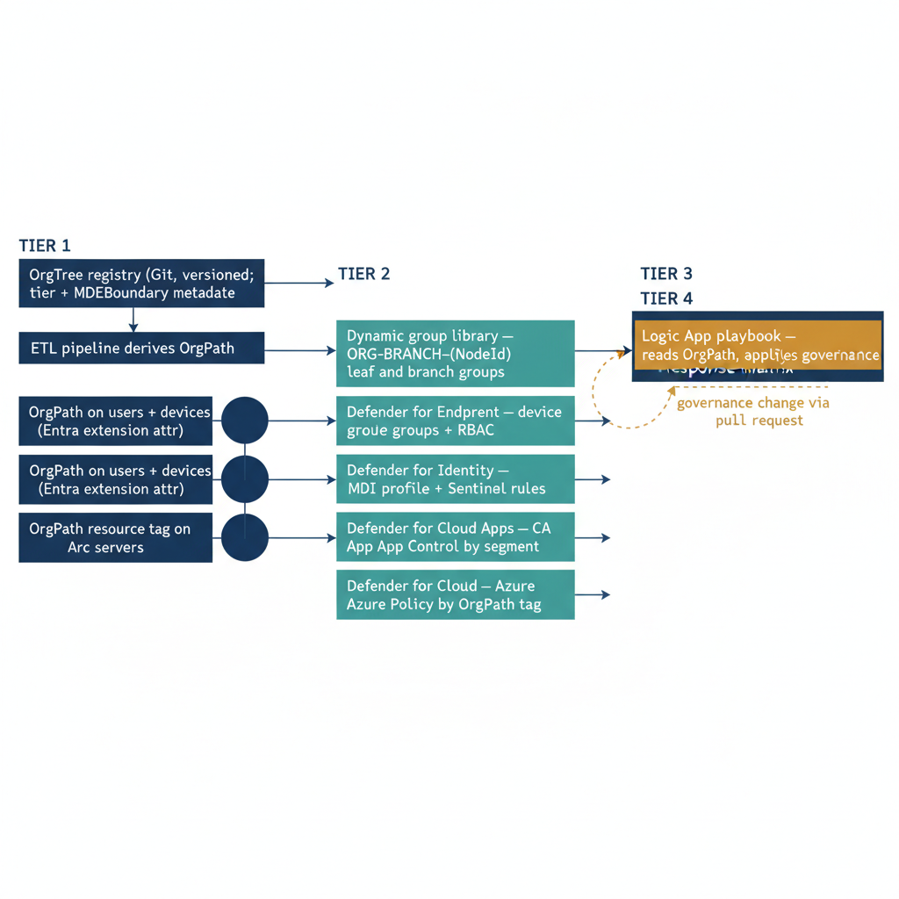

# Chapter 8 — The Complete Defender Integration Architecture

::: {.callout-note}
## In this chapter
This capstone chapter traces the full data flow end to end — from the OrgTree registry, through the ETL pipeline and dynamic group library, into each Defender layer (Endpoint, Identity, Cloud Apps, Cloud), up through the unified Sentinel workbook and the OrgPath-aware response playbook. It then names the operational property the architecture delivers: organizational structure present in the data, enforced by policy, and acted on by automation. Quick-reference appendices tabulate naming conventions and API permissions.
:::

*From OrgTree to Organizational Security Operations*

## The End-to-End Data Flow

The architecture documented across this series now spans from the organizational hierarchy definition in OrgTree through the enriched alert on an analyst's screen. Tracing this flow end-to-end makes the dependencies and the operational properties visible in a way that examining each component in isolation does not.

{#fig-book-06-cpt-08-diagram-01 fig-alt="Engineering blueprint diagram on a white background tracing the full flow left to right. Stage 1, a federal navy (#1F3A5F) box \"OrgTree registry (Git, versioned; tier + MDEBoundary metadata)\". Arrow to navy \"ETL pipeline derives OrgPath\". Arrow to a navy fan of three targets \"OrgPath on users + devices (Entra extension attr)\" and \"OrgPath resource tag on Arc servers\". Arrow to a teal (#1A9E8F) box \"Dynamic group library — ORG-BRANCH-{NodeId} leaf and branch groups\". From the group library, four teal Defender-layer boxes stack vertically as Stage 2: \"Defender for Endpoint — device groups + RBAC\", \"Defender for Identity — MDI profile + Sentinel rules\", \"Defender for Cloud Apps — CA App Control by segment\", \"Defender for Cloud — Azure Policy by OrgPath tag\". All four converge rightward into a navy Stage 3 box \"Unified Sentinel workbook — posture by OrgPath segment\". Arrow to an amber (#D4A017) Stage 4 box \"Logic App playbook — reads OrgPath, applies governance response matrix\". A dashed amber feedback arrow runs from the playbook back to the OrgTree registry labeled \"governance change via pull request\". Tier and stage labels above each cluster, monospace identifiers, no human figures, 16:9 landscape." width="85%"}

It begins with OrgTree. The organizational hierarchy is defined in the OrgTree registry: a JSON document maintained in the governance repository that specifies every organizational node, its position in the hierarchy, its governance metadata including tier classification and MDEBoundary flag, and the identifier of its parent node. Changes to this document go through pull request review, require approval from designated governance owners, and are version-controlled with full audit history. OrgTree is not a directory attribute or an Active Directory OU structure; it is an authoritative governance document that happens to be machine-readable.

The ETL pipeline, built in Part Four, reads the OrgTree registry and derives an OrgPath value for every user, device, and Arc-enrolled server in the environment. For users and devices, the OrgPath value is written to a directory extension attribute on the Entra ID object. For Arc-enrolled servers, it is applied as a resource tag by the tagging pipeline from Part Five. The pipeline runs on a schedule and on-demand when the OrgTree registry changes, ensuring that OrgPath values are current and consistent across all asset types.

The dynamic group library, created from OrgPath in Part Four, translates the per-object OrgPath value into Entra ID group membership. For each OrgTree node, two dynamic groups exist: a leaf group that matches only objects whose OrgPath exactly equals the node's path, and a branch group that matches all objects whose OrgPath starts with the node's path. These groups are the membership source for every other policy surface in the architecture: Conditional Access policies, Intune device configuration profiles, PIM role assignment scopes, Lifecycle Workflows, MDE device groups, and MDCA session control policies all reference these dynamic groups as their membership boundary.

In the Defender for Endpoint layer, MDE device groups backed by the OrgPath branch dynamic groups define the analyst visibility boundaries and the policy assignment scope. The synchronization script from Chapter Two creates these MDE device groups and links them to the appropriate Entra ID groups. MDE RBAC roles are scoped to these device groups, giving each organizational SOC team bounded visibility into their assigned segment and no visibility into others. Automated investigation remediation levels are set per device group based on the node's tier classification in OrgTree: Tier 0 nodes have full automated remediation, reflecting the pre-authorization given to the security operations team for that segment; Tier 2 nodes have no automated remediation, requiring analyst approval for every response action.

In the Defender for Identity layer, OrgPath is surfaced in MDI entity profiles through the extension attribute synchronization that brings OrgPath from Entra ID into the MDI investigation view. Sentinel analytics rules from Chapter Three evaluate MDI alerts against the OrgPath of the source identity, firing differentiated high-severity incidents for alerts involving sensitive-segment principals and surge detection incidents for concentrated MDI activity in any single organizational segment. These rules run continuously, ensuring that the organizational sensitivity classification from OrgTree is expressed directly in the Sentinel incident priority without requiring analyst judgment at intake.

In the Defender for Cloud Apps layer, Conditional Access App Control policies created by the Chapter Four script route application sessions for each OrgPath user segment through the MDCA proxy with segment-appropriate controls. The Finance segment has download monitoring and session frequency controls calibrated to Finance data sensitivity norms. The Engineering segment has a monitoring-only policy calibrated to the higher download volumes normal in technical work. The MDCA anomaly detection query from Chapter Four produces a per-segment cloud application risk summary that feeds the Sentinel workbook alongside the MDE and MDI signal streams.

In the Defender for Cloud and infrastructure layer, Azure Policy assignments use the OrgPath resource tag on Arc-enrolled servers to enforce appropriate Defender for Servers plan selection automatically. The Tier 0 policy definition from Chapter Five ensures that every Arc-enrolled server identified as Tier 0 infrastructure receives Plan 2 coverage within the next policy compliance cycle, without requiring a manual per-server enrollment action. The Resource Graph query from Chapter Five produces the infrastructure security posture snapshot organized by OrgPath segment, which the governance pipeline commits to the repository for version-controlled drift detection.

The unified Sentinel workbook from Chapter Six joins the MDE, MDI, and MDCA signal streams in the cross-product dashboard query, producing the single organizational security posture view that is the SOC's primary operational instrument. Every row in this view is an OrgPath segment. Every column is a product-specific risk metric. The analyst does not need to know which products generated which signals; the workbook has already aggregated and organized them by organizational position.

When an incident fires — whether from a Sentinel analytics rule, a Defender XDR incident, or a manual incident creation — the Logic App playbook from Chapter Seven is triggered. The playbook reads the incident entities, retrieves the OrgPath of each affected identity from the Microsoft Graph API, evaluates the OrgPath against the governance-controlled response matrix, annotates the incident with the organizational context comment, routes the incident to the correct ITSM queue and escalation contact, and executes the tier-appropriate containment actions — device isolation, PIM revocation, access review initiation — automatically where the response matrix authorizes automated action.

## The Operational Property This Architecture Delivers

The security operations center that has completed the implementation described across this document series is working in a categorically different operational environment from one that has not. The difference is not one of tooling; the Defender suite and Microsoft Sentinel are available to any tenant with the appropriate licensing. The difference is one of structure. Organizational structure is present in the data, propagated by the pipeline, enforced by the policy surface, and acted on by the automation layer. Every alert arrives annotated with the organizational context of the affected asset.

Every analyst sees only the organizational segments they are responsible for. Every containment action is calibrated to the tier and sensitivity of the affected segment. Every investigation begins with the organizational position of the affected identity or device as a known fact, not as something to be reconstructed from a chain of directory lookups.

The governance model — defined in OrgTree, encoded in OrgPath, propagated automatically by the pipeline, enforced by Azure Policy and dynamic group membership, and expressed through the analytics and playbook layers — is the foundation that makes all of this possible. The Defender suite provides the signals. OrgPath provides the structure that makes those signals actionable at organizational scale. The series is not complete because all security problems have been solved; it is complete because the substrate has been built that allows security policy to be expressed, enforced, and measured in terms of the organizational reality the security team is actually protecting.

::: {.callout-note title="📝 What Comes Next"}
Part Eight of this series covers governance health monitoring: the dashboards, alerting rules, and audit mechanisms that ensure the OrgPath substrate itself remains accurate, current, and authoritative. An organizational governance model is only as valuable as its fidelity to the actual organizational structure. Part Eight documents the continuous validation processes that detect and correct drift between OrgTree and the live environment — ensuring that the organizational context surfaced in the Defender suite accurately reflects the organization the security operations center is protecting.
:::

## Appendix A — Component and Naming Reference

| **Component** | **Naming Convention** | **Defined In** | **Drives** |
|----|----|----|----|
| OrgTree Registry Node | Freeform; structured in registry.json | OrgTree (Part Three) | All downstream components |
| OrgPath Extension Attribute | extension\_{AppId}\_OrgPath | ETL Pipeline (Part Four) | Dynamic groups, MDI profile, Graph API |
| Branch Dynamic Group | ORG-BRANCH-{NodeId} | Dynamic Group Library (Part Four) | MDE device groups, CA policies, MDCA scope |
| OrgPath Resource Tag | tags\['OrgPath'\] | Tagging Pipeline (Part Five) | Azure Policy, Resource Graph, Defender for Cloud |
| MDE Device Group | MDE-{NodeId} | Chapter Two (this document) | MDE RBAC scoping, policy assignment |
| Response Matrix | governance/security/response-matrix.json | Chapter Seven (this document) | Logic App playbook containment decisions |
| Sentinel Analytics Rules | MDI-SensitiveOrgPath-\*, MDI-OrgPath-\* | Chapter Three (this document) | Incident creation, priority classification |

## Appendix B — API and Permission Reference

| **API Surface** | **Endpoint / Resource** | **Required Permission** | **Used In** |
|----|----|----|----|
| MDE Device Groups API | api.securitycenter.microsoft.com/api/machinegroups | WindowsDefenderATP: Machine.ReadWrite.All | Chapter Two synchronization script |
| Microsoft Graph — CA Policies | graph.microsoft.com/v1.0/identity/conditionalAccess/policies | Policy.ReadWrite.ConditionalAccess | Chapter Four CA policy creation |
| Microsoft Graph — User Read | graph.microsoft.com/v1.0/users/{UPN} | User.Read.All | Chapter Seven Logic App playbook |
| Azure Resource Graph | Search-AzGraph / resourcegraph.azure.com | Reader on subscription(s) | Chapter Five posture query |
| Azure Policy — DINE Remediation | ARM deployIfNotExists managed identity | Security Admin on subscription | Chapter Five Defender for Servers policy |
| Sentinel Incident Comment | Logic App azuresentinel connector | Microsoft Sentinel Responder | Chapter Seven Logic App playbook |
