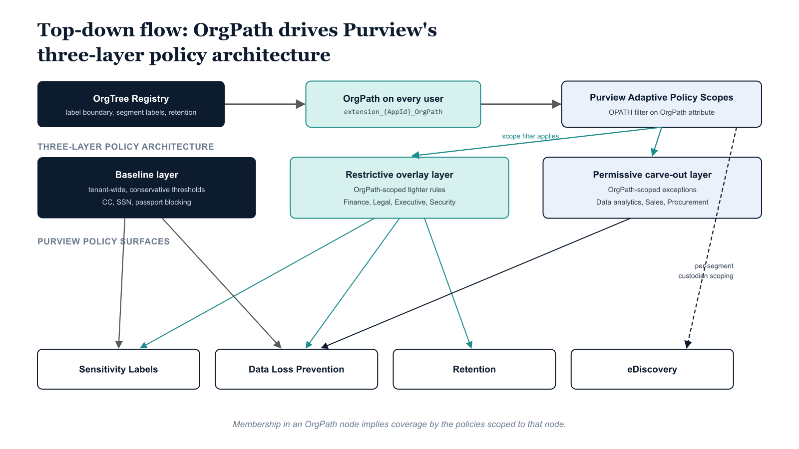
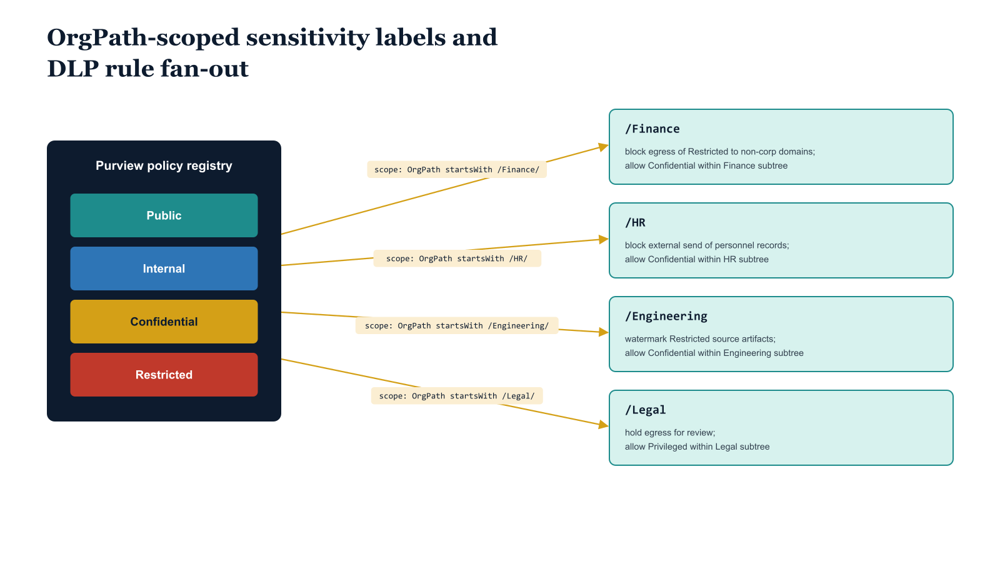

# Chapter 1 — The Data Governance Gap: Why Purview Needs Organizational Structure

::: {.callout-note}
## In this chapter
Microsoft Purview is a capable platform with a structural weakness: every policy must be scoped to something, and its native scoping mechanisms either drift or erase the differentiation governance requires. This chapter shows how Adaptive Policy Scopes read the OrgPath attribute to close that gap, restoring the same structural inheritance that GPO linkage once gave on-premises Active Directory, and previews how each Purview capability inherits that one path.
:::

## The Scoping Problem in Microsoft Purview

Microsoft Purview is a technically sophisticated platform. Its sensitivity label engine can classify and protect documents at creation time, enforce encryption based on label tier, apply visual markings, and control co-authoring permissions across Microsoft 365 services. Its Data Loss Prevention engine can inspect content in transit — email, Teams messages, SharePoint uploads, endpoint file operations — match against hundreds of built-in sensitive information types or custom classifiers, and take a graduated range of actions from policy tip notifications to outright blocking.

Its retention engine can enforce preservation and deletion schedules across Exchange mailboxes, SharePoint document libraries, OneDrive accounts, Teams channels, and Viva Engage communities. Its eDiscovery Premium capability provides case-based investigation management with custodian holds, content searches, review sets, and export. The platform is capable. The scoping problem, however, is not a capability gap — it is a structural one.

Every Purview policy must be scoped to something. That something must identify the set of users, mailboxes, sites, or endpoints to which the policy applies. Microsoft Purview provides several scoping mechanisms out of the box: static lists of specific mailboxes or sites, all-user policies that apply tenant-wide, location-based scoping that targets SharePoint sites or OneDrive accounts by URL, and, critically, Adaptive Policy Scopes — a dynamic scoping mechanism introduced to address the limitations of the first three. The limitation of static lists is well understood: organizations change continuously.

Users join, move between departments, change roles, and leave. A static list of Finance mailboxes that was accurate in January will drift through the year as Finance staff turn over, new analysts join, and managers transfer to other divisions. The maintenance burden of keeping those lists accurate falls on the compliance team, which typically lacks visibility into the real-time state of organizational structure. The all-user policy solves the maintenance problem by eliminating targeting entirely — but it does so by eliminating differentiation, which is precisely what enterprise governance requires.

A Finance division and an Engineering division should not carry the same retention schedule, the same DLP thresholds, or the same sensitivity label set. The location-based scoping mechanism is useful for SharePoint sites but does not express organizational hierarchy — it says nothing about which users are in Finance versus Engineering unless someone has manually organized SharePoint sites along divisional lines and maintained those site memberships alongside directory memberships.

The consequence is predictable. Without a reliable, maintained organizational position attribute, compliance teams default to the path of least resistance: broad policies with few differentiations, or elaborate manual group structures that require dedicated administrative effort to keep current. Both paths fail over time. The broad policy creates compliance gaps where segments with elevated requirements — Finance, Legal, Executive, HR — are not adequately protected. The manual group structure creates drift as group memberships lag behind directory changes. The governance substrate built in Parts Three and Four of this series exists precisely to eliminate that drift — and this document extends that substrate into Purview.

## Adaptive Policy Scopes as the Native Bridge

Microsoft Purview's Adaptive Policy Scopes are the native mechanism that closes the gap between the OrgPath substrate and Purview policy targeting. An Adaptive Policy Scope is a dynamic scope definition that evaluates user or group attributes at policy application time rather than at policy creation time.

Rather than enumerating specific mailboxes or users when a policy is created, an Adaptive Scope defines a filter expression — an OPATH-style attribute query against Entra ID user properties — and Microsoft Purview evaluates that expression continuously, updating the policy's covered population as directory attributes change. When the filter expression references the OrgPath extension attribute, the scope dynamically includes every user whose OrgPath matches the filter condition: every user in a given division, department, unit, or team, as expressed by the path prefix they carry in the directory.

This is the key architectural insight of this document. The Adaptive Scope filter condition extension\_{AppId}\_OrgPath -like '/Root/Finance/\*' -or extension\_{AppId}\_OrgPath -eq '/Root/Finance' targets every user whose organizational position is within the Finance division — including users in every department, unit, and team beneath Finance in the OrgTree hierarchy — without requiring any intermediate group, without any manual list maintenance, and without any polling or synchronization job beyond the standard Adaptive Scope processing cycle that Purview runs internally.

When a user moves from Finance to Operations, their OrgPath attribute is updated by the governance pipeline — the same pipeline established in Parts Three and Four — and Purview's Adaptive Scope engine automatically includes them in the Operations scope and excludes them from the Finance scope on its next evaluation cycle. The policy follows the person, because the person's position is encoded in a directory attribute that Purview can read directly.

The Adaptive Scope mechanism restores to Purview the same structural inheritance that Group Policy Object linkage provided for on-premises Active Directory policy: membership in a structural node implies coverage by the policies linked to that node. A new user provisioned into the Finance division inherits Finance's retention policy, Finance's DLP rules, and Finance's segment-specific label policy — not because anyone added them to a group, but because their OrgPath reflects their position, and the Adaptive Scopes that cover Finance reflect that position in their filter expressions.

{#fig-07-orgpath-and-purview-diagram-01 fig-alt="Top row: OrgTree Registry (LabelPolicyBoundary, SegmentLabels, retention metadata) → OrgPath on every user → Purview Adaptive Policy Scopes (OPATH filter on OrgPath extension attribute). Middle band labeled \"Three-layer policy architecture\" contains three stacked layer boxes: Baseline layer (tenant-wide, conservative thresholds — CC, SSN, passport blocking); Restrictive overlay layer (OrgPath-scoped tighter rules — Finance, Legal, Executive, Security); Permissive carve-out layer (OrgPath-scoped exceptions — Data analytics, Sales, Procurement). The Adaptive Policy Scopes box feeds into the Restrictive and Permissive layers (Baseline is tenant-wide, no scope filter). Bottom band labeled \"Purview policy surfaces\" contains four parallel boxes: Sensitivity Labels, Data Loss Prevention, Retention, eDiscovery. Arrows from each layer down to applicable surfaces: Baseline → Labels + DLP; Restrictive → Labels + DLP + Retention; Permissive → DLP. A direct arrow from Adaptive Policy Scopes into eDiscovery, indicating per-segment custodian scoping. Engineering blueprint style, federal navy (#1F3A5F) for substrate, three distinct teal/amber/slate fills for the three layers, 16:9 landscape." width="100%"}

## What This Document Establishes

This document develops the full Purview integration across four capability areas, then describes the pipeline extensions and operational model required to keep that integration current. Chapter Two addresses sensitivity labels and label policies: how the two-layer label architecture works, how Adaptive Scopes deliver segment-specific labels to organizational segments without manual group maintenance, and the complete PowerShell implementation using the Security and Compliance PowerShell module.

Chapter Three addresses Data Loss Prevention: why uniform DLP policies fail at enterprise scale, how the three-layer DLP architecture — baseline, restrictive overlay, and permissive carve-out — maps onto the OrgPath hierarchy, and the complete DLP policy and rule creation script for a representative high-sensitivity segment.

Chapter Four addresses retention: why differentiated retention schedules are the most operationally significant Purview integration for compliance-obligated organizations, how the OrgTree node metadata carries retention policy definitions, and the complete script that creates retention policies and rules for every node in the registry that carries a retention requirement.

Chapter Five addresses eDiscovery: how OrgPath transforms custodian identification from a manual enumeration process into a deterministic directory query, and the complete script that creates a Purview eDiscovery Premium case, populates the custodian list from an OrgPath scope query, and applies a legal hold to custodian content sources. Chapter Six describes the governance pipeline extensions that wire Purview into the same propagation model established for other integrations. Chapter Seven addresses the operational cadence and the compliance evidence the integrated model produces for audit purposes.

| Chapter | Purview capability | How OrgPath scopes it |
| --- | --- | --- |
| 2 | Sensitivity labels | Publishes segment labels through an Adaptive Scope on the OrgPath branch |
| 3 | Data loss prevention | Layers baseline, restrictive, and carve-out policies by OrgPath branch |
| 4 | Retention | Drives schedules from OrgTree node retention metadata |
| 5 | eDiscovery | Turns custodian identification into an OrgPath prefix query |
| 6 | Pipeline wiring | Syncs policies on node and attribute changes |
| 7 | Operations and reporting | Produces coverage evidence per OrgPath segment |

{#fig-07-orgpath-and-purview-diagram-02 fig-alt="Hub-and-spoke fan-out diagram. Center-left: a single hub labeled \"Purview policy registry\" (federal navy #1F3A5F) containing four sensitivity labels stacked vertically: Public (green), Internal (yellow), Confidential (orange), Restricted (red). Center-right: four OrgPath branch leaves arrayed vertically (teal #1A9E8F): /Finance, /HR, /Engineering, /Legal — each with a small sample policy bundle icon. Arrows from the hub to each branch leaf labeled (amber #D4A017) with the OrgPath scoping segment, e.g. \"scoped to OrgPath startsWith /Finance/\". Below each branch leaf: a small footer line showing an example tailored DLP rule pair — for /Finance: \"block egress of Restricted to non-corp domains; allow Confidential within Finance subtree\"; for /HR: \"block external send of personnel records; allow Confidential within HR subtree\"; for /Engineering: \"watermark Restricted source artifacts; allow Confidential within Engineering subtree\"; for /Legal: \"hold egress for review; allow Privileged within Legal subtree\". Engineering blueprint style, neutral slate background, no human figures, 16:9 landscape." width="100%"}
