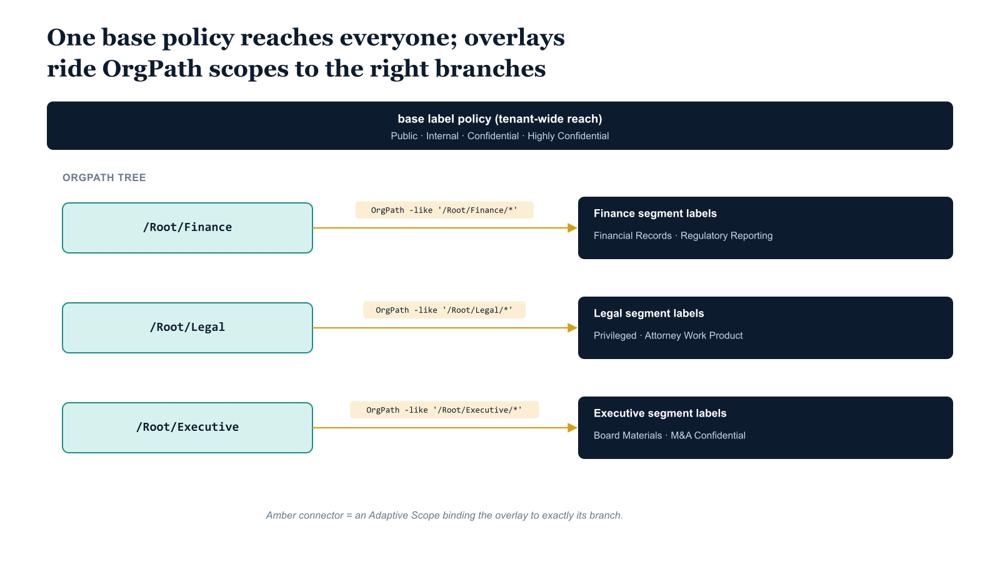

# Chapter 2 — Sensitivity Labels and Label Policies by Organizational Segment: Differentiating Protection by Organizational Position

::: {.callout-note}
## In this chapter
Publishing every label to every user breeds classification confusion and dilutes the controlled labels that matter. This chapter shows the two-layer label architecture — a tenant-wide base policy plus segment overlay policies riding OrgPath Adaptive Scopes — and how branch inheritance means a single policy at a division node covers every department beneath it without manual group maintenance.
:::

## Where OrgPath Adds Value to the Label Model

Sensitivity labels in Microsoft Purview define the classification and protection posture of content: what visual markings are applied to files and emails, whether encryption is enforced and under what access conditions, whether co-authoring is permitted, whether items can be forwarded or printed, and how the label interacts with downstream DLP and retention rules. Labels are organized in a taxonomy from least restrictive to most restrictive — typically Public, Internal, Confidential, and Highly Confidential at the base tier, with sublabels beneath each tier for specific content categories. Label policies control which labels are published to which users and establish the default label applied to new unlabeled content within each location. The label taxonomy is typically straightforward; the label policy architecture is where organizational structure becomes decisive.

Without OrgPath, most organizations publish all labels to all users. The full label set — including Finance-specific labels, Legal-specific labels, and Executive-specific labels — appears in the sensitivity label picker for every employee. This approach has two costs. First, it creates classification confusion: a junior analyst in Engineering sees labels like Privileged — Attorney Work Product and M&A Confidential and must either ignore them or, worse, apply them incorrectly. Second, it dilutes the governance value of segment-specific labels because their presence in the picker implies they are general-purpose choices rather than controlled classifications. The correct model publishes only the labels relevant to a user's organizational segment, so that the label set a user sees reflects their actual information handling responsibilities.

With OrgPath and Adaptive Scopes, label policy scoping becomes a structural property of the OrgTree rather than a configuration maintained independently. The Finance division label policy targets the Finance OrgPath branch through an Adaptive Scope filter; the Legal segment policy targets the Legal branch; the Executive segment policy targets the Executive branch. When a user is promoted from a Finance department role into an Executive leadership role, their OrgPath changes, and within the Adaptive Scope's next evaluation cycle they see the Executive segment labels and no longer see labels exclusive to Finance. No label policy configuration change is required.

{#fig-book-07-cpt-02-diagram-01 fig-alt="A federal navy band across the top labeled \"base label policy — Public, Internal, Confidential, Highly Confidential\" spans the full width to show tenant-wide reach. Below it a teal OrgPath tree shows branch nodes with monospace paths /Root/Finance, /Root/Legal, and /Root/Executive. To the right of each branch sits a navy overlay card listing its segment labels — Finance shows Financial Records and Regulatory Reporting, Legal shows Privileged and Attorney Work Product, Executive shows Board Materials and M&A Confidential. An amber Adaptive Scope connector joins each overlay card to its branch, annotated with the monospace filter OrgPath -like '/Root/Finance/*'. White background, 16:9, engineering blueprint style, monospace labels for paths and filters, no human figures." width="85%"}

## The Two-Layer Label Architecture

The OrgPath model supports a two-layer label architecture that separates organization-wide baseline labels from segment-specific labels. The first layer is the organization-wide base label policy, published to all users through a policy that is either unscoped — applying to the full tenant user population — or scoped through an Adaptive Scope that matches all active users.

This base policy publishes the general-purpose classification labels that every employee needs: Public for content intended for external audiences, Internal for standard business content not suitable for public disclosure, Confidential for content that carries business risk if disclosed outside authorized recipients, and Highly Confidential for the organization's most sensitive content requiring encryption and strict access controls. The default label is typically set to Internal for Exchange email and documents, ensuring that new content is classified immediately rather than remaining unlabeled.

This base policy requires no OrgPath intelligence — it applies uniformly, and its existence ensures that every user has at minimum the baseline classification vocabulary.

The second layer is a set of segment-specific label policies, each published through an Adaptive Scope targeting a specific OrgPath branch. These policies add labels that are relevant only to users in the targeted segment and would be confusing or misleading to users in other segments. The Finance segment policy adds Financial Records — for structured financial data subject to regulatory retention — and Regulatory Reporting — for content that will be included in external regulatory submissions.

The Legal segment policy adds Privileged — for content subject to attorney-client privilege — and Attorney Work Product — for legal analysis and case strategy documents. The Executive segment policy adds Board Materials — for content prepared for or received from the board of directors — and M&A Confidential — for merger, acquisition, or divestiture content during active transaction periods. Users in each segment see both the base labels and their segment-specific labels; the effective label set is the union of all policies that apply to the user's OrgPath position.

The governance implication of this layering is significant. The base layer is stable and changes infrequently — the general classification taxonomy evolves slowly. The segment layer is dynamic and evolves with the organization's structure, because the OrgTree node metadata — specifically the LabelPolicyBoundary flag and the SegmentLabels array — is the authoritative source for which segments need segment-specific policies and which labels those policies should publish. Governance review of the segment layer is embedded in the OrgTree change process: adding a segment-specific label to a division requires updating the OrgTree node metadata through the standard change request workflow, which provides review, approval, and audit trail before any policy change is committed.

## Adaptive Scope and Label Policy Creation Script

The following script reads the OrgTree registry, identifies all nodes flagged as label policy boundaries, and creates the corresponding Adaptive Scope and Sensitivity Label Policy for each node. It uses the Security and Compliance PowerShell module accessed through Connect-IPPSSession, which is included in the ExchangeOnlineManagement module version 3 and later. In production automation, the connection should use certificate-based authentication with a registered application rather than interactive user credentials; the AdminUPN parameter is the interactive fallback for initial testing and administrative sessions.

## PowerShell — Adaptive Scope and Sensitivity Label Policy Creation (Security & Compliance PowerShell)

```powershell
#Requires -Modules ExchangeOnlineManagement

<#
.SYNOPSIS
    Creates Purview Adaptive Policy Scopes and Sensitivity Label Policies
    for OrgPath-defined organizational segments.

.DESCRIPTION
    Reads OrgTree nodes flagged as label policy boundaries and creates:
      1. An Adaptive Policy Scope (User type) targeting the node's OrgPath
         branch using an OPATH filter expression against the extension attribute.
      2. A Sensitivity Label Policy publishing segment-specific labels
         to users matching the Adaptive Scope.

    Run after new labels have been created and approved in Purview.
    Node.SegmentLabels must list label names exactly as they appear in Purview.

    Requires: Security and Compliance PowerShell (Connect-IPPSSession)
              ExchangeOnlineManagement module v3+
              Install: Install-Module ExchangeOnlineManagement

.PARAMETER OrgTreeRegistryPath
    Local path to the OrgTree registry JSON file produced by the governance
    pipeline. This file contains all active node definitions including
    LabelPolicyBoundary and SegmentLabels metadata.

.PARAMETER AdminUPN
    UPN of an account with Compliance Administrator or higher role in Purview.
    Used for Connect-IPPSSession interactive auth.
    For unattended automation: replace with -CertificateThumbprint and -AppId.

.PARAMETER OrgPathAttrName
    Full extension attribute name for OrgPath as registered in Entra ID.
    Format: extension_{AppIdWithoutHyphens}_OrgPath
    Substitute the App Registration client ID with hyphens removed.

.EXAMPLE
    .\New-PurviewLabelPolicies.ps1 `
        -OrgTreeRegistryPath "C:\governance\orgtree\registry.json" `
        -AdminUPN "governance-admin@contoso.com" `
        -OrgPathAttrName "extension_a1b2c3d4e5f6_OrgPath"

.NOTES
    Idempotent: existing scopes and policies are detected and skipped or
    updated rather than duplicated.
    Label names must exist in Purview before this script runs.
#>
param(
    [Parameter(Mandatory)][string]$OrgTreeRegistryPath,
    [Parameter(Mandatory)][string]$AdminUPN,            # e.g. governance-admin@contoso.com
    [Parameter(Mandatory)][string]$OrgPathAttrName      # e.g. extension_{AppIdWithoutHyphens}_OrgPath
)

Set-StrictMode -Version Latest
$ErrorActionPreference = "Stop"

# ---------------------------------------------------------------------------
# CONNECT
# In production automation, use certificate-based auth:
#   Connect-IPPSSession -AppId $AppId -CertificateThumbprint $Thumbprint `
#       -Organization "contoso.onmicrosoft.com"
# ---------------------------------------------------------------------------
Write-Host "[$(Get-Date -f 'HH:mm:ss')] Connecting to Security and Compliance PowerShell..."
Connect-IPPSSession -UserPrincipalName $AdminUPN

# ---------------------------------------------------------------------------
# LOAD ORGTREE REGISTRY
# Filter to nodes that are Active and carry the LabelPolicyBoundary flag.
# ---------------------------------------------------------------------------
if (-not (Test-Path $OrgTreeRegistryPath)) {
    throw "OrgTree registry not found at: $OrgTreeRegistryPath"
}

$registry   = Get-Content $OrgTreeRegistryPath -Raw | ConvertFrom-Json
$labelNodes = $registry.nodes | Where-Object {
    $_.Status -eq "Active" -and $_.LabelPolicyBoundary -eq $true
}

Write-Host "[$(Get-Date -f 'HH:mm:ss')] Label policy boundary nodes found: $($labelNodes.Count)"

$stats = @{ Created = 0; Updated = 0; Skipped = 0; Errors = 0 }

foreach ($node in $labelNodes) {

    $scopeName  = "AdaptiveScope-LabelPolicy-$($node.Id)"
    $policyName = "LabelPolicy-OrgPath-$($node.Id)"

    Write-Host ""
    Write-Host "  Processing node: $($node.Name) [$($node.Path)]"

    try {
        # -------------------------------------------------------------------
        # STEP 1: CREATE ADAPTIVE SCOPE
        # FilterExpression uses OPATH syntax against Entra ID user attributes.
        # The -like operator with a trailing wildcard covers all descendants.
        # The -eq condition covers the node itself (users homed at this exact path).
        # Both conditions are OR'd to cover the full branch.
        # -------------------------------------------------------------------
        $filterExpression = "$OrgPathAttrName -like '$($node.Path)/*' " +
                            "-or $OrgPathAttrName -eq '$($node.Path)'"

        $existingScope = Get-AdaptiveScope -Identity $scopeName -ErrorAction SilentlyContinue

        if (-not $existingScope) {
            New-AdaptiveScope `
                -Name             $scopeName `
                -LocationType     "User" `
                -FilterExpression $filterExpression `
                -Comment          "OrgPath label scope — node $($node.Id): $($node.Name) [$($node.Path)]"

            Write-Host "    [CREATED] Adaptive scope: $scopeName"
        } else {
            # Update filter in case the node path changed since last run.
            Set-AdaptiveScope `
                -Identity         $scopeName `
                -FilterExpression $filterExpression
            Write-Host "    [UPDATED] Adaptive scope: $scopeName"
        }

        # -------------------------------------------------------------------
        # STEP 2: VALIDATE SEGMENT LABELS
        # SegmentLabels is an array of label names as they appear in Purview.
        # Labels must exist before a policy can reference them.
        # -------------------------------------------------------------------
        $segmentLabels = $node.SegmentLabels

        if (-not $segmentLabels -or $segmentLabels.Count -eq 0) {
            Write-Warning "    [SKIP] No SegmentLabels defined for node $($node.Id) — skipping policy creation."
            $stats.Skipped++
            continue
        }

        # Verify each label exists in the tenant before attempting policy creation.
        $verifiedLabels = @()
        foreach ($labelName in $segmentLabels) {
            $exists = Get-Label -Identity $labelName -ErrorAction SilentlyContinue
            if ($exists) {
                $verifiedLabels += $labelName
            } else {
                Write-Warning "    [WARN] Label not found in tenant: '$labelName' — excluded from policy."
            }
        }

        if ($verifiedLabels.Count -eq 0) {
            Write-Warning "    [SKIP] No verified labels remain for node $($node.Id). Create labels first."
            $stats.Skipped++
            continue
        }

        # -------------------------------------------------------------------
        # STEP 3: CREATE OR UPDATE LABEL POLICY
        # AddAdaptivePolicyScope associates the Adaptive Scope with the policy.
        # AdvancedSettings can be used to set default labels per location;
        # omitted here for segment overlay policies (base policy sets defaults).
        # -------------------------------------------------------------------
        $existingPolicy = Get-LabelPolicy -Identity $policyName -ErrorAction SilentlyContinue

        if (-not $existingPolicy) {
            New-LabelPolicy `
                -Name                   $policyName `
                -Labels                 $verifiedLabels `
                -AddAdaptivePolicyScope $scopeName `
                -Comment                "Segment label policy — $($node.Name), OrgPath: $($node.Path)"

            Write-Host "    [CREATED] Label policy: $policyName"
            Write-Host "              Labels: $($verifiedLabels -join ', ')"
            $stats.Created++
        } else {
            # Ensure all verified labels are present; add any that are missing.
            Set-LabelPolicy `
                -Identity $policyName `
                -AddLabel $verifiedLabels
            Write-Host "    [UPDATED] Label policy: $policyName"
            $stats.Updated++
        }

    } catch {
        Write-Warning "    [ERROR] Node $($node.Id): $_"
        $stats.Errors++
    }
}

Write-Host ""
Write-Host "=== Label Policy Synchronization Complete ==="
Write-Host "  Created : $($stats.Created)"
Write-Host "  Updated : $($stats.Updated)"
Write-Host "  Skipped : $($stats.Skipped)"
Write-Host "  Errors  : $($stats.Errors)"

Disconnect-ExchangeOnline -Confirm:$false
Write-Host "[$(Get-Date -f 'HH:mm:ss')] Disconnected from Security and Compliance PowerShell."
```

## Label Inheritance Through the OrgPath Branch

The filter expression used in each Adaptive Scope — combining an exact-match condition for the node's own path value and a wildcard condition for all path values that begin with the node's path followed by a separator — implements a branch traversal that mirrors the structural inheritance model of the OrgTree.

A label policy Adaptive Scope created for the Finance division node at path /Root/Finance automatically covers users in the Finance/Accounting department at /Root/Finance/Accounting, the Finance/Treasury unit at /Root/Finance/Treasury, and every team beneath those departments — without any enumeration of those sub-nodes in the policy scope definition. This is the structural inheritance property: the filter expression is written once, at the division level, and it remains valid regardless of how many departments, units, and teams are added beneath Finance in the future.

A new Finance/FinancialPlanning department added to the OrgTree in any future OrgTree change cycle is automatically covered by the Finance label policy Adaptive Scope from the moment users in that department receive their OrgPath values — no policy update is required.

This property restores to Microsoft Purview label policy targeting the same structural inheritance that Group Policy Object linkage provided for on-premises Active Directory policy deployment. In the on-premises model, an administrator linked a GPO to an Organizational Unit and trusted that all users in child OUs inherited the policy. In the Purview OrgPath model, the compliance team defines a label policy scope at a division node and trusts that all users in organizational positions beneath that division inherit the label policy. The trust is justified by the same mechanism: the OrgPath attribute encodes the structural membership, and the filter expression evaluates that membership at runtime.

::: {.callout-note title="Deployment Recommendation: Base Policy First"}
Deploy the organization-wide base label policy — publishing Public, Internal, Confidential, and Highly Confidential to all users — before deploying any segment-specific overlay policies. The base policy ensures that all users have a complete classification vocabulary immediately, and that new users provisioned before the segment overlay policies complete their initial processing cycle can still classify content appropriately. Segment overlay policies then layer additional labels on top of the base set without creating any classification gaps during the deployment window.
:::

## OrgTree Node Metadata Requirements for Label Policy Management

The label policy synchronization script depends on two metadata properties being present on OrgTree nodes that require segment-specific label policies. The first is the boolean flag LabelPolicyBoundary, set to true on nodes where a segment-specific label policy should be created. Not every node in the OrgTree needs to be a label policy boundary — the branch inheritance model means that a single policy at the division level covers the entire division, so only the highest-level node that requires a segment-specific policy needs the flag.

Subsidiary nodes inherit the division policy through the OrgPath filter; they do not need their own policies unless they require a different label set from their parent division. The second property is the array SegmentLabels, listing the names of labels to be published by the segment-specific policy, exactly as those label names appear in the Purview label catalog. These properties are added to node metadata through the standard OrgTree change request process, reviewed and approved by the governance team, before they are committed to the registry and trigger the pipeline.
