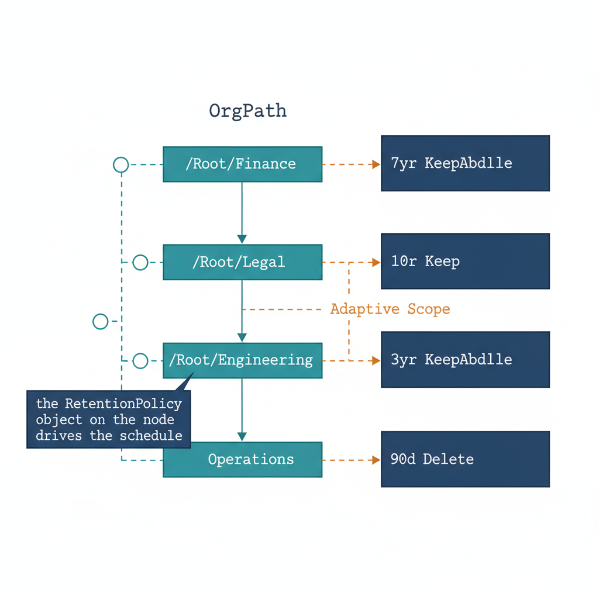

# Chapter 4 — Retention — Enforcing Differentiated Schedules Through Organizational Structure

::: {.callout-note}
## In this chapter
Retention is the most consequential Purview integration because its failure modes — destroying content under a preservation duty, or hoarding content past a deletion duty — surface years later and carry legal weight. This chapter shows how OrgTree node metadata carries each segment's schedule, how an Adaptive Scope enforces it, and why a user's records follow the policy that governed their role when the records were created.
:::

## Why Retention Is the Most Consequential Purview Integration

Sensitivity labels and DLP policies protect data at the moment of use — when content is classified, when it is shared, when it is sent. Retention policies operate on a different axis entirely: they determine whether content exists at all after a specified period, and whether it can be deleted before that period expires. The consequences of retention misconfiguration are therefore more severe and more durable than the consequences of DLP misconfiguration.

A DLP policy gap means content was shared when it should not have been — a serious incident, but one with a defined scope. A retention policy gap means either that content subject to a preservation obligation was permitted to be deleted — potentially exposing the organization to adverse inference in litigation or regulatory enforcement — or that content subject to a deletion requirement was retained indefinitely — creating unnecessary discovery surface and potential privacy compliance exposure.

Both failure modes carry legal and regulatory consequences that can take years to surface and are substantially more difficult to remediate than a DLP incident.

The organizational differentiation problem is particularly acute for retention. Different segments of the organization generate different categories of records, and those categories carry materially different retention obligations. Finance generates financial records — general ledgers, financial statements, audit workpapers, tax filings — that applicable accounting and tax regulations typically require to be retained for seven years.

Legal generates matter files, outside counsel communications, and contract records that must be retained for the life of the matter or contract plus a specified tail period, often ranging from five to ten years depending on the matter type. Human Resources generates personnel records that combine an active-employment retention period with a post-termination tail, creating a complex schedule that varies by record category. Engineering generates project documentation with a shorter operational relevance window, typically three years for closed projects.

Operations generates system logs, transaction logs, and operational records that may have retention periods as short as ninety days or as long as required by specific industry regulations. A single organization-wide retention policy cannot satisfy all of these requirements simultaneously. It either retains everything for the longest required period — seven or more years — which wastes storage, increases discovery costs, and retains data beyond its operational and compliance usefulness — or it retains for a shorter period, which creates compliance gaps for the segments with longer obligations.

{#fig-book-07-cpt-04-diagram-01 fig-alt="A teal OrgPath tree runs down the center with branch nodes carrying monospace paths NCR / Finance, NCR / Legal, NCR / Engineering, and NCR / Operations. Beside each node sits a federal navy retention card showing the schedule in monospace — Finance reads 7yr KeepAndDelete, Legal reads 10yr Keep, Engineering reads 3yr KeepAndDelete, Operations reads 90d Delete. An amber Adaptive Scope connector joins each node to its card, and a small navy callout reads \"the RetentionPolicy object on the node drives the schedule\". White background, 16:9, engineering blueprint style, monospace labels for paths and durations, no human figures." width="100%"}

## The Adaptive Scope Model for Retention

Retention policies in Microsoft Purview support Adaptive Policy Scopes using exactly the same mechanism as DLP policies and label policies. A retention policy that targets the Finance OrgPath branch through an Adaptive Scope covers the Exchange mailboxes, SharePoint sites, and OneDrive accounts of every user whose OrgPath value places them within the Finance division at the time the policy evaluates.

When a user moves from Finance to Operations — their OrgPath changes, the governance pipeline propagates the new value — they leave the Finance Adaptive Scope and enter the Operations scope automatically. The retention policy that previously applied to their mailbox changes: new content generated after the move is subject to the Operations retention schedule, while content generated before the move retains its previous classification.

This is the correct behavior: a user's records should be retained according to the policy that governed their role when those records were created, and Microsoft Purview's event-based retention capabilities can enforce this distinction for users whose OrgPath has changed during their tenure.

The practical benefit of this Adaptive Scope behavior for organizational mobility is significant. In organizations that manage retention through static group memberships, a user who moves between divisions requires explicit group membership updates in every retention policy scope before the new policy applies to their content. If those updates are delayed — as they routinely are in manual or semi-automated environments — the user is either uncovered by any policy for the interim period or continues to be covered by their previous division's policy, both of which are incorrect outcomes.

The OrgPath propagation pipeline described in Parts Three and Four of this series updates the OrgPath attribute within hours of the organizational move being committed to the OrgTree registry, and the Adaptive Scope engine picks up the change on its next evaluation cycle without any additional administrative action.

## OrgTree Node Retention Metadata Structure

The retention policy synchronization model depends on OrgTree node metadata carrying a structured retention policy definition. Each node that requires a distinct retention policy carries a RetentionPolicy object in its registry metadata with three required fields. The RetentionDurationYears field is a numeric value — an integer for year-based schedules, a decimal for shorter periods such as 0.25 for a ninety-day schedule.

The RetentionAction field is one of three enumerated values: Keep for segments where content must be preserved for the specified duration but deletion is not mandatory at the end of the period; Delete for segments where content should be deleted when the period expires without requiring preservation; or KeepAndDelete for segments where content must be preserved for the full duration and then deleted.

The Locations field is an array of Purview location type identifiers specifying which content repositories are covered by the policy for users in this segment — typically ExchangeEmail, SharePointSites, and OneDriveAccounts for most segments, with TeamsChannels and TeamsChatMessages added for segments where Teams content carries formal record status.

These metadata values are authored by the Legal and Compliance function during the OrgTree change request process and are subject to the same review and approval workflow as any other node metadata change. The governance team does not independently determine retention schedules; rather, it is the authorized implementer of schedules that Legal and Compliance have approved. The OrgTree node metadata is the implementation artifact that translates those approved schedules into operational policy configuration, and the governance repository's change history provides the audit trail connecting the implemented policy to the approval decision.

The table below illustrates representative retention metadata for a set of organizational segments:

| **OrgPath Node** | **RetentionDurationYears** | **RetentionAction** | **Locations** | **Rationale** |
|----|----|----|----|----|
| /Root/Finance | 7 | KeepAndDelete | ExchangeEmail, SharePointSites, OneDriveAccounts | Financial record retention under applicable accounting and tax regulations |
| /Root/Legal | 10 | Keep | ExchangeEmail, SharePointSites, OneDriveAccounts, TeamsChannels | Matter file retention; deletion requires separate matter-close determination |
| /Root/HumanResources | 7 | KeepAndDelete | ExchangeEmail, SharePointSites, OneDriveAccounts | Personnel record retention post-termination |
| /Root/Engineering | 3 | KeepAndDelete | SharePointSites, OneDriveAccounts, TeamsChannels | Project documentation operational relevance window |
| /Root/Operations | 0.25 | Delete | ExchangeEmail, SharePointSites | Operational log ninety-day schedule; no preservation requirement |
| /Root/Executive | 7 | Keep | ExchangeEmail, SharePointSites, OneDriveAccounts, TeamsChannels, TeamsChatMessages | Corporate governance records; deletion requires board-level determination |

## Retention Policy and Rule Creation Script

The following script reads the OrgTree registry, identifies all active nodes carrying a RetentionPolicy metadata object, and creates the corresponding Adaptive Scope, Retention Compliance Policy, and Retention Compliance Rule for each node. The script is idempotent — existing policies and rules are detected and reported rather than duplicated, and existing Adaptive Scopes have their filter expressions updated to reflect any node path changes since the last run. The script handles all five location types, constructs the location parameter hashtable dynamically from the node's Locations array, and converts the RetentionDurationYears value to days for the RetentionDuration parameter, which the cmdlet accepts in days.

## PowerShell — OrgPath-Scoped Retention Policy Creation (Security & Compliance PowerShell)

```powershell
#Requires -Modules ExchangeOnlineManagement

<#
.SYNOPSIS
    Creates Purview retention policies scoped to OrgPath branches using
    retention metadata defined in the OrgTree registry.

.DESCRIPTION
    Processes each OrgTree node that carries a RetentionPolicy metadata object
    and creates:
      1. An Adaptive Policy Scope (User type) targeting the node's OrgPath branch.
      2. A Retention Compliance Policy covering the configured workload locations.
      3. A Retention Compliance Rule enforcing the specified duration and action.

    RetentionPolicy metadata structure required on each node:
      RetentionDurationYears : number  — retention period (use 0.25 for 90 days)
      RetentionAction        : string  — "Keep" | "Delete" | "KeepAndDelete"
      Locations              : array   — one or more of:
                                         "ExchangeEmail"
                                         "SharePointSites"
                                         "OneDriveAccounts"
                                         "TeamsChannels"
                                         "TeamsChatMessages"

.PARAMETER OrgTreeRegistryPath
    Path to the OrgTree registry JSON file.

.PARAMETER AdminUPN
    Compliance Administrator UPN for interactive auth.
    Replace with certificate-based auth for production automation.

.PARAMETER OrgPathAttrName
    Full extension attribute name for OrgPath.
    Example: "extension_{AppIdWithoutHyphens}_OrgPath"

.NOTES
    Retention duration is passed to New-RetentionComplianceRule as days.
    Years are converted: $retentionDays = [int]($years * 365)
    For 0.25 years (90 days): [int](0.25 * 365) = 91 days — acceptable approximation.

    RetentionComplianceAction values map to RetentionAction:
      Keep          -> RetentionComplianceAction "Keep"
      Delete        -> RetentionComplianceAction "Delete"
      KeepAndDelete -> RetentionComplianceAction "KeepAndDelete"

    Script is idempotent; safe to re-run after OrgTree registry updates.
#>
param(
    [Parameter(Mandatory)][string]$OrgTreeRegistryPath,
    [Parameter(Mandatory)][string]$AdminUPN,
    [Parameter(Mandatory)][string]$OrgPathAttrName
)

Set-StrictMode -Version Latest
$ErrorActionPreference = "Stop"

Write-Host "[$(Get-Date -f 'HH:mm:ss')] Connecting to Security and Compliance PowerShell..."
Connect-IPPSSession -UserPrincipalName $AdminUPN

if (-not (Test-Path $OrgTreeRegistryPath)) {
    throw "OrgTree registry not found at path: $OrgTreeRegistryPath"
}

$registry       = Get-Content $OrgTreeRegistryPath -Raw | ConvertFrom-Json
$retentionNodes = $registry.nodes | Where-Object {
    $_.Status -eq "Active" -and $null -ne $_.RetentionPolicy
}

Write-Host "[$(Get-Date -f 'HH:mm:ss')] Retention policy nodes: $($retentionNodes.Count)"

$stats = @{ Created = 0; Updated = 0; Skipped = 0; Errors = 0 }

foreach ($node in $retentionNodes) {

    $rp         = $node.RetentionPolicy
    $scopeName  = "AdaptiveScope-Retention-$($node.Id)"
    $policyName = "RetentionPolicy-OrgPath-$($node.Id)"
    $ruleName   = "RetentionRule-OrgPath-$($node.Id)"

    Write-Host ""
    Write-Host "  Processing: $($node.Name) [$($node.Path)]"
    Write-Host "    Duration: $($rp.RetentionDurationYears) years | Action: $($rp.RetentionAction)"

    try {
        # -------------------------------------------------------------------
        # STEP 1: ADAPTIVE SCOPE
        # -------------------------------------------------------------------
        $filter = "$OrgPathAttrName -like '$($node.Path)/*' " +
                  "-or $OrgPathAttrName -eq '$($node.Path)'"

        $existingScope = Get-AdaptiveScope -Identity $scopeName -ErrorAction SilentlyContinue
        if (-not $existingScope) {
            New-AdaptiveScope `
                -Name             $scopeName `
                -LocationType     "User" `
                -FilterExpression $filter `
                -Comment          "Retention scope — $($node.Name) [$($node.Path)]"
            Write-Host "    [SCOPE CREATED] $scopeName"
        } else {
            Set-AdaptiveScope -Identity $scopeName -FilterExpression $filter
            Write-Host "    [SCOPE UPDATED] $scopeName"
        }

        # -------------------------------------------------------------------
        # STEP 2: BUILD LOCATION PARAMETER HASHTABLE
        # Map each Locations array entry to the corresponding cmdlet parameter.
        # "All" means: cover all items in the location for users in the scope.
        # -------------------------------------------------------------------
        $locationParams = @{}
        foreach ($loc in $rp.Locations) {
            switch ($loc) {
                "ExchangeEmail"      { $locationParams["ExchangeLocation"]        = "All" }
                "SharePointSites"    { $locationParams["SharePointLocation"]      = "All" }
                "OneDriveAccounts"   { $locationParams["OneDriveLocation"]        = "All" }
                "TeamsChannels"      { $locationParams["TeamsChannelLocation"]    = "All" }
                "TeamsChatMessages"  { $locationParams["TeamsChatLocation"]       = "All" }
                default {
                    Write-Warning "    [WARN] Unrecognized location type '$loc' — skipped."
                }
            }
        }

        if ($locationParams.Count -eq 0) {
            Write-Warning "    [SKIP] No valid locations resolved for node $($node.Id)."
            $stats.Skipped++
            continue
        }

        # -------------------------------------------------------------------
        # STEP 3: RETENTION COMPLIANCE POLICY
        # AddAdaptivePolicyScope links the Adaptive Scope to the policy.
        # -------------------------------------------------------------------
        $existingPolicy = Get-RetentionCompliancePolicy -Identity $policyName -ErrorAction SilentlyContinue

        if (-not $existingPolicy) {
            New-RetentionCompliancePolicy `
                -Name                   $policyName `
                -Comment                "OrgPath retention — $($node.Name), $($rp.RetentionDurationYears)yr, $($rp.RetentionAction)" `
                -AddAdaptivePolicyScope $scopeName `
                @locationParams | Out-Null

            Write-Host "    [POLICY CREATED] $policyName"
            $stats.Created++
        } else {
            Write-Host "    [POLICY EXISTS]  $policyName — rule check follows."
            $stats.Updated++
        }

        # -------------------------------------------------------------------
        # STEP 4: RETENTION COMPLIANCE RULE
        # RetentionDuration is in days. Convert from years.
        # RetentionDurationDisplayHint sets the UI display unit (Years/Days).
        # ExpirationDateOption "CreationAgeInDays" starts the clock at creation.
        # Alternatives: "ModificationAgeInDays", "LabelApplicationAgeInDays",
        #               "EventAgeInDays" (event-based retention).
        # -------------------------------------------------------------------
        $existingRule = Get-RetentionComplianceRule -Identity $ruleName -ErrorAction SilentlyContinue

        if (-not $existingRule) {
            $retentionDays = [int]($rp.RetentionDurationYears * 365)

            $ruleParams = @{
                Name                        = $ruleName
                Policy                      = $policyName
                RetentionDuration           = $retentionDays
                RetentionDurationDisplayHint = "Years"
                ExpirationDateOption        = "CreationAgeInDays"
            }

            # Map RetentionAction to cmdlet parameter value
            switch ($rp.RetentionAction) {
                "Keep" {
                    $ruleParams["RetentionComplianceAction"] = "Keep"
                }
                "Delete" {
                    $ruleParams["RetentionComplianceAction"] = "Delete"
                }
                "KeepAndDelete" {
                    $ruleParams["RetentionComplianceAction"] = "KeepAndDelete"
                    # Content is preserved for RetentionDuration then deleted.
                    # No additional parameters required for KeepAndDelete.
                }
            }

            New-RetentionComplianceRule @ruleParams | Out-Null
            Write-Host "    [RULE CREATED]   $ruleName ($retentionDays days, $($rp.RetentionAction))"
        } else {
            Write-Host "    [RULE EXISTS]    $ruleName — no changes applied."
        }

    } catch {
        Write-Warning "    [ERROR] Node $($node.Id): $_"
        $stats.Errors++
    }
}

Write-Host ""
Write-Host "=== Retention Policy Synchronization Complete ==="
Write-Host "  Policies Created : $($stats.Created)"
Write-Host "  Policies Updated : $($stats.Updated)"
Write-Host "  Nodes Skipped    : $($stats.Skipped)"
Write-Host "  Errors           : $($stats.Errors)"

Disconnect-ExchangeOnline -Confirm:$false
Write-Host "[$(Get-Date -f 'HH:mm:ss')] Disconnected."
```

## Retention Label Deployment Within the OrgPath Model

The retention policies created by the script above are auto-apply retention policies: they apply the retention schedule automatically to all content in the covered locations without requiring users to manually apply a label. This is appropriate for most organizational segment retention requirements, where the obligation is uniform across all content generated by users in the segment. Retention labels — user-applied or auto-applied labels that classify individual items rather than entire mailboxes or sites — serve a complementary purpose within the OrgPath model.

They are used for content categories that require a different retention schedule from the segment default: a specific contract type within the Legal segment that requires a longer retention period than the segment baseline, or a specific report type within Finance that triggers an event-based retention clock rather than a creation-date clock.

The governance model treats retention policies as the segment-level default and retention labels as the item-level override, and the OrgPath attribute does not govern label application — it governs only the default policy that applies to unlabeled content in the user's content repositories.
