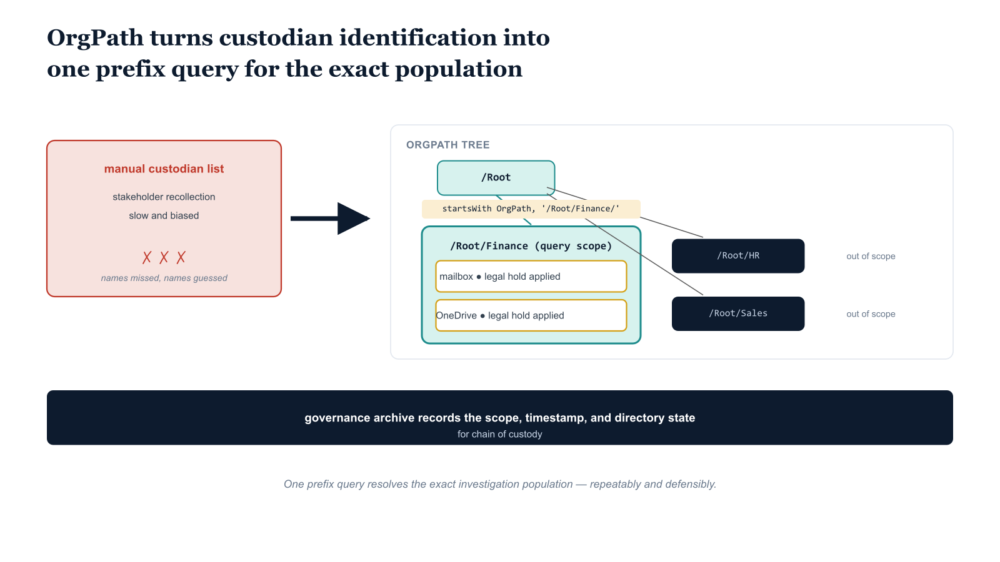

# Chapter 5 — eDiscovery — Using Organizational Position to Scope Investigations

::: {.callout-note}
## In this chapter
Custodian identification decides the quality of an investigation, yet without a structured position attribute it depends on slow, biased stakeholder recollection. This chapter shows how OrgPath makes the population queryable — resolving a custodian list with one prefix query — and how the governance archive of past OrgPath state supplies the chain-of-custody evidence a hold methodology needs.
:::

## The Custodian Identification Problem

Microsoft Purview eDiscovery Premium manages investigation cases through a custodian model. A custodian is a person who is likely to have possession of, or control over, information relevant to an investigation or litigation matter. In the Purview model, custodians are added to a case, their content sources — Exchange mailboxes, OneDrive accounts, and additional data sources the case team specifies — are placed on legal hold, and the case team uses content searches to identify, collect, and review data from those sources.

The quality of an investigation depends substantially on the accuracy of the custodian list. An over-inclusive custodian list — one that adds every user in the organization to a case — imposes unnecessary hold burdens on users with no relevant information and creates an unmanageable review workload. An under-inclusive list — one that misses users who hold relevant content — creates the risk that relevant evidence is destroyed through routine operations or end-user deletion before it is collected.

In organizations without a structured organizational position attribute, custodian identification is predominantly a manual process. The investigation team asks business stakeholders which users were involved in the matter. Those stakeholders name individuals they are aware of. The team adds those individuals as custodians. The process is subject to stakeholder bias — stakeholders may not recall all relevant personnel, may have an interest in not identifying certain individuals, or may simply lack awareness of all users who held relevant information. It is also slow: identifying custodians for a large investigation can take days or weeks as the team iterates through interviews and organizational chart reviews.

OrgPath changes this by making the organizational population queryable. When every user carries an OrgPath attribute encoding their position in the organizational hierarchy, the eDiscovery team can identify all users in a relevant organizational segment by issuing a single directory query against the OrgPath attribute. A financial controls investigation whose scope is the Finance division and its subsidiaries — Accounting, Treasury, Financial Planning, Tax — returns every user in those departments through a single prefix-match query. The result is a deterministic, reproducible, auditable custodian list derived from the organizational structure at the time the query was run, rather than a list assembled through stakeholder recollection.

{#fig-book-07-cpt-05-diagram-01 fig-alt="On the left, a red cluster labeled \"manual custodian list — stakeholder recollection, slow and biased\" marks the problem state. A wide navy arrow points right to a teal OrgPath tree whose NCR / Finance subtree is highlighted as the query scope, annotated with the monospace filter startsWith(extensionAttribute15, \"Region=NCR|Department=Finance|\"). Amber markers sit on each resolved custodian mailbox and OneDrive to show legal hold applied, while sibling branches stay plain navy and out of scope. A navy band along the bottom reads \"governance archive records the scope, timestamp, and directory state for chain of custody\". White background, 16:9, engineering blueprint style, monospace labels for paths and filters, red reserved for the problem cluster, no human figures." width="100%"}

## The Governance Archive of OrgPath State

An important eDiscovery implication of the OrgPath model is that it creates a historical record of organizational position at any point in time. The governance pipeline, as established in Parts Three and Four, commits every OrgPath change to the governance repository with a timestamp, the prior value, the new value, and the change request that authorized the move.

When an investigation spans a historical period — as most investigations do — the eDiscovery team can query the governance repository to determine who held a given OrgPath value at a specific date in the past, rather than relying solely on the current directory state.

This historical OrgPath record is the eDiscovery-relevant complement to the operational governance function: it provides the organizational provenance evidence that the case team needs to defend the custodian selection methodology, demonstrating that the custodian list reflects the actual organizational population at the time of the relevant events, not the current population at the time the case was opened.

## eDiscovery Case Creation, Custodian Population, and Hold Application Script

The following script combines a Microsoft Graph API query for users by OrgPath scope with Security and Compliance PowerShell cmdlets to create a complete eDiscovery Premium case, add the identified users as custodians, and apply a case hold policy to custodian mailboxes. The script is parameterized so that the investigation scope can be expressed as any OrgPath prefix — a single team, a department, a division, or a cross-divisional scope expressed through multiple script invocations with results merged. It connects to both Microsoft Graph (for the Entra ID user query) and Security and Compliance PowerShell (for case and hold management), completing each connection, performing its operations, and disconnecting before establishing the next, which is the recommended pattern for scripts that span both connection contexts.

PowerShell — eDiscovery Premium Case Creation with OrgPath Custodian Identification (Graph + Security & Compliance PowerShell)

```powershell
#Requires -Modules ExchangeOnlineManagement, Microsoft.Graph.Users

<#
.SYNOPSIS
    Creates a Purview eDiscovery Premium case with custodians identified
    by OrgPath scope, and applies a legal hold to custodian content sources.

.DESCRIPTION
    Given an OrgPath scope (a path prefix), this script:
      1. Queries Entra ID (via Microsoft Graph) for all users whose OrgPath
         is within the scope — at or below the specified node.
      2. Creates a Purview eDiscovery Premium (AdvancedEdiscovery) case.
      3. Adds each identified user as a case member (custodian).
      4. Creates a CaseHoldPolicy targeting custodian Exchange mailboxes.
      5. Creates a CaseHoldRule applying a broad content match query
         (narrow with -ContentMatchQuery for date-scoped holds).

    The script logs all custodians added and errors encountered.
    Re-running against an existing case skips creation steps and proceeds
    to add any new custodians identified by the current OrgPath query.

.PARAMETER CaseName
    Unique name for the eDiscovery case.
    Recommended format: "{Topic}-{Year}-{Sequence}", e.g. "FIN-Controls-2026-001"

.PARAMETER CaseDescription
    Description of the investigation for the case record.

.PARAMETER OrgPathScope
    OrgPath prefix defining the investigation population.
    All users whose OrgPath equals or begins with this value are added as custodians.
    Example: "/Root/Finance" covers all Finance division users.
    Example: "/Root/Finance/Accounting" covers only the Accounting department.

.PARAMETER HoldName
    Name for the CaseHoldPolicy applied to custodian sources.
    Must be unique within the tenant. Default: "Hold-{CaseName}"

.PARAMETER OrgPathAttrName
    Full extension attribute name for OrgPath.
    Example: "extension_{AppIdWithoutHyphens}_OrgPath"

.PARAMETER AdminUPN
    Compliance Administrator UPN for Security and Compliance PowerShell.
    The same account (or a separate Graph-authorized account) must have
    User.Read.All scope for the Graph API call.

.PARAMETER ContentMatchQuery
    KQL query string for the hold rule. Default: matches all content.
    Narrow with date filters for scoped holds:
    Example: "received>=2025-01-01 AND received<=2026-01-01"

.NOTES
    Prerequisites:
      - ExchangeOnlineManagement module v3+ (provides Connect-IPPSSession)
      - Microsoft.Graph.Users module (provides Get-MgUser)
      - eDiscovery Manager or eDiscovery Administrator role in Purview
      - User.Read.All app permission or delegated scope for Graph
      - E5 or eDiscovery Add-On license assigned to the running account
        and to each user designated as a custodian.

    The Add-ComplianceCaseMember cmdlet adds users to the case.
    Custodian designation and data source mapping (mailbox + OneDrive)
    are completed through the Purview eDiscovery portal UI or via
    the Purview eDiscovery Graph API endpoints (beta), which provide
    richer custodian management than the compliance cmdlets.
    This script uses cmdlets for broad compatibility.
#>
param(
    [Parameter(Mandatory)][string]$CaseName,
    [Parameter(Mandatory)][string]$CaseDescription,
    [Parameter(Mandatory)][string]$OrgPathScope,        # e.g. "/Root/Finance"
    [Parameter(Mandatory)][string]$OrgPathAttrName,     # e.g. "extension_{AppIdWithoutHyphens}_OrgPath"
    [Parameter(Mandatory)][string]$AdminUPN,            # e.g. "ediscovery-admin@contoso.com"
    [string]$HoldName              = "Hold-$CaseName",
    [string]$ContentMatchQuery     = "received:>01/01/1900"  # Default: all content; narrow as needed
)

Set-StrictMode -Version Latest
$ErrorActionPreference = "Stop"

$timestamp = Get-Date -f 'yyyy-MM-dd HH:mm:ss'
Write-Host "[$timestamp] eDiscovery case setup starting."
Write-Host "  Case      : $CaseName"
Write-Host "  Scope     : $OrgPathScope"

# ===========================================================================
# PHASE 1: CUSTODIAN IDENTIFICATION VIA MICROSOFT GRAPH
# ===========================================================================
Write-Host ""
Write-Host "[GRAPH] Connecting to Microsoft Graph (User.Read.All)..."
Connect-MgGraph -Scopes "User.Read.All" -NoWelcome

Write-Host "[GRAPH] Querying users with OrgPath in scope: $OrgPathScope"

# ---------------------------------------------------------------------------
# Server-side Graph filter for extension attributes.
# Note: Graph API $filter on extension attributes requires the attribute
# to be indexed in the Entra ID tenant. If the query returns a 400 error
# (filter not supported), use the client-side fallback below.
#
# The filter string uses OData $filter syntax (not OPATH).
# "startsWith" is the Graph equivalent of the OPATH "-like '*'" pattern.
# ---------------------------------------------------------------------------
$graphFilter = "($OrgPathAttrName eq '$OrgPathScope') or " +
               "(startsWith($OrgPathAttrName,'$OrgPathScope/'))"

$userProperties = @(
    "id",
    "displayName",
    "userPrincipalName",
    "mail",
    "accountEnabled",
    $OrgPathAttrName
)

$custodianUsers = $null

try {
    $custodianUsers = Get-MgUser `
        -Filter  $graphFilter `
        -Property ($userProperties -join ",") `
        -All `
        -ConsistencyLevel "eventual" `
        -CountVariable totalCount

    Write-Host "[GRAPH] Server-side filter returned $($custodianUsers.Count) users."
} catch {
    # ---------------------------------------------------------------------------
    # FALLBACK: Client-side filter when server-side extension attr filter fails.
    # Retrieves all users with the OrgPath attribute and filters locally.
    # Performance: acceptable for tenants up to ~50,000 users.
    # For larger tenants, index the extension attribute in Entra ID.
    # ---------------------------------------------------------------------------
    Write-Warning "[GRAPH] Server-side filter failed: $_"
    Write-Warning "[GRAPH] Falling back to client-side filter (may be slower for large tenants)."

    $allUsers = Get-MgUser `
        -Property ($userProperties -join ",") `
        -All

    $custodianUsers = $allUsers | Where-Object {
        $_.AccountEnabled -eq $true -and (
            $orgPathVal = $_.AdditionalProperties[$OrgPathAttrName]
            $orgPathVal -eq $OrgPathScope -or $orgPathVal -like "$OrgPathScope/*"
        )
    }

    Write-Host "[GRAPH] Client-side filter result: $($custodianUsers.Count) users."
}

# Filter to only enabled users with a valid mail address (required for holds)
$validCustodians = $custodianUsers | Where-Object {
    $_.AccountEnabled -eq $true -and -not [string]::IsNullOrWhiteSpace($_.Mail)
}

$custodianEmails = $validCustodians | Select-Object -ExpandProperty Mail

Write-Host "[GRAPH] Valid custodians (enabled, mail present): $($custodianEmails.Count)"

if ($custodianEmails.Count -eq 0) {
    Write-Warning "No valid custodians found for OrgPath scope '$OrgPathScope'. Verify the scope path and that users have OrgPath values assigned."
    Disconnect-MgGraph
    return
}

# Log custodian list to governance output
Write-Host "[GRAPH] Custodian list:"
foreach ($email in $custodianEmails) {
    $u = $validCustodians | Where-Object { $_.Mail -eq $email }
    Write-Host "  - $($u.DisplayName) <$email>"
}

Disconnect-MgGraph
Write-Host "[GRAPH] Disconnected from Microsoft Graph."

# ===========================================================================
# PHASE 2: EDISCOVERY CASE CREATION (Security and Compliance PowerShell)
# ===========================================================================
Write-Host ""
Write-Host "[IPPS] Connecting to Security and Compliance PowerShell..."
Connect-IPPSSession -UserPrincipalName $AdminUPN

# ---------------------------------------------------------------------------
# CREATE CASE
# CaseType "AdvancedEdiscovery" = eDiscovery Premium (E5 / add-on required).
# ---------------------------------------------------------------------------
$existingCase = Get-ComplianceCase -Identity $CaseName -ErrorAction SilentlyContinue

if (-not $existingCase) {
    New-ComplianceCase `
        -Name        $CaseName `
        -Description $CaseDescription `
        -CaseType    "AdvancedEdiscovery"

    Write-Host "[IPPS] eDiscovery case created: $CaseName"
} else {
    Write-Host "[IPPS] Case already exists: $CaseName — proceeding to custodian and hold steps."
}

# ---------------------------------------------------------------------------
# ADD CUSTODIANS
# Add-ComplianceCaseMember adds each user as a case member.
# Full custodian configuration (data source mapping, acknowledgment workflow)
# is completed in the Purview portal. This step establishes case membership.
# ---------------------------------------------------------------------------
Write-Host ""
Write-Host "[IPPS] Adding custodians to case: $CaseName"

$addedCount  = 0
$skippedCount = 0
$errorCount  = 0

foreach ($email in $custodianEmails) {
    try {
        Add-ComplianceCaseMember -Case $CaseName -Member $email
        Write-Host "  [ADDED]   $email"
        $addedCount++
    } catch {
        $msg = $_.Exception.Message
        if ($msg -like "*already exists*" -or $msg -like "*already a member*") {
            Write-Host "  [EXISTS]  $email"
            $skippedCount++
        } else {
            Write-Warning "  [ERROR]   $email`: $msg"
            $errorCount++
        }
    }
}

Write-Host "  Added: $addedCount | Already present: $skippedCount | Errors: $errorCount"

# ---------------------------------------------------------------------------
# CREATE HOLD POLICY
# CaseHoldPolicy preserves custodian content in place.
# ExchangeLocation: list of custodian email addresses.
# SharePointLocation: OneDrive and SharePoint site URLs (see notes below).
# Enabled $true: hold is active immediately upon creation.
#
# OneDrive URL format: https://{tenant}-my.sharepoint.com/personal/{UPN_normalized}
# where UPN normalization replaces '@' with '_' and '.' with '_'
# Example: user@contoso.com -> contoso-my.sharepoint.com/personal/user_contoso_com
#
# The SharePointLocation parameter below is left empty; see the companion
# function New-OneDriveHoldUrls (below) to generate and add OneDrive URLs.
# ---------------------------------------------------------------------------
Write-Host ""
Write-Host "[IPPS] Creating hold policy: $HoldName"

$existingHold = Get-CaseHoldPolicy -Case $CaseName -Identity $HoldName -ErrorAction SilentlyContinue

if (-not $existingHold) {
    New-CaseHoldPolicy `
        -Name             $HoldName `
        -Case             $CaseName `
        -ExchangeLocation $custodianEmails `
        -Enabled          $true

    Write-Host "[IPPS] Hold policy created: $HoldName"
    Write-Host "       Exchange mailboxes on hold: $($custodianEmails.Count)"

    # Hold Rule: defines what content is held (KQL query)
    New-CaseHoldRule `
        -Name                $("Rule-" + $HoldName) `
        -Policy              $HoldName `
        -ContentMatchQuery   $ContentMatchQuery

    Write-Host "[IPPS] Hold rule created. Query: $ContentMatchQuery"
} else {
    Write-Host "[IPPS] Hold policy already exists: $HoldName — no changes applied."
}

Write-Host ""
Write-Host "=== eDiscovery Case Setup Complete ==="
Write-Host "  Case          : $CaseName"
Write-Host "  OrgPath Scope : $OrgPathScope"
Write-Host "  Custodians    : $($custodianEmails.Count)"
Write-Host "  Hold Policy   : $HoldName"
Write-Host ""
Write-Host "Next steps:"
Write-Host "  1. Open the Purview eDiscovery portal and navigate to case: $CaseName"
Write-Host "  2. Complete custodian data source mapping (mailbox + OneDrive) per custodian."
Write-Host "  3. Add SharePoint site URLs for relevant collaboration workspaces."
Write-Host "  4. Obtain custodian acknowledgment of legal hold notification."
Write-Host "  5. Run content searches to identify and collect responsive content."

Disconnect-ExchangeOnline -Confirm:$false
Write-Host "[$(Get-Date -f 'HH:mm:ss')] Disconnected from Security and Compliance PowerShell."
```

## SharePoint and OneDrive Hold Scope

The script above applies holds to Exchange mailboxes using the custodian email list, which translates directly to mailbox identifiers in the Microsoft 365 compliance platform. For SharePoint and OneDrive, the hold mechanism requires site collection URLs rather than user identifiers. OneDrive for Business URLs follow a deterministic pattern: the tenant's SharePoint root URL with the suffix -my.sharepoint.com, followed by /personal/ and the user's UPN with the at-symbol and all periods replaced by underscores. For a user with UPN jane.smith@contoso.com in a tenant whose SharePoint root is contoso.sharepoint.com, the OneDrive URL is https://contoso-my.sharepoint.com/personal/jane_smith_contoso_com. The governance pipeline can construct this URL list from the custodian UPN list by applying this transformation pattern, and the result can be passed to the New-CaseHoldPolicy cmdlet's -SharePointLocation parameter alongside the OneDrive URL list.

SharePoint collaboration site holds — covering project workspaces, team sites, and departmental document libraries associated with the investigation scope — require a separate enumeration step. The SharePoint sites most relevant to an investigation are those associated with the OrgPath segment in scope, either through naming conventions the organization uses for its SharePoint site taxonomy or through site membership data that maps sites to organizational segments. Where OrgPath-aligned SharePoint site collection naming conventions have been established — a recommended practice that the governance architecture supports — the governance repository contains the mapping between OrgPath nodes and their associated SharePoint site collection URLs, and the hold application script can query that mapping to add the relevant sites to the hold policy.

::: {.callout-note title="Legal Hold Chain of Custody"}
The OrgPath-based custodian identification method is a starting point for custodian scoping, not the final custodian list. Legal counsel must review and approve the custodian list before the hold policy is applied in any matter where the hold may be subject to challenge. The governance repository's record of the OrgPath query — including the OrgPath scope, the timestamp of the query, the directory state at that timestamp, and the resulting custodian list — provides the chain of custody documentation for the hold methodology. Preserve this record as a case artifact. The script output log should be committed to the case management system as the formal custodian identification artifact.
:::
