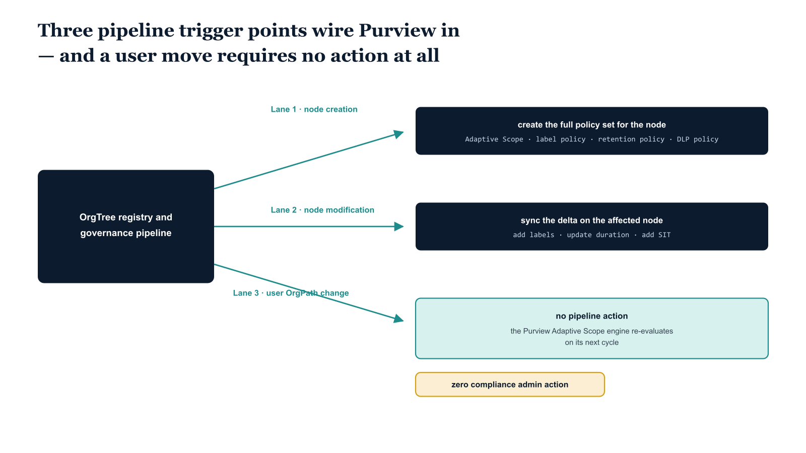

# Chapter 6 — Wiring Purview into the Propagation Pipeline

::: {.callout-note}
## In this chapter
Purview joins the event-driven propagation pipeline at three trigger points — node creation, node modification, and user OrgPath change — and the third requires no pipeline action at all, because the Adaptive Scope engine re-evaluates coverage natively. This chapter walks the trigger handlers, the two new drift-detection categories, and a KQL view of DLP activity organized by OrgPath segment.
:::

## The Three Purview Pipeline Trigger Points

The governance propagation pipeline established in Parts Three and Four is an event-driven system: it responds to changes in the OrgTree registry and to changes in user OrgPath attributes, dispatching the appropriate configuration operations across all integrated services. Parts Five through Eight added trigger handlers for PIM eligibility assignments, Lifecycle Workflow deployments, Sentinel workspace RBAC, Intune policy assignments, Defender configuration profiles, DNS zone delegation, and PKI certificate authority mappings. Part Nine adds Purview-specific trigger handlers across three event categories, each with a distinct operational character.

{#fig-book-07-cpt-06-diagram-01 fig-alt="A federal navy box on the left reads \"OrgTree registry and governance pipeline\". Three teal lanes run to the right. Lane one, node creation, leads to a navy box \"create Adaptive Scope, label policy, retention policy, DLP policy\". Lane two, node modification, leads to a navy box \"sync the delta on the affected node — add labels, update duration, add SIT\". Lane three, user OrgPath change, leads to a teal box \"no pipeline action; Purview Adaptive Scope engine re-evaluates on its next cycle\", tagged with an amber marker reading \"zero compliance admin action\". White background, 16:9, engineering blueprint style, monospace labels for policy and cmdlet names, no human figures." width="85%"}

The first trigger category is OrgTree node creation. When a new node is added to the OrgTree registry and committed — a new division is established, a new major department is created, a joint-venture organizational unit is added — the pipeline evaluates the new node's metadata for Purview policy boundary flags. If the node carries LabelPolicyBoundary: true, the pipeline invokes the Adaptive Scope and label policy creation function. If the node carries a RetentionPolicy object, the pipeline invokes the retention policy creation function.

If the node's DLP configuration metadata — a DlpPolicy object analogous in structure to the RetentionPolicy object, specifying the SIT coverage, action thresholds, and workload locations — is present, the pipeline invokes the DLP policy creation function. All three Purview policy creation scripts are designed to be invoked at this trigger point: they check for existing policies before creating new ones and are therefore safe to call idempotently at any time.

The second trigger category is OrgTree node modification. When an existing node's metadata is updated — the retention duration changes, a new segment label is added to the SegmentLabels array, the DLP policy mode is advanced from simulation to enforcement, or the node's LabelPolicyBoundary flag is set for the first time — the pipeline runs the policy synchronization scripts for the affected node.

The synchronization scripts detect the existing policies, compare the current configuration against the node metadata, and apply the delta: adding newly specified labels to an existing label policy, updating the RetentionDuration on an existing retention rule, adding a new SIT to an existing DLP rule. Every metadata change that triggers a pipeline run produces a pipeline execution record in the governance repository, creating the audit trail that connects the policy configuration change to the OrgTree change request that authorized it.

The third trigger category is user OrgPath attribute change — and crucially, this is the one Purview trigger that requires no pipeline action. When a user's OrgPath attribute is updated by the governance pipeline as part of a mover workflow, Microsoft Purview's Adaptive Scope engine automatically re-evaluates the user's policy coverage on its next processing cycle. The user leaves the Adaptive Scopes associated with their previous OrgPath value and enters the Adaptive Scopes associated with their new OrgPath value without any explicit policy reassignment. This is the most important operational advantage of the Adaptive Scope mechanism: individual user moves require zero compliance administrative action. The pipeline action ends at the directory attribute update; Purview handles the rest.

## Drift Detection Extensions for Purview

The daily drift detection run — the scheduled pipeline job that compares the current state of all integrated services against the OrgTree registry and reports gaps — gains two new detection categories with the Purview integration. The first is policy coverage gaps: organizational segments whose OrgPath position places them under a node with a RetentionPolicy or LabelPolicyBoundary flag, but for which the corresponding Adaptive Scope's filter expression does not currently cover any users in the directory.

This condition can arise when a node's path was changed in the OrgTree — a restructuring that renamed a division — but the Adaptive Scope filter expression was not updated to reflect the new path. The drift detection job queries each Adaptive Scope using the Security and Compliance PowerShell Get-AdaptiveScope cmdlet, retrieves its filter expression, and validates that the expression matches the current node path in the registry.

The second drift category is user coverage gaps: active users whose OrgPath value places them within a segment that has a defined retention or label policy, but who are not appearing in the expected Adaptive Scope's covered population because their OrgPath attribute value does not match any Adaptive Scope filter expression in the tenant. This typically occurs when a user's OrgPath value is malformed — missing the leading slash, truncated mid-path, or using a path value that does not appear in the OrgTree registry — and the Adaptive Scope's filter expression does not match the malformed value. The drift detection job reports these users as unpositioned, and the remediation is to correct the OrgPath attribute value through the governance pipeline's attribute repair function established in Part Three.

## KQL Query: DLP Policy Matches by Organizational Position

The following KQL query provides the governance team with a structural view of DLP activity organized by the OrgPath of the triggering user. It combines the OfficeActivity table — which carries DLP match events from Exchange, SharePoint, OneDrive, and Teams — with a derived table of current user OrgPath values drawn from Entra ID audit logs. The result is a per-segment DLP match summary showing total match volume, blocking action counts, the most frequently matched sensitive information type, and the workloads involved.

This view is more operationally useful than the raw DLP activity log because it surfaces the organizational pattern of DLP activity: if the Finance segment generates a disproportionate share of blocking actions, that may indicate a legitimate workflow collision requiring a carve-out policy, or it may indicate that Finance users are systematically attempting to share financial data in ways the DLP rules correctly block. The distinction requires human review, but the OrgPath-organized view makes the pattern visible.

## KQL — Purview DLP Policy Matches by OrgPath Segment (Log Analytics / Microsoft Sentinel)

```kql
// ============================================================
// Purview DLP Policy Matches Organized by OrgPath Segment
// ============================================================
// Purpose : Surface DLP alert volume, blocked actions, and top SIT
//           matches per OrgPath segment over the trailing 24 hours.
// Sources : OfficeActivity (DLP events)
//           AuditLogs (Entra ID — OrgPath attribute change events
//                      used to derive current user OrgPath values)
// Notes   : OrgPath values are derived from the most recent
//           "Update user" audit event carrying the OrgPath attribute.
//           Users with no recent OrgPath audit event appear as UNPOSITIONED.
//           Increase the AuditLogs lookback (currently 7d) if users have
//           not had their OrgPath updated recently.
// ============================================================

// Step 1: Derive current OrgPath for each user from Entra ID audit logs
let OrgPathAttrName = "extension_{AppIdWithoutHyphens}_OrgPath";  // Substitute App ID

let UserOrgPaths = AuditLogs
| where TimeGenerated >= ago(7d)
| where OperationName == "Update user"
| mv-expand Props = AdditionalDetails
| where tostring(Props.displayName) contains "OrgPath"
| extend
    UPN     = tostring(TargetResources[0].userPrincipalName),
    OrgPath = tostring(Props.newValue)
| where isnotempty(UPN) and isnotempty(OrgPath)
| summarize arg_max(TimeGenerated, OrgPath) by UPN
| project UPN, OrgPath;

// Step 2: Join DLP events with OrgPath and summarize by segment
OfficeActivity
| where TimeGenerated >= ago(24h)
| where Operation in ("DLPRuleMatch", "DLPPolicyMatch")
| extend
    UserUPN     = tolower(UserId),
    PolicyName  = tostring(parse_json(PolicyDetails)[0].PolicyName),
    RuleName    = tostring(parse_json(PolicyDetails)[0].Rules[0].RuleName),
    SITMatched  = tostring(
                    parse_json(PolicyDetails)[0].Rules[0]
                    .ConditionsMatched.SensitiveInformation[0].SensitiveType),
    ActionTaken = tostring(
                    parse_json(PolicyDetails)[0].Rules[0].Actions[0].Name),
    Workload    = Workload,
    MatchCount  = 1
| join kind=leftouter (
    UserOrgPaths
    | extend UPN = tolower(UPN)
) on $left.UserUPN == $right.UPN
| extend OrgPathLabel = iif(isempty(OrgPath), "UNPOSITIONED", OrgPath)
// Simplify OrgPath to division level for summary grouping
// Split on "/" and take the 3rd segment (index 2): "/Root/Finance" -> "Finance"
| extend DivisionLabel = iif(
    OrgPathLabel == "UNPOSITIONED",
    "UNPOSITIONED",
    tostring(split(OrgPathLabel, "/")[2])
  )
| summarize
    TotalMatches    = count(),
    BlockedActions  = countif(ActionTaken has "Block"),
    NotifyActions   = countif(ActionTaken has "Notify"),
    TopSIT          = any(SITMatched),
    TopPolicy       = any(PolicyName),
    Workloads       = make_set(Workload),
    AffectedUsers   = dcount(UserUPN)
    by DivisionLabel, OrgPathLabel, bin(TimeGenerated, 1h)
| order by TotalMatches desc
| project
    TimeWindow      = TimeGenerated,
    Division        = DivisionLabel,
    OrgPath         = OrgPathLabel,
    TotalMatches,
    BlockedActions,
    NotifyActions,
    AffectedUsers,
    TopPolicy,
    TopSIT,
    Workloads
```

## Graph API Integration for Adaptive Scope Validation

The drift detection job validates Adaptive Scope configurations by querying the Security and Compliance PowerShell endpoint for all Adaptive Scopes in the tenant, extracting their filter expressions, and comparing each expression against the OrgTree registry. The validation logic parses the filter expression string to extract the OrgPath value it targets and checks whether that value matches a current, active node in the OrgTree registry.

Scopes whose filter expressions reference OrgPath values that no longer appear in the registry — because a node was renamed, moved, or decommissioned — are flagged as orphaned and reported to the governance team for remediation. The remediation is either to update the scope's filter expression to match the node's new path or, if the node was decommissioned, to deactivate the associated policies and scopes through the decommission workflow established in Part Three.
