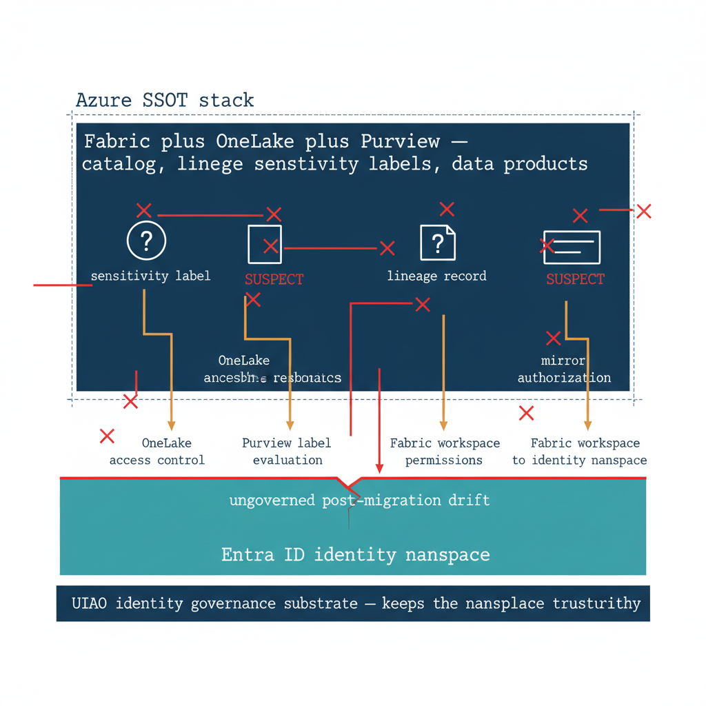

# Chapter 1 — The Asymmetry Part Seven Leaves Open

::: {.callout-note}
## In this chapter
Part Seven governed the user plane — Adaptive Policy Scopes that follow people through every move. This book opens the half it leaves untouched: the data plane, where Fabric Domains and OneLake security govern data assets through a different mechanism that does not consume an Adaptive Scope. We establish OrgPath as the join key across both planes and position UIAO as the identity substrate the Azure SSOT stack assumes but does not provide.
:::

## What the Purview Chapter Governs and What It Does Not

Part Seven of this series, *OrgPath and Microsoft Purview*, established the
mechanism by which OrgPath becomes the dynamic targeting attribute for every
user-facing policy plane Microsoft Purview manages. Adaptive Policy Scopes
evaluate an OPATH filter expression against the OrgPath extension attribute,
and the policies attached to those scopes — sensitivity labels, data loss
prevention, retention, eDiscovery — follow the user through every
organizational change without a single line of group membership maintenance.
The chapter described the model in continuous detail across four capability
areas and four scripts, and it closed with the operational cadence by which
the substrate keeps Purview's user-facing policies aligned to the
organization's structural state.

The model in Part Seven is complete and correct for what it governs. But it
governs only one half of the data governance problem. Purview's Adaptive
Scopes scope user-facing policy decisions: who can label, who can share, who
can be subject to retention, who can be a custodian in an eDiscovery case.
The other half of data governance is data-facing rather than user-facing:
where does the data live, what domain owns it, which workspace can read it,
which lakehouse mirrors it, which sensitivity context is inherited by
default when an item is created in that domain. That half is governed by a
different Microsoft scoping mechanism — Fabric Domains and OneLake security
— that does not consume OrgPath through an Adaptive Scope, because Adaptive
Scopes are a user-attribute filter and Fabric Domains are a data-asset
hierarchy. The two are not the same plane, and they are not the same
inheritance model.

This chapter develops the second half. It establishes OrgPath as the join
key across two parallel policy planes — the user plane, governed by Adaptive
Scopes as Part Seven described, and the data plane, governed by Fabric
Domain assignment and OneLake security — and it works through the discovery,
enrichment, registration, and ongoing governance steps that bind a hybrid
SQL Server estate into a coherent governed substrate beneath the Microsoft
Fabric, OneLake, and Purview stack. The chapter also makes explicit the
identity-substrate role that the UIAO canon plays beneath that stack: the
trust assertions Purview makes about data assets are only as reliable as the
identity namespace those assertions rest on, and the identity namespace is
exactly what UIAO governs.

{#fig-book-07a-cpt-01-diagram-01 fig-alt="A federal navy upper block labeled \"Fabric plus OneLake plus Purview — catalog, lineage, sensitivity labels, data products\" sits on a teal foundation block labeled \"Entra ID identity namespace\". Amber dependency arrows run downward showing OneLake access control, Purview label evaluation, Fabric workspace permissions, and mirror authorization all resolving to the identity namespace. A red fracture line runs through the foundation labeled \"ungoverned post-migration drift\", with red markers propagating up into the stack where a sensitivity label and a lineage record turn suspect. Beneath the foundation a navy band reads \"UIAO identity governance substrate — keeps the namespace trustworthy\". White background, 16:9, engineering blueprint style, monospace labels for the surface names, red reserved for the drift fracture, no human figures." width="85%"}

## The Architectural Boundary That Microsoft Will Not Cross

Microsoft's answer to federal data sprawl is now well-defined. The Fabric +
OneLake + Purview stack provides a unified, next-generation SSOT platform
for data assets. OneLake provides a single logical data lake per tenant,
with zero-copy shortcuts and near-real-time mirroring that eliminate
duplicate SQL Server instances without rip-and-replace. Microsoft Purview
provides the governance and metadata control plane: catalog, lineage,
sensitivity labels, data products, and authoritative-record designations.
Fabric SQL and Azure SQL provide the operational and transactional layer,
with geographic replication and Arc-managed coordination for on-premises
estates. This stack is architecturally sound, directly aligned with the
Federal Data Strategy, the Evidence Act, the Data Center Optimization
Initiative, and CDO mandates, and any agency moving to Azure Government
should plan around it.

The stack has a foundational dependency that it does not govern itself: the
identity namespace. Every capability in the Fabric + OneLake + Purview stack
depends on a trusted, consistent, and continuously verified Entra ID
identity plane. OneLake access control resolves to Entra ID security groups
and service principals. Purview sensitivity labels evaluate Entra ID user
and group classification bindings. Fabric workspace permissions are Entra
ID role assignments. Shortcut and mirror authorizations consume Entra ID
managed identity credentials. The lineage record that attributes a change
to a principal is meaningful only if that principal is itself meaningful in
the current state of the identity directory.

If the Entra ID tenant is in a post-migration state with ungoverned drift
between the COR baseline and the live directory, every trust assertion in
the Purview governance layer becomes suspect. A sensitivity label applied
to a data product by a principal whose authorization state has drifted is
not a compliant control. An audit lineage record attributing a change to a
principal that no longer exists in its migrated form is not a reliable
evidence artifact. This is not a flaw in Azure's design — it is an
architectural boundary. Purview governs data assets. The substrate beneath
it governs the identity namespace Purview's governance depends on. The
correct architecture is not UIAO instead of Fabric + OneLake + Purview. It
is UIAO beneath it — as the identity governance substrate that makes the
Azure data SSOT trustworthy.
