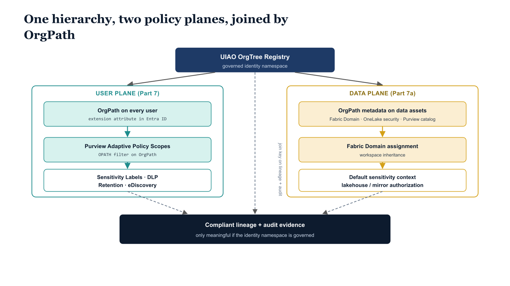
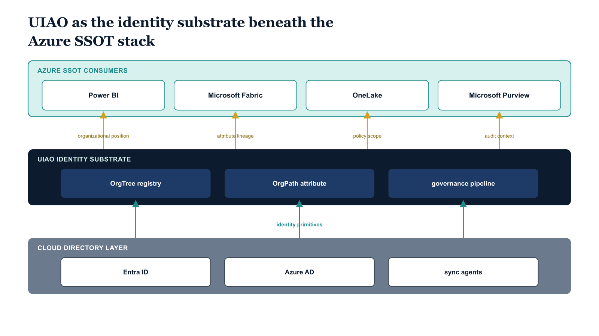

# Chapter 2 — OrgPath as the Join Key Across Two Policy Planes

::: {.callout-note}
## In this chapter
This chapter refuses the shortcut of treating Purview Adaptive Scopes and Fabric Domain assignment as one inheritance chain — they are distinct mechanisms targeting different objects. OrgPath is the join key that lets both planes share a hierarchy across three surfaces: the Entra ID user attribute, the Purview data-map custom metadata, and the Fabric Domain name, each kept aligned by an independent reconciliation job reading the same OrgTree registry.
:::

{#fig-07a-uiao-beneath-the-azure-ssot-stack-diagram-01 fig-alt="Single root box at top: UIAO OrgTree Registry (governed identity namespace). Two parallel columns below: Left column \"User Plane (Part 7)\" stacks three boxes top-to-bottom — OrgPath on every user → Purview Adaptive Policy Scopes (OPATH filter on OrgPath) → Sensitivity Labels, DLP, Retention, eDiscovery. Right column \"Data Plane (Part 7a)\" stacks three boxes — OrgPath metadata on data assets (Fabric Domain, OneLake security, Purview catalog) → Fabric Domain assignment (workspace inheritance) → Default sensitivity context, lakehouse/mirror authorization. The root Registry fans down to the top of each lane. A separate \"Compliant lineage + audit evidence (only meaningful if identity namespace is governed)\" box at the bottom receives dashed arrows from the registry (labeled \"join key on lineage + audit\") and from each lane's bottom box. Engineering blueprint style, neutral slate, federal navy (#1F3A5F) for registry, teal (#1A9E8F) for user plane, amber (#D4A017) for data plane, 16:9 landscape." width="85%"}

## The User Plane and the Data Plane Are Not the Same Plane

The single most important conceptual move in this chapter is to refuse the
shortcut of treating Purview Adaptive Scopes and Fabric Domain assignment
as a single inheritance chain. They are two distinct scoping mechanisms,
they have different evaluation models, and they target different objects.
Conflating them produces architectures that work in demonstration and break
under audit.

Purview Adaptive Policy Scopes are user-attribute filters. The OPATH
expression `extension_{AppId}_OrgPath -like '/Root/Finance/*'` evaluates
against user objects in Entra ID and produces a dynamic set of users whose
OrgPath places them under the Finance branch. The policies attached to that
scope — a Finance label policy, a Finance DLP policy, a Finance retention
policy, a Finance eDiscovery custodian query — apply to the users in that
set, wherever those users go in Microsoft 365. The scope is a user-plane
construct. It says nothing about which data assets are Finance data.

Fabric Domains are a data-asset hierarchy. A workspace is assigned to a
domain through the Fabric admin portal or the Fabric Admin REST API, and
every item in that workspace — lakehouses, warehouses, semantic models,
mirrored databases, reports — inherits the domain assignment as metadata.
The domain hierarchy can mirror the OrgPath hierarchy, and items in a
Finance domain workspace can be expected to carry Finance default
sensitivity context, but the inheritance is from the domain, not from any
user's OrgPath. The mechanism that decides which workspace belongs to which
domain is a separate provisioning step from the mechanism that decides which
OrgPath a user carries.

OrgPath is the join key that lets both planes share a hierarchy. The same
string path that the OrgTree pipeline writes to a user's extension attribute
also names the Fabric Domain that workspaces are assigned to, and also
populates the custom metadata field that a Purview data-map collection or
data product carries to identify its owning organizational segment. When
all three planes reference the same hierarchy through OrgPath as a string
key, the substrate is coherent. When any one of them maintains its own
hierarchy independently, the substrate drifts, and the drift is the
condition `DRIFT-PROVENANCE` is designed to surface.

## Three Surfaces, One Hierarchy

The substrate this chapter describes binds three Microsoft surfaces through
OrgPath. The Entra ID user plane carries OrgPath as the extension attribute
the OrgTree pipeline maintains, exactly as Part Seven described, and exactly
as the existing pipelines for Intune, Defender, Application Identity, and
the other planes covered in the preceding chapters of this series already
manage. The Purview data map carries OrgPath as a custom metadata field on
data assets, applied either by Purview scan post-processing or by an
explicit tagging operation tied to the asset's owning workspace. The Fabric
Domain hierarchy carries OrgPath as the domain name itself, with each
Fabric workspace assigned to the domain whose path matches the workspace's
owning organizational segment.

The three surfaces are not synchronized through a single inheritance
mechanism. They are kept aligned by the OrgTree pipeline producing the
canonical hierarchy and three independent reconciliation jobs reading the
same OrgTree registry to drive their respective surfaces. The user
extension attribute is maintained by the pipeline established in Part Four.
The Purview data-map custom metadata is maintained by a reconciliation job
that reads the OrgTree registry and the Purview data map and emits
tagging operations against the data map's REST API. The Fabric Domain
hierarchy is maintained by a reconciliation job that reads the OrgTree
registry and the Fabric Admin API and emits domain creation, update, and
workspace assignment operations. Each job is idempotent in the same
pattern Part Seven established for Adaptive Scopes and label policies, and
each job emits the same drift findings into the substrate's Evidence
Bundle when reality diverges from the canonical state.

{#fig-07a-uiao-beneath-the-azure-ssot-stack-diagram-02 fig-alt="Three-tier vertical sandwich diagram. Top tier — a single wide rectangle (teal #1A9E8F) labeled \"Azure SSOT consumers\" containing four sub-boxes arranged horizontally: Power BI, Microsoft Fabric, OneLake, Microsoft Purview. Middle tier — a single wide rectangle (federal navy #1F3A5F) labeled \"UIAO identity substrate\" containing three sub-boxes arranged horizontally: OrgTree registry (left), OrgPath attribute (center), governance pipeline (right). Bottom tier — a single wide rectangle (slate-blue) labeled \"Cloud directory layer\" containing three sub-boxes: Entra ID, Azure AD, sync agents. Vertical arrows from the UIAO middle tier UP to each of the four SSOT consumers, each labeled (amber #D4A017) with what flows: \"organizational position\" to Power BI, \"attribute lineage\" to Microsoft Fabric, \"policy scope\" to OneLake, \"audit context\" to Microsoft Purview. Arrows from the bottom Cloud directory tier UP into the UIAO middle tier are labeled \"identity primitives\". Engineering blueprint style, neutral slate background, no human figures, 16:9 landscape." width="85%"}
