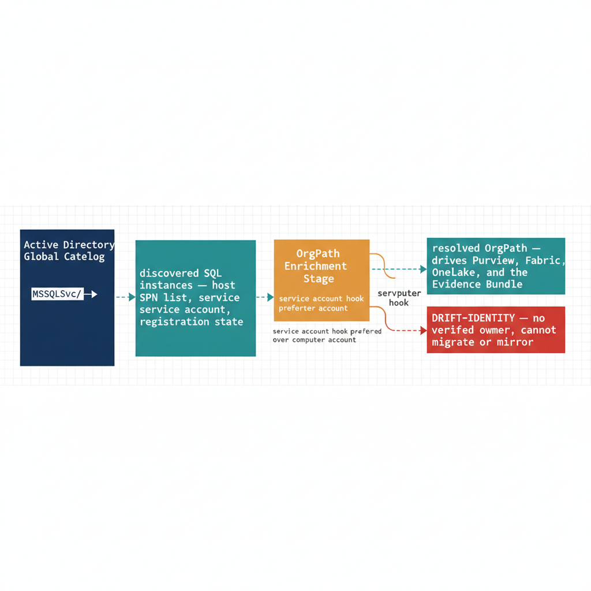

# Chapter 3 — Discovering the SQL Estate and Enriching It With OrgPath

::: {.callout-note}
## In this chapter
The data-plane story starts on-premises, with an honest enumeration of the SQL estate the agency actually runs — discovered through the Service Principal Names SQL Server registers in Active Directory. Each instance is then enriched with an OrgPath through its hosting computer account or, preferred, its service account; instances that resolve to neither are flagged so they cannot be silently migrated without an owner.
:::

## Where the On-Premises Half Begins

The substrate for SQL governance begins with discovery of the operational
estate the agency is actually running, not with an idealized inventory of
what the agency wishes it were running. In most federal environments, that
estate is decades of organic growth: regional SQL Server instances
installed for projects whose owners have rotated out, instances that were
never decommissioned after the workload moved, instances whose service
accounts are no longer attributable to a current owner, and instances whose
SPN registrations bind them to Active Directory in ways nobody documented
and nobody currently understands. The on-premises half of the SSOT story
begins by enumerating that estate honestly, before any data product can be
mirrored into OneLake or any domain can be assigned in Fabric.

Active Directory itself is the most reliable source of this enumeration.
SQL Server instances register Service Principal Names under the `MSSQLSvc/*`
prefix in the directory partition, and a single LDAP query against the
forest's Global Catalog returns every instance that is currently registered
to provide Kerberos authentication to clients. The UIAO Active Directory
survey adapter at
[`src/uiao/adapters/modernization/active_directory/survey.py`](../../../src/uiao/adapters/modernization/active_directory/survey.py)
performs this enumeration as part of its broader service-account scan, and
the canonical contract for the scan is recorded in
[`Spec3-D1.1`](../../../src/uiao/canon/specs/Spec3-D1.1-Get-ServiceAccountScan.md)
(`UIAO_139`). The output is structured: every SQL instance is recorded with
its hosting computer account, its SPN list, the service account that holds
the SPN write permission, and the registration state that indicates whether
the SPN was set automatically by the service installer or manually through
`setspn`. The eleven AD object types enumerated in the directory-migration
canon's
[`ad-dependency-inventory.md`](../../../src/uiao/modernization/directory-migration/ad-dependency-inventory.md)
include SPNs explicitly, because the SPN registration is the single
identity-layer artifact that breaks Kerberos authentication silently when
it is not re-registered against the migrated service account.

The discovery output is the raw material. It does not yet carry the
hierarchical attribution that connects each SQL instance to the
organizational segment whose work the instance supports. That attribution
is the enrichment step.

{#fig-book-07a-cpt-03-diagram-01 fig-alt="A federal navy box on the left labeled \"Active Directory Global Catalog\" emits a monospace query MSSQLSvc slash star into a teal box \"discovered SQL instances — host account, SPN list, service account, registration state\". An amber enrichment stage resolves each instance against two hooks, annotated \"service account hook preferred over computer account\". Two outcomes branch to the right: a teal node \"resolved OrgPath — drives Purview, Fabric, OneLake, and the Evidence Bundle\" and a red node \"DRIFT-IDENTITY — no verified owner, cannot migrate or mirror\". White background, 16:9, engineering blueprint style, monospace labels for the query and flags, red reserved for the drift outcome, no human figures." width="100%"}

## Enriching Discovery With OrgPath

Every SQL instance discovered by the AD survey adapter has at least two
hooks into the identity namespace. The first is the hosting computer
account, which carries its own OrgPath if the OrgTree pipeline has been
applied to the device plane (as Chapter 12 of this series describes for
infrastructure services). The second is the service account principal that
holds the SPN write permission, which carries OrgPath if the OrgTree
pipeline has been applied to the application identity plane (as Chapter 8
describes). Either hook is sufficient to resolve the SQL instance to an
OrgPath value, and the join logic prefers the service account hook when
both are present, because the service account is the persistent identity
that survives a server replacement while the hosting computer account is
not.

When neither hook resolves cleanly, the instance is flagged as
`DRIFT-IDENTITY` by the drift taxonomy formalized in
[`16_DriftDetectionStandard`](../../docs/16_DriftDetectionStandard.qmd) —
the instance exists in the directory but cannot be attributed to a verified
organizational position, and that condition is the explicit signal the CDO
office needs that the instance has no current owner and cannot be safely
migrated or mirrored without owner reassignment first. The drift finding is
not an error in the substrate; it is the substrate doing its job.

The enriched discovery output — every SQL instance with its resolved
OrgPath, or its `DRIFT-IDENTITY` flag — is the artifact that drives the
remaining steps. It feeds Purview data-map registration, Fabric Domain
assignment, OneLake mirroring decisions, and the Evidence Bundle output the
agency's authorizing official consumes during the FedRAMP cycle.
