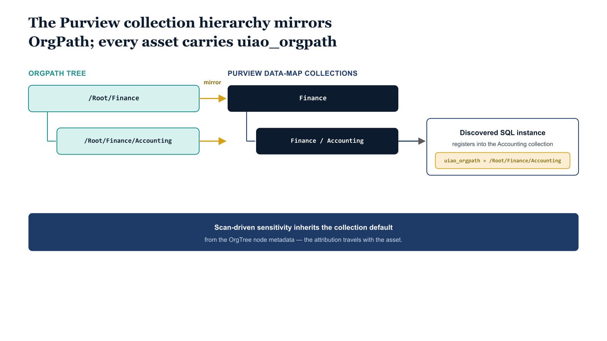

# Chapter 4 — Purview Registration With OrgPath as the Collection Key

::: {.callout-note}
## In this chapter
This chapter mirrors the Purview data-map collection hierarchy directly to OrgPath, registers each discovered SQL instance into its matching collection, and stamps every asset with a uiao_orgpath custom metadata tag. Scan-driven sensitivity classification then inherits each collection's default context from the same OrgTree node metadata the Part Seven label policies consumed for users.
:::

## The Data-Map Collection Hierarchy

The Purview data map is the federated catalog beneath which every governed
data asset in the agency's estate is described. Collections in the data
map are the organizational containers for those assets, and the collection
hierarchy can be defined by the data-governance team independently of any
other Microsoft surface. The convention this chapter recommends is to
mirror the collection hierarchy directly to the OrgPath hierarchy: a
`/Root/Finance/Accounting` OrgPath segment corresponds to a Purview
collection of the same name, and every SQL instance whose enriched
discovery output places it under that OrgPath is registered into the
matching collection.

The mirroring is enforced by a reconciliation job that reads the OrgTree
registry and emits collection creation and update operations against the
Purview data-map REST API. The job runs on the same cadence as the
existing OrgTree pipelines this series has described, and the job is
idempotent in the same pattern: existing collections are detected and
preserved, missing collections are created, and collections whose canonical
name has changed are updated. Collections are not deleted automatically
when an OrgTree node is retired; instead the retirement is recorded in the
provenance chain, and an explicit retention decision is required from the
data-governance steward before the collection is removed from the data map.
This preserves the auditability of historical assets registered under the
retired collection.

When a SQL instance is registered into the data map, the enriched
discovery output also tags the asset with a custom metadata field —
`uiao_orgpath`, by convention — whose value is the canonical OrgPath string
the discovery resolved. The custom metadata is what enables downstream
Purview Adaptive Scopes and policy logic to identify the segment the asset
belongs to without re-deriving the attribution from the collection
hierarchy at every evaluation. The custom metadata is also what lets the
Evidence Bundle output for the FedRAMP cycle prove that the asset's
attribution is currently aligned with the identity-layer canon.

{#fig-book-07a-cpt-04-diagram-01 fig-alt="On the left a teal OrgPath tree shows monospace nodes /Root/Finance and /Root/Finance/Accounting. An amber mirror connector runs to a federal navy Purview collection tree with matching collection names. A discovered SQL instance card registers into the Accounting collection and is stamped with a monospace metadata chip uiao_orgpath equals /Root/Finance/Accounting. A navy note beneath reads \"scan-driven sensitivity inherits the collection default from OrgTree node metadata\". White background, 16:9, engineering blueprint style, monospace labels for paths and the metadata tag, no human figures." width="85%"}

## Scan Configuration and Sensitivity Inheritance

The Purview scan that pulls schema and content metadata from the registered
SQL instance is configured against the same OrgPath-derived collection.
Scan results — table inventories, column-level sensitivity classifications,
lineage relationships to upstream and downstream assets — populate the
collection automatically and are visible to the data-governance team as the
collection's contents grow over time. Sensitivity labels applied through
scan-driven classification inherit the collection's default sensitivity
context, which is configured to match the segment's organizational risk
profile in the same OrgTree node metadata that the Part Seven label
policies consumed for users.

The result is a data-map state where every SQL instance, every database
within an instance, every schema, and every table is attributable to an
OrgPath segment, sensitivity-classified according to that segment's risk
profile, and visible to the steward responsible for that segment's data
governance. The state is maintained by the same OrgTree pipeline that
maintains every other Microsoft surface in this series, and it drifts only
when reality drifts from canon — which is the condition the substrate
exists to surface.
