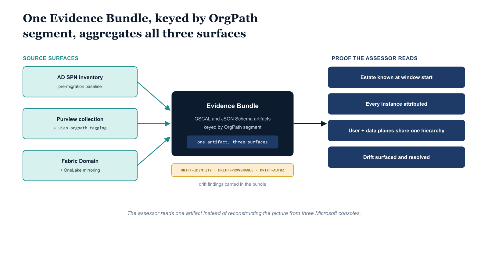

# Chapter 6 — The Evidence Bundle the Auditor Sees

::: {.callout-note}
## In this chapter
The substrate's compliance payoff is a single Evidence Bundle, structured around the OrgPath join key, that an authorizing official can hand a 3PAO without reverse-engineering three Microsoft consoles. It aggregates the SPN inventory, OrgPath attribution, Purview registration, Fabric Domain assignment, and OneLake mirroring per segment, accumulates continuously rather than at assessment time, and proves four things to the assessor.
:::

## A Single Coherent Artifact Across Three Surfaces

The substrate's compliance value is not the existence of the three
reconciliation jobs in isolation. It is the existence of a single coherent
artifact — the Evidence Bundle — that the agency's authorizing official can
hand to a 3PAO and that the assessor can interpret without reverse-engineering
three separate Microsoft consoles to reconstruct the picture. The Evidence
Bundle for the data plane is structured around the same OrgPath join key
that the rest of the substrate uses.

{#fig-book-07a-cpt-06-diagram-01 fig-alt="Three teal source lanes on the left — AD SPN inventory, Purview collection plus uiao_orgpath tagging, and Fabric Domain plus OneLake mirroring — each feed a central federal navy box \"Evidence Bundle — OSCAL and JSON Schema artifacts, keyed by OrgPath segment\". An amber column lists the drift findings carried in the bundle: DRIFT-IDENTITY, DRIFT-PROVENANCE, DRIFT-AUTHZ. On the right, four navy proof chips read estate known at window start, every instance attributed, user and data planes share one hierarchy, and drift surfaced and resolved. White background, 16:9, engineering blueprint style, monospace labels for the drift codes, no human figures." width="85%"}

For each OrgPath segment, the Evidence Bundle records the SPN inventory the
AD survey adapter produced (the pre-migration baseline and the
post-migration verification), the OrgPath attribution that resolves each
discovered SQL instance to the segment, the Purview collection registration
state with its custom metadata tagging, the Fabric Domain assignment with
the workspaces that belong to it, the OneLake mirroring configuration for
each mirrored database, the sensitivity classification results from the
Purview scan, and the drift findings — `DRIFT-IDENTITY`, `DRIFT-PROVENANCE`,
`DRIFT-AUTHZ` — that the substrate has surfaced since the last evidence
emission. The bundle is structured as OSCAL artifacts where the OSCAL
schema permits, and as JSON Schema-validated UIAO artifacts elsewhere; the
substrate manifest declares the artifact types it emits.

The bundle proves four things to the assessor. First, the agency knew what
SQL instances existed at the start of the assessment window. Second, every
instance is attributed to an organizational position that is itself
attributable through the OrgTree registry. Third, the user-plane and
data-plane policies that govern each instance are sourced from the same
hierarchy that governs the rest of the agency's data governance posture.
Fourth, the substrate has surfaced and resolved the drift conditions that
would otherwise have become compliance findings during the assessment
itself.

The bundle is a byproduct of the substrate's normal operation. It is not
assembled at assessment time. The artifacts accumulate continuously, the
drift findings are timestamped and remediation-contracted as the drift
standard requires, and the assessor sees a continuous record of the
substrate's state rather than a point-in-time attestation.
