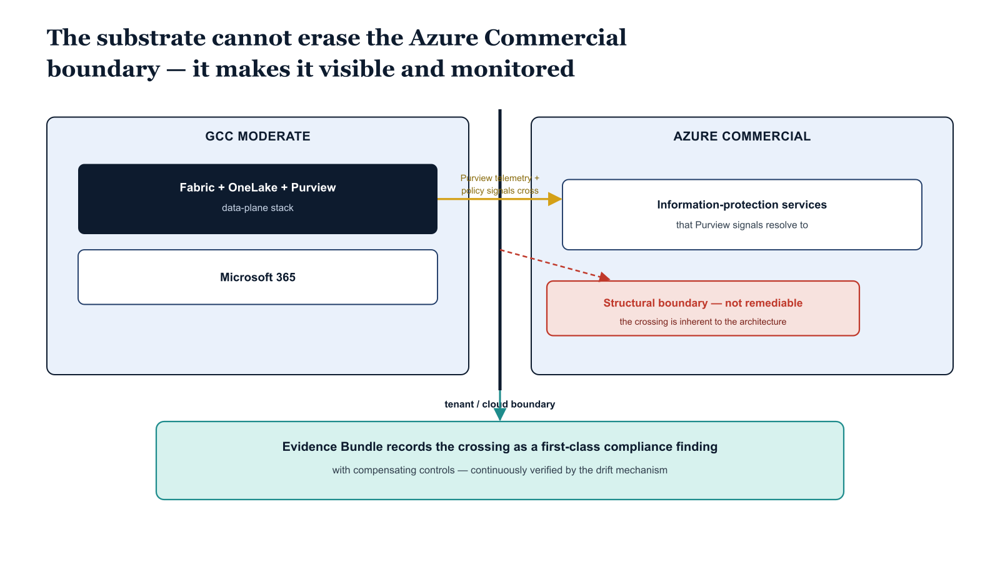

# Chapter 7 — GCC Moderate Boundary Caveats for the Azure SSOT Stack

::: {.callout-note}
## In this chapter
The Fabric, OneLake, and Purview stack runs in Azure Government, Azure Commercial, and at the GCC Moderate boundary — but under GCC Moderate, Purview information-protection telemetry traverses the Azure Commercial boundary. The substrate cannot remediate that structural boundary; what it can do is record it as a first-class compliance finding with compensating controls, continuously verified by the same drift mechanism that governs the rest of the substrate.
:::

## What Works at GCC Moderate and What Does Not

The Fabric + OneLake + Purview stack runs in Azure Government, in Azure
Commercial, and at the M365 GCC Moderate boundary that overlays Azure
Commercial infrastructure for federal civilian agencies. The substrate
this chapter describes applies coherently in all three deployments, but the
GCC Moderate boundary introduces compliance constraints that the substrate
must surface explicitly rather than let pass silently. The canonical
description of the boundary is in
[`B1-gcc-moderate-boundary-model`](../federal-aan-series/boundary/B1-gcc-moderate-boundary-model.qmd),
and the structural three-way conflict between TIC 3.0, Zero Trust, and
FedRAMP 20x that the boundary creates is the subject of a separate
compliance artifact that the substrate's Evidence Bundle references.

The relevant constraint for the Azure SSOT stack is that Microsoft Purview
information protection features — the scan-driven sensitivity
classification, the lineage attribution to Entra ID principals, the
adaptive policy evaluation — rely on telemetry and policy signals that
traverse the Azure Commercial boundary when running under GCC Moderate.
The substrate cannot remediate that boundary; the boundary is structural.
What the substrate can do, and does, is record the boundary as a
first-class compliance finding in the Evidence Bundle, document the
compensating controls the agency has put in place, and demonstrate that
the controls are continuously verified through the same drift mechanism
that governs the rest of the identity-substrate state. The Compliance
Control Plane is where these boundary conditions are surfaced and
documented, and the boundary-authorization canon family is where the
authorization-package material is maintained.

The agency that adopts the substrate does not adopt it to make the GCC
Moderate boundary disappear. The agency adopts it to make the boundary
visible, attributed, and continuously monitored — which is what the open
governance posture the substrate exists to deliver actually means.

{#fig-book-07a-cpt-07-diagram-01 fig-alt="A federal navy boundary line divides the figure into a GCC Moderate region, holding the Fabric plus OneLake plus Purview stack over M365, and an Azure Commercial region. An amber arrow shows Purview information-protection telemetry and policy signals crossing the navy boundary from GCC Moderate into Azure Commercial. A red marker on the crossing reads \"structural boundary, not remediable\". A teal Evidence Bundle box records the crossing as a first-class compliance finding with compensating controls, continuously verified by the drift mechanism. White background, 16:9, engineering blueprint style, monospace labels, red reserved for the structural-boundary marker, no human figures." width="100%"}

## Positioning Summary

Microsoft Purview governs data assets. The Fabric + OneLake stack provides
the data SSOT platform federal agencies are correctly converging on. UIAO
is the open canon that describes how to compose those capabilities, at the
identity layer, into a substrate that survives an audit and survives the
migration boundary the entire Azure SSOT stack is built on. The substrate
is not an alternative to the Microsoft stack; it is the identity governance
layer the Microsoft stack assumes and does not provide.

For the federal mandate alignment that makes this substrate necessary, see
the companion whitepaper
[*Federal SSOT Alignment*](../whitepapers/federal-ssot-alignment.qmd) in
the Whitepapers section.
