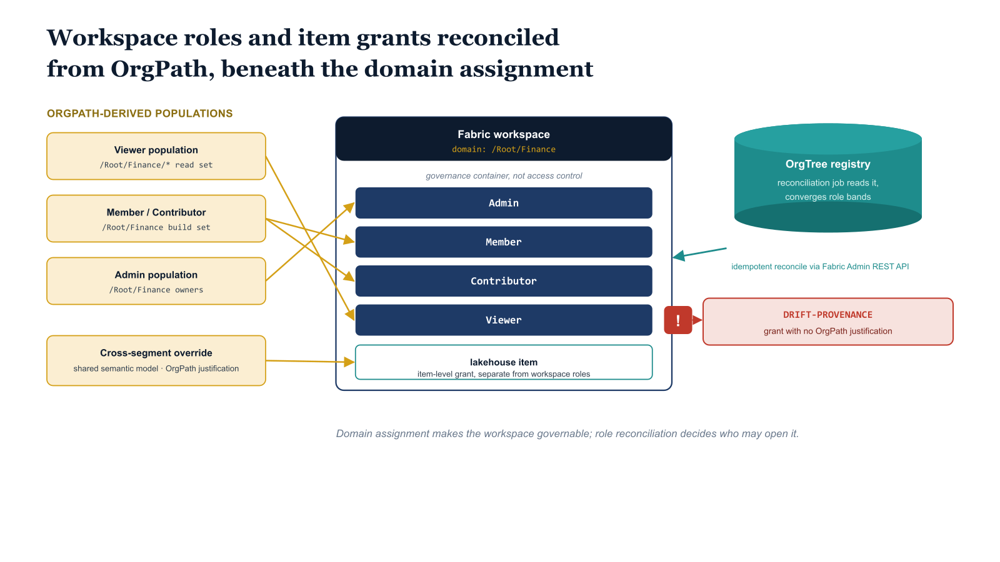

# Chapter 8 — Workspace and Item Security Mapped to OrgPath

::: {.callout-note}
## In this chapter
Domain assignment in Chapter 5 placed workspaces under the right organizational hierarchy, but a domain is a governance container, not an access-control boundary. Access in Fabric is granted by workspace roles — `Admin`, `Member`, `Contributor`, `Viewer` — and by item-level permissions beneath them. This chapter closes the gap Chapter 5 left: it maps Fabric workspace-role and item-level grants to OrgPath, so the people who can read and build on a segment's data are exactly the people the segment's organizational position warrants, and so a transfer re-scopes data-plane access the same way it re-scopes everything else.
:::

## Why Domain Assignment Is Not Access Control

The distinction this chapter turns on is easy to lose, because the domain assignment of Chapter 5 looks, at a glance, like it ought to settle the question of access. It does not. Assigning a workspace to the Fabric Domain named `/Root/Finance` makes that workspace *governable*: it carries the domain's default sensitivity context, it inherits the domain's audit lineage, and every lakehouse, warehouse, semantic model, and mirrored database inside it is now legible to Purview and to the Evidence Bundle as Finance data. What the domain assignment does not do — what it was never designed to do — is decide who may open the workspace and read what it contains. A domain is a label on the container; the lock on the door is something else entirely.

That something else is the Fabric workspace role grant, and it is governed by a completely separate mechanism. A workspace can sit cleanly under `/Root/Finance` in the domain hierarchy while its membership list has accreted, over months of ad-hoc additions, a population that bears no resemblance to the Finance organization. An analyst who transferred out two quarters ago can still hold a `Member` role on a workspace whose domain assignment is impeccable. The governance container is correct; the access is wrong; and because the two are maintained by different operations, nothing in the domain layer will ever notice. This is the gap Chapter 5 deliberately left open, and it is precisely the gap that a hand-maintained access list will drift through.

{#fig-book-07a-cpt-08-diagram-01 fig-alt="White background, engineering blueprint style, 16:9 landscape. A federal navy #1F3A5F Fabric workspace box at top is labeled with monospace text and shows its domain assignment from Chapter 5 reading domain: NCR / Finance, captioned governance container, not access control. Beneath the workspace box, four horizontal role bands in navy are stacked top to bottom and labeled in monospace: Admin, Member, Contributor, Viewer. Each role band is fed from the left by an amber #D4A017 connector arrow coming from an amber OrgPath-derived population box, for example a box reading Viewer population resolved from the NCR / Finance subtree read set. To the right, an item-level grant is shown: a small lakehouse item box inside the workspace receives a separate amber connector from an OrgPath-derived override population labeled shared semantic model, cross-segment grant, anchored to recorded OrgPath justification. On the far right a teal #1A9E8F reconciliation job box reads the OrgTree registry, depicted as a teal cylinder labeled OrgTree registry, and emits arrows back to the role bands labeled idempotent reconcile via Fabric Admin REST API. One role band shows a single red marker labeled DRIFT-PROVENANCE pointing at a grant with no OrgPath justification, the only red element in the figure. Monospace labels throughout for paths and role names. No human figures." width="100%"}

A workspace, then, is governed along two independent axes that this part of the series keeps deliberately separate. The vertical axis is the domain hierarchy of Chapter 5, which answers *what kind of data is this and under whose governance does it fall*. The horizontal axis is the access model this chapter describes, which answers *who may see it and who may build on it*.

Both axes should be anchored to the same OrgPath, resolved from the same OrgTree registry, but they are driven by different reconciliation operations against different Fabric surfaces. Keeping them distinct is what lets the substrate stay coherent under audit: when an auditor asks why a particular person can read a Finance lakehouse, the answer is a role grant traceable to an OrgPath, not a domain assignment that was never an access decision in the first place.

## The Fabric Role Model and Where OrgPath Binds

Fabric grants access at the workspace through four roles, and the differences between them are the differences between reading, building, and governing. A `Viewer` may consume the items a workspace contains — query a semantic model, open a report, read a lakehouse through the SQL endpoint — without altering anything. A `Contributor` may create and edit items but does not control the workspace itself. A `Member` may do everything a `Contributor` can and additionally manage the workspace's content and share its items onward.

An `Admin` holds the workspace, including the power to add and remove other members and to change the workspace's settings. Beneath these workspace roles sit item-level permissions, which apply directly to a lakehouse, a warehouse, a semantic model, or a mirrored database and grant access to that one item independently of the broader workspace role — the mechanism that makes a single shared semantic model readable by a population that has no business in the rest of the workspace.

The binding point for OrgPath is the membership of each of these roles, and the rule is uniform: every role population should be an OrgPath-derived set resolved from the same OrgTree registry that named the domain in Chapter 5. The `Viewer` role on a Finance workspace should be filled by the read population that OrgPath places at or beneath `/Root/Finance` — the same branch-inclusive resolution the Adaptive Scopes of Book 07 already perform on the user plane.

The `Contributor` and `Member` roles should be filled by the narrower build populations that OrgPath identifies as the segment's data engineers and analysts, and the `Admin` role by the smaller still population OrgPath records as the workspace's owning team. The registry is the single authority for who belongs in each set; the role grant is a projection of the registry onto the Fabric data plane.

What this binding buys is the property the whole series is built toward: a transfer re-scopes data-plane access automatically, because the access was never an independent fact about the workspace. When an analyst's OrgPath moves from `/Root/Finance` to `/Root/Legal`, the read population beneath `/Root/Finance` no longer contains them, the read population beneath `/Root/Legal` now does, and the next reconciliation pass removes them from the Finance `Viewer` role and adds them to the Legal one. Nobody files a ticket to revoke the Finance workspace and nobody remembers to grant the Legal one; the registry changed, and the data plane follows. The same OrgPath that re-scoped the user's Purview policies in Book 07 has re-scoped their Fabric access here, through a different mechanism but from the identical source of truth.

## Reconciling Workspace-Role Membership From the Registry

The mechanism that keeps role membership aligned with OrgPath is the same idempotent reconciliation job that Chapter 5 used for domain assignment, pointed at a different Fabric surface. The job reads the OrgTree registry for the segment that owns the workspace, resolves the read and build populations by OrgPath, and reconciles each workspace role's membership against the resolved set — adding the members the registry says belong, removing the members it does not, and leaving correct grants untouched.

Because the reconciliation is a convergence toward a declared state rather than a stream of one-off changes, running it twice in succession produces no second effect; the second pass simply confirms that reality already matches the registry. This is the same operational discipline established for Adaptive Scopes and label policies in Book 07, and it is what makes the data plane safe to reconcile continuously rather than on a fragile schedule of manual edits.

There are two equivalent ways to land the resolved population on the workspace, and the choice is an implementation detail rather than a doctrinal one. The job can call the Fabric Admin REST API directly, adding and removing role assignments on the workspace by principal; or it can maintain a backing Entra security group whose membership it reconciles from OrgPath, and assign that single group to the workspace role once.

The group-backed approach has the advantage that the same group can scope adjacent surfaces and that the workspace role grant itself becomes a stable, auditable single line; the direct-API approach has the advantage of keeping the resolved population visible in the workspace's own membership without an intervening object. Either way the source is the registry and the resolution is by OrgPath; the substrate does not care which projection mechanism a given segment chooses, only that the projection is driven from the canonical hierarchy.

A short, illustrative reconciliation makes the shape concrete. A reconciliation script resolves the `Viewer` population for a Finance workspace from OrgPath and converges the workspace's `Viewer` role to match, using representative Fabric Admin REST endpoints; the endpoint paths are marked as illustrative and should be confirmed against current Fabric Admin REST documentation before use.

That reconciliation script is reproduced in full, set in reduced type for reference, in [Appendix A — Reference PowerShell Scripts](Book_07a_CPT_10.qmd#chapter-8-workspace-role-reconciliation).

## Item-Level Overrides Without Losing the Org Anchor

The workspace-role model is the common case, but it is not the whole case, and a model that could only express it would be too rigid to survive contact with how agencies actually share data. There are legitimate reasons to grant access to a single item without granting it to the workspace that contains it: a semantic model that several segments are meant to consume in common, a cross-segment report that an oversight function needs to read, a mirrored reference dataset that the whole tenant depends on.

Fabric expresses these as item-level permissions, granted directly on the lakehouse, warehouse, semantic model, or mirrored database, and the access model has to allow them. Refusing item-level grants outright would push the same sharing into untracked workarounds — an exported extract, a copied dataset — which is strictly worse for governance than a recorded exception.

The discipline this chapter insists on is not that overrides are forbidden but that they remain anchored. Every item-level grant should still resolve to an OrgPath-derived population and should carry, in the registry, a recorded justification for why this item is shared beyond its workspace's normal boundary. A shared semantic model is granted to the OrgPath population of the segments meant to consume it, with a registry note that records the cross-segment sharing decision and who approved it.

A cross-segment report is granted to the oversight function's OrgPath population, with the justification that the function's mandate requires it. The override is thereby a decision someone made, recorded against the org hierarchy, and reviewable later — not an orphaned grant whose origin no one can reconstruct. The reconciliation job treats these item grants exactly as it treats workspace roles: it converges the item's permission to the OrgPath-derived population the registry declares for it, and a grant the registry does not declare is a candidate for removal.

The test that separates a legitimate override from drift is therefore not whether the grant is at the item level rather than the workspace level — both are first-class in this model — but whether the grant carries an OrgPath anchor and a recorded justification. An item-level grant that resolves cleanly to a registered OrgPath population with a documented cross-segment rationale is governance working as intended. An item-level grant that resolves to nothing in the registry, that no OrgPath population accounts for, is an exception masquerading as a feature, and it is exactly the condition the next section names.

## Drift, Evidence, and the Join to the User Plane

A workspace-role grant or an item-level grant with no OrgPath justification is precisely the `DRIFT-PROVENANCE` condition the substrate is built to surface. When the reconciliation job finds a principal holding `Member` on a Finance workspace whom no OrgPath population at or beneath `/Root/Finance` accounts for, that grant has no provenance: nothing in the canonical hierarchy explains why it exists. The job emits a `DRIFT-PROVENANCE` finding naming the workspace, the role, the principal, and the absent anchor, and it does so for item-level grants on the same terms.

Drift on the data plane is detected by exactly the same mechanism as drift on the domain assignment of Chapter 5 and the user-plane scopes of Book 07 — a divergence between the resolved OrgPath population and the grants that actually exist — which is why a single kind of finding can describe misalignment across every surface the substrate touches.

The deeper point is the join this chapter completes. The same OrgPath that scopes a Finance user's Purview label, DLP, and retention policy in Book 07 now scopes that user's Fabric workspace and item access here. The user plane and the data plane, which Chapter 2 was at pains to keep conceptually distinct, are nonetheless made auditable through one key: ask of the user plane *what policies govern this person* and of the data plane *what data this person may reach*, and both answers resolve through the same OrgPath into the same OrgTree registry. An auditor does not have to reconcile two unrelated access models by hand; they follow one string path through both planes and the answers are consistent by construction.

That consistency is what the Evidence Bundle of Chapter 6 collects. Every reconciliation pass — domain assignment, workspace role, item grant, user-plane scope — emits its convergence result and its `DRIFT-PROVENANCE` findings into the same bundle, so that the evidence for *who can reach this segment's data and why* is assembled continuously rather than reconstructed under audit pressure. The workspace-role and item-level mapping this chapter describes is the last piece the data plane owed that bundle: with it, the access decisions that govern Fabric are no longer a separate, hand-maintained reality that the evidence cannot see, but a projection of the same governed hierarchy that scopes everything else, recorded and reviewable through the one key the whole substrate shares.
