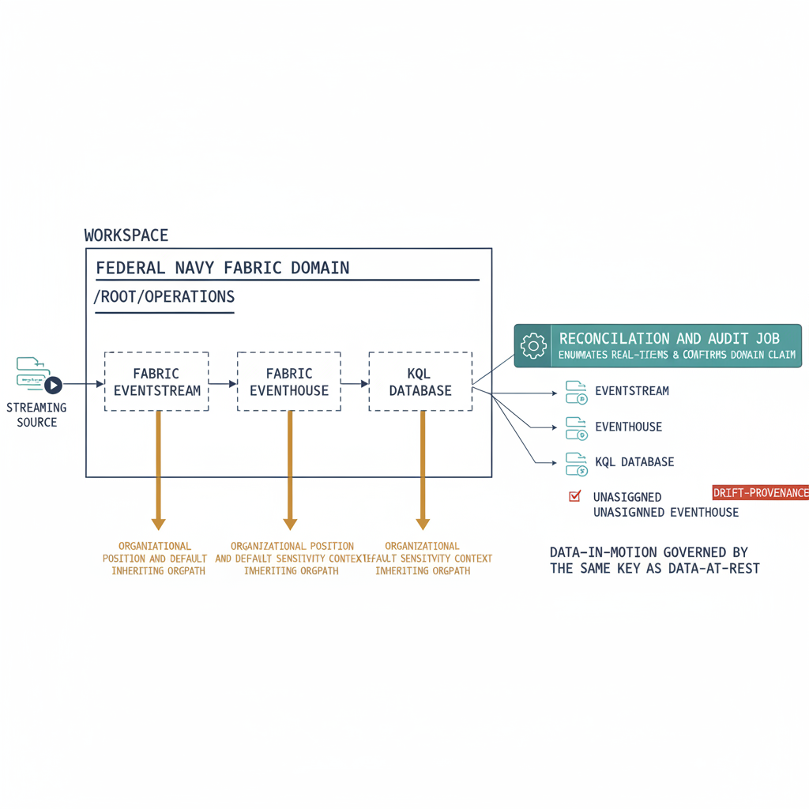

# Chapter 9 — Real-Time Intelligence and Eventstreams Under the Domain Hierarchy

::: {.callout-note}
## In this chapter
The data plane in Chapter 5 was a data-at-rest plane — mirrored SQL estates and lakehouse items under a domain. Fabric Real-Time Intelligence adds a data-in-motion plane: eventstreams, eventhouses, and KQL databases that ingest and serve streaming data. This chapter extends the domain-and-OrgPath model to those streaming items, so real-time workloads inherit the same organizational governance, default sensitivity context, and drift detection as the batch estate — and so streaming data does not become the ungoverned seam that escapes the substrate.
:::

## The Data-in-Motion Plane Chapter 5 Did Not Cover

Chapter 5 brought the operational SQL estate into the Fabric data plane through OneLake mirroring, and it bound that estate to the OrgPath hierarchy through Fabric Domain assignment. Everything that chapter governed was, in one way or another, data at rest: a mirrored database, a lakehouse table, a warehouse, a semantic model — items whose contents change in batches and whose governance can be reasoned about as the governance of a stored asset. Fabric Real-Time Intelligence introduces a different shape of workload.

An `eventstream` ingests events from a source and routes them; an `eventhouse` holds the resulting time-series data; a `KQL database` serves queries over that data with sub-second latency. These are data-in-motion items, and the workloads they support — telemetry pipelines, operational dashboards, alerting, anomaly detection — were entirely outside Chapter 5's mirroring-and-domain treatment.

The omission matters because these are not second-class objects in Fabric. An `eventstream`, an `eventhouse`, and a `KQL database` are each first-class Fabric items, provisioned in workspaces, owned by principals, and carrying their own metadata and access model exactly as a lakehouse or a warehouse does. They are not adjuncts to the batch estate; they are a parallel estate with its own ingestion paths and its own consumers. An agency that has carefully placed every mirrored SQL instance under `/Root/Operations` and every lakehouse under the segment that owns it can still stand up a real-time telemetry pipeline that answers to no organizational anchor at all.

That is the classic ungoverned seam this series keeps returning to. The substrate's value is that every governed surface refers back to the same OrgPath hierarchy, so that lineage, authorization, and audit evidence all resolve to a single organizational namespace. A streaming item that ingests and serves data under no domain assignment breaks that promise precisely where it is least visible — in a fast-moving plane that batch-oriented reconciliation jobs were never written to enumerate. The remainder of this chapter closes the seam by extending the Chapter 5 model, rather than inventing a new one, to cover the real-time estate.

{#fig-book-07a-cpt-09-diagram-01 fig-alt="White background, engineering blueprint style, 16:9 landscape. On the left a streaming source feeds a Fabric eventstream box, which flows into an eventhouse box, which flows into a KQL database box; all three boxes sit inside a single workspace rectangle assigned to a federal navy Fabric Domain labeled in monospace /Root/Operations carried over from Chapter 5. Amber connectors run from the domain down to each of the three streaming items, labeled organizational position and default sensitivity context, showing the items inheriting the domain's OrgPath. On the right a reconciliation and audit job box enumerates the real-time items and confirms each carries the domain its workspace claims; a red DRIFT-PROVENANCE marker flags one unassigned eventhouse that failed the check. A navy note reads data-in-motion governed by the same key as data-at-rest. Monospace labels for paths and item types, federal navy #1F3A5F for domain and notes, teal #1A9E8F for the audit job, amber #D4A017 for the inheritance connectors, red reserved only for the DRIFT-PROVENANCE marker, no human figures." width="85%"}

## Streaming Items as Domain-Assigned Workspace Items

The reason the model extends cleanly is that real-time items live in workspaces, and workspaces are exactly what Chapter 5 taught the substrate to govern. A Fabric workspace is assigned to a Fabric Domain by the reconciliation job that reads the OrgTree registry, looks up the domain whose name matches the workspace's owning segment, and issues the assignment operation through the Fabric Admin API. Every item the workspace contains inherits that assignment as metadata. An `eventstream`, an `eventhouse`, and a `KQL database` provisioned inside a workspace assigned to `/Root/Operations` are, by that inheritance, items of the `/Root/Operations` domain — without any real-time-specific configuration step. The domain assignment that Chapter 5 already performs covers the streaming estate the moment those items are created in a governed workspace.

This is the same inheritance logic the batch estate relies on, and it is worth being explicit that it is inheritance from the workspace's domain, not from any user's OrgPath. A streaming item does not carry an organizational position because the person who built it sits under `/Root/Operations`; it carries that position because it lives in a workspace that the reconciliation job assigned to the `/Root/Operations` domain. The join key is the workspace's domain assignment, and the streaming item is governed transitively through it. As long as real-time work is done in workspaces that the substrate already governs, the real-time estate inherits the hierarchy for free.

What does not inherit automatically is the part that matters most for an audit. Domain assignment is a workspace-level property; it does not by itself guarantee that a given `eventhouse` was actually created inside a governed workspace, nor that a streaming item provisioned through an automated pipeline landed in the workspace the pipeline intended. Source connections, the routing definitions inside an `eventstream`, and any sensitivity labels applied to the served data are configured on the items themselves and are not derived from the domain.

The domain tells you where an item sits in the organizational hierarchy; it does not tell you that the item's ingestion path, its served data, and its access model are consistent with that position. Those properties have to be reconciled explicitly, which is why the model needs an enumeration job that reaches the real-time items directly rather than trusting that workspace assignment alone has covered them.

## Default Sensitivity Context and Authorization on Streaming Data

The data-protection question for the real-time estate is the same question Chapter 5 answered for the batch estate, and the answer has the same shape. A Fabric Domain can carry a default sensitivity context, and items in a workspace assigned to that domain inherit it. An `eventhouse` and the `KQL database` that serves its data sit in a domain-assigned workspace, so the served data is associated with the domain's default sensitivity context exactly as a mirrored database's contents are.

Authorization follows the same pattern as well: access to the streaming data is governed through the Entra ID identity plane that the rest of the substrate uses, evaluated against the domain-assigned workspace's access model, so a consumer querying a `KQL database` is authorized under the same organizational position that governs a consumer reading a lakehouse table. The protection model does not fork between data at rest and data in motion; both resolve to the segment's domain-level posture.

Where the picture is less complete is Microsoft Purview's reach into real-time items. Purview information-protection — scan-driven sensitivity classification, lineage attribution to Entra ID principals, the data-map custom metadata that Chapter 2 described as one of the three OrgPath surfaces — was built first around stored data assets, and its coverage of streaming items is narrower and still maturing. The default sensitivity context an item inherits from its domain is a real and useful control, but it is not the same thing as a Purview scan having classified the contents of an `eventhouse` and attributed its lineage. Under GCC Moderate this gap is wider still, because the Purview information-protection telemetry that would close it is itself subject to the boundary constraint Chapter 7 documents.

The honest position, therefore, is that the substrate governs the organizational placement and the default sensitivity context of the real-time estate fully, governs its authorization through the same identity plane as everything else, and governs its Purview classification only as far as Purview's streaming coverage extends in the relevant deployment. That is not a defect the substrate hides; it is a coverage boundary the substrate records, so that an auditor reviewing the real-time estate sees exactly which controls are inherited and verified and which depend on a Microsoft capability that is still arriving.

## Reconciling and Auditing Real-Time Items by OrgPath

The mechanism that closes the seam is the same domain-assignment reconciliation job Chapter 5 established, extended to enumerate the real-time estate rather than only the batch items. Where the Chapter 5 job walks workspaces and confirms that each workspace's domain matches the OrgPath its metadata claims, the extended job additionally enumerates the `eventstream`, `eventhouse`, and `KQL database` items inside each workspace and confirms that each one carries the domain its containing workspace claims.

The job runs idempotently — it reads state and emits findings, it does not mutate items it has not been asked to change — and it emits a `DRIFT-PROVENANCE` finding for any `eventhouse` or `KQL database` whose domain assignment is missing or mismatched, in the same shape and into the same Evidence Bundle as every other drift finding in the substrate.

The drift conditions worth surfacing for the real-time estate are concrete. A `KQL database` provisioned into a workspace that the reconciliation job has not yet assigned to any domain is an item serving data under no organizational anchor — exactly the ungoverned seam this chapter exists to prevent — and it produces a `DRIFT-PROVENANCE` finding the moment the enumeration reaches it. An `eventhouse` in a workspace whose assigned domain does not match the OrgPath its metadata claims is the streaming counterpart of the workspace-domain mismatch Chapter 5 already detects.

Treating these as the same class of finding, emitted by the same job into the same bundle, is the point: the real-time estate is not audited by a separate process with a separate notion of correctness, it is folded into the one reconciliation discipline that governs the whole substrate.

A short, idempotent enumeration over the Fabric Admin REST API illustrates the shape of the check. The endpoints it uses are illustrative — the exact Real-Time Intelligence item routes and their availability vary by deployment, and a production job binds to the endpoints published for the agency's cloud — but the logic is the one the substrate already applies to the batch estate.

That enumeration is reproduced in full, set in reduced type for reference, in [Appendix A — Reference PowerShell Scripts](Book_07a_CPT_10.qmd#chapter-9-real-time-item-audit).

The script is deliberately small and read-only; its job is to demonstrate that the real-time estate is enumerable and that the domain-inheritance check the batch estate already passes is the same check applied to `eventstream`, `eventhouse`, and `KQL database` items. In production the enumeration is a stage of the existing domain-assignment reconciliation job, not a separate tool, so that the real-time estate and the batch estate share one source of truth and one Evidence Bundle.

## Boundary Caveats and Cross-Reference to Chapter 7

Every claim in this chapter is subject to the boundary reality that Chapter 7 sets out for the Azure SSOT stack as a whole, and the real-time estate has two boundary-specific wrinkles worth naming.

The first is feature availability: Real-Time Intelligence and its constituent item types do not always reach GCC Moderate on the same schedule as the batch Fabric surfaces, so an enumeration that runs cleanly in Azure Commercial may find a narrower or differently shaped real-time estate at the boundary, and the reconciliation job must tolerate that rather than treat a missing capability as drift.

The second is Purview integration: as the data-protection section noted, Purview's classification and lineage coverage of streaming items is still maturing, and under GCC Moderate the information-protection telemetry that would carry it traverses the Azure Commercial boundary exactly as Chapter 7 describes.

Neither wrinkle is something the substrate can remediate, and that is the same posture Chapter 7 takes for the rest of the stack. The boundary is structural; the substrate's job is not to make it disappear but to make it visible, attributed, and continuously monitored.

For the real-time estate that means the Evidence Bundle records which item types are available in the deployment, records the domain assignment and default sensitivity context that the substrate does govern fully, and records the Purview classification gap as a known coverage boundary rather than letting it pass silently. The canonical treatment of the boundary, the compensating-control framing, and the boundary-authorization canon all live in Chapter 7's [GCC Moderate Boundary Caveats for the Azure SSOT Stack](Book_07a_CPT_07.qmd), and the streaming story shares that boundary discipline rather than restating it.

The result is that the data-in-motion plane is held to the same standard as everything else in the substrate. It inherits the OrgPath hierarchy through workspace domain assignment, it is authorized through the same identity plane, it is reconciled and audited by the same `DRIFT-PROVENANCE` mechanism, and its boundary limits are recorded with the same honesty. Streaming data does not become the seam that escapes governance, because the substrate governs it with the same key it uses for data at rest.
