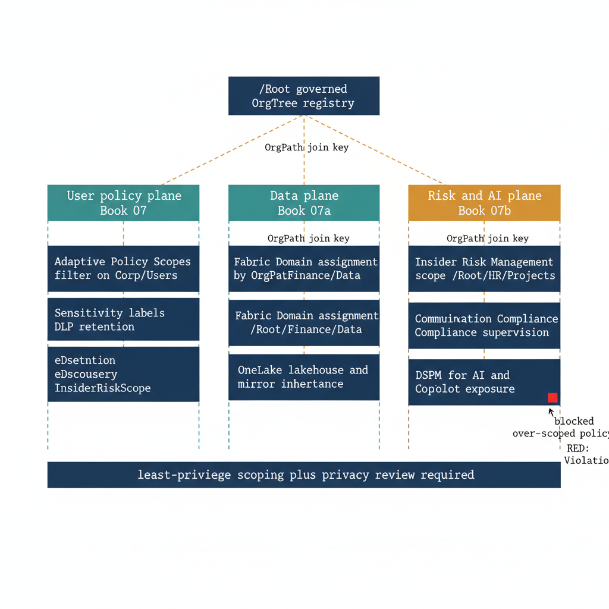

# Chapter 1 — The Risk and AI Gap Part Seven Does Not Cover

::: {.callout-note}
## In this chapter
Book 07 governed the policies that decide who may *act on* data — label, share, retain, discover. Book 07a governed where data *lives* — Fabric Domains and OneLake. This chapter opens the third surface Purview exposes: the solutions that decide who is *watched* (Insider Risk Management), who is *supervised* (Communication Compliance), and who is *exposed through AI* (DSPM for AI and Copilot). These are not access-control mechanisms; they are risk- and AI-posture mechanisms, and their fairness depends entirely on the organizational position they are scoped to. OrgPath is again the join key — but here it carries a heavier obligation, because mis-scoping these policies is not an outage, it is a surveillance error.
:::

## What Book 07 and Book 07a Each Closed, and What They Left Open

Part Seven and its data-plane companion together described two of the three planes that the Microsoft Purview surface actually contains, and it is worth being precise about where each one stopped. Book 07 governed the user-policy plane: sensitivity labels, Data Loss Prevention, retention, and eDiscovery, all of them scoped through Purview Adaptive Policy Scopes that evaluate the `extension_{AppId}_OrgPath` attribute against user objects in Entra ID.

That plane answers the question *who may act on data, and under what constraints* — who may share a Confidential document externally, whose mailbox is held for a litigation matter, whose files are retained for seven years. Book 07a governed the data plane: Fabric Domains and OneLake, where a workspace is assigned to a domain whose name matches the `OrgPath` of the segment that owns it, and the lakehouses, warehouses, and mirrored databases inside that workspace inherit the domain's default sensitivity context.

That plane answers a different question — *where data lives, and which organizational segment owns the asset* — and it does so by tagging assets rather than filtering users.

Neither plane, however, governs the third surface that Purview now exposes, and that surface is the subject of this book. Insider Risk Management, Communication Compliance, and the AI-data-posture tooling — Data Security Posture Management for AI, together with the Copilot exposure surface it reports against — are not Adaptive-Scope policies in the Book 07 sense, and they are not Fabric Domain assignments in the Book 07a sense.

They consume scope through their own mechanisms: Insider Risk Management binds policies to a defined population of in-scope users, Communication Compliance binds supervisory policies to a set of supervised users and reviewers, and DSPM for AI reports exposure against the data assets and the prompts that reach them. They target a question that neither of the prior two planes asks — not *who may act on data* and not *where data lives*, but *whose behavior is monitored, whose communication is reviewed, and whose data is reachable through generative AI*.

This is why the three planes cannot be collapsed into a single inheritance chain, exactly as Book 07a refused to collapse Adaptive Scopes and Fabric Domains into one. Each plane reads the same hierarchy, but each reads it through a different mechanism and applies it to a different object. The user-policy plane filters users; the data plane tags assets; the risk-and-AI plane defines populations under observation and surfaces of exposure. The thing they share is not a mechanism — it is a hierarchy, and the hierarchy is `OrgPath`.

The remaining chapters of this book build the risk-and-AI plane the way the prior books built the first two: as a set of reconciliation jobs that read the canonical OrgTree registry and drive an independent Microsoft surface, emitting drift findings when reality diverges from the canonical state.

{#fig-book-07b-cpt-01-diagram-01 fig-alt="White background, engineering blueprint style, 16:9 landscape, no human figures. A single federal navy #1F3A5F root box at top labeled in monospace /Root governed OrgTree registry. From the root, an amber #D4A017 connector labeled OrgPath join key fans down to three vertical lanes of equal width. Left lane header in teal #1A9E8F reads User policy plane Book 07 and stacks two monospace boxes — Adaptive Policy Scopes filter on OrgPath, then Sensitivity labels DLP retention eDiscovery. Center lane header in teal reads Data plane Book 07a and stacks two monospace boxes — Fabric Domain assignment by OrgPath, then OneLake lakehouse and mirror inheritance. Right lane header in amber reads Risk and AI plane Book 07b and stacks three monospace boxes — Insider Risk Management scope, Communication Compliance supervision, and DSPM for AI and Copilot exposure. Each lane is fed from the top by the same amber OrgPath join key connector. Beneath all three lanes runs a single wide federal navy guardrail band with monospace text least-privilege scoping plus privacy review required. A small red marker sits on the right lane only, flagging a blocked over-scoped policy, to show red is reserved for the violation case. Monospace labels throughout for paths and flags such as /Root/Finance and InsiderRiskScope." width="85%"}

## Why Organizational Position Is the Right Scope for Risk and Surveillance

The argument that organizational position is the correct scope for risk and surveillance begins from a fact about risk indicators themselves: the same signal means different things in different segments.

A spike of off-hours file downloads from a SharePoint site is, for a Finance analyst at quarter close, an ordinary pattern that the reconciliation team would expect to see and should never alert on; for a departing employee in a sensitive program who has already given notice, the identical signal is one of the strongest leading indicators of data exfiltration that Insider Risk Management can surface.

A large outbound transfer to a personal cloud account is over-collection noise for a marketing contractor whose role is to move creative assets, and a genuine investigative trigger for someone under `/Root/Finance/Treasury`. The behavior is the same; only the organizational position differs, and the organizational position is what determines whether the behavior is normal or anomalous.

The same asymmetry governs supervisory obligation. Communication Compliance exists because some segments carry regulatory or fiduciary duties that require their communications to be reviewed — broker-dealer-style supervision for a financial-services function, conflict-of-interest review for a procurement team, communications oversight for a segment that handles material non-public information. For those segments, supervision is mandatory and its absence is a compliance failure. For every other segment, the identical supervisory policy is over-collection: it reviews communications that no regulation requires reviewing, it imposes a privacy cost on people who carry no supervisory duty, and it accumulates a surveillance footprint that the organization cannot justify if it is ever asked to. The line between mandatory supervision and unjustified over-collection is drawn by organizational position, not by anything else.

Organizational position is also the only axis that carries this distinction *deterministically*. Group membership drifts — a user is added to a distribution list and silently inherits a scope nobody intended; job-title strings are free-text, inconsistent across HR feeds, and routinely wrong; departmental fields are stale the moment a reorganization lands.

`OrgPath` is the one attribute in the estate that is maintained by a governed pipeline against a canonical registry, that names a position in a hierarchy rather than a label on a person, and that the reconciliation jobs in the prior books already keep aligned across Entra ID, the Purview data map, and the Fabric Domain hierarchy.

When Insider Risk Management defines its in-scope population by an `OrgPath`-derived membership rather than by a hand-curated group, the population is exactly the set the governance team intended, it changes as the OrgTree changes, and the change is recorded as a registry event rather than as an untracked group edit. That determinism is what makes organizational position not merely a reasonable scope but the correct one for mechanisms whose fairness depends on watching precisely the right people and no others.

## The Asymmetry: These Policies Watch People, So Scoping Errors Are Surveillance Errors

The central asymmetry that this book returns to, chapter after chapter, is that a scoping error on the risk-and-AI plane is categorically worse than a scoping error on the planes Part Seven and Book 07a described. When a Book 07 label policy is mis-scoped, the consequence is friction: a user is offered the wrong default label, a DLP policy tip fires where it should not, a retention label applies a longer hold than necessary.

These are inconveniences, they are visible to the affected user, and they are corrected by a change request. When a Book 07a Fabric Domain is mis-assigned, the consequence is a `DRIFT-PROVENANCE` finding and a workspace whose lineage metadata is wrong until the reconciliation job repairs it — a data-governance defect, but a quiet one. None of these failures harms a person.

Insider Risk Management and Communication Compliance fail differently because they watch people. If an Insider Risk policy is scoped too broadly — if its in-scope population includes a segment whose behavior was never meant to be monitored — the organization is now collecting behavioral risk signals on people it has no basis to monitor, building anomaly profiles on employees who carry no elevated risk, and accumulating exactly the kind of surveillance record that a privacy regulator, an employee-relations dispute, or a records request will treat as over-collection.

If a Communication Compliance policy is scoped too broadly, the organization is reviewing the private communications of people no regulation obligates it to supervise. The error is not an outage; it is a surveillance error, and a surveillance error cannot be repaired the way a misapplied label can, because the over-collection has already happened by the time the drift is detected. The signals have been gathered, the reviews have been conducted, and the footprint exists.

The mirror-image failure is equally serious and points the other way. If the in-scope population is too *narrow* — if a departing employee in a sensitive program falls outside the Insider Risk scope because an OrgTree change moved their node and the reconciliation job had not yet run, or if a segment that owes regulatory supervision is silently dropped from a Communication Compliance policy — then the organization has failed to watch someone it was obligated to watch, and the gap is invisible until it matters.

Both directions of error stem from the same root cause: a divergence between the canonical organizational position recorded in the OrgTree registry and the population the Microsoft surface is actually enforcing against. That is precisely the divergence that `DRIFT-PROVENANCE` exists to surface, which is why drift detection on this plane is not a hygiene feature but a control of record.

It is this asymmetry that justifies the additional gate this book places on every reconciliation job it describes. On the user-policy and data planes, a reconciliation job needs to be idempotent and to emit drift findings; that is enough. On the risk-and-AI plane, every job that scopes a surveillance or AI-exposure policy must additionally pass a privacy review before its scope change is applied — a documented determination that the population about to be brought under observation is the population the organization has a basis to observe.

The privacy review gates the reconciliation, it is recorded in the Evidence Bundle alongside the drift finding, and within the GCC-Moderate boundary it is non-optional. Least-privilege scoping on this plane is not a performance optimization; it is the difference between proportionate monitoring and surveillance the organization cannot defend.

## OrgPath as the Join Key Across the Risk and AI Surfaces

Having established why the risk-and-AI plane is distinct and why its scoping errors carry a heavier weight, the remaining work of this book is to show that the plane is nevertheless governed by the same join key as the other two.

The `OrgPath` string that the OrgTree pipeline writes to a user's extension attribute, the string that drives the Adaptive Scope filter `extension_{AppId}_OrgPath -like '/Root/Finance/*'` in Book 07, and the string that names the Fabric Domain `/Root/Finance` in Book 07a, is the same string that defines the in-scope population of an Insider Risk policy, the supervised set of a Communication Compliance policy, and the organizational boundary that DSPM for AI reports its exposure findings against. One hierarchy, read three more times, by three more independent reconciliation jobs against the same registry.

Each of those jobs follows the pattern the prior books established, with the privacy-review gate added. An Insider Risk reconciliation job reads the OrgTree registry for the nodes flagged with an `InsiderRiskScope` boundary, resolves the `OrgPath`-derived population for each, compares it to the in-scope users the Insider Risk surface currently enforces, and emits the scope change only after the privacy review has cleared — recording a `DRIFT-PROVENANCE` finding when the enforced population has diverged from the canonical one.

A Communication Compliance reconciliation job does the same against the nodes that carry a supervisory obligation, binding supervised users and reviewers by `OrgPath` rather than by hand-curated groups. A DSPM-for-AI reconciliation job reads the data-asset boundaries that Book 07a already tags with `OrgPath` and aligns the AI-exposure reporting surface to those same segment boundaries, so that a Copilot exposure finding can be attributed to the organizational position that owns the reachable data rather than to an unscoped tenant-wide blur.

The shape of every remaining chapter, then, is the shape this series has used throughout: a Microsoft surface, an OrgTree boundary flag that declares which segments require segment-specific governance on that surface, a reconciliation job that reads the registry and drives the surface idempotently, and a drift finding that fires when reality diverges from canon — with the privacy review interposed as the gate that makes this plane's reconciliation defensible.

What the prior books treated as a hygiene discipline, this book treats as a guardrail, because on a plane that watches people the distance between a correct scope and an incorrect one is the distance between proportionate governance and a surveillance error. OrgPath is the join key that keeps that distance closed, and the chapters that follow show, surface by surface, exactly how.
