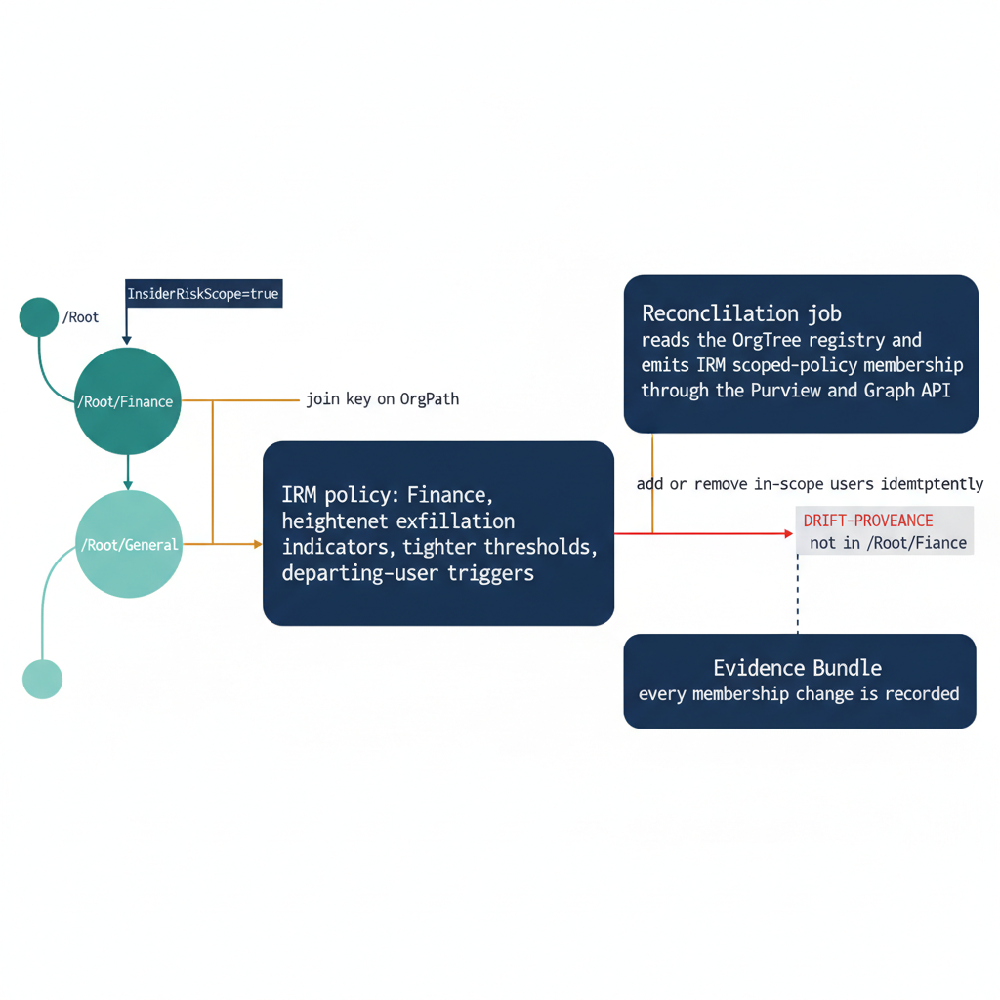

# Chapter 2 — Insider Risk Management by Organizational Position

::: {.callout-note}
## In this chapter
Insider Risk Management policies score user activity against indicators — data exfiltration, departing-employee signals, policy-violation patterns. Which indicators apply, at what thresholds, and to whom, should follow organizational position rather than a hand-maintained user list. This chapter scopes IRM policies and their user membership through OrgPath, so a transfer or departure re-scopes the risk posture automatically, and so the people in scope are always exactly the people the segment's risk model intends. It also draws the line that the next chapters formalize: scoping someone into an Insider Risk policy is a surveillance decision, and every such decision must be reconciled from the registry and recorded in the Evidence Bundle.
:::

## How Insider Risk Policies Are Scoped Today, and Why That Breaks

Microsoft Purview Insider Risk Management evaluates user activity against a configured set of indicators — files copied to USB or personal cloud storage, downloads from SharePoint at volume, sensitive content printed or shared externally, mailbox auto-forwarding, sequences that cluster around a recorded resignation date — and produces a risk score that escalates a user into triage when the score crosses a threshold. Each policy carries its own indicator selection, its own threshold tuning, and its own population of in-scope users. In the native model, that population is defined the way most Microsoft 365 surfaces define populations: users are assigned to a policy directly, or by membership in a security group or distribution list that an administrator nominates when the policy is created. This is straightforward to stand up and entirely reasonable for a first deployment. It is also the seam where the model begins to drift away from organizational reality the moment the organization changes.

The problem is not that group-based assignment is wrong; it is that the group is a second source of truth that no longer agrees with the first. The organizational fact — this person works in Finance, that person just transferred out of the Executive office, this contractor's engagement ends Friday — lives in the OrgTree registry and flows onto every user as their `OrgPath`. The Insider Risk policy's membership, by contrast, lives in a group whose contents are maintained by whoever remembers to maintain it. When a Finance analyst transfers to a general-population role, the registry records the move and re-paths the user within the day; the Insider Risk group does not, and the analyst keeps the heightened exfiltration posture of a segment they no longer belong to. When a new hire joins a high-sensitivity segment, the registry paths them under `/Root/Finance` immediately, but the heightened policy does not cover them until someone adds them to the group, leaving a window in which the segment's risk model is simply not running on the person it most intends to watch.

The failure mode is sharpest precisely where Insider Risk Management matters most: the leaver. A departing employee is the canonical insider-risk subject, and the departing-user posture is the reason Insider Risk Management exists at all. Yet in the group-maintained model the departure signal and the policy membership are maintained by two different processes that are not guaranteed to agree. A user can be off-boarded in the directory while still sitting in the Insider Risk group, leaving stale surveillance running against an account that no longer transacts; or a user can be flagged as departing in the HR feed while never having been added to the segment's heightened policy, so the very event the policy was built to catch arrives with no policy scoped to catch it. Manual reconciliation closes these gaps slowly and inconsistently, and every gap is invisible until an audit or an incident exposes it.

What the model needs is to stop maintaining a second list at all. The in-scope population of an Insider Risk policy should be a deterministic function of organizational position, derived from the same registry that already governs `OrgPath`, so that a transfer or a departure re-scopes the risk posture as a side effect of the organizational change rather than as a separate task someone must remember to perform.

{#fig-book-07b-cpt-02-diagram-01 fig-alt="White background, engineering blueprint style, 16:9 landscape, monospace path and flag labels, no human figures. On the left, a teal OrgTree branch shows a parent node labeled /Root and a child node labeled /Root/Finance carrying a small navy flag tag reading InsiderRiskScope=true, with a lighter sibling node labeled /Root/General carrying no flag to show the general population is out of the heightened segment. From the flagged /Root/Finance node, an amber connector labeled join key on OrgPath runs to the center, where a navy rounded rectangle reads IRM policy: Finance, heightened exfiltration indicators, tighter thresholds, departing-user triggers. On the right, a navy box labeled Reconciliation job reads the OrgTree registry and emits IRM scoped-policy membership through the Purview and Graph API, drawn as an amber connector from the job into the IRM policy box labeled add or remove in-scope users idempotently. Below the job, a small red marker labeled DRIFT-PROVENANCE flags one membership entry that diverges from the registry, with a thin red line pointing back to a stale user the registry no longer places under /Root/Finance. A dashed navy line runs from the job down to a box labeled Evidence Bundle, showing every membership change is recorded. Palette navy 1F3A5F for the IRM policy and job boxes, teal 1A9E8F for the OrgTree branch, amber D4A017 for the join-key and emit connectors, red used only for the DRIFT-PROVENANCE violation marker." width="85%"}

## Differentiating Indicators and Thresholds by Organizational Tier

A single Insider Risk policy applied uniformly across the organization fails for the same structural reason a uniform Data Loss Prevention policy fails: one indicator set and one threshold cannot simultaneously be sensitive enough for the segments that warrant aggressive watching and quiet enough for the segments that do not. Tuned for the general population, the policy under-watches the people whose access and proximity to sensitive data make them the segments an insider-risk program exists to cover. Tuned for those high-sensitivity segments, the same policy floods triage with alerts from the general population, where the heightened indicators describe ordinary work rather than risk. The native answer is to run more than one policy; the OrgPath answer is to let organizational position decide which policy a person belongs to, so the differentiation is structural rather than hand-curated.

High-sensitivity segments — Finance, Legal, the Executive office, Security, and any segment with privileged access to regulated or board-level material — warrant a heightened posture. That means a broader set of exfiltration indicators turned on: USB and personal-cloud copy, external sharing of labeled content, printing of sensitive material, and download-at-volume from the segment's repositories, each weighted to escalate sooner. It also means tighter thresholds, so a smaller accumulation of risky activity reaches triage, and a shorter departing-user lookback that engages the heightened indicators earlier in a notice period. The general population, by contrast, warrants a lighter posture: a narrower indicator set focused on the unambiguous signals, looser thresholds that tolerate the normal variance of everyday work, and a departing-user policy that engages only the core exfiltration indicators rather than the full heightened battery. The point of the lighter posture is not indifference; it is that an alert which fires constantly on ordinary work trains the triage team to ignore it, and a posture calibrated for everyone protects no one.

The mechanism that decides which posture applies to whom is the same segment-flag metadata convention that the preceding books established on OrgTree nodes. Book 07 used a `SegmentLabels` flag to drive Adaptive Scopes for labeling, DLP, and retention, and Book 07a carried the same convention onto the data plane. This chapter adds one more flag in exactly that family: an `InsiderRiskScope` flag set on the OrgTree nodes whose subtrees the heightened Insider Risk posture should cover. A node carrying `InsiderRiskScope=true` declares that every user resolved at or below that path belongs to the segment's heightened policy; a node without the flag leaves its users in the general-population posture. Because the flag lives on the registry node rather than on individual users, declaring a new segment heightened is a single metadata edit reviewed through the registry's change process, and the membership consequences propagate to every current and future user under that path without anyone touching a policy or a group.

Keeping the differentiation in registry metadata rather than in policy configuration also keeps it legible to governance. The set of segments running a heightened Insider Risk posture is not buried in the Purview portal where only a compliance administrator can read it; it is the set of OrgTree nodes carrying `InsiderRiskScope=true`, visible in the registry, reviewable as a list, and diffable over time. When leadership asks which parts of the organization are under heightened insider-risk watching and why, the answer is a query against the registry, and the justification for each flag is recorded in the change request that set it.

## Scoping IRM Policy Membership Through OrgPath

Here the Insider Risk surface diverges from the labeling and DLP surfaces in a way that matters to the implementation. Book 07 scoped its policies by attaching a Purview Adaptive Policy Scope — an OPATH filter evaluated continuously against the `OrgPath` user attribute — so that the policy's membership was computed by Purview itself, and a transfer re-pathed in Entra ID flowed into the scope without any external process. Insider Risk Management does not consume an Adaptive Policy Scope. Its in-scope population is an explicit user set on the policy, not a filter the platform re-evaluates on its own. That difference means the registry-to-policy alignment that Adaptive Scopes gave us for free must, on the Insider Risk surface, be driven explicitly by a reconciliation job. The pattern is the same one Book 07 and Book 07a established; only the actuation changes, because here the job must compute and apply membership rather than merely declare a filter.

The reconciliation job is the engine that turns the `InsiderRiskScope` flag into policy membership. It reads the OrgTree registry for every node carrying the flag, resolves the full set of users whose `OrgPath` places them at or below those nodes — the desired in-scope set — and compares that set to the policy's current membership. Users present in the desired set but absent from the policy are added; users present in the policy but absent from the desired set are removed; users correctly present are left untouched. The job is idempotent: running it against a registry and a policy that already agree produces no changes and emits only a clean status line, which is what allows it to run on a schedule, after every pipeline pass, or on demand, without ever needing to know whether it ran before. This is the same idempotent reconciliation discipline the OrgPath model uses everywhere, with `Get-…-ErrorAction SilentlyContinue` guards that make each step safe to repeat.

A reconciliation script implements that reconciliation for a single heightened Insider Risk policy. It reads the desired in-scope set from the OrgTree registry export, queries the policy's current membership, computes the add and remove deltas, and applies them, writing a status line for every decision and emitting a `DRIFT-PROVENANCE` record wherever the policy diverged from the registry. The Insider Risk membership cmdlets it uses are illustrative — the Purview Insider Risk Management surface is administered through a mix of the Security & Compliance PowerShell session and Microsoft Graph, and the exact membership cmdlet and parameter shapes vary by tenant configuration and release; the comments mark every illustrative call so it can be mapped to the cmdlet your tenant exposes.

That reconciliation script is reproduced in full, set in reduced type for reference, in [Appendix A — Reference PowerShell Scripts](Book_07b_CPT_07.qmd#chapter-2-insider-risk-membership-reconciliation).

The shape of this job is the same shape Book 07 used to reconcile Adaptive Scopes, and recognizing the symmetry is the point. The registry is read once, the desired set is resolved from `OrgPath` the same branch-inclusive way the OPATH filter resolves it, the current state is read, the deltas are computed, and only the deltas are applied — with every applied change recorded. The only thing the Insider Risk surface forces us to add is the explicit membership computation in the middle, because the platform will not recompute it for us. Everything else — idempotence, the `Get-…-ErrorAction SilentlyContinue` guards, the status lines, the Evidence Bundle write — is the model's standard reconciliation contract carried onto a new surface.

## Departing-User and Mover Signals as a Lifecycle Event

The reconciliation job described above runs continuously against organizational position, and that continuity is exactly what makes the departing-user case work correctly for the first time. A join, move, or leave is not an event the Insider Risk program has to be told about separately; it is a change to the OrgTree registry, and a change to the registry is precisely the signal the reconciliation job already consumes. When the lifecycle engine processes a departure — a resignation recorded in the HR feed, a contract end date, an off-boarding ticket — it writes that fact into the registry, and the next reconciliation pass sees it. The departing-user posture engages because the registry now says so, not because someone remembered to add the leaver to a watch list during the same week they were busy revoking access.

There are two distinct lifecycle motions the job handles, and they pull in opposite directions, which is why deriving membership from position rather than from a hand-maintained list is what keeps both correct. The mover — a transfer between segments — must be removed from the segment they left and, where the destination segment is itself flagged `InsiderRiskScope`, added to the one they joined. A Finance analyst who transfers to a general-population role should lose the Finance heightened posture on the next pass, because their `OrgPath` no longer resolves under any flagged branch; the transfer is a removal, computed automatically, with a `DRIFT-PROVENANCE` record explaining that the user is no longer under a flagged branch. The leaver is the opposite motion: a departure recorded in the registry engages the heightened departing-user indicators for the notice period, scoping the user into exactly the watching the program exists to perform during the window when exfiltration risk is highest.

The discipline that the native model cannot reliably enforce, and that the reconciliation model enforces as a matter of course, is the clean close. When an off-boarding completes and the user's account is disabled or removed, the registry stops resolving that user under any branch, and the very next reconciliation pass removes them from the policy. The heightened posture engages when the departure is recorded and disengages when the departure completes, so the surveillance window opens and closes with the lifecycle event rather than lingering as stale watching against a dormant account. Stale surveillance is not a harmless leftover; it is a privacy liability and an audit finding, because it means the organization is recording activity against a population that its own policy no longer intends to cover. Tying engagement and removal to the same registry event that drives every other lifecycle action is what closes the window cleanly.

This is the same lifecycle engine the rest of the OrgPath series leans on, and the Insider Risk surface is one more consumer of it rather than a special case. The pipeline does not run a bespoke departing-user routine for Insider Risk; it records the organizational fact once, and each reconciliation job — Adaptive Scopes, Fabric Domains, Insider Risk membership — reacts to that fact in its own surface. The leaver becomes a single registry change with a fan-out of correct consequences, one of which is that the right Insider Risk posture engages and, on completion, cleanly removes itself.

## Drift, Evidence, and the Privacy Boundary

Every membership change this job makes is a `DRIFT-PROVENANCE` finding written into the Evidence Bundle, and that is not incidental bookkeeping — it is the guardrail that makes registry-driven Insider Risk scoping defensible. A `DRIFT-PROVENANCE` record states what diverged between the registry and the policy and which direction the job corrected it: a user added because they entered a flagged segment, a user removed because they left one or because their departure completed. Read in sequence, those records reconstruct the entire history of who was under heightened insider-risk watching, when, and on the basis of which organizational fact. When an auditor or a works-council review asks why a particular person was in scope for a particular policy during a particular interval, the answer is not a recollection or a screenshot; it is the chain of findings in the bundle, each one tracing back to a registry state and an `OrgPath`.

That auditability matters more here than on any of the other surfaces in this series, because scoping someone into an Insider Risk policy is materially different from scoping them into a label or a retention rule. A labeling decision governs data; an Insider Risk decision governs surveillance of a person. Putting a user in scope means their file copies, downloads, external shares, and printing are scored against exfiltration indicators and surfaced to a triage team. That is a legitimate and often legally required control, but it is one whose every application must be justified, bounded, and reversible — which is exactly the property that deriving membership from the registry, and recording every change as `DRIFT-PROVENANCE`, provides. The model does not merely make the scoping correct; it makes the scoping accountable.

For that reason the reconciliation job is gated by the privacy review the next chapters formalize. The job does not get to expand the surveilled population on its own authority simply because someone set an `InsiderRiskScope` flag; the flag itself is a reviewed decision, and the job's operation sits inside the privacy boundary that governs which segments may be watched, under what indicators, and with what oversight. The chapters that follow develop that boundary in full — the review that must approve a heightened segment before its flag takes effect, the separation between the team that operates the pipeline and the team that triages Insider Risk alerts, and the retention limits on the surveillance records themselves. This chapter's job is the actuation; the privacy boundary is its authorization, and neither stands alone.

::: {.callout-note title="Scoping Insider Risk is a surveillance decision"}
Treat the `InsiderRiskScope` flag as a privacy-significant control, not a routine
metadata edit. Setting it on an OrgTree node expands the population whose activity
is scored against exfiltration indicators and surfaced to triage. The reconciliation
job actuates that decision deterministically and records every membership change as
`DRIFT-PROVENANCE` in the Evidence Bundle, but actuation is not authorization: the
flag must clear the privacy review the following chapters formalize before it takes
effect, and the job must never be the mechanism by which a segment is quietly brought
under heightened watching without that review.
:::
