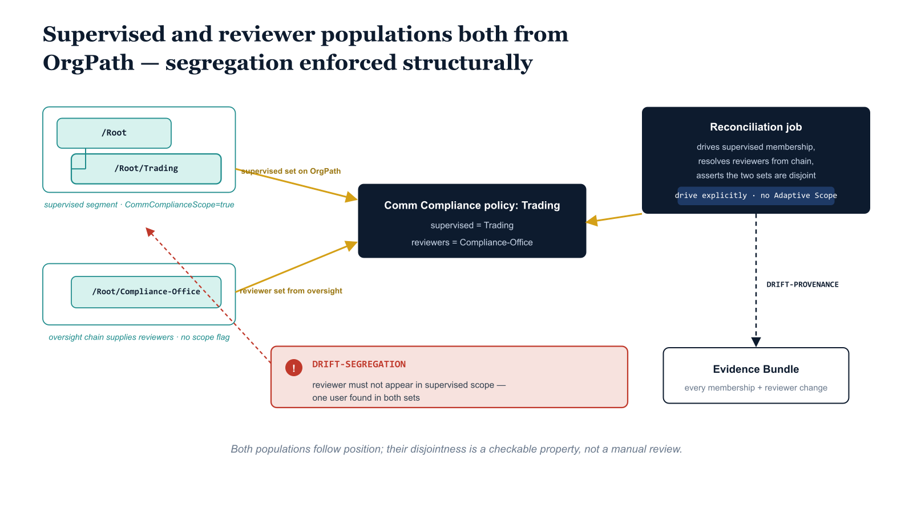

# Chapter 3 — Communication Compliance by Organizational Segment

::: {.callout-note}
## In this chapter
Communication Compliance policies supervise messages for regulated-conduct, harassment, or sensitive-information patterns, and they assign reviewers to act on matches. Which segments are supervised, against which classifiers, and by which reviewers, are organizational decisions. This chapter scopes Communication Compliance policies, their supervised-user populations, and their reviewer assignments through OrgPath — so supervision follows organizational position, reviewers are drawn from the right oversight chain, and the segregation between the supervised and their reviewers is structurally enforced.
:::

## What Communication Compliance Supervises, and the Org Questions Hidden In It

Microsoft Purview Communication Compliance is the supervisory surface that inspects the organization's communications — Exchange email, Teams chats and channel messages, and connected third-party channels — against a set of classifiers and detects the patterns an organization is obligated to watch for: regulated-conduct language that a financial-services or government-ethics regime requires be supervised, harassment and threatening language, conflicts of interest, gifts-and-entertainment solicitations, and sensitive or regulated information leaving the channels it is permitted to travel in.

A Communication Compliance policy names three things at once: a supervised population whose messages are inspected, a classifier or condition set that decides what counts as a match, and a population of reviewers who receive the matches and remediate them through a triage workflow. The classifier choice is a compliance decision and is largely independent of the org chart, but the other two — who is supervised and who reviews — are organizational decisions through and through, and the native configuration surface does not treat them as such.

Three organizational questions sit underneath every Communication Compliance policy, and the native model buries all three in a portal blade where they are invisible to governance. The first is who is supervised: the policy carries a supervised-user set, and in the default model that set is a hand-nominated list of users, or a security group an administrator picked when the policy was created — the same second-source-of-truth problem the preceding chapters traced on the labeling, DLP, and Insider Risk surfaces.

The second is who reviews: the policy carries a reviewer set, and in the default model that, too, is a hand-maintained list, typically a handful of named compliance officers entered by hand and almost never revisited as those officers move, leave, or change responsibilities. The third question is the one the native model does not even pose, let alone enforce: that the supervised set and the reviewer set must not overlap.

A person reviewing the supervised communications of a segment they themselves belong to is a segregation-of-duties failure — the reviewer is positioned to suppress findings against their own conduct — and yet nothing in the policy configuration checks for it. The overlap is invisible until an audit finds it, by which point it has usually been latent for a long time.

The OrgPath answer is to stop treating any of the three as portal configuration and instead derive all of them from organizational position. The supervised population is a function of which segments carry a supervision obligation; the reviewers are a function of which segment in the OrgTree holds oversight over the supervised segment; and the disjointness between the two is a structural invariant that can be asserted on every reconciliation pass rather than discovered in a quarterly review.

Where the labeling and DLP chapters made one population — the policy's scope — follow position, this chapter makes two populations follow position at once, and then makes the relationship between them a checkable property. That second move, deriving the reviewers from the org tree and asserting their disjointness from the supervised, is what distinguishes Communication Compliance from every prior surface in the series and is the substance of this chapter.

{#fig-book-07b-cpt-03-diagram-01 fig-alt="White background, engineering blueprint style, 16:9 landscape, monospace path and flag labels, no human figures. On the left, a teal OrgTree shows two clearly separate branches. The upper branch has a parent node labeled /Root and a child node labeled /Root/Trading carrying a small navy flag tag reading CommComplianceScope=true, captioned the supervised segment. Below and apart from it, a second teal branch shows a node labeled /Root/Compliance-Office carrying no scope flag, captioned the oversight chain that supplies reviewers. From the flagged /Root/Trading node an amber connector labeled supervised set on OrgPath runs to the center; from the /Root/Compliance-Office node a second amber connector labeled reviewer set from oversight chain runs to the center. Both connectors meet at a navy rounded rectangle reading Comm Compliance policy: Trading supervised, reviewers = Compliance-Office. On the right, a navy box labeled Reconciliation job reads the OrgTree registry, drives the supervised membership explicitly, resolves reviewers from the oversight chain, and asserts the two sets are disjoint, with an amber connector from the job into the policy box labeled drive membership explicitly, no Adaptive Scope. A red guardrail marker sits across the boundary between the two branches labeled DRIFT-SEGREGATION reviewer must not be in supervised scope, with a thin red line pointing at a single user object that appears in both sets to show the violation. Below the job a small navy marker reads DRIFT-PROVENANCE and a dashed navy line runs down to a box labeled Evidence Bundle showing every membership and reviewer change is recorded. Palette navy 1F3A5F for the policy and job boxes, teal 1A9E8F for the OrgTree branches, amber D4A017 for the join and emit connectors, red used only for the DRIFT-SEGREGATION violation marker." width="100%"}

## Scoping Supervised Populations Through OrgPath

The supervised population is the first of the two sets this chapter derives, and it is derived the same way Chapter 2 derived an Insider Risk policy's membership — by an explicit reconciliation job rather than by a platform-evaluated filter — because Communication Compliance, like Insider Risk Management, does not consume a Purview Adaptive Policy Scope. This is the point at which the surface diverges from Book 07, and the divergence is worth stating plainly because it determines how the job has to be built.

Book 07 scoped its labeling and DLP policies by attaching an Adaptive Policy Scope, an OPATH filter that Purview re-evaluates continuously against the `OrgPath` user attribute, so that a transfer re-pathed in Entra ID flowed into the policy's membership with no external process at all.

Communication Compliance carries an explicit supervised-user set on the policy, not a filter the platform recomputes on its own, and so the registry-to-policy alignment that Adaptive Scopes gave us for free must here be driven explicitly by a job that computes the desired set and applies it. The pattern is the one the series has used repeatedly; only the actuation changes, because the job must materialize and maintain membership rather than merely declare a filter.

The driver for the supervised set is a segment flag on the OrgTree node, in exactly the family the preceding books established. Book 07 used a `SegmentLabels` flag to drive Adaptive Scopes; Book 07a carried the convention onto the data plane; Chapter 2 of this book added `InsiderRiskScope`; this chapter adds `CommComplianceScope`.

A node carrying `CommComplianceScope=true` declares that every user whose `OrgPath` resolves at or below that path belongs to the policy's supervised population — so flagging `/Root/Trading` declares that the trading desk and everything beneath it is supervised, while a sibling such as `/Root/General` that carries no flag leaves its users unsupervised.

Because the flag lives on the registry node rather than on individual users, declaring a new segment supervised is a single metadata edit reviewed through the registry's change process, and its consequences propagate to every current and future user under that path without anyone touching a policy or a group.

The set of supervised segments is then not buried in the Purview portal but is exactly the set of OrgTree nodes carrying `CommComplianceScope=true` — visible, reviewable as a list, and diffable over time, which matters a great deal for a control as legally consequential as workplace communication supervision.

The reconciliation job turns that flag into supervised membership the same way the Insider Risk job turned `InsiderRiskScope` into policy membership. It reads the OrgTree registry for every node carrying `CommComplianceScope=true`, resolves the full branch-inclusive set of users whose `OrgPath` places them at or below those nodes — the desired supervised set — reads the policy's current supervised membership, computes the add and remove deltas, and applies only the deltas, emitting a `DRIFT-PROVENANCE` record for each change into the Evidence Bundle.

The job is idempotent: a registry and a policy that already agree produce no changes and emit only a clean status line, which is what lets it run on a schedule, after every OrgTree pipeline pass, or on demand without needing to know whether it ran before.

A transfer onto a supervised desk adds the user on the next pass; a transfer off it removes them; an off-boarding that stops resolving the user under any flagged branch removes them cleanly when the departure completes, so the supervision window opens and closes with the lifecycle event rather than lingering as stale watching against an account the policy no longer intends to cover.

## Reviewer Assignment From the Organizational Oversight Chain

The reviewer set is the second population this chapter derives, and deriving it is the move that has no precedent in the earlier surfaces, because labeling, DLP, retention, and Fabric Domains all scope a single population and Communication Compliance scopes two with a relationship between them. In the native model the reviewers are a hand-listed handful of named compliance officers, and that list rots for exactly the reason every hand-maintained list rots: the officers move, leave, change desks, and go on extended leave, while the list keeps naming them.

A policy whose only reviewer transferred out of the compliance function three months ago is a policy whose matches are landing in a queue no one is authorized to work, and nothing in the configuration surfaces that fact. The reviewer list is a second source of truth about who holds oversight, and it disagrees with the first — the OrgTree — the moment the org changes.

The OrgPath answer is to resolve the reviewers from the supervised segment's organizational oversight chain in the OrgTree rather than to hand-list them. Every supervised segment has, somewhere above or beside it in the hierarchy, the organizational node that holds compliance oversight over it — a compliance office, a supervisory-principal function, a designated oversight branch — and that node is itself an `OrgPath` with a resolvable population.

For the trading desk supervised at `/Root/Trading`, the reviewers are the population of the compliance function that oversees trading, recorded in the registry as an oversight node such as `/Root/Compliance-Office`; the policy's reviewer set is then every user resolving under that oversight `OrgPath`, exactly as the supervised set is every user resolving under the supervised `OrgPath`.

The reviewer population becomes a derived, maintainable set rather than a static list: when a compliance officer joins the oversight office, they become a reviewer on the next pass; when one leaves, they stop being a reviewer when their `OrgPath` no longer resolves under the oversight node; and a policy never again silently carries a reviewer who left the oversight function months ago.

Recording the oversight relationship in the registry, rather than encoding it implicitly in a hand-picked reviewer list, also makes the relationship legible to governance in the same way the supervised flag is. The registry node for a supervised segment carries, alongside its `CommComplianceScope` flag, a reference to the oversight `OrgPath` that supplies its reviewers — a single, reviewable declaration that says, in effect, the trading desk is supervised and the compliance office reviews it.

When an auditor asks who is authorized to review the trading desk's supervised communications and on what basis, the answer is the population under the declared oversight node and the change request that declared the relationship, not a recollection of who was named in a portal blade and when. The reviewer set, like the supervised set, becomes a deterministic function of organizational position, computed by the same job, from the same registry, with the same drift discipline applied to its changes.

## Structural Segregation of Duties Between Supervised and Reviewer

The integrity property that this chapter makes possible — and that the native model cannot enforce — falls out for free once both populations are derived from OrgPath: the job can assert, on every pass, that the reviewer set and the supervised set are disjoint. Because both sets are now computed from the registry rather than entered by hand, the relationship between them is a computable property rather than a manual audit check.

A reviewer who is also a member of the segment they supervise is a segregation-of-duties failure — they are positioned to see, and to suppress, findings against their own conduct or that of their immediate peers — and in the native model that overlap is invisible until someone goes looking for it.

In the OrgPath model the job computes both sets, intersects them, and emits a `DRIFT-SEGREGATION` finding for every user that appears in both, turning a periodic manual check into a continuous structural invariant that is asserted every time the job runs.

The `DRIFT-SEGREGATION` finding is deliberately a distinct finding type from the `DRIFT-PROVENANCE` records that the membership-and-reviewer reconciliation already emits, because it reports a different kind of problem. A `DRIFT-PROVENANCE` record says the policy diverged from the registry and the job corrected it — a routine, expected, self-healing event.

A `DRIFT-SEGREGATION` record says the two registry-derived populations themselves overlap, which is not something the job can silently self-heal, because deciding whether to remove the person from the supervised set or from the reviewer set is an organizational judgment about where that person actually belongs, not a mechanical reconciliation.

The job's correct behavior on a segregation finding is therefore to surface it loudly — to emit it into the Evidence Bundle, to refuse to treat the policy as cleanly reconciled, and to escalate it to the privacy and oversight review rather than to quietly delete the offending user from one set on its own authority. The invariant is asserted continuously; the remediation is a governed decision.

The most common cause of a segregation finding is exactly the case the structural check exists to catch, and it is one that hand-maintained lists routinely miss: an oversight node and a supervised node whose subtrees overlap, so that some users resolve under both.

If a compliance office sits organizationally inside a division that is itself supervised, or if a supervisory principal on the trading desk is named into the reviewer population while still resolving under `/Root/Trading`, the same person ends up in both sets, and the job catches it the instant the overlap appears rather than waiting for an audit to surface it years later.

Designing the registry so that oversight nodes sit outside the subtrees they review is the structural fix, and the `DRIFT-SEGREGATION` finding is what tells the organization, continuously, whether it has gotten that design right. The check is cheap — it is a set intersection on two populations the job has already computed — and its value is that a control auditors traditionally have to test by sampling becomes a property the substrate asserts on every pass.

A reconciliation script reconciles a single Communication Compliance policy's supervised set and reviewer set from OrgPath and asserts their disjointness. It reads both populations from the registry — the supervised set from the `CommComplianceScope`-flagged branches and the reviewer set from the declared oversight branch — applies the supervised membership idempotently, applies the reviewer assignment idempotently, and then intersects the two sets, emitting a `DRIFT-SEGREGATION` finding for any user that appears in both.

The Communication Compliance membership and reviewer cmdlets it uses are illustrative — the Purview Communication Compliance surface is administered through a mix of the Security & Compliance PowerShell session and Microsoft Graph, and the exact cmdlet and parameter shapes vary by tenant configuration and release — and every illustrative call is marked so it can be mapped to the cmdlet your tenant exposes.

That reconciliation script is reproduced in full, set in reduced type for reference, in [Appendix A — Reference PowerShell Scripts](Book_07b_CPT_07.qmd#chapter-3-communication-compliance-reconciliation).

The shape of this job is the now-familiar reconciliation contract carried onto one more surface, with a single addition that is the heart of the chapter. The registry is read once, two populations are resolved from `OrgPath` the same branch-inclusive way the OPATH filter resolves them, the current state of each is read, the deltas are computed, and only the deltas are applied — with every applied change recorded as `DRIFT-PROVENANCE`.

What Communication Compliance adds is Step 5: because the job has both registry-derived sets in hand, it can intersect them and assert disjointness, emitting `DRIFT-SEGREGATION` rather than silently correcting, because the correction is a governed organizational decision and not a mechanical one. Everything else — idempotence, the `Get-…-ErrorAction SilentlyContinue` guards, the status lines, the Evidence Bundle write — is the model's standard reconciliation discipline.

## Operational Cadence and the Privacy Boundary

The job runs on the same cadence as the rest of the OrgPath substrate's reconcilers — on a schedule, after every OrgTree pipeline pass, and on demand — and that continuity is what keeps supervision aligned to organizational reality without anyone maintaining a list. A join, move, or leave is not an event the Communication Compliance program has to be told about separately; it is a change to the OrgTree registry, and a change to the registry is exactly the signal the job already consumes.

A transfer onto a supervised desk adds the user; a transfer off it removes them; a compliance officer joining the oversight office becomes a reviewer; an officer leaving stops being one. The lifecycle engine writes the organizational fact once, and Communication Compliance reacts to it as one consumer among the labeling, DLP, retention, Fabric, and Insider Risk reconcilers, rather than as a special case that needs its own departing-user routine.

Communication Compliance is, however, the most privacy-significant surface in this book after Insider Risk, and arguably the most sensitive of the two in one respect: it inspects the actual content of people's messages, not merely the metadata of their file operations. For that reason the reconciliation job is gated by the privacy review that Chapter 6 formalizes, and the gate is not a formality.

Setting `CommComplianceScope` on a segment expands the population whose communications are inspected against classifiers and surfaced to reviewers — a control that in many regulated contexts is legally mandated, but one whose every application must be justified, bounded, and reversible. The job actuates a supervision decision; it does not authorize one. The flag must clear the privacy review before it takes effect, and the job must never be the mechanism by which a segment is quietly brought under communication supervision without that review.

The `DRIFT-SEGREGATION` finding sits inside the same boundary: a segregation breach is escalated to the oversight review rather than self-healed precisely because deciding where a conflicted reviewer belongs is a governance judgment that the privacy boundary exists to make.

Every change the job makes — every supervised add and remove, every reviewer add and remove, every segregation finding — is evidence-logged into the Evidence Bundle, and read in sequence those records reconstruct the entire history of who was supervised, by whom, on the basis of which organizational fact, and whether the segregation invariant ever lapsed.

When an auditor or a works-council review asks why a particular person's communications were supervised during a particular interval, or who was authorized to review them, the answer is the chain of findings in the bundle, each tracing back to a registry state and an `OrgPath`, rather than a recollection or a portal screenshot. The model does not merely make the scoping correct; it makes the supervision accountable, which on a content-inspecting surface is the difference between a defensible control and an audit liability.

::: {.callout-note title="GCC-Moderate availability for Communication Compliance"}
Read this chapter against the boundary reality of GCC Moderate, as the rest of
the series instructs. Communication Compliance classifier availability — the
built-in trainable classifiers for regulated conduct, harassment, and
sensitive-information patterns — and the reviewer-tooling and Graph surface area
available to automate the supervised-and-reviewer reconciliation are not uniform
across clouds, and a configuration validated in a commercial tenant cannot be
assumed to transfer into GCC Moderate without confirming each capability against
its current government-cloud service description. Treat the commercial feature
set as the superset and confirm each classifier and cmdlet in-boundary before
depending on it. What does not vary across the boundary is the method: the
supervised set and the reviewer set are both OrgPath-derived, the
`DRIFT-SEGREGATION` disjointness check is pure set logic over data the agency
already holds, and the in-boundary scope simply grows as government-cloud parity
for the classifier and reviewer surfaces advances.
:::
