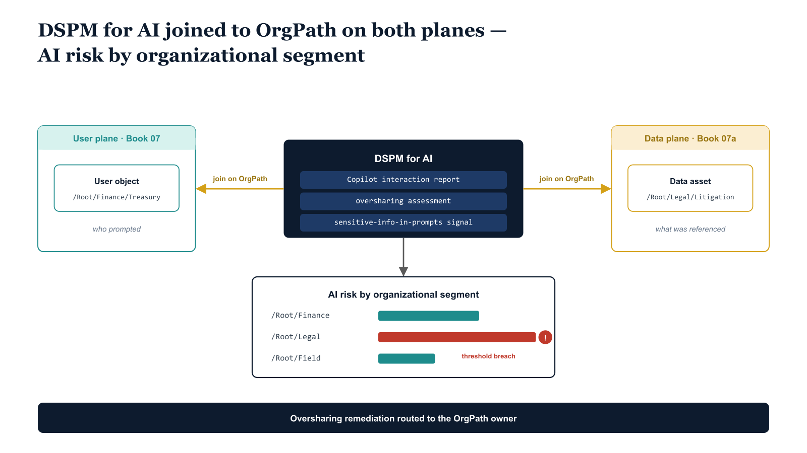

# Chapter 4 — Purview DSPM for AI and Copilot Data Posture

::: {.callout-note}
## In this chapter
Data Security Posture Management for AI reports how AI assistants — chiefly Microsoft 365 Copilot — touch organizational data: what is referenced, what is at risk of oversharing, and which interactions warrant review. The reports are only actionable when their findings can be attributed to organizational position. This chapter binds DSPM for AI to OrgPath so Copilot oversharing risk, sensitive-prompt activity, and AI-interaction auditing are all readable by segment, and so the remediation work the posture surfaces lands on the right organizational owner.
:::

## What DSPM for AI Reports, and Why It Is Org-Blind by Default

Data Security Posture Management for AI is the Purview surface that observes how generative AI assistants interact with the organization's data and reports the resulting risk. In a Microsoft 365 tenant its principal subject is Microsoft 365 Copilot, and the signals it produces fall into three broad families.

The first is interaction reporting: a record of Copilot activity that captures how many users are prompting Copilot, how frequently, in which applications, and against which categories of content, so that the volume and pattern of AI engagement across the tenant becomes visible rather than invisible.

The second is oversharing assessment: an analysis of how much sensitive or broadly-permissioned content Copilot can reach on a user's behalf, surfacing the SharePoint sites, document libraries, and files that are accessible to far more people than their content warrants and that Copilot will therefore happily summarize, quote, or surface in a response.

The third is sensitive-information-in-prompts signaling: detection of regulated or labeled data appearing in the prompts users type and the responses Copilot returns, so that the act of pasting a Social Security number or a privileged legal memo into a Copilot prompt is itself a governable event rather than an untracked one.

These three signal families are genuinely valuable, and a tenant that has turned DSPM for AI on can see, in aggregate, that AI risk exists. What it cannot see is whose risk it is. The reports are constructed at the tenant level and the individual-user level, and there is nothing in between.

An oversharing assessment will tell an administrator that the tenant contains some number of sites reachable by Copilot that hold sensitive content with overly broad permissions, and it will let that administrator drill into a specific site or a specific user, but it offers no organizational rollup. There is no view that says Finance owns the largest concentration of oversharing risk, that Legal's privileged-content exposure rose this quarter, or that the field offices in one region carry a disproportionate share of sensitive-prompt activity.

The data exists at the granularity of `user` and at the granularity of `tenant`, and the organizational segment — the level at which a director actually holds accountability and at which a remediation campaign is actually run — is simply absent from the model.

The consequence is that DSPM for AI is org-blind by default, and org-blindness is not a cosmetic limitation. It means leadership cannot prioritize by division, because the posture surface does not express divisions.

It means a remediation finding has no structural owner, because a finding attached only to a tenant belongs to everyone and therefore to no one, and a finding attached only to an individual user mistakes the symptom for the accountable party — the user who can reach an over-permissioned site did not grant the permission and frequently cannot fix it. Without an organizational dimension, the AI posture surface produces awareness without accountability: everyone can see that risk exists, and no one is structurally responsible for any particular slice of it.

The remainder of this chapter is about restoring that missing dimension by joining DSPM-for-AI findings to OrgPath.

{#fig-book-07b-cpt-04-diagram-01 fig-alt="White background, engineering blueprint style, 16:9 landscape, monospace labels, no human figures. Center: a federal navy (#1F3A5F) panel labeled \"DSPM for AI\" containing three stacked monospace rows reading \"Copilot interaction report\", \"oversharing assessment\", \"sensitive-info-in-prompts signal\". On the left, a teal (#1A9E8F) column labeled \"User plane (Book 07)\" shows a user object carrying a monospace OrgPath attribute /Root/Finance/Treasury, captioned \"who prompted\". On the right, an amber (#D4A017) column labeled \"Data plane (Book 07a)\" shows a data asset carrying a monospace OrgPath metadata field /Root/Legal/Litigation, captioned \"what was referenced\". Amber connectors run from the central DSPM panel out to BOTH the teal user object and the amber data asset, each connector labeled \"join on OrgPath\". The two joins converge into a navy rollup box on the far right labeled \"AI risk by organizational segment\" containing monospace segment rows /Root/Finance, /Root/Legal, /Root/Field each with a small bar. A single red marker flags one row as a violation threshold breach. A navy guardrail note along the bottom reads \"oversharing remediation routed to OrgPath owner\". Palette: navy #1F3A5F for the DSPM panel and rollup, teal #1A9E8F for the user plane, amber #D4A017 for the data plane and connectors, red reserved only for the one violation marker." width="100%"}

## Joining AI-Posture Findings to OrgPath on Both Planes

The conceptual core of this chapter is a single observation about the shape of every DSPM-for-AI finding: each one touches two objects, not one. A Copilot interaction has a user who issued the prompt and a set of data assets the assistant referenced in constructing its response. An oversharing finding names a piece of content that is over-permissioned and, implicitly, the population of users who can therefore reach it through Copilot.

A sensitive-prompt detection records both the user who typed the sensitive value and, very often, the labeled asset the value was drawn from. The finding is never purely about a person and never purely about a document; it is always a relationship between a `user` and a `data asset`. This is precisely why the two preceding books matter here, and why this chapter sits where it does in the series.

Book 07 established that every user carries OrgPath on the user plane — the Entra ID extension attribute the OrgTree pipeline maintains. Book 07a established that every data asset carries OrgPath on the data plane — the Purview data-map custom metadata field and the Fabric Domain assignment. A DSPM-for-AI finding therefore touches two objects that *both already carry an OrgPath*, one from each plane.

That dual binding is what makes the join possible, and it is worth being precise about why both sides are needed rather than just one. Joining only on the user plane would tell us which organizational segment is doing the prompting, which is useful for interaction reporting and for routing sensitive-prompt behavior to the right supervisory population, but it would say nothing about which segment *owns the data* that an interaction put at risk.

Joining only on the data plane would tell us which segment's content is being referenced or overshared, but it would lose the actor — the person whose access path created the exposure. Joining on both planes at once produces something neither plane can produce alone: a view of AI risk in which each finding is attributed simultaneously to the segment that acted and the segment whose data was implicated.

When a user in `/Root/Finance/Treasury` prompts Copilot and the assistant surfaces an over-permissioned document owned by `/Root/Legal/Litigation`, the finding belongs to a Treasury actor and a Litigation asset at the same time, and both facts are recoverable because both objects carry their OrgPath.

The mechanism of the join is the same string-key discipline that runs through the whole OrgPath model and that Book 07a's Chapter 2 was at pains to establish. The user plane and the data plane are not the same plane and are not synchronized by a single inheritance chain; they are kept aligned by independent reconciliation against the one OrgTree registry, and OrgPath is the join key that lets them share a hierarchy without sharing a mechanism.

A DSPM-for-AI rollup pipeline reads each finding, resolves the prompting user's OrgPath from the user-plane attribute, resolves the referenced asset's OrgPath from the data-plane metadata, and emits the finding twice into an aggregation indexed by organizational segment — once under the actor's segment and once under the asset's segment. The output is the view DSPM for AI does not natively offer: AI risk indexed by organizational position, with the same hierarchy that governs labels, DLP, retention, and Fabric Domains.

Because the rollup is built on the canonical registry rather than on any directory snapshot, a user or asset whose OrgPath has drifted from the registry surfaces the same `DRIFT-PROVENANCE` finding the rest of the substrate raises, and the AI-risk view inherits the substrate's provenance guarantees rather than standing apart from them as an unaccountable parallel report.

## Copilot Oversharing as an OrgPath-Scoped Remediation Queue

The most operationally consequential application of the dual join is the conversion of Copilot oversharing findings from an undifferentiated tenant backlog into an OrgPath-partitioned remediation queue. An oversharing assessment, left in its native form, produces a long list of sites and files that Copilot can reach but probably should not — content with broad permissions, missing sensitivity labels, or inheritance from a parent site that was provisioned for collaboration and never re-scoped.

As a flat tenant-wide list this output is nearly impossible to act on, because remediation requires someone with both the authority and the context to decide whether a given site's permissions are genuinely too broad, and a flat list assigns that decision to no one in particular.

The result, predictably, is that the list grows, the most senior administrator is nominally responsible for all of it, and almost none of it is ever closed, because the people who actually understand whether the Litigation document library should be reachable by the whole department do not see the finding and were never asked.

Resolving each oversharing finding against the owning asset's data-plane OrgPath changes the economics of the queue. Every over-permissioned site, library, or file is owned by an organizational segment, and that segment's OrgPath is already recorded as data-map metadata or as the Fabric Domain the asset's workspace inherits.

Partitioning the oversharing list by that OrgPath produces one remediation queue per segment, and each queue is then routed to the owner that the OrgTree registry already names for that node — the same accountable owner who reviews the segment's label policy boundary and its DLP carve-outs. The Finance data steward receives Finance's oversharing findings; the Legal operations team receives Legal's; a regional field office receives its own.

Each finding arrives with the context the owner needs to triage it — what the content is, how broadly it is reachable, and which sensitive information types it carries — and the owner can decide to tighten permissions, apply a missing label, or document a justified exception, with that decision recorded against the OrgTree node rather than lost in an administrator's inbox.

Because the queue is partitioned by OrgPath rather than by individual finding, it can also be tracked to closure as a governable workstream rather than an endless backlog. Each segment's queue has a measurable size, a trend over time, and an owner who can be held to a remediation rate, and leadership can read oversharing posture the way it reads any other segment metric — Finance's queue is shrinking, Legal's spiked after a matter intake and is being worked down, a particular field region is not engaging and needs intervention.

The remediation work that DSPM for AI surfaces finally has a structural home, and the home is the same organizational hierarchy that governs everything else in the substrate. The over-permissioning that created the exposure is fixed by the segment that owns the data, the closure is recorded against the node, and the AI-risk rollup reflects the improvement on the next pass — the queue is a loop, not a list.

## Sensitive-Prompt and Interaction Auditing by Segment

The sensitive-prompt and interaction signals that DSPM for AI emits are most valuable not as a standalone report but as an input to the supervisory solutions established earlier in this book — Insider Risk Management in Chapter 2 and Communication Compliance in Chapter 3 — and OrgPath is what lets those solutions consume the AI signal for the right populations rather than indiscriminately across the tenant.

A user pasting regulated data into a Copilot prompt, or a pattern of interactions that probes for content a user has no business assembling, is exactly the kind of behavior Insider Risk Management is designed to weigh; a Copilot exchange that constitutes a regulated communication is exactly what Communication Compliance is designed to review.

The AI-interaction stream is, in other words, a new evidence source for governance functions that already exist, and resolving each interaction to the prompting user's user-plane OrgPath lets that evidence be scoped to the segment whose risk posture or regulatory obligation actually warrants the scrutiny.

That scoping is not merely a convenience; it is the difference between proportionate supervision and over-collection. Routing every Copilot interaction in the tenant into an Insider Risk policy or a Communication Compliance review queue would be both operationally unworkable and ethically indefensible — it would subject the entire workforce to behavioral monitoring calibrated for the highest-risk roles, generating noise the reviewers cannot triage and surveillance the broad population has done nothing to warrant.

OrgPath lets the AI signal be consumed exactly where the earlier chapters established it belongs: the elevated-supervision policies attach to the high-sensitivity branches, the regulated-communication review queues attach to the segments under a supervisory mandate, and the AI-interaction stream flows into each only for the users whose OrgPath places them in scope. The segment that handles material non-public information receives prompt-level scrutiny of its Copilot use; the segment that does not is not swept into a monitoring regime it never needed.

The AI posture surface becomes a feeder for the supervisory plane, joined on the same user-plane OrgPath, with the same discipline of scoping collection to the population the obligation actually covers.

## GCC-Moderate Availability and the AI-Governance Boundary

Everything described in this chapter must be read against the boundary reality of GCC Moderate, and the discipline Book 07a applied to Fabric and Purview feature availability applies here with particular force, because the AI-governance surface is among the most boundary-sensitive in the Microsoft 365 estate.

Feature availability for DSPM for AI, the Copilot footprint it observes, and the connector and Graph surface area available to automate the joins described above are not uniform across clouds, and an architecture validated in a commercial tenant cannot be assumed to transfer into GCC Moderate without checking each capability against its current government-cloud status.

The governing principle is the same one stated throughout this series: treat the commercial feature set as the superset, confirm each capability against the GCC-Moderate service description before depending on it, and design so that the absence of a commercial-only feature degrades the model gracefully rather than breaking it.

The capabilities that are robust in-boundary are the ones the OrgPath model depends on most. The OrgTree registry, the Entra ID user-plane OrgPath attribute, and the Purview data-map and Fabric Domain data-plane metadata are all substrate the agency operates inside its own boundary, and the join logic — resolving a finding's user and asset to their respective OrgPaths and rolling the result up by segment — runs on data the agency already holds, independent of whether any given DSPM-for-AI report rendering is available in the portal.

Where a posture report or an automated signal is available in GCC Moderate, it can be joined to OrgPath using exactly the mechanism this chapter describes. Where a specific DSPM-for-AI capability, a particular Copilot interaction export, or a given Graph endpoint is commercial-only or lags its commercial counterpart at the time of deployment, the governable scope contracts to whatever signal the boundary does expose, and the organizational rollup is built on that narrower signal rather than abandoned.

The practical posture, then, is to draw an explicit line for the deploying agency between what is governable in-boundary today and what remains commercial-only, and to revisit that line on the same cadence the rest of the substrate's boundary caveats are reviewed, because government-cloud parity for AI features is moving quickly and the line will shift.

What does not shift is the architecture: the moment a DSPM-for-AI signal is available inside GCC Moderate, it is a signal that touches a user and a data asset, both of which carry OrgPath, and it joins into the same segment-indexed risk view as every other finding. The boundary determines which signals the agency can see; OrgPath determines what the agency can do with the signals it has.

Marking a capability commercial-only is therefore a statement about coverage, never about method — the method is constant across the boundary, and the in-boundary scope simply grows as government-cloud parity advances.
