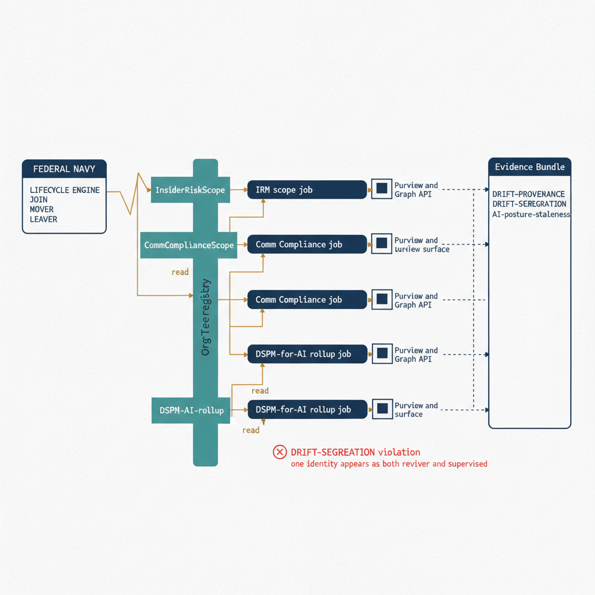

# Chapter 5 — Wiring Risk and AI Policies into the Propagation Pipeline

::: {.callout-note}
## In this chapter
The three preceding chapters each described a surface and the OrgPath scope it needs. This chapter wires them into the same propagation pipeline Book 07 built for Adaptive Scopes — three more idempotent reconciliation jobs reading the one OrgTree registry, each driving a surface that does not consume an Adaptive Policy Scope and so must be reconciled explicitly. The chapter establishes the shared job contract, the ordering against the lifecycle engine, the reuse of the OrgPath resolution layer the labeling and DLP work already built, and the drift findings each job emits into the one Evidence Bundle, so risk and AI governance ride the propagation cadence already in production rather than a parallel pipeline.
:::

## The Shared Reconciliation-Job Contract

The three surfaces the preceding chapters introduced — Insider Risk Management from Chapter 2, Communication Compliance from Chapter 3, and the DSPM-for-AI rollup from Chapter 4 — are not three new mechanisms that need three new pipelines. They are three new consumers of one mechanism the OrgPath model has been running since Book 07: the idempotent reconciliation job. That job has a fixed contract, and it is worth stating plainly because everything in this chapter is an application of it. The job reads the OrgTree registry as the desired state, reads its target surface as the actual state, computes the delta between the two, applies only that delta idempotently, and emits a drift finding into the Evidence Bundle wherever desired and actual diverged. A registry and a surface that already agree produce an empty delta, no changes, and a clean status line — which is precisely the property that lets the job run on a schedule, after every pipeline pass, or on demand, without ever needing to know whether it ran before. This is the same contract the Adaptive-Scope reconcilers in Book 07 and the data-plane reconcilers in Book 07a obey; the only thing that changes from surface to surface is the adapter that reads and writes the actual state.

What makes the explicit reconciliation job mandatory rather than optional on these three surfaces is a single structural fact: none of them consumes a Purview Adaptive Policy Scope. Book 07 scoped its labeling, DLP, and retention policies by attaching an Adaptive Policy Scope — an OPATH filter evaluated continuously by Purview against the `OrgPath` user attribute — so that membership was computed by the platform itself, and a transfer re-pathed in Entra ID flowed into the scope with no external process to maintain. That is the model working at its best, and it is exactly the model these three surfaces cannot use. Insider Risk Management carries an explicit in-scope user set rather than a filter the platform re-evaluates. Communication Compliance carries explicit supervised-user and reviewer assignments, with the segregation constraint Chapter 3 established that no person may sit on both sides. The DSPM-for-AI rollup is not a policy at all but an aggregation that must be recomputed from current findings against current organizational position. In every case the alignment that Adaptive Scopes gave us for free must instead be driven by a job that computes and applies it, and a surface that depends on a job rather than on a native filter is a surface that drifts the moment the job stops running.

That is the whole reason these chapters exist as a distinct book rather than as three more sections of Book 07. The labeling and DLP surfaces could be described almost entirely in terms of declaring a scope and letting Purview maintain it; the risk and AI surfaces cannot, because there is no scope to declare. Their correctness is an operational property of a job that runs continuously, not a configuration property of a policy that sits still. The contract is identical, but the consequence of the contract is heavier here: on a labeling surface a missed reconciliation pass means a label policy's filter lags the registry by a cycle; on the Insider Risk surface a missed pass means the surveilled population lags the registry by a cycle, which is a privacy fact, not a metadata fact. The remainder of this chapter is about wiring these three jobs into the propagation pipeline with the ordering, the reuse, and the evidence discipline that heaviness demands.

{#fig-book-07b-cpt-05-diagram-01 fig-alt="White background, engineering blueprint style, 16:9 landscape, monospace job and flag labels, no human figures. On the left a federal navy box reads lifecycle engine with three stacked monospace event rows join, mover, leaver, and an amber connector runs from it to the center. The center spine is a teal vertical bar labeled OrgTree registry carrying three monospace flag tags InsiderRiskScope, CommComplianceScope, and DSPM-AI-rollup. Three reconciliation-job lanes fan to the right, each a navy rounded rectangle: the top lane reads IRM scope job, the middle lane reads Comm Compliance job, the bottom lane reads DSPM-for-AI rollup job. Each lane has an amber connector reading from the registry on its left and an amber connector on its right writing to its Purview surface drawn as a small navy box labeled Purview and Graph API. From each of the three job lanes a dashed navy line runs to a single tall box on the far right labeled Evidence Bundle, into which monospace finding labels DRIFT-PROVENANCE, DRIFT-SEGREGATION, and AI-posture-staleness are written. A single red marker sits on the Comm Compliance lane flagging a DRIFT-SEGREGATION violation where one identity appears as both reviewer and supervised. Palette navy 1F3A5F for the job and surface boxes, teal 1A9E8F for the registry spine, amber D4A017 for the read, emit, and lifecycle connectors, red used only for the one DRIFT-SEGREGATION violation marker." width="85%"}

## Ordering Against the Lifecycle Engine

A reconciliation job that runs continuously against organizational position is only half the design; the other half is where that job sits in the propagation order relative to the lifecycle engine that records joins, moves, and leaves. Book 07 and Book 04 established that order, and these three jobs take their places within it rather than running in some parallel schedule of their own. The lifecycle engine is the front of the pipeline: it consumes the HR feed, the off-boarding tickets, the transfer approvals, and writes the resulting organizational fact into the OrgTree registry. Everything downstream — the Adaptive-Scope reconcilers, the data-plane reconcilers, and now these three risk and AI jobs — reacts to that registry change. Placing the risk and AI jobs correctly in that sequence is what makes a join, a move, or a leave produce the right risk posture at the right moment rather than a posture that engages too late or, worse, lingers after it should have closed.

The ordering constraint that matters most is the leaver, and it runs counter to intuition. The instinct is to deprovision a departing user first and clean up the trailing surfaces afterward, but on the Insider Risk surface that order is exactly wrong, because the departing-user posture is the whole point of the surface and it must engage *before* deprovisioning completes, not after. When the registry records a departure, the Insider Risk reconciliation pass must run early enough that the heightened departing-user indicators are scoped onto the account while the account still transacts — during the notice period when exfiltration risk is highest — rather than after the account has been disabled and there is nothing left to watch. The propagation order therefore places the Insider Risk job ahead of the deprovisioning step for a leaver: the registry records the departure, the Insider Risk job engages the heightened posture on the next pass, the surveillance window runs through the notice period, and only when off-boarding completes and the registry stops resolving the user under any branch does the same job remove the scope cleanly. The window opens and closes with the lifecycle event because the job sits at the right point in the sequence, not because anyone scheduled it by hand.

The mover and the joiner impose their own ordering, gentler but no less real. A transfer between segments must remove the user from the segment they left and, where the destination is itself flagged, add them to the one they joined, and because the Insider Risk and Communication Compliance jobs both derive membership from the same registry change, running them after the registry is updated and before the next access change settles keeps the supervisory posture aligned with the access posture rather than trailing it by a cycle. A new hire pathed under a flagged branch should fall into the segment's posture on the first reconciliation pass after the registry records the join, so there is no window in which the segment's risk model is simply not running on the person it most intends to watch. The DSPM-for-AI rollup, by contrast, is order-tolerant in a way the membership jobs are not: it is an aggregation rather than a membership mutation, so it can run last in the sequence, recomputing AI risk by segment against whatever organizational position the earlier jobs have just settled. The driver later in this chapter encodes exactly this order — leaver-sensitive Insider Risk first, Communication Compliance second, the DSPM-for-AI rollup last — so that the lifecycle engine's single registry change fans out into three surfaces in the sequence each surface's correctness requires.

## Reusing Versus Duplicating the OrgPath Resolution Layer

The three jobs in this chapter all need to answer the same question the labeling, DLP, retention, and data-plane jobs already answered: given a flagged OrgTree branch, which users does `OrgPath` place at or below it? That resolution — the branch-inclusive match that treats `/Root/Finance` itself plus everything under `/Root/Finance/` as the in-scope population, evaluated against the Entra ID extension attribute the OrgTree pipeline maintains — is not new work these chapters invent. It is the exact resolution Book 07's Adaptive Scopes encode in their OPATH filters and that the Book 07b Insider Risk job in Chapter 2 already materializes explicitly because Insider Risk consumes a member list rather than a filter. The discipline this chapter insists on is that the three jobs *reuse* that resolution verbatim rather than each reimplementing it, because a second implementation of OrgPath resolution is a second source of OrgPath truth, and a second source of truth is itself drift.

The point is easy to state and easy to violate. It would be entirely natural to write the Communication Compliance job with its own little routine that walks the registry, picks out `CommComplianceScope` nodes, and resolves their populations, and to write the DSPM-for-AI rollup with yet another routine that resolves a user's segment from their OrgPath. Each routine would work in isolation. But the moment two routines resolve OrgPath slightly differently — one treats the branch node itself as in-scope and the other does not, one normalizes a trailing slash and the other does not, one reads the extension attribute and the other reads a cached copy — the two surfaces they drive disagree about who belongs to a segment, and that disagreement is invisible until an audit finds a user supervised under Communication Compliance but absent from the Insider Risk population they should share. The OrgPath model's entire premise is that organizational position has one answer; honoring that premise means the resolution that produces the answer has one implementation, shared across every job that needs it.

Concretely, the three jobs differ only in their surface-write adapter. The shared front half — connect, read the registry, read the relevant `SegmentLabels` flag, resolve the branch-inclusive user set from `OrgPath` — is identical to the front half of the Book 07 reconcilers and is invoked the same way. The Insider Risk job's adapter computes membership deltas and applies them to the policy's explicit member set, emitting `DRIFT-PROVENANCE`. The Communication Compliance job's adapter computes supervised-user and reviewer assignments, enforces the segregation constraint, and emits `DRIFT-SEGREGATION` where a reviewer and a supervised identity collide. The DSPM-for-AI adapter resolves each finding's user and asset to their respective OrgPaths and rolls the result up by segment, emitting an AI-posture staleness finding where a finding's OrgPath has drifted from the registry. Three adapters, one resolution layer, one registry. The reuse is not merely tidy; it is what makes the `InsiderRiskScope`, `CommComplianceScope`, and DSPM rollup surfaces agree about organizational position by construction rather than by coincidence.

## The Drift Findings Each Job Emits

Each of the three jobs writes its findings into the same Evidence Bundle the rest of the OrgPath substrate writes into, and the findings are typed so that a reviewer reading the bundle can tell at a glance which surface diverged and how. The Insider Risk job emits `DRIFT-PROVENANCE`, exactly as Chapter 2 described: a record for every membership change, stating which user was added or removed, on the basis of which flagged branch, and at what time, so that the entire history of who was under heightened insider-risk watching is reconstructable from the bundle rather than from a recollection. A `DRIFT-PROVENANCE` finding is the guardrail that makes registry-driven surveillance scoping defensible, because it ties every expansion or contraction of the watched population back to an organizational fact and a registry state.

The Communication Compliance job emits `DRIFT-SEGREGATION` in addition to its own provenance records, and this finding carries a weight the others do not. Chapter 3 established that Communication Compliance has a structural constraint the other surfaces lack: the reviewers who adjudicate flagged communications must be separated from the supervised population whose communications they review, so that no person reviews their own correspondence and no segment marks its own homework. `DRIFT-SEGREGATION` is the finding the reconciliation job raises when that constraint is violated — when an identity computed from the registry would appear as both a reviewer and a supervised user for the same scope. The job does not silently resolve the collision; it refuses to apply the assignment that would create it and writes `DRIFT-SEGREGATION` into the bundle, because a segregation violation is a control failure that a human must adjudicate, not a delta the job is authorized to apply. Treating segregation as a hard finding rather than a soft preference is what keeps the supervisory plane's independence intact under automation.

The DSPM-for-AI rollup emits an AI-posture staleness finding rather than a membership-drift finding, because it is an aggregation and not a membership job. When the rollup resolves a Copilot interaction or an oversharing finding to its user-plane and data-plane OrgPaths and discovers that one of those OrgPaths has drifted from the canonical registry — a user whose attribute lags the registry, an asset whose data-map metadata was never reconciled — it raises the staleness finding so the AI-risk view does not silently attribute a finding to the wrong segment. This is the same provenance guarantee the rest of the substrate carries: a rollup built on the canonical registry surfaces its own drift rather than papering over it, so the segment-indexed AI-risk view inherits the substrate's accountability rather than standing apart as an unaccountable parallel report. All three finding types land in the one Evidence Bundle described in Book 07a's Chapter 6 and the chapter that follows this one, so that risk and AI governance produce evidence in the same place, in the same shape, as every other surface in the series.

## Failure Modes and Idempotency Guarantees

Idempotency is the load-bearing property of every reconciliation job in this series, but it is load-bearing in a stronger sense here than anywhere else, because the surfaces these jobs drive are surveillance surfaces. On a labeling surface, a non-idempotent job that double-applies is a cosmetic defect: a label applied twice is still a label applied once. On the Insider Risk surface, a non-idempotent job that double-applies or half-removes a scope is a compliance incident. A job that adds a user to a heightened policy twice and removes them once leaves stale surveillance running against an account the registry no longer places in the segment — recording activity against a person the organization's own policy no longer intends to cover, which is a privacy liability and an audit finding rather than a harmless leftover. A job that half-removes a departing user's scope — disengaging the indicators while leaving the membership entry behind — leaves the account nominally watched but functionally un-watched, the worst of both states. The idempotency guarantee is therefore not a performance nicety; it is the property that makes the difference between a surveillance window that opens and closes with the lifecycle event and one that lingers or leaks.

The jobs achieve idempotency the same way the rest of the model does: they compute the desired state and the actual state independently, apply only the symmetric difference, and guard every read with `-ErrorAction SilentlyContinue` so that a not-yet-provisioned policy reads as an empty actual set rather than throwing. A second run against a registry and a surface that already agree computes an empty delta and applies nothing. This is what lets the driver re-run a failed pass without reasoning about what the previous pass managed to do before it failed — the only question any pass asks is "what is the difference between the registry and the surface right now," and that question has the same answer whether it is the first attempt or the fourth.

Partial failure is the case the driver must handle most carefully, precisely because the three jobs are ordered and a leaver's Insider Risk posture must engage before deprovisioning. If the Insider Risk job fails mid-pass — the Communication Compliance and DSPM jobs have not run yet — the driver must not silently proceed to deprovisioning on the assumption that the surveillance window was established, because it may not have been. The orchestration encodes this as a fail-stop on the leaver-sensitive job: a failure in the Insider Risk pass aborts the sequence and records the failure in the Evidence Bundle as an explicit gap, so that a human sees a departing user whose heightened posture did not engage rather than a departing user who was deprovisioned with no record that anything went wrong. The Communication Compliance job's segregation refusal is handled the same way — a `DRIFT-SEGREGATION` finding is a stop, not a warning to be aggregated and ignored. The DSPM rollup, being an order-tolerant aggregation, can fail soft: a failed rollup leaves the previous segment-indexed view in place and records its own staleness, because a stale AI-risk view is a coverage gap rather than a surveillance incident. The driver below encodes exactly these failure semantics — fail-stop on the two membership surfaces, fail-soft on the aggregation — alongside the lifecycle-aware ordering and the single Evidence Bundle write.

## The Lifecycle-Aware Reconciliation Driver

A driver invokes the three reconciliation jobs in lifecycle-aware order and aggregates their drift findings into one Evidence Bundle record per run. It does not reimplement OrgPath resolution or the per-surface adapters — those live in the per-surface job scripts the preceding chapters established, the same way Book 07's reconcilers factor resolution out of actuation. The driver's job is sequencing, failure semantics, and evidence aggregation: run the leaver-sensitive Insider Risk pass first and fail-stop on it, run Communication Compliance second and fail-stop on a segregation violation, run the DSPM-for-AI rollup last and fail-soft, and write one consolidated bundle record describing what every pass did. The membership and rollup cmdlets the inner jobs use are illustrative and marked as such; the sequencing, the idempotent guards, and the single-record evidence write are concrete and load-bearing.

That driver is reproduced in full, set in reduced type for reference, in [Appendix A — Reference PowerShell Scripts](Book_07b_CPT_07.qmd#chapter-5-risk-and-ai-propagation-orchestrator).

The shape of this driver is the point as much as its contents. It does not know how Insider Risk membership is applied, how Communication Compliance reviewers are assigned, or how AI findings are rolled up by segment; those are the inner jobs' concern, and each inner job reuses the one OrgPath resolution layer rather than inventing a second. The driver owns the three things that are genuinely cross-cutting — the lifecycle-aware order that puts the leaver-sensitive Insider Risk pass first, the failure semantics that fail-stop the two membership surfaces and fail-soft the aggregation, and the single Evidence Bundle record that lets one run produce one auditable artifact. Wired this way, risk and AI governance do not run on a parallel pipeline with their own schedule and their own evidence format; they ride the propagation cadence already in production, react to the same registry change every other surface reacts to, and write into the same bundle, so the substrate stays coherent across every surface it governs.

::: {.callout-note title="Order and idempotency are the control, not the optimization"}
On these three surfaces the reconciliation job's ordering and idempotency are
not performance choices — they are the compliance control. The leaver-sensitive
Insider Risk pass must run before deprovisioning so the heightened posture
engages while the account still transacts, and the membership passes must be
idempotent so a re-run never double-applies or half-removes a surveillance
scope. A `DRIFT-SEGREGATION` violation is a fail-stop for human adjudication,
never a warning to aggregate and ignore. Treat a non-idempotent or mis-ordered
run as a compliance incident, not a bug, and let the single Evidence Bundle
record be the proof that each run did exactly — and only — what the registry
authorized.
:::
