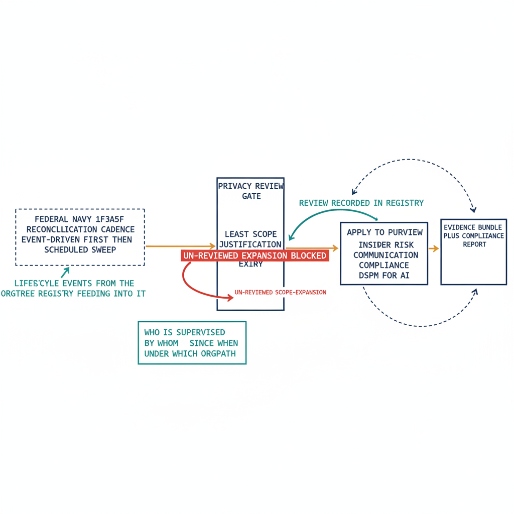

# Chapter 6 — Operational Cadence, Privacy Guardrails, and Compliance Reporting

::: {.callout-note}
## In this chapter
Running risk and AI governance is not the same as running label and retention governance, because the policies in this book watch people. This closing chapter sets the operational cadence for the three reconciliation jobs, formalizes the privacy review that gates every change to a surveillance or AI-posture scope, and defines the compliance reporting that proves — to an auditor and to the workforce — that supervision landed only where organizational position warranted it. It closes Book 07b and hands back to the main series.
:::

## The Operational Cadence for Risk and AI Scope

The reconciliation jobs in this book run on a fundamentally different rhythm than the ones in Book 07, and the difference is not arbitrary. Book 07's labeling, DLP, and retention policies are scoped by Purview Adaptive Policy Scopes, which means Purview itself re-evaluates membership continuously against the `OrgPath` attribute; the operational cadence there is a slow one, dominated by quarterly taxonomy review and annual retention attestation, because the platform handles the moment-to-moment population tracking on its own.

The risk and AI surfaces this book governs do not get that for free. Insider Risk Management carries an explicit member set rather than an Adaptive Scope, Communication Compliance attaches supervised populations as enumerated lists, and the DSPM-for-AI rollup is a pipeline the agency operates rather than a native report. On these surfaces the membership is only as current as the last reconciliation pass, which makes the cadence a first-class operational concern rather than a background convenience.

What drives that cadence is the observation that risk and AI scopes change with lifecycle events far more than they change with policy edits. A label taxonomy is revised a handful of times a year by a deliberate governance decision; by contrast, the population of a heightened Insider Risk segment churns every time someone joins, transfers, or gives notice, and those events arrive continuously and unpredictably across the workforce.

A departing employee is the canonical insider-risk subject precisely because the departure is an event, not a policy change, and the window in which heightened watching matters opens and closes on the lifecycle clock rather than the governance calendar. Tying the reconciliation cadence to the slow label-governance rhythm would leave the surveillance posture perpetually stale against the very events it exists to catch, scoping leavers in days after they have left and dropping movers weeks after they transferred.

The cadence for this book therefore inverts the priority: it is event-driven first and scheduled-sweep second.

Event-driven first means the reconciliation jobs are wired to the lifecycle engine that already drives every other consequence of a join, move, or leave. When the lifecycle engine writes a departure, a transfer, or a new hire into the OrgTree registry — a resignation from the HR feed, a contract end date, an off-boarding ticket — that registry write is itself the trigger, and the affected segment's reconciliation pass runs as a side effect of the organizational change rather than waiting for the next scheduled window.

A transfer out of `/Root/Finance` re-paths the user in the registry, and the Insider Risk membership job for the Finance heightened policy runs against the new state on the same pass that re-points the user's labels and retention. The surveillance posture engages and disengages with the lifecycle event, which is the only cadence under which the departing-user case — the reason the whole surface exists — works correctly the first time rather than after a lag.

The scheduled sweep is the second line, not the first, and its job is reconciliation completeness rather than timeliness. A periodic full pass — nightly is a reasonable default for these surfaces — re-derives every heightened segment's desired membership from the registry and compares it to each policy's current state, catching anything the event-driven path missed: an event the trigger did not fire on, a manual change someone made directly in the Purview portal, a policy that drifted from the registry for any reason.

Because every reconciliation job in this book is idempotent, the sweep is safe to run unconditionally; a registry and a policy that already agree produce no changes and emit only a clean status line, so the sweep costs nothing when nothing has drifted and corrects everything when something has. The two cadences compose into a single guarantee: lifecycle events propagate immediately, and the scheduled sweep ensures that the steady state never silently diverges from the registry between events.

{#fig-book-07b-cpt-06-diagram-01 fig-alt="White background, engineering blueprint style, 16:9 landscape, monospace labels, no human figures. A horizontal governance loop runs left to right. On the far left a federal navy 1F3A5F box reads reconciliation cadence, event-driven first then scheduled sweep, with a small teal 1A9E8F annotation lifecycle events from the OrgTree registry feeding into it. An amber D4A017 connector runs from the cadence box into a tall navy gate in the center labeled privacy review gate. The gate carries three stacked monospace check rows least scope, justification, expiry. A red stop marker sits across the gate entrance, drawn as a red bar blocking an un-reviewed scope-expansion arrow that tries to pass through, labeled un-reviewed expansion blocked. A teal pass-through arrow labeled review recorded in registry continues past the gate to a navy box labeled apply to Purview surface, listing three monospace surfaces Insider Risk, Communication Compliance, DSPM for AI. An amber connector runs onward to a navy box labeled evidence bundle plus compliance report, and a dashed navy return arrow loops from that box back to the cadence box on the left to close the governance loop. Along the bottom a teal side panel lists four monospace audit questions who is supervised, by whom, since when, under which OrgPath. Palette navy 1F3A5F for the cadence, gate, apply, and report boxes, teal 1A9E8F for the registry and pass-through annotations and the audit panel, amber D4A017 for the flow connectors, red reserved only for the stop marker blocking the un-reviewed expansion at the gate." width="85%"}

## The Privacy Review Gate

Every chapter in this book has pointed at a single guardrail, and this is where it is formalized: no reconciliation job may expand a surveillance or AI-posture scope without passing a privacy review recorded in the registry. The reconciliation jobs are the actuation, but actuation is not authorization. A job that reads an `InsiderRiskScope` flag and materializes its membership is faithfully executing a decision; it is not making one.

The decision — that a particular segment's workforce should have its file copies, downloads, external shares, and printing scored against exfiltration indicators, or that a particular population's communications should be routed into supervised review, or that a segment's Copilot interactions should feed the supervisory plane — is a privacy-significant act that must be reviewed before it takes effect.

The gate is the mechanism that makes that ordering structural rather than aspirational: the flag does not become operative the moment someone sets it, and the job does not get to expand the surveilled population on its own authority simply because a flag appeared in the registry.

The gate checks three things, and they are the same three properties a privacy review exists to establish. The first is least scope: the proposed expansion must cover the narrowest organizational segment that the justification actually warrants, not a convenient parent node that happens to sweep in adjacent populations. Flagging `/Root/Finance/Treasury` because Treasury handles material non-public information is a least-scope decision; flagging `/Root/Finance` because Treasury sits under it is not, and the gate is where that distinction is caught.

The second is justification: every expansion must carry a recorded reason that ties the heightened posture to a concrete organizational obligation — a regulatory mandate, a documented risk profile, a legal hold, a supervisory requirement — rather than a vague intuition that a segment seems sensitive. The third is expiry: a surveillance scope is bounded in time, not perpetual, and the review records when the heightened posture should lapse or be re-justified, so that watching does not outlive the reason for it.

Least scope, justification, and expiry together are the structural answer to the question every supervised employee, every works council, and every inspector general eventually asks — why are these people being watched — and the gate is where that answer is required to exist before the watching begins.

The gate is evidenced in the registry, which is what makes it auditable rather than ceremonial. When a privacy review approves a scope expansion, the approval is recorded against the OrgTree node that carries the flag — who reviewed it, when, the justification of record, the least-scope determination, and the expiry — in the same change-request workflow that governs every other registry edit.

The flag and its review are a single reviewed artifact, not two disconnected facts, so the existence of an operative `InsiderRiskScope=true` on a node is inseparable from the recorded review that authorized it. A reconciliation job, before it expands a scope, confirms that the flag it is about to actuate carries a current, unexpired review; a flag without one is treated as un-reviewed and does not pass the gate, and the expansion is blocked rather than silently applied.

This is the structural property the whole book is built toward: the registry does not merely say which segments are watched, it carries, for each one, the recorded justification for why — and the reconciliation machinery refuses to widen the surveilled population past what that record authorizes.

The gate's discipline is asymmetric by design, and the asymmetry is deliberate. Contraction of a surveillance scope — removing a transfer-out, dropping a completed leaver, narrowing a segment whose obligation lapsed — needs no review, because reducing who is watched is never a privacy risk and delaying it would itself be the harm; the reconciliation jobs remove users from scope freely and immediately on every pass. Expansion is the only direction the gate governs, because expansion is the only direction that puts new people under watching.

This asymmetry means the gate never stands between the model and a clean close: a departing employee whose off-boarding completes is dropped from every heightened policy on the next pass without any review at all, while a new segment proposed for heightened watching cannot be brought into scope until its justification clears the gate. The model makes it effortless to stop watching someone and deliberately difficult to start.

::: {.callout-note title="Privacy Review Gate Discipline"}
Treat scope expansion and scope contraction as fundamentally different operations. A reconciliation job may *remove* users from any surveillance or AI-posture scope freely and on every pass — contraction is never a privacy risk and must never be delayed. A reconciliation job may *expand* a scope only against an `InsiderRiskScope`, supervised-population, or AI-posture flag that carries a current, unexpired privacy review recorded in the registry — establishing least scope, a justification of record, and an expiry. A flag without that recorded review is un-reviewed: the gate blocks the expansion, and no job may be the mechanism by which a segment is quietly brought under heightened watching without the review. The gate is the structural answer to "why are these people being watched," and it must exist in the registry before the watching begins.
:::

## Compliance Reporting: Proving Supervision Landed Only Where Warranted

The compliance deliverable for this book is a per-segment report, indexed by OrgPath, that shows who is in each risk, supervision, and AI-posture scope, since when, and under which justification. Where Book 07's coverage report answered the data-governance question — which segments have which label, DLP, and retention policies, and how many users each covers — this report answers the supervision question, which is materially different because its subject is people under watching rather than data under classification.

For every OrgPath segment carrying a heightened posture, the report records the policy or policies that segment is scoped into, the current in-scope user count, the date each scope was first applied, the privacy review of record that authorized it, the justification and expiry the review established, and the `DRIFT-PROVENANCE` history that traces every membership change back to a registry state.

It is built from the same registry the reconciliation jobs read and the same Evidence Bundle they write, so it is a byproduct of normal operation rather than an artifact assembled at audit time.

This report is the evidence an auditor or an inspector general needs, and it is precisely the evidence that the native Purview surfaces cannot produce on their own. An auditor reviewing an agency's insider-risk program does not want a screenshot of the Purview portal; they want a defensible answer to who was under heightened watching during a given interval, on whose authority, and for what reason — and they want it traceable to a record rather than a recollection.

Because the report is indexed by OrgPath and every entry carries its review of record, the answer to "why was this person in scope for this policy during this period" is a chain of facts: the user's `OrgPath` placed them under a flagged branch, the branch's flag carried a recorded privacy review establishing least scope and justification, and the `DRIFT-PROVENANCE` findings in the Evidence Bundle date their entry and exit.

The same report that satisfies the auditor satisfies a works-council review or a Freedom of Information response, because all three are asking the same question in different registers, and the report was designed around that question from the start.

The report's second audience is leadership, and for them it serves a function the auditor's view only implies: confirming that the organization is not over-collecting. Over-collection — watching more of the workforce than the obligations actually warrant — is the characteristic failure of a surveillance program that grew by accretion rather than by design, and it is invisible without an organizational view, because no individual policy looks excessive in isolation.

The per-segment report makes over-collection legible by laying the entire surveilled footprint against the organizational hierarchy: leadership can read, in one artifact, exactly which segments are under heightened insider-risk watching, which populations are under communication supervision, which segments' AI interactions feed the supervisory plane, and the recorded justification for each.

A segment under watching with no current justification of record, a scope whose expiry has lapsed, or a heightened footprint that has crept upward without corresponding obligations is immediately visible, and leadership can confirm — to itself, to oversight bodies, and to the workforce — that supervision landed only where organizational position warranted it. The report does not merely prove the program is running; it proves the program is bounded.

That boundedness is the report's deepest purpose, and it closes the loop the privacy review gate opens. The gate ensures that no scope expands without a recorded justification; the report ensures that the standing set of justifications is continuously visible and reviewable, so that the discipline the gate enforces at the moment of expansion does not erode silently over the months that follow.

Together they make the surveillance footprint a governed quantity with an owner, a trend, and an expiry rather than an accumulating liability no one is structurally responsible for. The agency can demonstrate, on demand and as a byproduct of operation, that every person under watching is there for a recorded reason, that the reason is current, and that the watching will lapse when the reason does — which is the entire point of building this surface on the registry rather than on hand-maintained lists.

## Boundary, Tooling, and Cross-Reference to Book 07a

Everything in this book must be read against the boundary reality of GCC Moderate, and the risk and AI surfaces are among the most boundary-sensitive in the Microsoft 365 estate. Insider Risk Management, Communication Compliance, and DSPM for AI each rely on telemetry, policy evaluation, and connector surface area whose availability and data-residency behavior differ between Azure Government, Azure Commercial, and the GCC Moderate boundary that overlays Azure Commercial infrastructure for federal civilian agencies. An architecture validated in a commercial tenant cannot be assumed to transfer into GCC Moderate without confirming each capability against its current government-cloud service description, and some of the information-protection telemetry these surfaces depend on traverses the Azure Commercial boundary when running under GCC Moderate — a structural condition the substrate cannot remediate, only surface.

Rather than restate that boundary treatment here, this book shares the boundary story Book 07a already established, so that the two supplements speak with one voice on the subject.

The canonical treatment is [`Book_07a_CPT_07`](Book_07a_CPT_07.qmd), which sets the governing principle for the whole Azure SSOT stack: the boundary is structural and cannot be made to disappear, so the substrate records it as a first-class compliance finding in the Evidence Bundle, documents the compensating controls the agency has put in place, and demonstrates that those controls are continuously verified through the same drift mechanism that governs the rest of the substrate. The risk and AI surfaces inherit that posture directly.

Where a given Insider Risk capability, Communication Compliance feature, or DSPM-for-AI signal is available in GCC Moderate, it is governed by OrgPath exactly as this book describes; where it is commercial-only or lags its commercial counterpart, the governable scope contracts to whatever the boundary exposes, the gap is recorded as a finding rather than papered over, and the line between in-boundary and commercial-only is revisited on the same cadence the rest of the substrate's boundary caveats are reviewed.

The discipline, then, is the one Book 07a stated and this book adopts without amendment: treat the commercial feature set as the superset, confirm each capability against the GCC-Moderate service description before depending on it, and design so that the absence of a commercial-only feature contracts the model's coverage gracefully rather than breaking its method. What does not change across the boundary is the architecture.

A risk signal touches a user who carries `OrgPath` on the user plane; an AI-posture finding touches a user and a data asset that both carry `OrgPath`; a supervision decision attaches to an OrgTree node that carries its flag and its recorded review. The boundary determines which signals the agency can see; OrgPath determines what the agency does with the signals it has — and that method is constant whether the deployment is in Azure Government, Azure Commercial, or at the GCC Moderate boundary.

## Series Hand-Back

With this chapter, the three-book arc across the Purview surface is complete. Book 07 governed the user-policy plane — sensitivity labels, DLP, and retention — scoping each policy to organizational position through Adaptive Scopes evaluated against the `OrgPath` attribute. Book 07a governed the data plane — the Purview data map, Fabric Domains, and OneLake mirroring — carrying the same hierarchy onto data assets so that content is attributed to the segment that owns it.

Book 07b governed the risk and AI plane — Insider Risk Management, Communication Compliance, and DSPM for AI — scoping supervision and AI posture to organizational position while gating every expansion of that surveillance behind a recorded privacy review. Three planes, one join key: every policy in every Purview surface answers the same question against the same source of truth — which organizational segment does this person, this asset, or this interaction belong to, as defined by the OrgTree registry and encoded in `OrgPath`.

The through-line is that compliance evidence is produced as a byproduct of governance rather than as a separate documentation effort, and that the evidence is structured around the single OrgPath join key on every plane. The same `DRIFT-PROVENANCE` discipline that proves a label landed on the right segment proves that a leaver was dropped from a heightened policy when their off-boarding completed; the same Evidence Bundle that hands a 3PAO the data-plane attribution hands an inspector general the supervision footprint with its recorded justifications. Reconciling supervision from the registry does not merely make the scoping correct — it makes the scoping accountable, bounded, and auditable, which is the property that distinguishes a defensible governance program from an accreting surveillance liability.

This closes Book 07b and, with it, the Purview supplement to the OrgPath narrative. The reader who has worked through Books 07, 07a, and 07b now holds the full Purview governance model — user policy, data plane, and risk and AI — composed through one organizational hierarchy and surfacing its own audit evidence. Book 08 picks up the thread where this series leaves off, carrying the OrgPath substrate onward to the next service in the governance architecture, with the same single directory fact continuing to do the work that every integrated surface relies on and none of them provide on their own.
