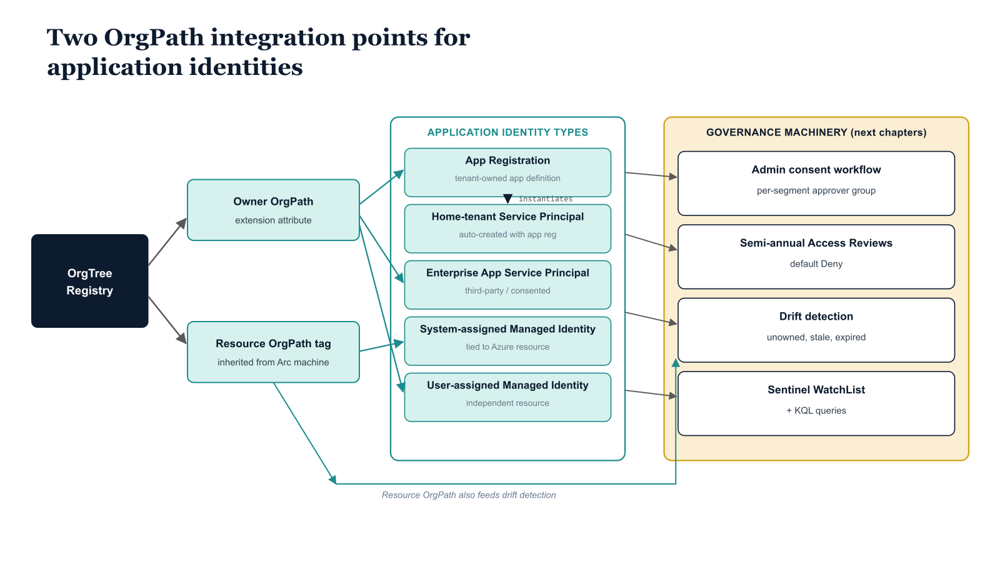
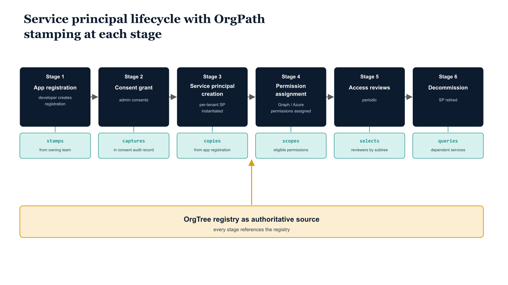

# Chapter 1 — The Application Identity Governance Gap

::: {.callout-note}
## In this chapter
Application identities are the least-governed identity class in most tenants — app registrations accumulate with no owner, no lifecycle, and no organizational attribution. This chapter extends the OrgPath ownership model to the three application identity types (app registrations, service principals, and managed identities) and previews how the existing drift-detection, Access-Review, and Sentinel machinery extends to cover them with minimal new infrastructure.
:::

## The Ungoverned Identity Class

Parts One through Ten of this series constructed a comprehensive governance substrate for every major identity type in the Entra ID tenant. Users carry OrgPath extension attributes that place them in the organizational hierarchy, drive Privileged Identity Management role scoping, trigger Lifecycle Workflow automation at hire and separation events, and populate Sentinel monitoring dashboards with organizational context. Devices and Arc-enrolled servers carry OrgPath resource tags that enforce configuration baselines through Azure Policy, route Intune compliance policy, and feed the Defender for Endpoint fleet governance model.

B2B guest identities carry OrgPath assignment attributes that place them in sponsor-accountability chains and route them through periodic Access Reviews. After ten parts and a considerable body of pipeline code, the tenant's human and machine identity planes are governed end-to-end by a coherent, attribute-driven, organizationally-aware model.

Application identities are the exception. In most Entra ID tenants at any meaningful scale, the application identity plane is the least governed identity class in the directory. App registrations accumulate over time with no systematic ownership model, no lifecycle policy, and no organizational attribution. A registration created three years ago for a proof-of-concept integration that was never promoted to production may still carry active client secrets. A registration built to support a project whose team disbanded eighteen months ago may hold application-level Graph permissions scoped to the entire tenant.

A registration created by a contractor who has since left the organization may have no current directory owner at all. None of these registrations appear in any governance report, because none of them carry an OrgPath, and none of them have an owner who would be invited to review them.

The scale of this problem is rarely appreciated until the first comprehensive inventory is run. A tenant with five thousand users and a decade of active development will typically contain several hundred app registrations, a significant fraction of which are actively used by no one. Many will have expired credentials that were never cleaned up. A subset will hold API permissions — including application-level permissions — that grant tenant-wide access to resources no running workload needs.

And because app registrations are not covered by the user Lifecycle Workflow triggers that Part Three established, there is no automatic deprovisioning event when the last person accountable for an application leaves the organization. The application simply continues to exist, with its permissions intact, until someone deliberately deletes it. In practice, without a governance framework, no one does.

This document extends the OrgPath governance substrate to the application identity plane. The extension is not a new concept — it applies the same attribute-driven, OrgTree-anchored ownership model that governs users and devices to application objects. Every app registration, every service principal instantiated from an app registration owned by the organization, and every user-assigned managed identity receives an OrgPath attribute that identifies the organizational node whose team is accountable for that identity. With that attribute in place, the same governance machinery already built — drift detection pipelines, Access Reviews, Sentinel monitoring, admin workflow routing — extends naturally to application identities with minimal additional infrastructure.

## Identity Types in Scope

Three distinct application identity types fall under the governance model described in this document, and it is worth being precise about what each one is before establishing how OrgPath applies to it.

An app registration is the application definition object that lives in the home tenant of the organization that created it. It is the canonical source of the application's identity configuration: its display name, its required API permissions, its credential set (client secrets and certificates), its redirect URIs, and its token issuance behavior. The app registration object is what developers interact with when they build applications that authenticate against Entra ID.

It is created in the tenant, owned by the tenant's directory administrators and developers, and subject to the tenant's governance policies. Every application built and operated by the engineering organization produces an app registration, and it is on this object that the OrgPath ownership attribute is most naturally set — because the app registration is where organizational accountability for the application's security posture, credential rotation, and eventual decommissioning is anchored.

A service principal is the tenant-specific instantiation of an application. There are two kinds. When the organization creates an app registration in its home tenant, the act of creating the registration automatically produces a corresponding home-tenant service principal. This service principal is the security object used in role assignments, consent grants, and audit logs — it is the service principal, not the app registration, that appears in sign-in logs and that receives Azure RBAC role assignments.

When the organization grants admin consent to a third-party application from another tenant — a SaaS product, an independent software vendor's integration, a platform service — Entra ID creates an enterprise application service principal in the home tenant that represents that external application. This enterprise application service principal does not have a corresponding home-tenant app registration; it is governed solely as a service principal.

Both types require OrgPath coverage: the home-tenant service principal inherits its OrgPath from the app registration, and the enterprise application service principal receives its OrgPath directly, stamped to identify the organizational team that approved the consent and is accountable for the ongoing permission grants.

A managed identity is a special-purpose service principal created and managed by the Azure fabric rather than by application developers. Managed identities exist to give Azure resources — virtual machines, App Service instances, Logic Apps, Arc-enrolled servers — a Entra ID identity that they can use to authenticate to Azure services without requiring the storage or rotation of explicit credentials. System-assigned managed identities are tied to a specific resource: they are created when the resource is created, and they are deleted when the resource is deleted.

Their lifecycle is inseparable from the resource's lifecycle. User-assigned managed identities are independent Azure resources that can be attached to one or more compute resources and that persist independently of any specific resource's lifecycle. They are created explicitly, assigned explicitly, and must be deleted explicitly.

This independence makes them the more complex governance case: a user-assigned managed identity can outlive every resource it was originally attached to, accumulate Azure RBAC role assignments across subscriptions, and become an orphan identity with permissions and no clear ownership if the governance model does not account for it.

## OrgPath Integration Points

{#fig-08-orgpath-and-application-identity-diagram-01 fig-alt="Far-left root box: OrgTree Registry. The registry feeds two middle \"joining\" boxes: Owner OrgPath (extension attribute) and Resource OrgPath tag (inherited from Arc machine). To the right, a labeled cluster \"Application identity types\" contains five identity boxes: App Registration (tenant-owned application definition), Home-tenant Service Principal (auto-created with app reg), Enterprise App Service Principal (third-party / consented), System-assigned Managed Identity (tied to Azure resource), User-assigned Managed Identity (independent resource). Owner OrgPath connects to App Registration, Enterprise App SP, and User-assigned MI. App Registration has an internal arrow labeled \"instantiates\" to Home-tenant SP. Resource OrgPath connects to System-assigned MI. A second cluster on the far right \"Governance machinery (drives next chapters)\" contains four boxes: Admin consent workflow (per-segment approver group); Semi-annual Access Reviews (default Deny); Drift detection (unowned, stale, expired); Sentinel WatchList + KQL queries. Owner OrgPath fans into all four governance boxes; Resource OrgPath also feeds into Drift detection. Engineering blueprint style, neutral slate, federal navy (#1F3A5F) for registry, teal (#1A9E8F) for identities, amber (#D4A017) for governance machinery, 16:9 landscape." width="85%"}

The OrgPath governance model defines two distinct integration points for application identities, serving different purposes and implemented through different mechanisms, but together providing complete organizational context for every application identity in the tenant.

The first integration point is the owner OrgPath. Every app registration and every user-assigned managed identity is stamped with an OrgPath extension attribute that identifies the organizational node whose team is accountable for that identity. The attribute value follows the same slash-delimited path syntax used throughout the series — for example, /Root/Engineering/Platform — and must reference an active node in the OrgTree registry.

The owner OrgPath answers the accountability question: when a governance process needs to know who is responsible for this application, who should receive the credential expiry notification, who is invited to the Access Review, and who must approve changes to the application's permission grants, the owner OrgPath provides the organizational address of that team. It is set on the application object itself, using the same schema extension attribute type registered in Part Four, extended to cover the Application object type as described in Chapter Two.

The second integration point is the resource OrgPath. For managed identities associated with Arc-enrolled servers and Azure resource objects, the OrgPath tag placed on the parent resource in Part Five already communicates the organizational context of the managed identity. A system-assigned managed identity on an Arc-enrolled server tagged with OrgPath=/Root/Operations/Infrastructure is, by virtue of that resource tag, already placed in the Operations Infrastructure organizational segment for governance purposes.

The resource OrgPath flows from the resource tag without any additional attribute-writing step; the governance pipeline reads the resource tag and uses it to contextualize the managed identity. The owner OrgPath, by contrast, must be set on the application object itself through the stamping pipeline described in Chapter Two. The distinction matters for the drift detection pipeline: system-assigned managed identity drift is detected by checking the resource tag; user-assigned managed identity and app registration drift is detected by checking the application object attribute.

## Document Roadmap

Chapter Two defines the ownership model in full and establishes the pipeline that extends the OrgPath schema to application objects, inventories all app registrations against ownership status, and stamps the OrgPath owner attribute on each registration through a triage-driven assignment workflow. Chapter Three addresses consent policy governance — how the OrgPath stamped on application objects enables a more precise consent policy model than the tenant-wide binary setting and how the admin consent workflow is configured to route consent requests to OrgPath-designated approver groups.

Chapter Four covers Access Reviews for application permissions: scoped by owning OrgPath node, configured with a default-deny outcome, and organized to ensure that the most dangerous permission grants receive periodic attestation from the teams accountable for them. Chapter Five describes the orphan and drift detection pipeline that identifies app registrations whose OrgPath references a deactivated OrgTree node, registrations with no OrgPath at all, and registrations whose credential health signals abandonment.

Chapter Six addresses managed identity governance specifically, including the Azure Policy that enforces OrgPath tags on user-assigned managed identities and the way the drift detection scope extends to cover managed identities. Chapter Seven presents the Sentinel monitoring layer: KQL queries that surface application authentication anomalies with organizational context, populated by a WatchList that maps the OrgPath inventory to Sentinel at query time.

| Chapter | Focus | OrgPath mechanism |
| --- | --- | --- |
| 2 | Ownership model and stamping | Owner OrgPath extension attribute on each app object |
| 3 | Consent policy governance | Routes consent approval to the owning OrgPath node |
| 4 | Access reviews | Default-deny reviews scoped to the owning branch |
| 5 | Orphan and credential drift | Flags missing, invalid, or archived OrgPath plus expired credentials |
| 6 | Managed identity governance | Azure Policy enforces OrgPath tags on user-assigned identities |
| 7 | Sentinel monitoring | WatchList joins sign-in telemetry to the OrgPath owner |

{#fig-08-orgpath-and-application-identity-diagram-02 fig-alt="Left-to-right timeline diagram showing the lifecycle of a service principal with OrgPath stamping at each stage. Six lifecycle stages laid out in horizontal sequence (federal navy #1F3A5F boxes), each with a small icon above and a one-line OrgPath operation label below in monospace (teal #1A9E8F): Stage 1 — App registration (developer creates registration; OrgPath operation: `stamps` from owning team's OrgPath); Stage 2 — Consent grant (admin consents; OrgPath operation: `captures` in consent audit record); Stage 3 — Service principal creation (per-tenant SP instantiated; OrgPath operation: `copies` from app registration); Stage 4 — Permission assignment (Graph/Azure permissions assigned; OrgPath operation: `scopes` eligible permissions); Stage 5 — Access reviews (periodic; OrgPath operation: `selects` reviewers by OrgPath subtree authority); Stage 6 — Decommission (OrgPath operation: `queries` dependent services in dependency map; SP retired). Beneath the six stages spans a single horizontal bar (amber #D4A017) labeled \"OrgTree registry as authoritative source\", with a single upward arrow into the timeline indicating every stage references the registry. Engineering blueprint style, neutral slate background, no human figures, 16:9 landscape." width="85%"}
