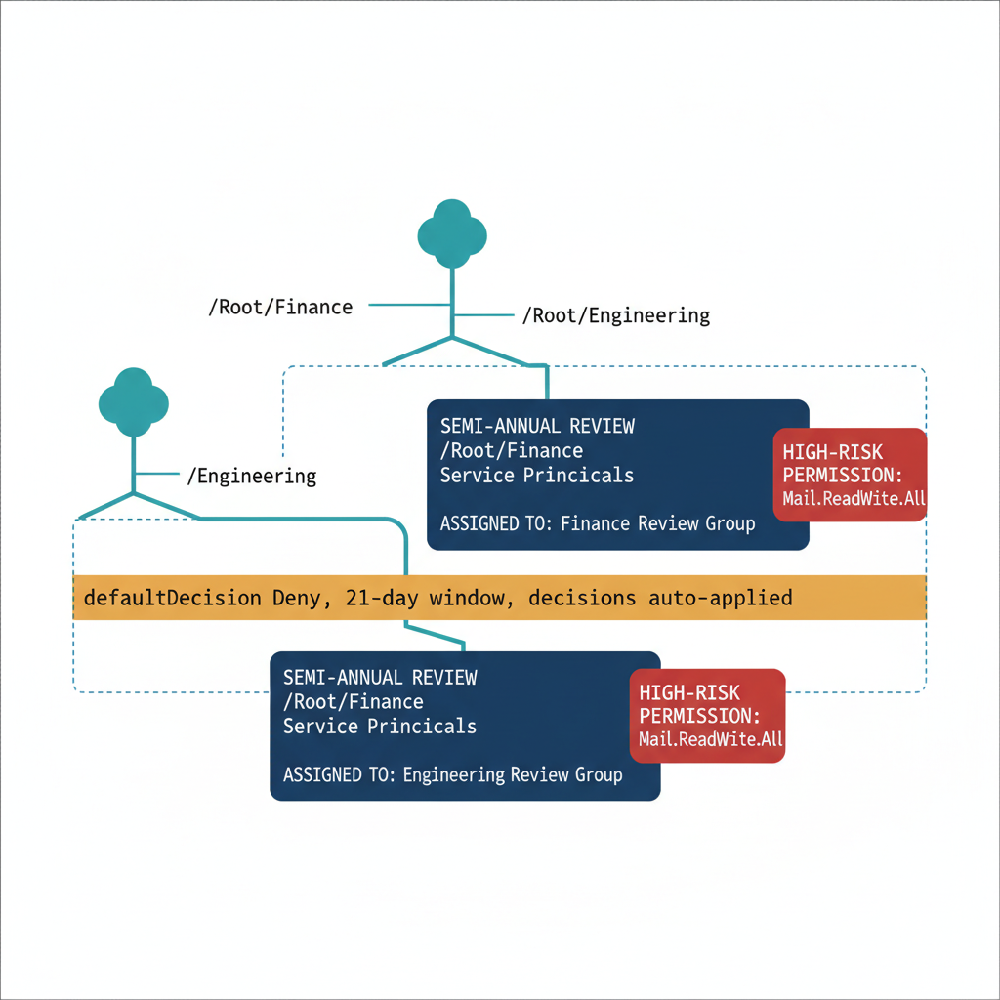

# Chapter 4 — Access Reviews for Application Permissions

::: {.callout-note}
## In this chapter
Application permissions act autonomously at tenant scope with no user session to constrain them, which makes them the highest-risk and least-reviewed permission class. This chapter organizes semi-annual reviews by owning OrgPath branch so each portfolio is judged by the team that knows it, and sets the default decision to Deny so a permission no reviewer can vouch for is removed rather than retained by inaction.
:::

## Why Application Permissions Are the Highest-Risk Permission Class

Of all the permission types that the governance model must address, application permissions represent the most acute risk and the least commonly reviewed category in most tenants. The distinction that matters for risk assessment is the difference between delegated permissions and application permissions. A delegated permission requires a user to be present in the authentication session — the application acts on behalf of the user and is constrained by that user's own rights.

If the user does not have access to a particular mailbox, the application using a delegated permission cannot access it either. Application permissions remove the user from the equation entirely. They grant the application the ability to act autonomously, at the tenant-wide scope of the permission, without any user session and without any per-user constraint. A service principal holding the Mail.ReadWrite.All application permission can read and modify every mailbox in the tenant. A service principal holding Directory.ReadWrite.All can modify any object in the directory.

These permissions are appropriate for specific automation workloads, but they are also extraordinarily powerful and must be reviewed periodically to confirm that every grant is still intentional and still necessary.

The review cadence for application permissions should be tighter than for user access. Semi-annual reviews — every six months — strike the right balance for most organizational contexts: frequent enough to catch permissions that have become unnecessary following a project completion or a product change, infrequent enough that the review burden on the designated reviewer groups is manageable. The default decision for an application permission Access Review should be Deny, not Approve.

If a reviewer does not act on a permission, the model should assume the reviewer could not confirm the permission is still needed, not assume it is still needed because no one objected. This is the inverse of most user access review configurations, where stale entitlements accumulate through reviewer inaction, and it is the appropriate posture for permissions that operate at tenant scope.

{#fig-book-08-cpt-04-diagram-01 fig-alt="A teal OrgPath tree shows branches with monospace paths /Root/Finance and /Root/Engineering. Each branch feeds a federal navy semi-annual review card scoped to that branch's service principals and assigned to that branch's review group. An amber band across both cards reads \"defaultDecision Deny, 21-day window, decisions auto-applied\". A red chip on the side flags a tenant-wide application permission such as Mail.ReadWrite.All as the highest-risk grant requiring explicit confirmation. White background, 16:9, engineering blueprint style, monospace labels for paths and the permission name, red reserved for the high-risk permission chip, no human figures." width="85%"}

## OrgPath-Scoped Review Structure

With OrgPath on application objects, the Access Review model for application permissions can be organized by organizational owner rather than as a single tenant-wide review that dumps every application's permissions into a single reviewer queue. The Finance division's application portfolio — the service principals whose OrgPath owner attribute places them in the Finance branch — is reviewed by Finance IT governance leads who understand what the Finance applications are supposed to do and what API access they legitimately need.

The Engineering platform team's application portfolio is reviewed by Engineering platform leads who understand the integration patterns and can make informed decisions about which API grants are necessary for the platform's operation. This organizational scoping makes the review substantive rather than bureaucratic: reviewers are evaluating applications they actually know, in a portfolio they actually own.

The OrgTree registry node schema is extended with two additional fields for application permission review governance: AppReviewBoundary, a boolean that designates the node as a review scope boundary, and AppReviewGroupName, the display name of the Entra ID security group whose members are the designated reviewers for this node's application portfolio. The review creation script reads these fields, resolves the reviewer group, and creates a semi-annual recurring Access Review definition scoped to the service principals whose OrgPath places them in the node's branch. The defaultDecision is set to Deny, autoApplyDecisionsEnabled is set to true, and the review instance duration is twenty-one days — enough time for distributed reviewer teams to complete the review without creating a sprint-length distraction.

## Script 4.1 — Semi-Annual OrgPath-Scoped Access Reviews for Application Permissions (PowerShell)

```powershell
<# data-id="111"
.SYNOPSIS
    Creates semi-annual Access Reviews for application permissions,
    grouped by the owning OrgPath organizational node.
.DESCRIPTION
    For each OrgTree node flagged as AppReviewBoundary, creates an
    Access Review scoped to service principals owned by that node
    (identified by OrgPath extension attribute on the application object).
    Reviewers are the node's designated app review group.
    defaultDecision = "Deny" removes permissions if reviewers take no action.
.NOTES
    Requires: Connect-MgGraph -Scopes "AccessReview.ReadWrite.All","Application.Read.All"
    Requires Entra ID Governance licensing.
    Access Reviews for service principal permissions use the
    /v1.0/identityGovernance/accessReviews/definitions endpoint.
#>
param(
    [string]$OrgTreeRegistryPath = "C:\governance\orgtree\registry.json",
    [string]$OrgPathAttrName     = "extension_{AppIdWithoutHyphens}_OrgPath"  # Substitute
)

Connect-MgGraph -Scopes "AccessReview.ReadWrite.All","Application.Read.All" -NoWelcome

$registry    = Get-Content $OrgTreeRegistryPath -Raw | ConvertFrom-Json
$reviewNodes = $registry.nodes | Where-Object {
    $_.Status -eq "Active" -and $_.AppReviewBoundary -eq $true -and $_.AppReviewGroupName
}

# Start reviews on the coming Monday
$startDate = (Get-Date).AddDays(((1 - [int](Get-Date).DayOfWeek + 7) % 7)).ToString("yyyy-MM-dd")
if ($startDate -eq (Get-Date).ToString("yyyy-MM-dd")) { $startDate = (Get-Date).AddDays(7).ToString("yyyy-MM-dd") }

foreach ($node in $reviewNodes) {

    $reviewName  = "AppPermReview-$($node.Id)-SemiAnnual"

    $exists = Get-MgIdentityGovernanceAccessReviewDefinition `
        -Filter "displayName eq '$reviewName'" -ErrorAction SilentlyContinue
    if ($exists) { Write-Host "[EXISTS] $reviewName"; continue }

    $reviewerGroup = Get-MgGroup -Filter "displayName eq '$($node.AppReviewGroupName)'" `
        -ErrorAction SilentlyContinue
    if (-not $reviewerGroup) {
        Write-Warning "Review group '$($node.AppReviewGroupName)' not found for node $($node.Id)"
        continue
    }

    $body = @{
        displayName            = $reviewName
        descriptionForAdmins   = "Semi-annual review of application permissions for apps owned by $($node.Name)"
        descriptionForReviewers = "Review each application's API permissions. Deny removes the permission grant."
        scope = @{
            # Review service principal permission grants (OAuth2 delegated + app role assignments)
            "@odata.type"         = "#microsoft.graph.principalResourceMembershipsScope"
            principalScopes       = @(
                @{
                    "@odata.type" = "#microsoft.graph.accessReviewQueryScope"
                    # Filter service principals by OrgPath owner — adjust filter as needed
                    query         = "/servicePrincipals?`$filter=$OrgPathAttrName eq '$($node.Path)'"
                    queryType     = "MicrosoftGraph"
                }
            )
            resourceScopes = @(
                @{
                    "@odata.type" = "#microsoft.graph.accessReviewQueryScope"
                    query         = "/servicePrincipals"
                    queryType     = "MicrosoftGraph"
                }
            )
        }
        reviewers = @(
            @{
                query     = "/groups/$($reviewerGroup.Id)/transitiveMembers"
                queryType = "MicrosoftGraph"
            }
        )
        settings = @{
            mailNotificationsEnabled        = $true
            reminderNotificationsEnabled    = $true
            justificationRequiredOnApproval = $true
            defaultDecisionEnabled          = $true
            defaultDecision                 = "Deny"
            instanceDurationInDays          = 21
            autoApplyDecisionsEnabled       = $true
            recommendationsEnabled          = $true
            recurrence = @{
                pattern = @{ type = "absoluteMonthly"; interval = 6 }
                range   = @{ type = "noEnd"; startDate = $startDate }
            }
        }
    } | ConvertTo-Json -Depth 10

    Invoke-MgGraphRequest `
        -Method POST `
        -Uri "https://graph.microsoft.com/v1.0/identityGovernance/accessReviews/definitions" `
        -Body $body -ContentType "application/json" | Out-Null

    Write-Host "[CREATED] $reviewName (reviewer: $($node.AppReviewGroupName))"
}

Write-Host "Application permission Access Review configuration complete."
Disconnect-MgGraph
```

::: {.callout-note title="Important: Reviewer Preparation"}
The effectiveness of application permission reviews depends almost entirely on reviewer preparation. Unlike user access reviews where reviewers can rely on context they already have (they know whether the user is still on the team), application permission reviews require reviewers to understand what each service principal does and whether each permission grant is necessary for its operation. The governance team should maintain a supplemental application catalog — a plain-language description of each governed application, its purpose, and its expected API permission profile — and make it available to reviewers at review launch. Applications whose permission grants have not changed since the last review cycle should be surfaced with a recommendation of Approve; applications with new permission grants since the last review should be surfaced with a recommendation of Deny, requiring the reviewer to affirmatively confirm that the new grant is appropriate.
:::
