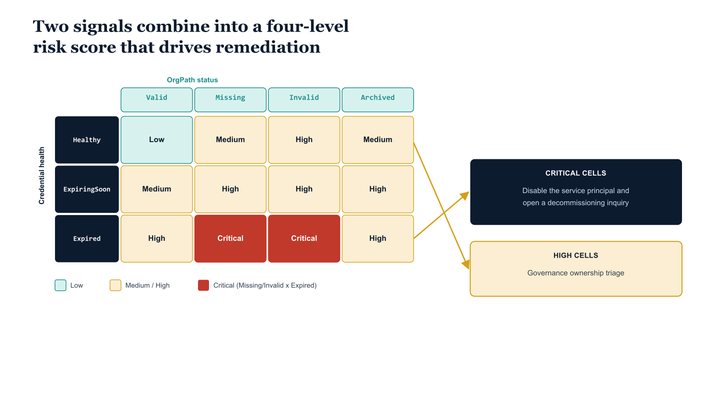

# Chapter 5 — Orphan Detection and Credential Drift

::: {.callout-note}
## In this chapter
An orphaned application has lost its organizational accountability — through a missing, invalid, or archived OrgPath — and an application with long-expired credentials is almost certainly abandoned. This chapter combines those two signals into a four-level risk score, routes Critical findings straight to disable-and-decommission, and routes High findings to ownership triage.
:::

## Classifying Orphaned Applications

An orphaned application is one that has no current, valid organizational accountability. There are three conditions that produce orphan status, and they can occur independently or in combination. The first is OrgPath absence: the application has never been stamped with an OrgPath owner attribute, meaning it was either created before the governance framework was established and was not captured in the Phase Zero triage, or it was created after the framework was in place by someone who bypassed the provisioning workflow.

The second is OrgPath invalidity: the application carries an OrgPath attribute whose value references a node that is no longer active in the OrgTree registry — the organizational unit that owned the application has been restructured, merged, or dissolved. The third is OrgPath archive: the application's OrgPath references a node that was previously active but has been explicitly archived in the OrgTree, typically because the project or team it represented has formally concluded.

All three conditions require remediation: the application either needs to be assigned to a new owning node or it needs to be decommissioned.

Credential expiry is the second and more operationally urgent orphan signal. A live application actively renews its credentials before they expire — this is a fundamental operational requirement for any production workload. An application whose client secrets have been expired for more than thirty days with no apparent recent authentication activity is almost certainly abandoned. The governance model treats this combination — expired credentials plus missing or invalid OrgPath — as a Critical risk finding requiring immediate action. The appropriate remediation for a Critical finding is not to renew the credentials but to disable the application and initiate a decommissioning inquiry. If someone objects to the disable, the objection itself surfaces the accountability that the governance framework could not find through its normal channels.

The drift detection pipeline runs on the same schedule as the user OrgPath drift detection pipeline established in earlier parts of the series — daily for credential expiry checks, weekly for comprehensive OrgPath validity checks. The pipeline reads every app registration, checks both OrgPath validity and credential health, produces a unified drift report, and commits it to the governance repository. The report entries are scored with a four-level risk classification — Critical, High, Medium, Low — and the Critical and High findings are promoted to the Sentinel WatchList used by the monitoring queries described in Chapter Seven, ensuring that orphaned applications with active credentials appear in the security monitoring layer as well as in the governance reporting layer.

{#fig-book-08-cpt-05-diagram-01 fig-alt="An engineering matrix sets OrgPath status across the top in teal columns reading Valid, Missing, Invalid, Archived, and credential health down the left in navy rows reading Healthy, ExpiringSoon, Expired. Cells shade by risk: green for Low, amber for Medium and High, and red for Critical where Missing or Invalid crosses Expired. An amber arrow routes Critical cells to a box \"disable the service principal and open a decommissioning inquiry\" and routes High cells to a box \"governance ownership triage\". White background, 16:9, engineering blueprint style, monospace labels for the status and health values, red reserved for the Critical cells, no human figures." width="85%"}

## Script 5.1 — Application Orphan and Credential Drift Detection (PowerShell)

```powershell
<# data-id="123"
.SYNOPSIS
    Detects orphaned and high-risk app registrations by checking OrgPath
    validity against the OrgTree registry and flagging expired credentials.
.DESCRIPTION
    Combines two signals: (1) OrgPath validity — apps with no OrgPath or
    whose OrgPath node is no longer active in the OrgTree, and (2) credential
    health — apps with expired client secrets or certificates.
    Outputs a JSON drift report committed to the governance repository.
    High-severity findings (no OrgPath + expired creds) are flagged for
    immediate remediation (disable the app).
.NOTES
    Requires: Connect-MgGraph -Scopes "Application.Read.All","AuditLog.Read.All"
#>
param(
    [string]$OrgTreeRegistryPath = "C:\governance\orgtree\registry.json",
    [string]$OrgPathAttrName     = "extension_{AppIdWithoutHyphens}_OrgPath",  # Substitute
    [string]$OutputPath          = "C:\governance\reports\app-drift-report.json"
)

Connect-MgGraph -Scopes "Application.Read.All","AuditLog.Read.All" -NoWelcome

$registry     = Get-Content $OrgTreeRegistryPath -Raw | ConvertFrom-Json
$activePaths  = $registry.nodes | Where-Object { $_.Status -eq "Active" } | ForEach-Object { $_.Path }
$archivedPaths = $registry.nodes | Where-Object { $_.Status -ne "Active" } | ForEach-Object { $_.Path }

$apps = Get-MgApplication -All `
    -Property "id,appId,displayName,createdDateTime,passwordCredentials,keyCredentials,
               signInAudience,owners,$OrgPathAttrName"

$now    = Get-Date
$report = @{
    GeneratedAt = ($now.ToString("o"))
    Findings    = @()
}

foreach ($app in $apps) {

    $orgPath     = $app.AdditionalProperties[$OrgPathAttrName]
    $hasOwners   = ($app.Owners.Count -gt 0)

    # --- OrgPath validity ---
    $orgPathStatus = if (-not $orgPath) {
        "Missing"
    } elseif ($activePaths -contains $orgPath) {
        "Valid"
    } elseif ($archivedPaths -contains $orgPath) {
        "Archived"   # Node was in OrgTree but has been removed
    } else {
        "Invalid"    # Value does not match any known node path
    }

    # --- Credential health ---
    $expiredSecrets = $app.PasswordCredentials | Where-Object {
        $_.EndDateTime -and [DateTime]$_.EndDateTime -lt $now
    }
    $expiringSoon = $app.PasswordCredentials | Where-Object {
        $_.EndDateTime -and [DateTime]$_.EndDateTime -gt $now -and
        [DateTime]$_.EndDateTime -lt $now.AddDays(30)
    }
    $expiredCerts = $app.KeyCredentials | Where-Object {
        $_.EndDateTime -and [DateTime]$_.EndDateTime -lt $now
    }

    $credStatus = if ($expiredSecrets.Count -gt 0 -or $expiredCerts.Count -gt 0) {
        "Expired"
    } elseif ($expiringSoon.Count -gt 0) {
        "ExpiringSoon"
    } else {
        "Healthy"
    }

    # --- Risk score ---
    $riskLevel = switch -Wildcard ("$orgPathStatus|$credStatus") {
        "Missing|Expired"    { "Critical" }
        "Invalid|Expired"    { "Critical" }
        "Archived|Expired"   { "Critical" }
        "Missing|*"          { "High" }
        "*|Expired"          { "High" }
        "Archived|*"         { "High" }
        "Invalid|*"          { "High" }
        "*|ExpiringSoon"     { "Medium" }
        default              { "Low" }
    }

    if ($riskLevel -ne "Low") {
        $report.Findings += [ordered]@{
            AppId          = $app.AppId
            ObjectId       = $app.Id
            DisplayName    = $app.DisplayName
            CreatedDate    = $app.CreatedDateTime
            OrgPath        = $orgPath
            OrgPathStatus  = $orgPathStatus
            HasOwners      = $hasOwners
            CredStatus     = $credStatus
            ExpiredSecrets = $expiredSecrets.Count
            ExpiredCerts   = $expiredCerts.Count
            RiskLevel      = $riskLevel
        }
    }
}

$report | ConvertTo-Json -Depth 10 | Set-Content -Path $OutputPath -Encoding UTF8

$critical = ($report.Findings | Where-Object { $_.RiskLevel -eq "Critical" }).Count
$high     = ($report.Findings | Where-Object { $_.RiskLevel -eq "High" }).Count
$medium   = ($report.Findings | Where-Object { $_.RiskLevel -eq "Medium" }).Count

Write-Host "App drift report written: $OutputPath"
Write-Host "  Critical: $critical | High: $high | Medium: $medium"
Disconnect-MgGraph
```

## Remediation Workflow for High-Risk Findings

The drift report output drives a two-track remediation workflow. Critical findings — applications with both an invalid OrgPath condition and expired credentials — are routed directly to the security operations team for immediate action. The recommended immediate action is to disable the application's service principal in the home tenant, which prevents any further token issuances while the decommissioning inquiry is conducted. Disabling the service principal does not delete it, preserving audit trail continuity while removing the active authentication risk. The security operations team then initiates a decommissioning inquiry: querying the audit logs for the application's last successful authentication, identifying any Azure RBAC role assignments held by the service principal, and reviewing the application's permission grants before submitting the deletion request through the change management process.

High findings — applications with either an invalid OrgPath condition or expired credentials, but not both — are routed to the governance team for ownership triage. The triage process follows the same workflow as Phase Zero: the governance team reviews the finding, identifies the correct owning OrgPath from organizational context (the application's display name, its creator's department, its API permission profile, and any Azure resource tags on associated resources all provide attribution signals), and either stamps the correct OrgPath or, if no valid owner can be identified, promotes the finding to the Critical track for immediate disable and decommissioning inquiry.
